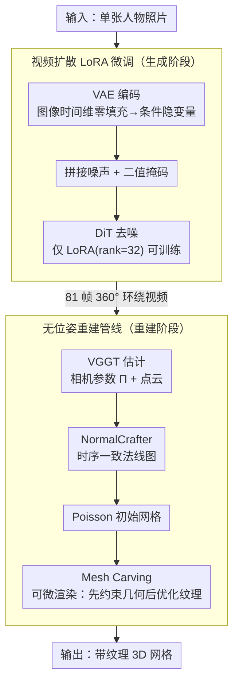

# HumanOrbit: 3D Human Reconstruction as 360° Orbit Generation

**会议**: CVPR 2026 Findings  
**arXiv**: [2602.24148](https://arxiv.org/abs/2602.24148)  
**代码**: 无  
**领域**: 3D视觉  
**关键词**: 3D人体重建, 视频扩散模型, 多视图生成, LoRA微调, 轨道视频

## 一句话总结

将单图3D人体重建转化为360°轨道视频生成问题，用仅500个3D扫描数据LoRA微调视频扩散模型（Wan 2.1）生成81帧环绕视频，再通过VGGT+Mesh Carving重建高质量纹理网格，无需位姿标注且在多视图一致性和身份保持上超越现有方法。

## 研究背景与动机

**领域现状**：从单张图像重建逼真3D人体是长期挑战，应用于通信、游戏、AR/VR等领域。当前路线主要有：大型重建模型（如InstantMesh）、人体专用模型（依赖3D人体数据集）、以及基于多视图扩散的方法。

**现有痛点**：
   - **3D人体数据稀缺**：高质量多视图/3D数据集需要专业捕捉工作室（密集标定相机、受控环境），成本极高且多样性有限
   - **图像扩散模型的多视图方法不一致**：Zero-1-to-3、SyncDreamer等基于图像扩散的方法在跨视图一致性上仍有明显伪影，尤其在人脸和手部细节上
   - **依赖外部先验**：PSHuman等方法需要SMPL体型/相机位姿标注，限制了对半身照、头像等非全身场景的适用性
   - **训练数据需求大**：Human4DiT需要大规模多维度人体数据集

**核心洞察**：2D人体图像数据量远超3D数据集；最新的DiT视频扩散模型（如Wan 2.1）在数十亿真实视频上训练，已学到强大的时序一致性和隐式3D结构先验——可以将"生成环绕视频"视为"多视图合成"。

**本文切入点**：不做图像扩散适配，而是**微调视频扩散模型**生成环绕轨道视频——利用视频模型天然的时序一致性保证多视图几何一致，仅需极少3D数据即可训练。

## 方法详解

### 整体框架

HumanOrbit 把"单图重建 3D 人体"拆成了一个出人意料的两步走：先把它当作视频生成问题，再把生成的视频当作真实拍摄的多视图素材去做三维重建。第一步是 **HumanOrbit 生成模型**——喂进一张人物照片，它吐出一段 81 帧的 360° 环绕视频，相当于让一台虚拟摄像机绕着这个人转了一圈。第二步是 **无位姿重建管线**——把这 81 帧当作环拍照片，用 VGGT 反推出每帧的相机参数和点云，NormalCrafter 补上法线图，Poisson 重建给出初始网格，最后用可微渲染做 Mesh Carving 精修出带纹理的网格。整条链路里没有任何 SMPL 体型先验，也不需要预先指定相机轨迹。

### 关键设计

**1. 视频扩散模型的 LoRA 微调：用极少 3D 数据换来强多视图一致性**

高质量 3D/多视图人体数据要靠专业捕捉工作室采集，贵且少；而基于图像扩散的多视图方法（Zero-1-to-3、SyncDreamer 之流）又在跨视图一致性上力不从心，尤其是人脸和手部。HumanOrbit 的应对是换一类底座模型——直接微调 Wan 2.1 的 Image-to-Video 480p 模型（含 3D VAE、CLIP 图像编码器、umT5 文本编码器和一串 DiT 块）。具体做法是把输入图像在时间维度上做零填充，经 VAE 编成条件隐变量，再和噪声、二值掩码拼接后交给 DiT 块去噪。训练时只在 DiT 块上挂 LoRA（rank=32），其余参数全部冻结；数据仅用 500 个 PosedPro 3D 扫描在 Blender 里渲染的轨道视频（含全身与肩部以上两种构图，加轻微旋转增强），扩成 3000 个 81 帧、640×640 的视频，单张 A100 跑 10 个 epoch 即可。之所以这么省，是因为 Wan 2.1 已经在数十亿真实视频里见过各种相机运动和时序连贯的物体外观，时序一致性本身就隐含了 3D 一致性——LoRA 要教的只是"绕着人转一圈"这一种特定运动，而不是从零学习几何一致，所以数据需求被压到了极低。换句话说，500 个扫描够用的关键不在数据量本身，而在于 Wan 2.1 预训练里早已内化的"围绕物体旋转"这一运动范式——LoRA（参数极少）做的不是灌输新知识，而是把模型本就具备的通用环绕能力精确特化为 360° 人体环绕轨道。这也带来一个有意思的副作用：因为只是轻量特化、没有覆盖底座的泛化能力，微调后的模型对椅子、狗这类非人类物体同样能生成合理的环绕视频。

**2. 无位姿重建管线：让 SfM 自己从生成视频里把一切参数算出来**

PSHuman 这类方法要么依赖预定义相机位姿，要么需要 SMPL 体型拟合，一旦遇到半身照、纯头像这种非全身场景就用不了。HumanOrbit 索性不给任何外部位姿，让重建端自己去估。先用 VGGT（前馈式 3D 场景属性估计网络）直接从生成的多视图图像同时预测相机参数 $\Pi = \{\pi_i\}_{i=1}^K$ 和深度投影点云，省掉预定义轨迹；再用 NormalCrafter 取得时序一致的法线图；网格初始化对 VGGT 点云做 Poisson 表面重建而非套 SMPL，从而保留对非全身场景的泛化；最后通过可微渲染迭代做 Mesh Carving，几何阶段的损失同时约束掩码和法线：

$$\mathcal{L}_{recon} = \mathcal{L}_{mask} + \mathcal{L}_{normal} = \sum_i \|M_i - \hat{M}_i\|_2^2 + \sum_i M_i \odot \|N_i - \hat{N}_i\|_2^2$$

几何收敛后再优化逐顶点颜色 $\mathcal{L}_{color} = \sum_i M_i \odot \|I_i - \hat{I}_i\|_2$ 补齐纹理。这套管线之所以成立，恰恰反过来印证了第一步的生成质量——VGGT 能从这些帧里稳定恢复出一圈环形相机轨迹，说明生成视频的 3D 一致性已经足够好，好到可以当真实环拍照片来用。

### 损失函数 / 训练策略

视频生成端用标准扩散训练损失，LoRA rank=32、单 A100 跑 10 个 epoch；网格重建端先以 $\mathcal{L}_{recon} = \mathcal{L}_{mask} + \mathcal{L}_{normal}$ 优化几何，再用 $\mathcal{L}_{color}$ 优化纹理。整条流程不需要体型标注、相机位姿标注，也不需要单独的人脸识别模块。

## 实验关键数据

### 主实验

| 数据集 | 指标 | HumanOrbit | PSHuman | SV3D | MV-Adapter |
|--------|------|------|----------|------|------|
| CCP (全身) | CLIP Score ↑ | **0.8317** | 0.8282 | 0.7888 | 0.7735 |
| CCP (全身) | MEt3R ↓ | **0.3175** | 0.3576 | 0.2966 | 0.3721 |
| CCP (全身) | MVReward ↑ | **0.8035** | 0.6814 | 0.2378 | 0.6795 |
| CelebA (头像) | CLIP Score ↑ | **0.7073** | - | 0.6582 | 0.6729 |
| CelebA (头像) | MVReward ↑ | **0.4947** | - | 0.4918 | 0.4727 |

### 消融实验

| 配置 | 关键指标 | 说明 |
|------|---------|------|
| VGGT vs COLMAP | VGGT: 密集点云+连续轨迹; COLMAP: 稀疏点云+断裂轨迹 | COLMAP导致重建缺失左臂 |
| 非人类物体（椅子/狗） | 成功生成环绕视频 | LoRA微调保留预训练泛化能力 |
| 固定仰角轨道 | 头顶/下巴等区域不可见 | 需探索更丰富的相机轨迹 |

### 关键发现

- MVReward指标（最贴合人类偏好）上大幅领先PSHuman（0.8035 vs 0.6814），说明生成质量和一致性显著更好
- SV3D倾向生成模糊轮廓和扭曲人脸；PSHuman缺乏细节关注；MV-Adapter偶尔出现拓扑错误（多余的鞋子）
- VGGT能从生成视频中可靠恢复环形相机轨迹，间接证明了视频的3D一致性
- 对头像场景同样有效（PSHuman因依赖SMPL无法处理），证明泛化性
- 对非人类物体（椅子/狗）也能工作，说明学到的是通用环绕运动模式

## 亮点与洞察

- **问题reformulation精妙**：将多视图生成从"图像扩散+3D约束"转化为"视频扩散+轨道运动"，天然获得时序一致性
- **极致数据效率**：仅500个3D扫描就能训练出超越需要大量3D数据的方法，核心在于利用预训练视频模型的强先验
- **无位姿设计**：不需要任何外部位姿标注（不需要SMPL、不需要预定义相机），让模型自由生成轨道后再用SfM恢复，避免了生成-标注不对齐问题
- **方法极简但有效**：整个方法仅增加LoRA参数，架构改动极小

## 局限与展望

- **固定仰角**：环绕轨道只在一个固定水平面上，头顶和下巴等区域不可见。可探索多高度轨道或螺旋轨迹
- **推理速度慢**：基于大型视频扩散模型，生成81帧环绕视频需约17分钟。减少帧数的初步尝试效果不佳，需探索更高效的推理策略
- **依赖VGGT的鲁棒性**：如果生成视频一致性差，VGGT的相机估计也会失败
- 未与MEAT、Pippo等最新方法对比（代码未公开）

## 相关工作与启发

- **PSHuman**：基于跨尺度多视图扩散+SMPL初始化的mesh carving，是最直接的对比基线
- **SV3D**：Stability AI的轨道视频扩散模型（21帧），但在人体上一致性不足
- **VGGT**：前馈式3D场景属性估计，替代传统SfM在生成视频上的应用
- **Wan 2.1**：DiT视频扩散模型，本文证明了仅用LoRA微调即可将其特化为多视图生成工具
- **启发**：视频扩散模型作为隐式3D先验的载体，可能是单图3D重建的新范式。LoRA在保留预训练知识方面的优势使得小数据微调成为可能

## 评分

- 新颖性: ⭐⭐⭐⭐ 视频扩散→多视图生成的范式转换思路新颖，无位姿设计简洁
- 实验充分度: ⭐⭐⭐ 多视图生成评估全面，但3D重建仅有视觉对比无定量指标；缺少与部分最新方法对比
- 写作质量: ⭐⭐⭐⭐ 动机清晰，方法简洁，实验展示直观
- 价值: ⭐⭐⭐⭐ 数据效率极高的单图人体3D重建方案，对3D数据生成也有重要启发
- 价值: 待评

<!-- RELATED:START -->

## 相关论文

- [\[CVPR 2026\] ORBIT: Benchmarking SfM in the Wild with 360° Video](orbit_benchmarking_sfm_in_the_wild_with_360deg_video.md)
- [\[CVPR 2026\] TeHOR: Text-Guided 3D Human and Object Reconstruction with Textures](tehor_text-guided_3d_human_and_object_reconstruction_with_textures.md)
- [\[CVPR 2026\] Human Geometry Distribution for 3D Animation Generation](human_geometry_distribution_for_3d_animation_generation.md)
- [\[CVPR 2026\] BulletGen: Improving 4D Reconstruction with Bullet-Time Generation](bulletgen_improving_4d_reconstruction_with_bullet-time_generation.md)
- [\[CVPR 2026\] Human Interaction-Aware 3D Reconstruction from a Single Image](human_interaction-aware_3d_reconstruction_from_a_single_image.md)

<!-- RELATED:END -->
