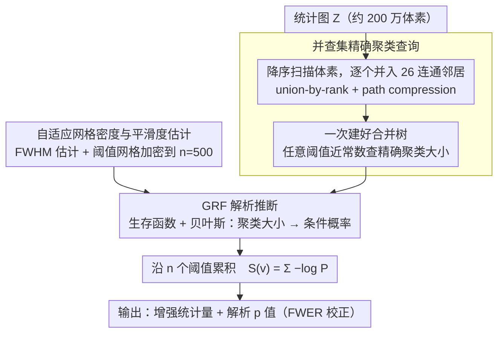

# Hybrid eTFCE–GRF: Exact Cluster-Size Retrieval with Analytical p-Values for Voxel-Based Morphometry

**会议**: CVPR 2026  
**arXiv**: [2603.11344](https://arxiv.org/abs/2603.11344)  
**代码**: [pytfce](https://pypi.org/project/pytfce/) (`pip install pytfce`)  
**领域**: 神经影像分析 / 统计推断  
**关键词**: TFCE, 高斯随机场, 并查集, 体素形态学, 无置换推断

## 一句话总结

将 eTFCE 的并查集数据结构（精确聚类大小查询）与 pTFCE 的 GRF 解析推断相结合，首次在单一框架中同时实现精确聚类大小提取和无置换检验的解析 $p$ 值，全脑 VBM 分析比 R pTFCE 快 4.6–75 倍、比置换 TFCE 快三个数量级。

## 研究背景与动机

**领域现状**：TFCE 通过跨所有阈值积分聚类空间范围来增强体素级统计推断的灵敏度，是神经影像分析的标准方法。但推断阶段依赖置换检验（数千次重标记），在全脑尺度（约 200 万体素）下需数小时至数天。

**现有痛点**：两种改进方法各解决了一半问题。pTFCE 用 GRF 理论替代置换检验实现快速推断，但在固定 100 级阈值网格上用连通分量标记（CCL）查聚类大小，引入离散化误差。eTFCE 通过并查集精确计算 TFCE 积分消除离散化，但仍需置换检验获取 $p$ 值。

**核心矛盾**：pTFCE 快但近似，eTFCE 精确但慢——两者算法互补但 15 年来无人组合。此外 FSL 的 TFCE 实现存在已确认到 6.0.7.19 版本的缩放 bug（步长 $\Delta\tau$ 在离散近似中被遗漏）。

**切入角度**：并查集对其聚类大小的下游消费方式无关——可以馈入置换零分布（eTFCE 方式），也可以馈入 GRF 生存函数（本文方式），切换不需修改数据结构。

**核心 idea**：用 eTFCE 的并查集替换 pTFCE 的 CCL 获取精确聚类大小，保留 GRF 解析推断避免置换检验。

## 方法详解

### 整体框架

这篇论文要在全脑 VBM（约 200 万体素）上同时拿到两样东西：精确的聚类大小，以及不靠成千上万次置换就算出来的 $p$ 值。它的做法是把统计图 $Z$ 的所有体素按取值从高到低排好序，然后像逐渐放水一样把体素一个个并进并查集（union-by-rank + path compression），整个过程自然长出一棵记录了聚类如何逐级合并的树。需要某个阈值下的聚类大小时，直接在这棵树上查就行，不必重新扫一遍全图；拿到精确聚类大小后，再用高斯随机场（GRF）的解析公式把它换算成条件概率，沿 $n$ 个阈值网格点逐级累积，最终得到每个体素的增强统计量 $S(v)$。

### 关键设计

**1. 并查集精确聚类查询：用一次构建好的合并树，取代 pTFCE 每个阈值都重扫全图的 CCL**

pTFCE 的瓶颈在于它用连通分量标记（CCL）在固定的 100 级阈值网格上查聚类大小，每个阈值都要把整张图重新标记一遍（单次 $O(N)$），网格越密成本越线性上涨，而固定网格本身又带来离散化误差。本文换了个思路：体素按统计值降序处理，每个体素先建成单例集合，再和已处理过的 26 连通邻居合并，union-by-rank 让树保持平衡、path compression 把每次 Find 摊销到 $O(\alpha(N))$（$\alpha$ 是逆 Ackermann 函数，在实际 $N$ 下 $\leq 5$，近乎常数）。这样合并树一次 $O(N \log N)$ 建好，就已经编码了完整的超水平集过滤层级，之后任意阈值的聚类大小查询都是近常数时间——把网格密度从 $n=100$ 加到 $n=500$，也只多花约 2 秒。

**2. GRF 解析推断：把精确聚类大小直接喂进生存函数，彻底甩掉置换检验**

有了精确聚类大小，下一步是怎么不靠重标记就得到 $p$ 值。本文沿用 pTFCE 的 GRF 框架：高度 $h$ 处聚类大小的生存函数为 $P(C > c \mid h) = \exp(-\lambda_h c^{2/3})$，其中 $\lambda_h = (E[c_h]/\Gamma(5/2))^{-2/3}$、期望聚类大小 $E[c_h] = N(1-\Phi(h))/E[\chi_h]$。再用贝叶斯定理把体素高度先验和聚类似然结合成条件概率 $P(Z_v \geq \tau_i \mid c_v^{uf}(\tau_i))$，逐阈值累积成增强统计量

$$S(v) = \sum_i -\log P\big(Z_v \geq \tau_i \mid c_v^{uf}(\tau_i)\big).$$

关键在于并查集和这一步是解耦的：同一棵合并树既能喂进置换零分布（eTFCE 的老路），也能喂进这里的 GRF 生存函数，换推断方式根本不用动数据结构。代价上也很划算——置换检验是 $O(BnN)$（$B$ 次重标记 × $n$ 阈值 × $N$ 体素），GRF 把它直接压到 $O(nN)$。

**3. 自适应网格密度与平滑度估计：用并查集省下的查询预算换更密的网格，同时把 GRF 赖以成立的场平滑度估准**

因为查询足够便宜，本文可以把阈值网格一路加密到 $n=500$（相比 $n=100$ 只多约 2 秒），逼近 $n=5000$ 参考解的精度。但 GRF 的 $p$ 值对场平滑度很敏感——平滑度一旦估高，检验就会变得反保守，所以这一步必须估得准。平滑度从标准化残差的空间导数做有限差分得到，验证下来 FWHM 为 $3.506 \pm 0.041$，对解析值 $3.532$ 的偏差仅 $-0.7\%$，满足 $<5\%$ 的准则。

### 损失函数 / 训练策略

非学习方法，无训练过程。总复杂度 $O(N \log N + nN)$；辅助内存约 48 MB（parent/rank/size 数组，$N \approx 2 \times 10^6$）。

## 实验关键数据

### 主实验

| 实验 | 指标 | Hybrid eTFCE-GRF | 基线/对比 | 说明 |
|---|---|---|---|---|
| 零假设 FWER（200次） | 拒绝数 | 0/200 | CI [0%, 1.9%] | 严格控制在标称水平 |
| 功效曲线（10信号幅） | Dice vs pTFCE | $\geq 0.999$（$a \geq 0.07$） | 与基线完全重叠 | 零功效损失 |
| 运行时间（64³ phantom） | 秒 | 1.02s | pTFCE 0.34s / eTFCE 1313s | 比 eTFCE 快 ~1300× |
| 运行时间（全脑 ~2M 体素） | 秒 | ~85s (hybrid) / ~5s (baseline) | R pTFCE ~390s | 4.6× / 75× 加速 |
| UK Biobank (N=500) | 年龄效应 $Z_{max}$ | 18.3 | — | 额叶/颞叶皮质萎缩 |
| IXI (N=563) | 站点效应 $F_{max}$ | 37.0 | — | 白质/后颅窝差异 |

### 消融实验

| 配置 | Pearson $r$ | $\max|\Delta Z|$ | Dice | 说明 |
|---|---|---|---|---|
| Hybrid $n$=100 vs Baseline $n$=100 | 1.000 | 0.00 | 1.0 | 同网格密度完全一致 |
| Hybrid $n$=500 vs 参考 $n$=5000 | >0.998 | $0.57 \pm 0.23$ | 1.0 | 密网格快速收敛 |
| IXI Py hybrid vs R pTFCE | 0.85–0.87 | — | 0.84–0.89 | Python 为 R 的严格子集 |
| 平滑度估计 vs 解析值 | 误差 $-0.7\%$ | $3.506 \pm 0.041$ vs 3.532 | — | 满足 $<5\%$ 准则 |

### 关键发现

- 匹配 $n=100$ 时 hybrid 和 baseline 产生**完全一致**结果，差异仅源于网格密度选择
- IXI 上 Python 方法的显著体素集是 R 参考实现的严格子集（更保守），支持 FWER 控制
- 并查集使 hybrid 比 CCL 基线慢约 3×（1.02s vs 0.34s），换来精确聚类和密网格支持

## 亮点与洞察

- 两种互补方法的融合概念上显而易见但 15 年来无人实现——暴露学术研究的路径依赖，各改进社区未交叉。"组合型创新"在方法学领域被低估
- 纯 Python 实现 `pip install pytfce` 一键安装无 R/FSL 依赖，极大降低技术门槛
- 附带发现 FSL TFCE 持续 15 年的缩放 bug（$\Delta\tau$ 遗漏），展示重新实现经典方法的附带价值
- 六组蒙特卡洛验证（FWER/功效/时间/平滑度/一致性/真实数据）是方法学论文的黄金标准

## 局限与展望

- GRF 假设要求场平稳且充分平滑（FWHM > 3 倍体素），灰白质交界处假设被违反
- 仅支持 3D 体积（26-连通），皮层表面分析需测地并查集
- 仅在结构 MRI VBM 验证，fMRI/DTI/ASL 等模态实验缺失
- 纯 Python 并查集仍有优化空间（C/Cython 扩展可缩小与 CCL 基线的 3× 差距）

## 相关工作与启发

- **vs pTFCE**: 共享 GRF 解析推断，但用并查集替换 CCL 获取精确聚类大小，消除离散化误差
- **vs eTFCE**: 共享并查集精确计算，但用 GRF 替换置换检验实现即时推断，快 1300 倍
- 并查集 + 解析推断的组合范式可推广到其他跨阈值统计分析场景（如持久同调的过滤层级）

## 评分

- 新颖性: ⭐⭐⭐⭐ 互补方法融合虽非颠覆但 15 年无人做
- 实验充分度: ⭐⭐⭐⭐⭐ 六组蒙特卡洛 + 两个真实脑数据集极严谨
- 写作质量: ⭐⭐⭐⭐ 方法学表述清晰，背景梳理系统
- 实用价值: ⭐⭐⭐⭐⭐ 纯 Python 开源工具直接解决社区痛点

<!-- RELATED:START -->

## 相关论文

- [\[CVPR 2025\] Hybrid eTFCE-GRF: Exact Cluster-Size Retrieval with Analytical p-Values for Voxel-Based Morphometry](../../CVPR2025/3d_vision/hybrid_etfce-grf_exact_cluster-size_retrieval_with_analytical_p-values_for_voxel.md)
- [\[CVPR 2026\] Easy3E: Feed-Forward 3D Asset Editing via Rectified Voxel Flow](easy3e_feed-forward_3d_asset_editing_via_rectified_voxel_flow.md)
- [\[CVPR 2026\] NimbusGS: Unified 3D Scene Reconstruction under Hybrid Weather](nimbusgs_unified_3d_scene_reconstruction_under_hybrid_weather.md)
- [\[CVPR 2026\] Efficient Hybrid SE(3)-Equivariant Visuomotor Flow Policy via Spherical Harmonics](efficient_hybrid_se3-equivariant_visuomotor_flow_policy_via_spherical_harmonics_.md)
- [\[CVPR 2026\] QD-PCQA: Quality-Aware Domain Adaptation for Point Cloud Quality Assessment](qd-pcqa_quality-aware_domain_adaptation_for_point_cloud_quality_assessment.md)

<!-- RELATED:END -->
