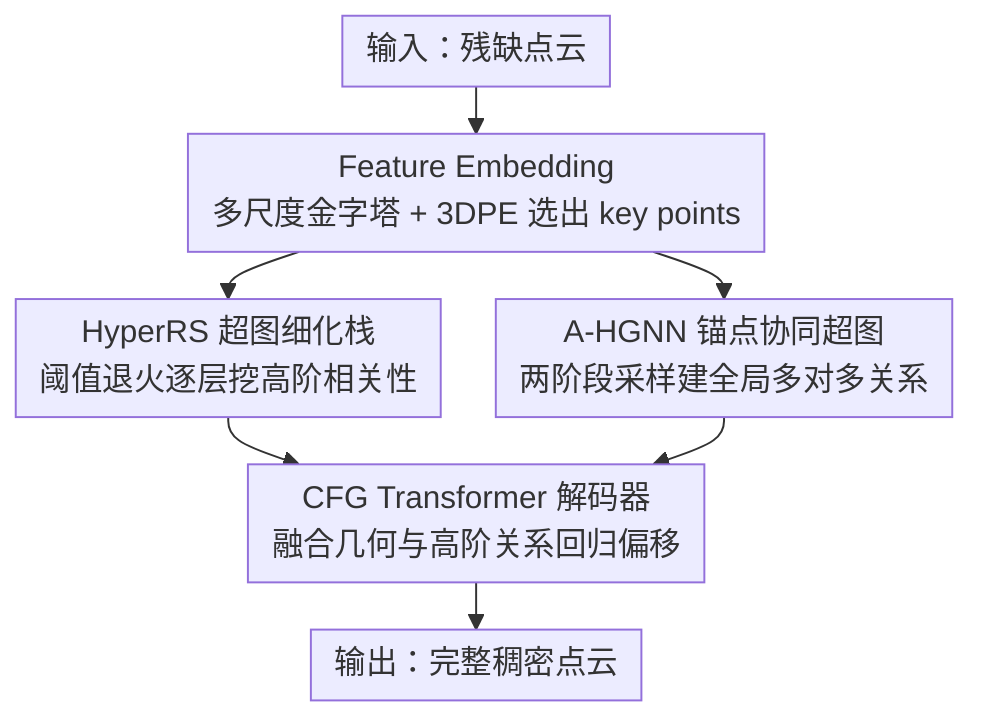

# Hyper-PCN: Hypergraph-Based Point Cloud Completion via High-Order Correlation Modeling

**会议**: CVPR 2026  
**论文**: [CVF Open Access](https://openaccess.thecvf.com/content/CVPR2026/html/Li_Hyper-PCN_Hypergraph-Based_Point_Cloud_Completion_via_High-Order_Correlation_Modeling_CVPR_2026_paper.html)  
**代码**: https://github.com/Rinfly/Hyper-PCN  
**领域**: 3D视觉  
**关键词**: 点云补全, 超图神经网络, 高阶相关性, 编码器-解码器, 3D 形状重建

## 一句话总结
针对点云补全里 Transformer 只能建模成对（pairwise）相关、在缺乏对称先验时补不好复杂结构的问题，Hyper-PCN 首次把超图引入**不完整**点云，用一个阈值退火的超图细化栈（HyperRS）由粗到细挖掘高阶相关性、再用锚点协同超图（A-HGNN）建模全局多对多关系，在 PCN / ShapeNet-55/34 / MVP 等多个基准上稳定刷新 SOTA。

## 研究背景与动机

**领域现状**：点云补全要从残缺点云重建完整稠密形状，关键是建模点云内部的相关性。早期靠 PointNet/PointNet++ 的 max-pooling 提全局特征；PoinTr 首次把 Transformer 引入，把点云切 patch、用 self-attention 建局部+全局依赖；后续沿两条路走——要么设计更强的 Transformer 架构（SnowflakeNet、AdaPoinTr、CRA-PCN 等），要么注入对称性/可学习几何先验提供形状级上下文（SymmCompletion、ODGNet）。

**现有痛点**：现有方法在复杂几何和精细结构上仍吃力，**尤其当对称这类常见先验缺失或两侧对称区域都残缺时**（论文图 1 的核心例子）。根因在于：对**高阶相关性**建模不足。真实结构的语义关系远不止"成对相似"或"对称"——比如飞机的机翼、尾翼、机身要协同组织成气动外形才能飞，这种多组件、协同的多对多关系，成对模型根本表达不了。

**核心矛盾**：Transformer 的 query-key 交互本质是**成对**的，天生限制了它建模高阶（多对多）相关性的能力；而超图（一条超边可连接任意多个顶点）恰恰是表达这种群组关系的天然工具。但已有的点云超图工作几乎都是为**完整**点云设计的，搬到不完整点云上会撞两个坎：（1）从稀疏残缺结构里抽可靠相关性本就更难，一次性（one-shot）建超图只能捕到有限关系；（2）随机采样/体素分区这类常见建图策略，会把算力偏向点云的完整区域，反而拖累对缺失部分的预测。

**本文目标**：首次在不完整点云上建模高阶相关性，并解决上面两个工程难点——既要由浅入深地多轮挖掘高阶关系，又要让建图不偏向完整区域、能覆盖全局。

**切入角度**：把超图引入补全，但不是一次建好，而是"渐进式 + 协同采样"：用一摞超图层做由粗到细的细化，用 key points 和 anchors 协同建图来纠正采样偏置。

**核心 idea**：用超图替代 Transformer 的成对注意力来显式建模高阶相关性——HyperRS 做阈值退火的逐层细化、A-HGNN 做锚点协同的全局建图，两者并行喂进编码器-解码器框架。

## 方法详解

### 整体框架
Hyper-PCN 是一个编码器-解码器结构。**超图编码器**先用一个基于 PointNet 的 Feature Embedding 从残缺点云里选出 $N_k$ 个 key points 及其特征；这些 key features 同时喂进两条并行支路——HyperRS 基于特征空间距离建超图、做逐层渐进细化，产出 hyper features 和一个粗形状（coarse points）；A-HGNN 用 key points 和 anchors 协同建图，抽全局高阶关系。**解码器**把编码器的粗特征、局部编码器特征和 A-HGNN 的全局特征拼接，送进两级 CFG（Cross Fusion Geometry）Transformer，由粗到细回归出逐点偏移，最终重建稠密完整点云。

### 关键设计

**1. 超图卷积：用超边建模多对多高阶关系**

补全的根本痛点是成对模型表达不了"多组件协同"的关系。Hyper-PCN 的基础算子是超图卷积。超图 $\mathcal{G}=(V,E,W)$ 里一条超边可连接任意多个顶点，关联矩阵 $H\in\{0,1\}^{n\times m}$ 记录"顶点 $v$ 是否属于超边 $e$"。超图卷积是"顶点→超边→顶点"的两段信息流：每个顶点先把特征送给所连超边、在超边上聚合更新，再从邻接超边按重要性收回消息更新自身，矩阵形式为

$$X^{(t+1)} = \sigma\big(D_v^{-1} H W D_e^{-1} H^\top X^{(t)} Q_t\big)$$

其中 $D_v$、$D_e$ 是顶点度/超边度的对角矩阵，$Q_t$ 是可学习变换矩阵。相比 Transformer 的成对 query-key，超边天然把一组语义相关的点（如重复的船帆、机翼-尾翼的气动耦合）绑成一个高阶单元一起聚合，这是建模多对多关系的关键。

**2. HyperRS 超图细化栈：阈值退火、由粗到细挖高阶相关性**

针对"从残缺结构一次建图只能捕到有限关系"这一坎，HyperRS 用一摞 $L$ 层超图层做渐进细化，每层在特征空间重新建图再卷积。第 $\ell$ 层以每个顶点为中心、把特征距离在阈值 $\tau_\ell$ 内的邻居归到同一超边，关联矩阵 $H^{(\ell)}_{i,j}=1$ 当且仅当 $\|X^{(\ell)}_i - X^{(\ell)}_j\|_2 \le \tau_\ell$。关键在于阈值**线性退火**：

$$\tau_\ell = \tau_{\text{start}} + \frac{\ell-1}{L-1}\big(\tau_{\text{end}} - \tau_{\text{start}}\big),\quad \tau_{\text{start}} > \tau_{\text{end}}$$

浅层阈值大、超边覆盖广而多，抓宽泛上下文（如对称这类低阶特征）；深层阈值小、只连更近邻居，聚焦细粒度高阶关系（如机翼-尾翼的语义耦合）。每层卷积后做带 SiLU 激活和 BN 的残差更新 $X^{(\ell+1)} = X^{(\ell)} + \mathrm{BN}(\mathrm{SiLU}(\widetilde X^{(\ell)}))$。这样逐层把不同粒度的高阶相关特征累积起来，形成对点云结构由浅入深的理解——图 3 的可视化显示超边随层加深从"对称"过渡到"重复结构"再到"语义耦合"，正对应这套退火设计。

**3. A-HGNN 锚点协同超图：两阶段采样纠正建图偏置**

第二个坎是随机/体素采样会把建图偏向完整区域、拖累缺失部分。A-HGNN 用 key points 与 anchors 的**协同**来建全局超图，而非只靠其一，从而缓解结构偏置、更全面地覆盖整个形状的全局依赖。具体地，anchors $P_a$ 由 key points $P_k$ 经确定性均匀下采样（预算 $N_a$）得到；算出每个 key point 到每个 anchor 的欧氏距离 $ED_{i,j}=\|p_{k,i}-p_{a,j}\|_2$，为每个点取最近的 $\alpha$ 个 anchor 作为邻居集 $\mathcal{N}(i)=\arg\text{Top-}\alpha_j(-ED_{i,j})$，据此建关联矩阵 $H^{(A)}_{i,j}=1$ 当 $j\in\mathcal{N}(i)$；再以输入特征为顶点特征做超图卷积，输出全局高阶相关特征 $F_{out}\in\mathbb{R}^{N_k\times 2N_k}$。"均匀下采样的锚点 + key point 协同"让超边不被完整区域主导，从而把全局结构信息也覆盖到缺失部分。

**4. CFG Transformer 解码器：几何与高阶关系融合回归偏移**

编码器给出粗形状和（局部 + 全局高阶）特征后，需要把它们融合成精细补全。CFG（Cross Fusion Geometry）Transformer 是两级架构：先给粗点 $P_c$ 加 3D 位置编码并与原始坐标拼接，得到 PE-增强表征 $Z_{PE}$；经 self-attention 抽出几何感知特征 $F_g$，把局部几何与高阶结构关系对齐；再变换成细化表征 $F_{ref}$ 并回归成逐点偏移，叠加得到完整点云 $Y\in\mathbb{R}^{N_o\times3}$。它把编码器拼来的局部几何线索和高阶相关特征做交叉融合，由粗到细两级细化，保证补出的结构既几何一致又保留输入可见部分。

### 损失函数 / 训练策略
用 Chamfer Distance（CD）在三个阶段监督——粗点、第一级 CFG Transformer 的中间点、最终完整点，总损失为三者加权和。训练细节：RTX 3090、AdamW、batch 64、420 epoch，初始学习率 $2\times10^{-4}$、权重衰减 $5\times10^{-4}$，前 20 epoch 从 $1\times10^{-5}$ 线性 warm-up 到 $2\times10^{-4}$；HyperRS 深度 $L=6$、距离阈值从 $\tau_{\text{start}}=0.20$ 线性退火到 $\tau_{\text{end}}=0.16$；A-HGNN 两阶段 anchors/top-k 取 $(N_a=128,k=24)$ 和 $(N_a=192,k=32)$。

## 实验关键数据

### 主实验

PCN 数据集上（CD-L1×10⁻³ 越低越好、F1@1% 越高越好），Hyper-PCN 在平均 CD 和 F1 以及全部 8 个类别上都取得最佳：

| 方法 | 来源 | CD-Avg↓ | F1↑ |
|--------|------|------|------|
| PoinTr | ICCV'21 | 8.38 | 0.745 |
| AdaPoinTr | TPAMI'23 | 6.53 | 0.845 |
| CRA-PCN | AAAI'24 | 6.39 | – |
| SymmCompletion | AAAI'25 | 6.28 | 0.853 |
| PointMAC | NIPS'25 | 6.33 | – |
| **Hyper-PCN（本文）** | – | **6.20** | **0.858** |

跨多基准同样领先（CD-L2 类指标 ×10⁻³ 或 ×10⁻⁴，越低越好）：

| 数据集 | 指标 | 本文 | 前 SOTA(SymmCompletion) |
|--------|------|------|----------|
| ShapeNet55 | CD-Avg | **0.65** | 0.69 |
| ShapeNet-34（Seen） | CD-Avg | **0.58** | 0.60 |
| ShapeNet-21（Unseen） | CD-Avg | **0.94** | 0.97 |
| MVP | CD↓ / F1↑ | **4.76 / 0.558** | 4.89 / 0.534 |

KITTI 上把 PCN 训练的模型直接迁移测试，定性结果显示补出的车更完整、边界更锐、点密度更均匀、离群点更少，体现真实场景泛化性。

### 消融实验

PCN 数据集上验证两个核心模块（CD-L1×10⁻³ 越低越好）：

| HyperRS | A-HGNN | CD↓ | F1↑ | 说明 |
|------|------|------|------|------|
| ✗ | ✗ | 6.43 | 0.844 | 去掉两个超图模块的基线 |
| ✓ | ✗ | 6.36 | 0.848 | 只加 HyperRS |
| ✗ | ✓ | 6.32 | 0.851 | 只加 A-HGNN |
| ✓ | ✓ | **6.20** | **0.858** | 完整模型 |

### 关键发现
- **两个超图模块互补且都有效**：单独加 HyperRS 或 A-HGNN 都能降 CD，二者同时启用增益最大（6.43→6.20），说明"逐层局部细化"和"锚点全局协同"建模的是不同层面的高阶关系。
- **退火阈值带来分层语义**：HyperRS 浅层抓对称等低阶特征、深层抓语义耦合等高阶关系，超边可视化（图 3）直观印证了由粗到细的设计意图。
- **泛化性强**：在 Unseen ShapeNet-21 和零样本迁移到 KITTI 上都领先，说明高阶相关建模不依赖类别记忆。
- **对称缺失场景受益最大**：当对称先验不可用、两侧对称区域都残缺时，高阶相关性指引比对称指引补得更好（论文动机图 1）。

## 亮点与洞察
- **超图替成对注意力**：核心洞察是"Transformer 的 query-key 本质成对、撑不起多对多关系"，而一条超边能绑一组协同点（机翼-尾翼-机身），这是把高阶相关性显式建出来的关键，可迁移到任何需要群组关系的点云任务。
- **阈值退火很巧**：用一个线性退火的距离阈值，就让同一套超图层在浅层抓全局、深层抓细节，免去人为设计多尺度结构，是个轻量却有效的"由粗到细"开关。
- **锚点协同纠偏**：针对"采样偏向完整区域"这一补全特有顽疾，用确定性均匀采样的 anchor 与 key point 协同建图，思路简单却切中要害。
- **首次把超图用于不完整点云**：之前点云超图工作都假设点云完整，本文点明并解决了残缺输入下建图的两个具体障碍，是方法迁移到新场景的范例。

## 局限与展望
- 超图建图基于特征/欧氏距离阈值，$\tau_{\text{start}}/\tau_{\text{end}}$、$L$、anchor 预算等超参需手调，换数据集的鲁棒性未充分讨论。
- 多层超图细化 + 两阶段锚点采样带来额外计算开销，论文未给出与轻量基线的效率/显存对比。
- 提升幅度在已饱和的基准上偏小（PCN CD 6.28→6.20），边际收益是否值得复杂度增加需权衡。
- KITTI 主要给定性结果，真实噪声/遮挡下的定量泛化分析放在附录、正文证据有限。

## 相关工作与启发
- **vs PoinTr / AdaPoinTr（Transformer 路线）**：它们用成对 self-attention 建相关性，Hyper-PCN 用超图卷积显式建多对多高阶关系，在复杂几何上补得更细。
- **vs SymmCompletion / ODGNet（几何先验路线）**：这类注入对称/可学习先验，但对称缺失或两侧都残缺时失效；Hyper-PCN 用高阶相关性作为更普适的结构指引，正是冲着这个失效场景去的。
- **vs 已有点云超图方法**：以往超图工作针对完整点云（检测、分割、质量评估），本文首次面向不完整点云，并用渐进细化 + 锚点协同解决残缺输入的建图难题。
- **vs SnowflakeNet / CRA-PCN（强解码器路线）**：它们靠专门的上采样/反卷积模块提升细节，Hyper-PCN 的增益主要来自编码端的高阶相关建模，二者思路正交、可互补。

## 评分
- 新颖性: ⭐⭐⭐⭐⭐ 首次把超图引入不完整点云，超图替成对注意力建高阶相关，切入点清晰
- 实验充分度: ⭐⭐⭐⭐ PCN/ShapeNet/MVP/KITTI 多基准 + 模块消融，但缺效率对比、KITTI 偏定性
- 写作质量: ⭐⭐⭐⭐ 动机（图 1 对称缺失）和超边可视化（图 3）讲得直观，公式记号偏密
- 价值: ⭐⭐⭐⭐ 在多个补全基准稳定刷新 SOTA 且泛化好，高阶相关建模思路可复用

<!-- RELATED:START -->

## 相关论文

- [\[CVPR 2026\] Geometric-Aware Hypergraph Reasoning for Novel Class Discovery in Point Cloud Segmentation](geometric-aware_hypergraph_reasoning_for_novel_class_discovery_in_point_cloud_se.md)
- [\[CVPR 2026\] Scalable Feature Matching via State Space Modeling and Sparse Correlation](scalable_feature_matching_via_state_space_modeling_and_sparse_correlation.md)
- [\[AAAI 2026\] Simba: Towards High-Fidelity and Geometrically-Consistent Point Cloud Completion via Transformation Diffusion](../../AAAI2026/3d_vision/simba_towards_high-fidelity_and_geometrically-consistent_point_cloud_completion_.md)
- [\[AAAI 2026\] Rethinking Multimodal Point Cloud Completion: A Completion-by-Correction Perspective](../../AAAI2026/3d_vision/rethinking_multimodal_point_cloud_completion_a_completion-by-correction_perspect.md)
- [\[AAAI 2026\] DAPointMamba: Domain Adaptive Point Mamba for Point Cloud Completion](../../AAAI2026/3d_vision/dapointmamba_domain_adaptive_point_mamba_for_point_cloud_completion.md)

<!-- RELATED:END -->
