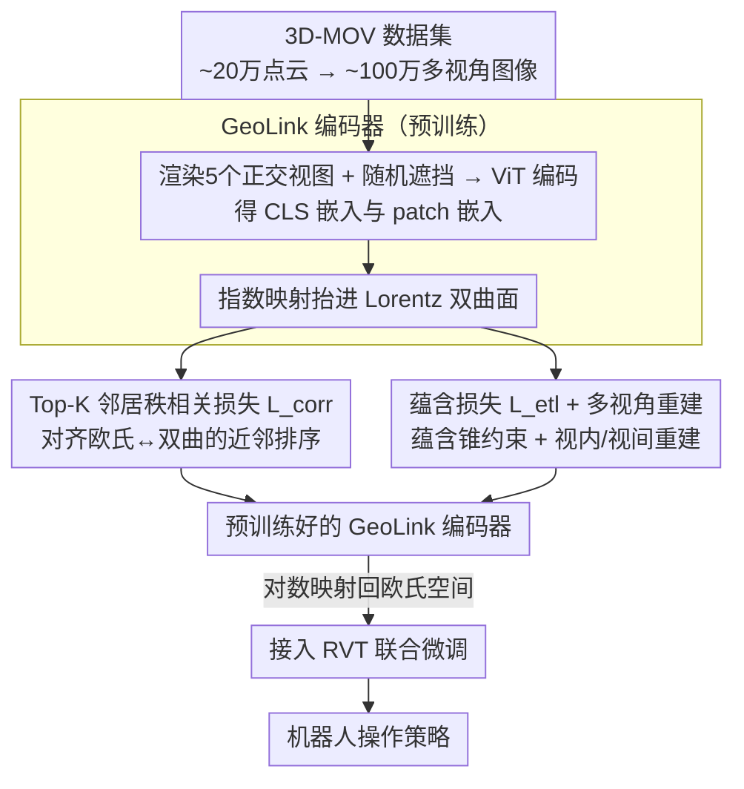

# HyperMVP: Hyperbolic Multiview Pretraining for Robotic Manipulation

**会议**: CVPR 2026  
**arXiv**: [2603.04848](https://arxiv.org/abs/2603.04848)  
**代码**: 待确认  
**领域**: 3D视觉  
**关键词**: 双曲空间, 多视角预训练, 机器人操作, 自监督学习, 3D表征

## 一句话总结

提出 HyperMVP，首个在双曲空间中进行3D多视角自监督预训练的框架，通过 GeoLink 编码器学习双曲多视角表征并迁移到机器人操作任务，在 COLOSSEUM 最困难的 All Perturbations 设置下实现 2.1× 性能提升。

## 研究背景与动机

3D感知的视觉预训练已被证明能有效提升下游机器人操作性能，但存在关键局限：

- 现有方法（如 3D-MVP）局限于**欧几里得嵌入空间**，其平坦几何限制了建模嵌入间结构关系的能力
- 欧几里得空间的距离度量线性增长，不适合表示层次结构和嵌套关系
- 双曲空间距离指数级扩展，天然适合表示树状/嵌套结构，但在机器人操作预训练中**完全未被探索**

本文顺着这个缺口，把视觉自监督预训练从欧几里得空间整体搬进双曲空间（Lorentz 模型），借双曲几何学到更有结构的表征，进而提升操作策略在扰动场景下的鲁棒性和泛化能力。

## 方法详解

### 整体框架

HyperMVP 想解决的是：3D 视觉预训练对机器人操作很有用，但现有方法把表征压在平坦的欧几里得空间里，建模不了 patch 之间那种"谁包含谁"的层次关系。它的做法是把整套自监督预训练搬进双曲空间，再迁移到操作策略上。整条流程分两段：先在自建的 3D-MOV 数据集上预训练一个 GeoLink 编码器，把多视角图像编码进 Lorentz 双曲面并学到结构化表征；再把这个编码器接到 Robotic View Transformer (RVT) 上联合微调，学具体的操作策略。

预训练数据用的是自建的 3D-MOV，约 20 万条高质量 3D 点云——18 万个物体来自 Objaverse-XL，6052 个场景片段来自 ScanNet，再加 3999 个普通桌面场景和 10001 个密集桌面场景（TO-Scene），合起来渲染出约 100 万张多视角图像。这套数据组合不是单纯堆量，后面消融会看到，正是其中的真实场景数据撑起了大部分收益。

### 关键设计

**1. GeoLink 编码器：把欧几里得多视角嵌入抬进双曲面，让语义层次自然展开**

它沿用 MAE 范式，先把 3D 点云渲染成 5 个正交视图图像，送进一个 $N=8$ 层的 ViT（隐藏维 768、8 个注意力头），得到 CLS 嵌入 $\mathbf{f}^{\text{cls}} \in \mathbb{R}^{5 \times 1 \times D}$ 和 patch 嵌入 $\mathbf{f}^{\mathrm{p}} \in \mathbb{R}^{5 \times P \times D}$。关键的一步是用指数映射把这些欧几里得嵌入提升到 Lorentz 双曲面上：

$$\mathbf{x}_s^* = \frac{\sinh(\sqrt{c}\|\mathbf{f}^*\|)}{\sqrt{c}\|\mathbf{f}^*\|}\mathbf{f}^*$$

之所以要绕进双曲空间，是因为双曲空间的距离随半径指数增长，天然适合摊开树状、嵌套的语义结构——平坦的欧氏空间塞不下这种层次。下游策略本身是在欧氏空间里跑的，所以微调时再用对数映射把表征映回欧氏空间，保持和 RVT 的兼容。

**2. Patch-aware Top-K 邻居秩相关损失 $L_{\text{corr}}$：用排序而非距离来对齐两个空间**

把嵌入抬进双曲空间后会冒出一个新问题：欧氏空间和双曲空间的距离尺度根本不可比，如果直接逼着两边的距离对齐，几何差异会让训练无法收敛。$L_{\text{corr}}$ 绕开了这一点——它对每个 patch 在两个空间里各自取 Top-K 近邻，只要求"谁离得更近"的排序一致，而不管"近多少"：

$$L_{\text{corr}} = 1 - \frac{1}{5}\sum_{i=1}^{5} g\left(|\mathbf{R}_i^{\mathcal{E}}_{\pi_i^K}|_z \odot |\mathbf{R}_i^{\mathcal{L}}_{\pi_i^K}|_z\right)$$

排序是几何无关的量，所以这条损失能在两套不同曲率的几何之间稳定地传递语义拓扑。后面消融里它也确实是贡献最大的一项。

> ⚠️ $L_{\text{corr}}$ 公式中的下标嵌套写法以原文为准。

**3. 蕴含损失 $L_{\text{etl}}$ 配多视角重建：把局部对齐到全局，再逼出多视角一致性**

光对齐拓扑还不够，模型还需要知道每个 patch 该归属到哪个整体语义。$L_{\text{etl}}$ 在双曲 CLS 嵌入周围画出一个蕴含锥（entailment cone），约束 patch 嵌入落进锥内，从而把局部 patch 和全局 CLS 的语义绑在一起——这正是双曲空间表达"包含"关系的标准手段。在此之上还叠了两路重建任务：视内重建让标准 MAE 解码器从被遮挡的输入恢复本视图；视间重建则用其他视图的特征经交叉注意力去预测锚视图，逼着编码器学到跨视图的一致性，而不只是单视图的纹理。

### 损失函数 / 训练策略

预训练总损失拆成双曲项和重建项两块：$L_{\text{pretrain}} = L_{\text{hyper}} + L_{\text{recon}}$。

$$L_{\text{hyper}} = \lambda_c L_{\text{corr}} + \lambda_{e1} L_{\text{etl}}(\mathbf{x}^{\text{cls}}, \mathbf{x}^{\mathrm{p}}) + \lambda_{e2} L_{\text{etl}}(\mathbf{x}^{\text{cls}}, \mathbf{x}^{\mathrm{msk}})$$

其中 $\lambda_c=1,\ \lambda_{e1}=0.5,\ \lambda_{e2}=0.1$；重建项 $L_{\text{recon}} = \lambda_{\text{ita}} L_{\text{intra}} + \lambda_{\text{ite}} L_{\text{inter}}$，取 $\lambda_{\text{ita}}=1,\ \lambda_{\text{ite}}=0.5$。预训练跑 100 epochs，batch size 64、masking ratio 0.75，用 AdamW（lr=5.12e-4），8×4090 GPU；微调阶段仿真 50K 步、真实 4K 步，换用 LAMB 优化器、lr=2e-3。

## 实验关键数据

### 主实验

| 数据集 | 指标 | HyperMVP | 之前SOTA | 提升 |
|--------|------|----------|----------|------|
| COLOSSEUM Avg(all perturbations) | Success Rate | 47.5% | 35.6% (3D-MVP) | +33.4% |
| COLOSSEUM All Perturbations | Success Rate | 11.2% | 5.3% (3D-MVP) | **2.1×** |
| RLBench 18-task Avg | Success Rate | **71.1%** | 68.0% (SAM2Act) | +3.1% |
| RLBench vs scratch | Success Rate | 71.1% | 62.9% (RVT) | +13.0% relative |
| Real-world Avg | Success Rate | **60.0%** | 32.9% (RVT) | +27.1% |
| Real-world All Perturbations | Success Rate | 50.0% | 22.2% (RVT) | +27.8% |

### 消融实验

| 配置 | 关键指标 (Avg Success %) | 说明 |
|------|---------|------|
| HyperMVP (full) | 71.11 | 完整模型 |
| MVT (3D-MVP方式) | OOM | 二次注意力+大规模预训练内存溢出 |
| MAE* (欧几里得) | 68.22 | 双曲空间确实有帮助 (+2.89) |
| w/o ScanNet (~194K) | 65.06 | 真实场景数据最重要 |
| w/o TO-Scene (~186K) | 68.44 | 数据多样性>数据规模 |
| w/o $L_{\text{corr}}$ | 67.72 | 秩相关损失贡献最大 (-3.39) |
| w/o $L_{\text{etl}}(\mathbf{x}^{\text{cls}}, \mathbf{x}^{\mathrm{p}})$ | 70.06 | 蕴含损失有轻微贡献 |
| w/o $L_{\text{inter}}$ | 71.00 | 视间重建贡献微弱 |

### 关键发现

- 双曲表征确实优于欧几里得（68.22 → 71.11），特别是在扰动场景下优势更明显
- 数据多样性（包含真实场景数据）比数据规模更重要：194K含场景数据 < 186K无场景数据
- Top-K 秩相关损失 $L_{\text{corr}}$ 是最关键的损失成分，移除后下降最大
- 正交投影保证了视图间的几何一致性，降低了视间重建任务的额外收益

## 亮点与洞察

- **首创性强**: 首次将双曲空间引入机器人操作的视觉预训练，打开了非欧几何在具身智能中的新方向
- **Top-K 秩相关损失设计巧妙**: 用排序相关替代距离对齐，优雅地解决了欧几里得-双曲空间距离不可比的问题
- **3D-MOV 数据集设计有深度**: 通过消融发现场景级数据的重要性，而非简单堆量
- **GeoLink 编码器灵活可扩展**: 与 3D-MVP 不同，微调时可适配任意数量输入视图

## 局限与展望

- 高精度任务（如 Place Cups）改进有限，受限于下游 RVT 策略本身能力
- 正交投影可能丢失透视信息，实际机器人相机通常是透视成像
- 双曲空间的收益机制缺乏更深入的理论分析（为什么双曲空间对操作有帮助？）
- 真实世界实验规模较小（每任务仅50条演示，10次试验评估）

## 相关工作与启发

- MERU 的双曲图文对齐思路在这里被推广到无监督多视角设置，提示双曲空间在自监督中有广泛潜力
- 3D-MVP 的多视角预训练范式被扩展，证明嵌入空间的选择对下游任务有非平凡影响
- 数据多样性 > 数据规模的发现对预训练数据工程有重要启示

## 评分

- 新颖性: ⭐⭐⭐⭐ 首次在双曲空间中做3D多视角预训练用于机器人操作，方向新颖
- 实验充分度: ⭐⭐⭐⭐ 仿真(COLOSSEUM+RLBench)+真实世界+消融全面，但真实实验规模偏小
- 写作质量: ⭐⭐⭐⭐ 数学推导清晰，双曲空间预备知识充分，结构工整
- 价值: ⭐⭐⭐⭐ 为具身智能的非欧几何表征学习开辟了新方向，3D-MOV数据集有复用价值

<!-- RELATED:START -->

## 相关论文

- [\[CVPR 2026\] Ada3Drift: Adaptive Training-Time Drifting for One-Step 3D Visuomotor Robotic Manipulation](ada3drift_adaptive_trainingtime_drifting_for_onest.md)
- [\[ICCV 2025\] RoboTron-Mani: All-in-One Multimodal Large Model for Robotic Manipulation](../../ICCV2025/3d_vision/robotron-mani_all-in-one_multimodal_large_model_for_robotic_manipulation.md)
- [\[CVPR 2026\] Real2Edit2Real: Generating Robotic Demonstrations via a 3D Control Interface](real2edit2real_generating_robotic_demonstrations_via_a_3d_control_interface.md)
- [\[NeurIPS 2025\] DynaRend: Learning 3D Dynamics via Masked Future Rendering for Robotic Manipulation](../../NeurIPS2025/3d_vision/dynarend_learning_3d_dynamics_via_masked_future_rendering_for_robotic_manipulati.md)
- [\[CVPR 2026\] Stepper: Stepwise Immersive Scene Generation with Multiview Panoramas](stepper_stepwise_immersive_scene_generation_with_multiview_panoramas.md)

<!-- RELATED:END -->
