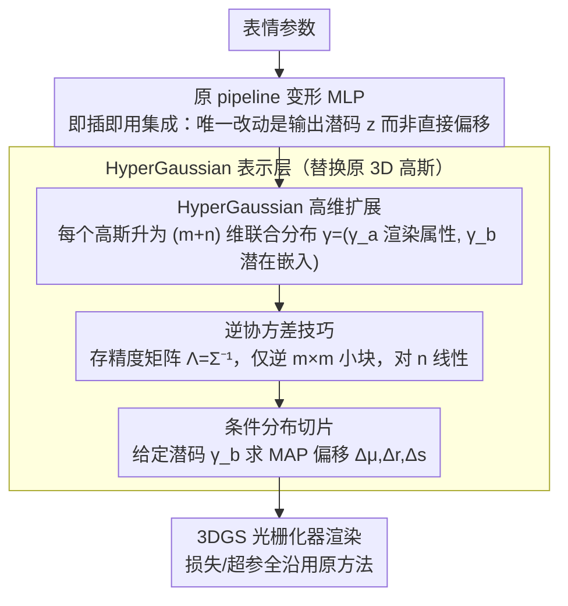

# HyperGaussians: High-Dimensional Gaussian Splatting for High-Fidelity Animatable Face Avatars

**会议**: CVPR 2026  
**arXiv**: [2507.02803](https://arxiv.org/abs/2507.02803)  
**代码**: [https://gserifi.github.io/HyperGaussians](https://gserifi.github.io/HyperGaussians)  
**领域**: 3D视觉  
**关键词**: 高斯溅射, 人脸头像, 高维高斯, 面部动画, 条件分布

## 一句话总结
提出HyperGaussians，将3DGS扩展到高维多元高斯，通过条件分布建模表情相关的属性变化+逆协方差技巧实现高效条件化，作为即插即用模块集成到FlashAvatar和GaussianHeadAvatar中可显著提升高频细节质量。

## 研究背景与动机
1. **领域现状**: 3D高斯溅射(3DGS)已成为人脸头像建模的标准方法，当前SOTA方法将高斯绑定到3DMM网格上，通过MLP预测表情依赖的偏移来处理动态效果。
2. **现有痛点**: 现有方法在非线性形变（眼睛闭合、嘴巴张开）、复杂光照效果（眼镜镜面反射）和细微结构（牙齿间隙、眼镜框架）上仍然表现不佳——这些高频细节正是造成"恐怖谷"效应的关键。
3. **核心矛盾**: 3D高斯原语本身的表达能力有限——每个高斯只有位置/旋转/缩放/颜色几个属性，即使用MLP预测表情依赖的偏移，属性的线性组合在表达能力上依然受限。
4. **本文目标**: 如何在不重新设计整个pipeline的前提下，增强3D高斯原语本身的表达能力以捕获高频动态效果？
5. **切入角度**: 受HyperNeRF启发——在高维空间中建模变形场并切片可以处理拓扑变化。将这一思想应用到高斯原语上：让每个高斯在高维空间中是一个多元高斯分布，通过条件化(切片)得到表情相关的3D高斯。
6. **核心 idea**: 将3D高斯扩展为(m+n)维的HyperGaussian，通过对n维潜在嵌入条件化来获得动态自适应的3D属性，并用逆协方差技巧保持高效。

## 方法详解

### 整体框架
HyperGaussians是一个即插即用的表示增强模块。原始pipeline（如FlashAvatar）中MLP输出表情依赖的偏移$\Delta\mu, \Delta r, \Delta s$；使用HyperGaussians后，MLP改为输出一个潜在向量$z_\psi$，通过高维高斯的条件分布计算得到MAP估计的偏移量。整个过程只需替换高斯表示，其他部分（损失函数、超参数）完全不变。

### 关键设计

**1. HyperGaussian 高维扩展：让每个高斯原语本身具备表情自适应能力**

标准 3D 高斯的属性就那么几个（位置、旋转、缩放、颜色），即使外挂 MLP 预测偏移，本质还是在固定原语上做线性调制，表达能力被原语自己卡死了。HyperGaussians 的做法是把原语升维：每个高斯不再只有 $m$ 维属性，而是和一段 $n$ 维潜在嵌入拼成一个 $(m+n)$ 维的多元高斯。具体地，定义联合分布 $\gamma = (\gamma_a, \gamma_b)^\top \sim \mathcal{N}(\mu, \Sigma)$，其中 $\gamma_a \in \mathbb{R}^m$ 是真正用于渲染的高斯属性（位置/旋转/缩放），$\gamma_b \in \mathbb{R}^n$ 是表情驱动的潜在嵌入。渲染某一帧时，把当前表情对应的潜码 $\gamma_b$ 代进去做条件化，就从这个高维分布里"切"出一个普通的 3D 高斯：

$$\mu_{a|b} = \mu_a + \Sigma_{ab}\Sigma_{bb}^{-1}(\gamma_b - \mu_b)$$

这一步在贝叶斯视角下正好是给定潜码后属性的 MAP 估计，先验 $p(\gamma_a)$ 顺带充当了隐式正则化，避免外推时属性乱飞。和只对位置建条件分布的 NDGS 比，HyperGaussians 把旋转、缩放也纳入条件分布——即建模了 $p(\Delta r|z)$ 与 $p(\Delta s|z)$，于是高斯可以随表情潜码同时平移、转向、伸缩，表达能力严格强于此前那些"只能动位置"的多维高斯变体。

**2. 逆协方差技巧：把高维条件化的代价从 $n$ 的三次方压回线性**

第一个设计有个致命的工程问题：条件均值里要算 $\Sigma_{bb}^{-1}$，这是个 $n \times n$ 的逆，复杂度 $O(n^3 + mn^2)$。潜在维度一旦上去（$n>8$），不论速度还是显存都顶不住，朴素实现根本跑不动。解法是不存协方差 $\Sigma$、改存它的逆——精度矩阵 $\Lambda = \Sigma^{-1}$。换成精度矩阵后，条件均值与条件协方差重写为

$$\mu_{a|b} = \mu_a - \Lambda_{aa}^{-1}\Lambda_{ab}(\gamma_b - \mu_b), \qquad \Sigma_{a|b} = \Lambda_{aa}^{-1}$$

现在需要求逆的只剩 $\Lambda_{aa} \in \mathbb{R}^{m \times m}$ 这个 $3\times3$ 或 $4\times4$ 的小块，跟潜在维度 $n$ 完全脱钩；复杂度降到 $O(m^3 + m^2 n)$，对 $n$ 是线性的，存储也从 $O((m+n)^2)$ 缩到 $O(m^2 + mn)$。效果上，$n=8$ 时速度提升约 150%、显存从 42MB 降到 22MB（−48%），$n=128$ 时速度提升约 15000%、显存减少超过 90%。正是这个技巧把"大潜在维度"从理论可能变成了工程可行。

**3. 即插即用集成：不碰架构、不调超参，只换原语就涨点**

HyperGaussians 被刻意设计成正交于 pipeline 的表示层升级，而不是又一套新架构。以 FlashAvatar 为例，唯一的改动是把变形 MLP 的输出从"直接的偏移 $\Delta\mu,\Delta r,\Delta s$"改成"潜码 $z_\psi$"，再让上面两步的条件分布把潜码翻译成偏移；损失函数、训练策略、学习率、迭代数这些全部原样保留，GaussianHeadAvatar 也照同样方式接入。这种"零侵入替换"的好处是它能和未来任何架构改进自由叠加——别人换更强的 backbone、更好的变形场，HyperGaussians 仍可叠在上面继续吃增益。代价侧也很轻：FlashAvatar 上只额外多约 1% 训练时间（多 ~30 分钟），消融显示潜在维度 $n=8$ 是质量与开销的最佳平衡点。

### 损失函数 / 训练策略
完全继承原方法（FlashAvatar/GaussianHeadAvatar）的损失函数和超参数。HyperGaussian参数的学习率设为$10^{-4}$。FlashAvatar用~15k高斯训练30k迭代(15-20分钟/RTX 4090)，GaussianHeadAvatar训练600k迭代(约2天)，HyperGaussians仅增加约1%训练时间(30分钟)。关键设计决策：对每个高斯基元分别维护位置、旋转、缩放三个独立的HyperGaussian分布，使用Cholesky参数化保证协方差矩阵正定。latent维度$n=8$通过消融确定为最佳平衡点。精度矩阵的参数化只需$\Lambda_{aa}$和$\Lambda_{ab}$两个块，显著减少内存占用。代码已开源以便其他研究者集成到自己的pipeline中。

## 实验关键数据

### 主实验 (29个受试者, 6个数据集)

| 方法 | PSNR↑ | SSIM↑ | LPIPS↓ |
|------|-------|-------|--------|
| SplattingAvatar | 28.58 | 0.9396 | 0.0902 |
| MonoGaussianAvatar | 29.94 | 0.9456 | 0.0655 |
| FlashAvatar | 29.43 | 0.9466 | 0.0511 |
| **Ours (FA)** | **29.99** | **0.9510** | **0.0498** |
| GaussianHeadAvatar | 24.10 | 0.8819 | 0.2027 |
| **Ours (GHA)** | **24.38** | **0.8819** | **0.1977** |

### 消融实验

| 配置 | LPIPS↓ | FPS |
|------|--------|-----|
| HyperGaussians (n=8) | 0.0498 | 300 |
| 增加MLP深度 (同参数量) | 0.0572 (+15%) | 158 (-47%) |
| 增加MLP宽度 (同参数量) | 0.0512 (+3%) | 178 (-41%) |

### 关键发现
- HyperGaussians在相同参数量下显著优于增加MLP容量：更好的LPIPS且不损失速度(300 FPS vs 158 FPS)。
- 改善在高频细节上最明显：镜面反射、眼镜框架、牙齿间隙、皮肤皱纹——这些恰好是标准3DGS最薄弱的地方，说明高维条件化确实增强了局部表达能力。
- 即使n=1（最小扩展）也已经优于baseline，n=8是最佳平衡点，n=128在逆协方差技巧下仍可行但收益递减。
- 逆协方差技巧是实用性的关键——没有它，n=128几乎不可行（速度提升15000%，内存减少>90%）。
- 在跨表情驱动(cross-reenactment)场景下同样有效，说明学到的是通用的高频建模能力而非过拟合到特定表情。
- 多视图设置(GaussianHeadAvatar)中，HyperGaussians同样提升了wrinkles和reflections质量，且训练开销仅增加1%。
- **逆协方差技巧效率数据**：$n=8$时，naïve实现42MB/条件化→逆协方差22MB(-48%)；$n=128$时内存减少>90%。
- **跨数据集一致性**：在INSTA、NerFace、IMAvatar、NeRSemble等6个不同数据集上表现一致。
- 训练收敛速度也有提升——HyperGaussians在较少迭代次数下就能达到baseline的最终质量。

## 亮点与洞察
- **贝叶斯视角的优雅统一**：将NDGS/4DGS/6DGS/7DGS等多维高斯扩展统一为条件高斯分布的特例，并指出它们的表达能力限制（不能条件旋转/缩放）。这种理论统一本身就有重要价值。
- **正交于架构的改进**：不碰任何模型设计就能提升质量，这意味着HyperGaussians可以与未来的任何架构改进自由组合——这种"免费升级"的特性非常有吸引力。
- **逆协方差技巧的通用性**：不仅适用于人脸头像，任何需要高维高斯条件化的场景都可以受益。从$O(n^3)$到$O(n)$的加速对实时应用有重大意义。

## 局限与展望
- 目前只在人脸头像上验证，全身动态场景（衣服、头发飘动等更大范围的非线性形变）的效果未知。
- 条件协方差矩阵 $\Sigma_{a|b} = \Lambda_{aa}^{-1}$ 在当前实现中未被利用——它包含了3D高斯参数的不确定性信息，可以用于主动学习或渲染质量评估。
- 需要预计算/优化精度矩阵的块 $\Lambda_{aa}$ 和 $\Lambda_{ab}$，虽然参数量从 $O((m+n)^2)$ 降到 $O(m^2+mn)$，但实现上比标准3DGS更复杂。
- 对于非常极端的表情(训练分布外)，条件分布的外推能力可能有限——多元高斯的线性条件化假设了参数间的线性关系。
- 定量提升虽然一致但幅度不大（PSNR +0.56, LPIPS -0.0013），视觉改善主要集中在高频细节区域。
- latent维度 $n=8$ 的选择通过消融确定，但不同场景可能需要不同的最优维度。自适应维度选择机制有待发展。

## 相关工作与启发
- **vs NDGS/6DGS/7DGS**: 这些方法是HyperGaussians的特例——它们不能条件旋转/缩放，且在大潜在维度时计算不可行。HyperGaussians解决了这两个核心限制，且消除了大形变时高斯消失的问题。
- **vs FlashAvatar**: 只替换高斯表示就把LPIPS从0.0511降到0.0498，PSNR从29.43升到29.99，充分说明了底层表示改进的价值。FlashAvatar用MLP预测偏移量是"外部调制"，HyperGaussians将调制内建到表示本身中。
- **vs HyperNeRF**: 高维建模变形的理念来自HyperNeRF，但HyperGaussians将其适配到高斯溅射框架中，结合逆协方差技巧实现了实时渲染(300 FPS)。HyperNeRF的“切片”思想和HyperGaussians的“条件化”形式上对应，但实现和理论框架完全不同。
- **vs MonoGaussianAvatar**: 需要100k+高斯和12小时训练，而FlashAvatar+HyperGaussians只需~15k高斯和20分钟，性能还更好。说明更好的表示比更多的参数更重要。- **vs SplattingAvatar**: SplattingAvatar不考虑表情变化对外观的影响（如镜面反射位移），导致渲染模糊。HyperGaussians通过条件分布自然地建模了这种依赖关系。
- **对未来的展望**: HyperGaussians的框架可以应用于人脸以外的动态场景（全身、动物、可变形物体），逆协方差技巧使得更高的latent维度也可行。
- **与4DGS的区别**: 4DGS增加时间维度但需要自定义CUDA kernel，HyperGaussians增加任意维度且通过逆协方差技巧可用标准3DGS光栅化器。
- **与Gaussian Mixture Model视角**: NDGS本质是高斯混合模型的多维扩展，但密度函数依赖联合分布导致大形变时不稳定；HyperGaussians用条件分布避免了这一问题。由于条件均值的计算等价于MAP估计，先验$p(\mathcal{A})$起到隐式正则化作用，有助于在测试时保持细节。

## 评分
- 新颖性: ⭐⭐⭐⭐⭐ 高维高斯+贝叶斯视角+逆协方差技巧三重创新，理论深度突出，统一了多种现有方法
- 实验充分度: ⭐⭐⭐⭐⭐ 29个受试者6个数据集非常充分，含消融、速度对比、单目/多视图设置
- 写作质量: ⭐⭐⭐⭐⭐ 数学推导清晰优雅，贝叶斯视角的统一分析尤其出色
- 价值: ⭐⭐⭐⭐⭐ 即插即用的表示升级，通用性强，逆协方差技巧有广泛应用前景

<!-- RELATED:START -->

## 相关论文

- [\[CVPR 2026\] High-Fidelity Mobile Avatars with Pruned Local Blendshapes](high-fidelity_mobile_avatars_with_pruned_local_blendshapes.md)
- [\[CVPR 2026\] 3D Gaussian Splatting with Self-Constrained Priors for High Fidelity Surface Reconstruction](3d_gaussian_splatting_with_self-constrained_priors_for_high_fidelity_surface_rec.md)
- [\[CVPR 2026\] Motion-Aware Animatable Gaussian Avatars Deblurring](motion-aware_animatable_gaussian_avatars_deblurring.md)
- [\[CVPR 2026\] ProgressiveAvatars: Progressive Animatable 3D Gaussian Avatars](progressiveavatars_progressive_animatable_3d_gaussian_avatars.md)
- [\[CVPR 2026\] Depth Peeling for High-Fidelity Gaussian-Enhanced Surfel Rendering](depth_peeling_for_high-fidelity_gaussian-enhanced_surfel_rendering.md)

<!-- RELATED:END -->
