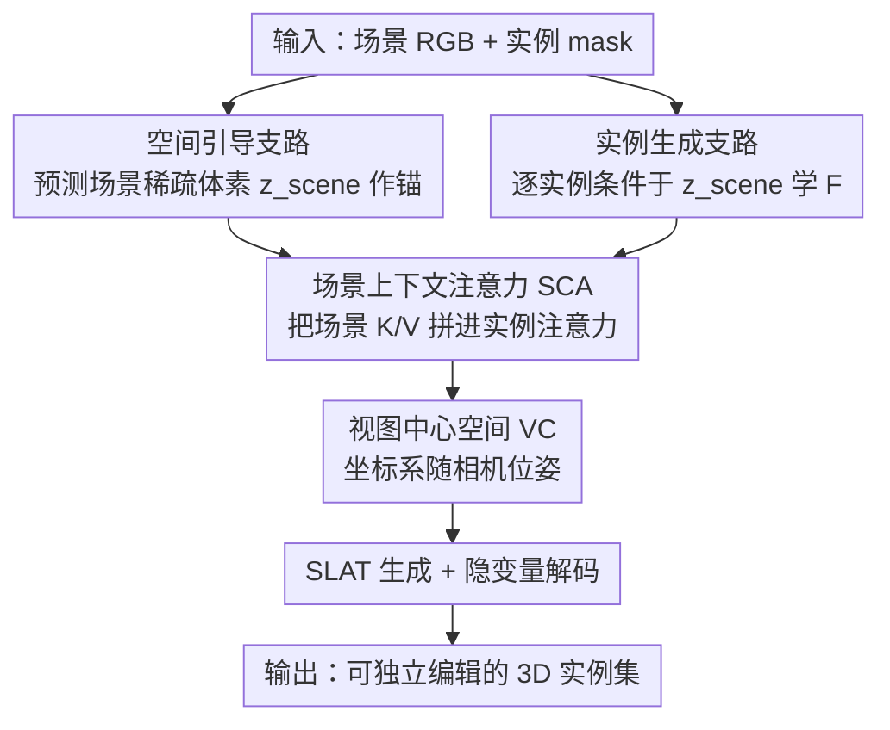

# I-Scene: 3D Instance Models are Implicit Generalizable Spatial Learners

**会议**: CVPR 2026  
**论文**: [CVF Open Access](https://openaccess.thecvf.com/content/CVPR2026/html/Ling_I-Scene_3D_Instance_Models_are_Implicit_Generalizable_Spatial_Learners_CVPR_2026_paper.html)  
**代码**: 项目页公开（论文称 "code is accessible at the project page"，具体地址未在缓存正文给出 ⚠️）  
**领域**: 3D视觉 / 交互式 3D 场景生成  
**关键词**: 3D 场景生成, 实例先验, 重编程, 视图中心空间, 前馈生成

## 一句话总结
I-Scene 不再用标注好的场景数据集去教模型"东西该摆哪"，而是把一个预训练的图像到 3D 实例生成器（TRELLIS）"重编程"成场景级空间学习器——靠场景上下文注意力 + 视图中心空间，让它在前馈一遍里学会推断邻接、支撑、对称等空间关系，甚至只用随机拼出来的无语义场景训练就能泛化到未见布局，全面超过在 3D-FRONT 上训练的 SOTA。

## 研究背景与动机
**领域现状**：交互式 3D 场景生成要产出可编辑、有 affordance、空间上自洽的物体排布。近期端到端方法（MIDI-3D、SceneGen、PartCrafter）把强大的图像到 3D 实例先验扩展到多物体，单次前向就同时建模多个物体及其关系，避开了"先检测—再检索/生成—最后解算布局"这种组合式管线的级联误差。

**现有痛点**：这些学习型方法的空间理解都**绑死在精挑细选的场景数据集**上。最常用的交互式 3D 场景数据集 3D-FRONT 只有约 2 万个室内卧室/客厅场景，且小物体、支撑物严重欠表示。于是模型容易过拟合到数据集偏置上，碰到"小物体放在大家具上/被遮在后面""室外布局"这类罕见排布就崩。组合式管线虽然语义开放，但对早期感知/规划错误敏感、还要逐场景优化，吞吐受限。

**核心矛盾**：泛化能力 ↔ 数据集覆盖之间的死结。布局监督来自数据集，而可得的交互式场景数据集在规模、多样性、空间变化上都有限，于是"用更多标注场景"这条路从根上就走不远。

**切入角度**：作者的核心洞察是——一个预训练的 3D 实例生成器虽然只输出单个 mesh，却**隐式编码了可迁移的空间知识**（深度、遮挡、尺度、支撑）。那么与其再去标注场景，不如把这个实例先验**重编程**成场景级空间学习器，用"模型自带的空间先验"取代"数据集的布局监督"。

**核心 idea**：把实例生成器重编程为空间学习器，用模型为中心的监督（model-centric supervision）替代数据集为中心的监督，并把场景表示从主流的"规范空间（canonical space）"换成"视图中心空间（view-centric space）"，得到一个完全前馈、可从无语义随机场景中学到空间关系的可泛化场景生成器。

## 方法详解

### 整体框架
给定单张场景图 $I_{scene}\in\mathbb R^{H\times W\times3}$ 和各实例的 mask $\{m_i\}_{i=1}^N$，I-Scene 输出一组可独立操控的 3D 实例 $A=\{A_i\}_{i=1}^N$，且它们在场景空间里的摆放与输入图一致。骨干用 TRELLIS，**只改动其稀疏结构 transformer，其余阶段不动**。模型分两条**共享权重、联合训练**的支路：**空间引导支路**吃场景 RGB，把整个场景预测成一组稀疏激活体素 $f_{scene}=\{(f_i,p_i)\}_{i=1}^L$，它干两件事——给出全局场景布局来引导实例生成、并建立一个所有实例都参照的共享场景坐标系（"锚轴"）；**实例生成支路**吃单个实例 RGB $I_{inst}$，在场景隐变量 $z_{scene}$ 的条件下学函数 $F$ 预测体素化的实例特征 $f_{inst}=F(I_{inst},z_{scene})$。由于 $z_{scene}$ 已经提供了场景布局，$F$ 只需专注于生成几何并跟随布局引导，这就把实例生成器从"隐式编码场景先验"转成了"显式学习空间布局"。$F$ 通过**场景上下文注意力**实现，整个表示放在**视图中心空间**里，训练数据则用**无语义随机场景**。

### 关键设计

**1. 双支路重编程：用模型自带的实例先验当场景监督，而不是去标场景**

针对"布局监督绑死数据集"的痛点，I-Scene 把预训练实例生成器拆成共享权重的两支路：空间引导支路把场景预测成稀疏体素，提供全局布局锚 $z_{scene}$；实例生成支路在该锚条件下逐个生成实例几何。这里的妙处是——没有这个全局锚，各实例会被独立生成、拼起来必然不连贯；有了锚，$F$ 就只用管"局部几何 + 跟随布局"，于是实例先验里的形状质量被保住，而空间关系由共享场景上下文提供。监督信号来自模型自身的空间先验（model-centric），彻底摆脱对标注场景的依赖。

**2. 场景上下文注意力（SCA）：把场景信息拼进实例注意力，且尽量不动预训练先验**

要让实例生成条件于场景，又不能让强大的 $z_{scene}$ 被"灾难性遗忘"，所以对基模型的改动要尽量小。SCA 把原来的部分自注意力层改造成：实例 $i$ 的 query/key/value 为 $(Q_i,K_i,V_i)$，空间引导支路的为 $(Q_s,K_s,V_s)$，把场景的 key/value 拼到实例的后面——$\tilde K_i=[K_i;K_s]$、$\tilde V_i=[V_i;V_s]$，再做 $\mathrm{SCA}(Q_i,\tilde K_i,\tilde V_i)=\mathrm{softmax}\!\big(Q_i\tilde K_i^\top/\sqrt d\big)\tilde V_i$。直觉上，实例生成不仅看自己的 $K_i/V_i$，还条件于场景的 $K_s/V_s$。这是对骨干的"自然"改动：它不改变隐变量分布——一个极端例子是当实例输入和场景输入完全相同时，SCA 退化为原始自注意力，因此对预训练先验的扰动最小（附录给出数学证明）。

**3. 视图中心空间（VC）：让坐标系随相机走，把"图像里的布局"当成 3D 摆位的强提示**

主流做法（MIDI、SceneGen）沿用图像到 3D 基模型的**规范空间**，但规范空间是视图不变的——同一物体不论相机在哪都被折叠成同一个规范表示，于是 $F$ 看不到物体在视图里的空间位置，只关注局部形状。在 3D-FRONT 这种物体少、形状各异的室内数据上还凑合，可一旦场景里有**相同物体**（如几把姿态相近的椅子），$F$ 就会把重复物体堆到同一个位置。I-Scene 改用视图中心空间：坐标轴基于相机位姿，场景表示是视图依赖的，严格编码了图像空间与场景空间之间的空间关系。同样两个相机设置下，两个物体的空间布局会随相机位姿**连贯地变化**——消融显示 VC 是布局连贯性的关键，去掉它在 OOD（BlendSwap/Scenethesis）上 IoU 掉得最多、还会出现重复/混融实例与接触违例。

**4. 无语义随机场景（NS）：用纯几何、无语义的随机拼搭训练，反而泛化更强**

3D-FRONT 是领域特定、资产有限的数据集；即便有了 SCA + VC，作者发现只在它上面训练实例质量会退化（模型不可避免地遗忘实例先验）。既然空间学习器 $F$ 学的不是"数据集布局"而是"跟随给定的空间引导"，那训练场景**有没有语义就不重要**。于是作者从 Objaverse 等多样 3D 资产里采样高质量实例，用**无碰撞机制**随机摆放（减少严重遮挡），只施加 right/left/front/back/on-top 这类基本空间关系与物理合理性约束，造出纯无语义的合成场景。在这种数据上训练，I-Scene 学到的是**通用空间推理**而对类别语义无感。实验进一步证明：纯随机训练（Rand-15K/25K）在 OOD 场景级指标上反超 3D-FT，且随规模 15K→25K 持续变好；3D-FT + Rand-15K 混合则取得全面最佳——标注场景对域内校准仍有用，但无语义场景提供了泛化所需的实例多样性。

### 损失函数 / 训练策略
训练用条件 rectified flow（CFM）：$\mathcal L_{CFM}(\theta)=\mathbb E_{t,x_0,\epsilon}\big\|v_\theta(x,t)-(\epsilon-x_0)\big\|_2^2$，其中 $v_\theta$ 是稀疏结构网络、$x(t)=(1-t)x_0+t\epsilon$、$\epsilon$ 为时间步 $t$ 的噪声。两支路共享权重联合训练。

## 实验关键数据

**自定义指标说明**：CD（Chamfer Distance，倒角距离，**越低越好**）；F-Score（阈值 $\tau=0.1$，**越高越好**），均在场景级（S，所有点并集）和物体级（O，逐匹配实例求均值后平均）两个层级报告；IoU-B（预测与真值场景轴对齐包围盒的体素 IoU，**越高越好**，刻画整体尺寸/位置/相对摆放）。几何质量评估前会把生成资产转点云、用 robust ICP 刚性对齐到真值。

### 主实验
在合成数据上对比 SOTA（3D-FRONT 为域内，BlendSwap & Scenethesis 为域外）：

| 数据集 | 指标 | Gen3DSR | SceneGen | MIDI | **I-Scene (Ours)** |
|--------|------|---------|----------|------|--------------------|
| 3D-FRONT (ID) | CD-S↓ / F-S↑ | 0.2587 / 42.31 | 0.1432 / 54.70 | 0.0175 / 90.08 | **0.0148 / 93.50** |
| 3D-FRONT (ID) | CD-O↓ / F-O↑ | 0.0697 / 57.22 | 0.0353 / 77.95 | 0.0877 / 70.10 | **0.0207 / 84.28** |
| 3D-FRONT (ID) | IoU-B↑ | 0.4838 | 0.5295 | 0.8596 | **0.8762** |
| BlendSwap & Scenethesis (OOD) | CD-S↓ / F-S↑ | 0.1429 / 45.43 | 0.1161 / 49.94 | 0.0212 / 83.13 | **0.0059 / 94.26** |
| BlendSwap & Scenethesis (OOD) | IoU-B↑ | 0.4736 | 0.4669 | 0.7412 | **0.8568** |

最显著的是 **OOD 上几乎不掉点**：所有 baseline 从 ID 到 OOD 都大幅退化，而 I-Scene 的物体/场景级指标在 BlendSwap/Scenethesis 上仍接近其 ID 水平。效率上，单 H100 每场景前馈 15.51s，慢于 PartCrafter（7.2s）但几何/布局质量更高，快于 MIDI（42.5s）、SceneGen（26.0s）、Gen3DSR（179.0s）。

### 消融实验
组件消融（从完整模型逐个去掉 SCA / VC / NS）：

| SCA | VC | NS | 3D-FRONT F-S↑ / IoU-S↑ | OOD F-S↑ / IoU-S↑ | 说明 |
|-----|----|----|------------------------|-------------------|------|
| ✓ | ✗ | ✗ | 93.69 / 0.8598 | 79.12 / 0.7557 | 仅 SCA，OOD 明显弱 |
| ✓ | ✓ | ✗ | 93.77 / 0.8792 | 90.79 / 0.8222 | 加 VC，OOD 大涨（布局连贯性） |
| ✓ | ✓ | ✓ | 93.50 / 0.8762 | **94.26 / 0.8568** | 完整模型，OOD 最佳（实例多样性） |

训练数据消融（同一模型换训练集）：

| 训练数据 | 3D-FRONT (ID) F-S↑ | OOD F-S↑ / IoU-B↑ | 现象 |
|----------|--------------------|-------------------|------|
| 3D-FT (25K) | 93.77 | 90.79 / 0.8222 | 域内最佳布局，但 OOD 偏弱 |
| Rand-15K | 92.67 | 92.67 / 0.8445 | 纯无语义随机即超 3D-FT 的 OOD |
| Rand-25K | 93.60 | 93.60 / 0.8471 | 随规模继续变好 |
| 3D-FT + Rand-15K | 93.50 | **94.26 / 0.8568** | 混合取得全面最佳 |

### 关键发现
- **VC 是布局连贯性的命门**：去掉它在 OOD 上 IoU 掉幅最大、scene-level F-score 显著下降，并出现重复/混融实例与接触违例——印证"图像里的物体布局是 3D 摆位的强提示"。
- **无语义随机场景足以教会空间推理**：纯几何线索（邻近、支撑、对称）就能提供强监督，规模 15K→25K 持续涨点，作者据此提出一条类似 MegaSynth 的"合成无语义布局可扩展"路线。
- **标注场景仍有价值但只用于域内校准**：3D-FT + Rand-15K 混合最佳，说明标注负责 ID 校准、随机场景负责泛化多样性，二者协同。

## 亮点与洞察
- **"重编程"而非"重训"**：把一个只会出单 mesh 的实例生成器改造成场景级学习器，只动稀疏结构 transformer 的部分注意力层，最大限度保留预训练先验——这套"最小侵入式改造基模型"思路可迁移到其他想复用 3D/图像基模型的任务。
- **SCA 的等价退化性质很巧**：当实例输入与场景输入相同时 SCA 退化为自注意力，从数学上保证对隐变量分布扰动最小，是"既要条件注入又要不毁先验"的优雅折中。
- **"无语义数据也能学空间"是反直觉的 aha**：用随机拼搭、无任何场景语义的数据反而泛化更好，把"空间学习"和"语义"解耦，指向用合成数据规模化交互式 3D 场景生成。

## 局限与展望
- 作者承认在**极小分辨率输入**和**严重遮挡的单视图**下表现相对较差；未来计划用重遮挡增强提升鲁棒性、并探索可选的多视图条件。
- 作者还计划进一步研究无语义随机场景的 scaling law，以应对更具挑战的野外布局。
- 自己看：⚠️ 缓存正文里多处公式被 OCR 打乱（如式 (1)(3)(4)(5) 的 LaTeX 残片），具体张量形状以原文为准；代码"项目页可得"但缓存未给出确切链接。方法强依赖 TRELLIS 这一特定实例骨干，换骨干是否仍成立未验证；15.51s/场景仍慢于 PartCrafter，对大规模批量生成是开销。

## 相关工作与启发
- **vs MIDI-3D / SceneGen（端到端多实例）**：它们从 3D-FRONT 标注里学物体姿态/隐式关系，受数据集偏置束缚、OOD 大幅退化；I-Scene 用模型为中心的监督 + 视图中心空间，OOD 几乎不掉点。
- **vs PartCrafter**：它把组合式潜在扩散扩展到 parts/objects 联合去噪，更快（7.2s）但缺纹理、几何/布局质量逊于 I-Scene；二者代表"更快 vs 更准"的折中。
- **vs Gen3DSR / 组合式管线（先感知再装配）**：它们靠检测/分割/深度再检索装配，对早期感知误差敏感、需逐场景优化、吞吐低（179s）；I-Scene 全前馈、无检索/解算 handoff，避开级联误差。

## 评分
- 新颖性: ⭐⭐⭐⭐⭐ "重编程实例先验 + 无语义数据学空间"是真正反直觉的新范式
- 实验充分度: ⭐⭐⭐⭐⭐ ID/OOD/真实/风格化 + 组件与数据双消融，证据链完整
- 写作质量: ⭐⭐⭐⭐ 动机与洞察清晰，但行文有少量笔误、关键证明在附录
- 价值: ⭐⭐⭐⭐⭐ 指向用合成数据规模化交互式 3D 场景生成的基础模型路线

<!-- RELATED:START -->

## 相关论文

- [\[CVPR 2026\] Towards Foundation Models for 3D Scene Understanding: Instance-Aware Self-Supervised Learning for Point Clouds](towards_foundation_models_for_3d_scene_understanding_instance-aware_self-supervi.md)
- [\[CVPR 2026\] Consistent Instance Field for Dynamic Scene Understanding](consistent_instance_field_for_dynamic_scene_understanding.md)
- [\[CVPR 2026\] Context-Nav: Context-Driven Exploration and Viewpoint-Aware 3D Spatial Reasoning for Instance Navigation](context-nav_context-driven_exploration_and_viewpoint-aware_3d_spatial_reasoning_.md)
- [\[CVPR 2026\] Featurising Pixels from Dynamic 3D Scenes with Linear In-Context Learners](featurising_pixels_from_dynamic_3d_scenes_with_linear_in-context_learners.md)
- [\[CVPR 2026\] Learning Spatial-Temporal Consistency for 3D Semantic Scene Completion](learning_spatial-temporal_consistency_for_3d_semantic_scene_completion.md)

<!-- RELATED:END -->
