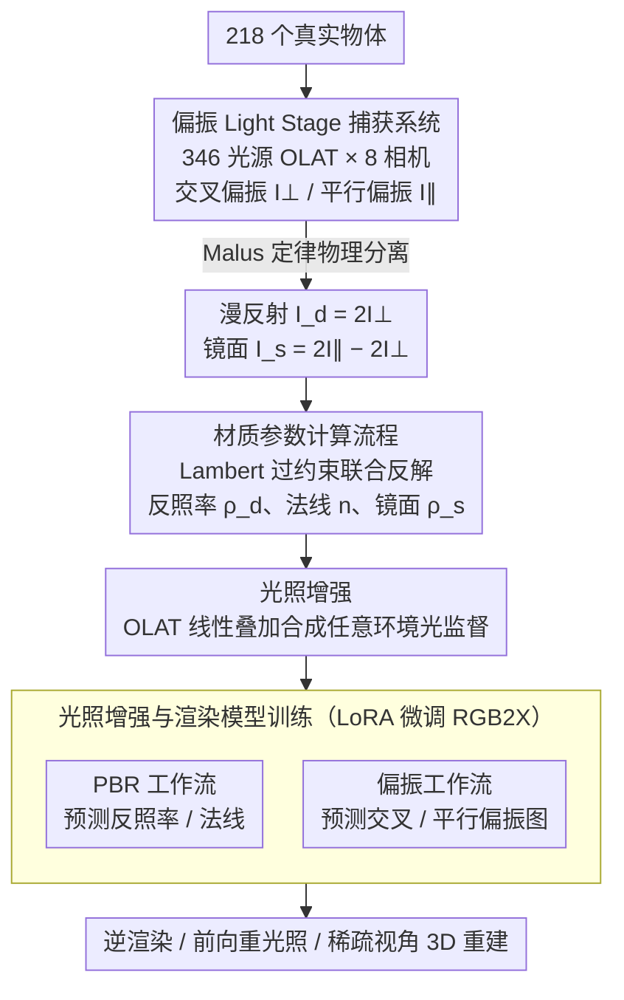

# ICTPolarReal: A Polarized Reflection and Material Dataset of Real World Objects

**会议**: CVPR 2026  
**arXiv**: [2603.24912](https://arxiv.org/abs/2603.24912)  
**代码**: [https://jingyangcarl.github.io/ICTPolarReal](https://jingyangcarl.github.io/ICTPolarReal) (项目页)  
**领域**: 3D视觉  
**关键词**: 偏振成像, 材质数据集, 逆渲染, 反射分离, Light Stage

## 一句话总结

本文构建了首个大规模真实世界偏振反射与材质数据集 ICTPolarReal，利用 8 相机 346 光源的 Light Stage 系统对 218 个日常物体进行交叉/平行偏振捕获，获得超 120 万张高分辨率图像及漫反射-镜面反射分离的地面真值，显著提升了逆渲染、前向重光照和稀疏视角三维重建的效果。

## 研究背景与动机

**领域现状**：逆渲染（固有图像分解）旨在将图像分解为反照率、光照和镜面成分。近年来，基于扩散模型的方法（如 RGB2X、Diffusion Renderer）取得了很大进步，但它们严重依赖合成数据集（如 Objaverse、Hypersim）进行训练。

**现有痛点**：合成数据虽然视觉逼真，但受限于简化的光照模型和有限的材质真实性。常用的着色模型采用解析 BRDF 或少量采样近似双向反射，忽略了多次散射、偏振和次表面传输等在真实物体中普遍存在的效应。这导致仅在合成数据上训练的模型难以泛化到真实光照和真实照片。

**核心矛盾**：缺乏真实世界的反射率测量数据。已有的真实世界数据集要么只提供不同光照条件下的照片但没有固有分解标注（Multi-Illumination），要么只限于平面样本和两个视角（OpenSVBRDF），要么物体数量和光照模式极为有限（Open Illumination），无法直接用于监督深度网络的材质分解训练。

**本文目标** (1) 构建一个覆盖多种材质的真实世界大规模反射数据集，提供漫反射/镜面反射分离的地面真值；(2) 验证使用真实测量数据能否显著提升逆渲染和重光照模型在真实场景中的表现。

**切入角度**：利用偏振光学原理，通过交叉偏振和平行偏振滤光器物理分离漫反射和镜面反射。Malus 定律保证了在特定偏振配置下可以精确提取这两种反射成分。

**核心 idea**：用偏振 Light Stage 系统对真实物体进行大规模测量，获得首个可直接监督逆渲染深度模型的真实世界材质数据集。

## 方法详解

### 整体框架

这篇工作的核心不是一个网络，而是一套"把真实物体的反射拆干净"的物理测量管线。它要解决的问题是：逆渲染模型一直拿合成数据训练，但合成 BRDF 拍不出真实物体里的多次散射、次表面传输这些效应，模型一到真实照片就失灵。作者的思路是用偏振光学在物理层面把漫反射和镜面反射分开，从而给每个真实物体打上可信的材质标签。整条管线分三步走：先用偏振 Light Stage 把一个物体在 346 个光照方向、8 个视角下各拍一对偏振图，再从这些偏振序列反解出漫反射反照率、镜面反照率和法线，最后用得到的数据集去微调逆渲染/前向渲染模型并验证它能否泛化到真实场景。

### 关键设计

**1. 偏振 Light Stage 捕获系统：用 Malus 定律在硬件层面分离漫反射与镜面反射**

逆渲染最棘手的一步是把镜面高光从漫反射底色里剥出来，纯靠算法分容易出错。作者干脆把这件事交给光学：系统由装在测地球面上的 346 个 LED 光源和 8 台同步的 RED Komodo 6K 全局快门相机组成，LED 前面贴线偏振片，相机也配可旋转偏振片。采集时按 OLAT（一次只点一盏灯）从前半球到后半球以螺旋顺序逐灯触发，每个光照方向各拍一张交叉偏振图 $I_{\perp}$ 和一张平行偏振图 $I_{\parallel}$。关键在 Malus 定律：镜面反射会保持入射光的偏振方向，所以交叉偏振时它被滤掉，$I_{\perp}$ 里只剩漫反射；而 $I_{\parallel}$ 两种成分都有。于是漫反射和镜面反射可以直接解析地写出来：

$$I_d = 2I_{\perp}, \qquad I_s = 2I_{\parallel} - 2I_{\perp}$$

整个分离过程不含任何学习，纯物理给出，这正是数据集地面真值可信的根基。

**2. 材质参数计算流程：用过约束的 OLAT 光照联合反解反照率与法线**

拿到偏振分离后的漫反射序列 $\Lambda_d$ 和镜面反射序列 $\Lambda_s$，下一步要把它们浓缩成每个像素的材质参数。漫反射部分遵循 Lambert 余弦定律——同一像素在不同方向 $\omega_k$ 光照下的亮度等于反照率乘上法线夹角余弦，于是作者对每个像素最小化

$$L = \{\rho_d\,|n \cdot \omega_k|\}_{k=0}^{N} - \Lambda_d$$

同时解出漫反射反照率 $\rho_d$ 和表面法线 $n$。因为有 346 个方向已知的 OLAT 光照，方程组是高度过约束的，法线和反照率的联合求解非常稳定，不会像少量光照那样陷入歧义。镜面反照率 $\rho_s$ 则通过对镜面反射函数在所有光照方向上积分近似得到。

**3. 光照增强与渲染模型训练：靠 OLAT 的线性可叠加性合成任意光照下的监督数据**

有了分离干净的数据，作者还想让它能训练出泛化的模型，关键观察是 OLAT 采集天然满足线性叠加——任意环境光下的成像，等于把各盏灯的单光照图按权重加起来。于是给定任意环境光纹理，只要投影到与标定光源对齐的单位球上算出每盏灯的权重，对所有 OLAT 图像加权求和，就能合成该光照下的重光照结果，而且漫反射/镜面分离的地面真值依然成立。基于此，训练设计了两条工作流：PBR 工作流预测物理材质成分（反照率、法线等），偏振工作流则直接预测交叉/平行偏振图像，相当于教普通相机"虚拟地"输出偏振结果。两条流都用 LoRA 微调 RGB2X，避免在小规模真实数据上全量微调导致灾难性遗忘。

### 损失函数 / 训练策略

逆渲染和前向渲染网络均基于 RGB2X 进行 LoRA 微调。逆渲染使用提示词条件机制控制不同目标成分的生成（如"albedo"或"surface normal"）。前向渲染使用 L2 损失监督，额外引入辐照度图作为输入。训练数据通过光照增强策略扩展，包含 OLAT、合成 HDRI 和全白光照三种类型。

## 实验关键数据

### 主实验

**逆渲染分解（HDRI 光照，Light Stage 数据）**:

| 方法 | Albedo MSE↓ | Albedo PSNR↑ | Normal PSNR↑ | Specular PSNR↑ |
|------|-------------|--------------|--------------|----------------|
| DR-IR (原始) | 0.035 | 20.01 | 20.48 | 22.61 |
| RGB2X (原始) | 0.040 | 18.08 | 18.58 | 17.21 |
| Ours (微调) | **0.005** | **33.51** | **28.09** | **31.02** |

**前向重光照（HDRI 光照，Light Stage 数据）**:

| 方法 | MSE↓ | PSNR↑ | SSIM↑ | LPIPS↓ |
|------|------|-------|-------|--------|
| DR-FR | 0.058 | 16.97 | 0.775 | 0.386 |
| RGB2X | 0.038 | 18.50 | 0.514 | 0.514 |
| Ours-PBR | **0.005** | **27.80** | **0.904** | **0.211** |
| Ours-Polarization | 0.007 | 26.13 | 0.909 | 0.200 |

### 消融实验

**稀疏视角 3D 重建（8 视角输入，50 个真实物体）**:

| 输入 / 方法 | PSNR↑ | SSIM↑ | LPIPS↓ |
|-------------|-------|-------|--------|
| Dust3r + 原始图像 | 14.51 | 0.226 | 0.604 |
| Dust3r + 预测漫反射 | 17.78 | 0.411 | 0.556 |
| Dust3r + 预测反照率 | **20.30** | **0.513** | **0.506** |
| Mast3r + 原始图像 | 12.72 | 0.193 | 0.613 |
| Mast3r + 预测反照率 | **15.57** | **0.282** | **0.603** |

### 关键发现

- 使用真实偏振数据微调后，反照率 PSNR 从 20 dB 提升至 33.5 dB（13.5 dB 飞跃），说明合成数据与真实反射之间存在巨大的域差距
- 偏振工作流在重光照任务上 LPIPS 最低（0.200），表明偏振监督有助于更精确的反射建模
- 去除镜面反射后的漫反射图像作为 3D 重建输入，Dust3r 的 PSNR 从 14.5 提升到 20.3，证明镜面反射是稀疏视角重建的主要干扰源

## 亮点与洞察

- **真实偏振分离的巧妙利用**：利用 Malus 定律实现完全物理驱动的反射分离，不依赖任何学习，为数据集提供了精确的地面真值。这种"先物理后学习"的思路值得借鉴
- **"虚拟偏振"概念**：训练模型从普通非偏振输入预测偏振等效输出，相当于赋予普通相机"偏振能力"，这个想法可以迁移到很多需要特殊成像的任务
- **光照增强的线性叠加**：OLAT 采集的关键优势在于真实反射的线性叠加性质，使得可以生成无限光照条件下具有精确标注的训练数据

## 局限与展望

- 数据采集限于静态物体和受控 Light Stage 环境，无法捕获高度透明、动态或强各向异性材质
- 数据集未包含次表面散射参数
- 218 个物体虽然覆盖面广但数量仍有限，特别是某些材质类别可能样本不足
- 未来可以探索将偏振测量扩展到更复杂材质以及野外采集场景

## 相关工作与启发

- **vs Objaverse/Hypersim（合成数据集）**: 这些合成数据集提供了大规模标注但缺乏真实材质特性。本文数据集虽然规模较小但具有真实物理测量的优势，两者可互补
- **vs Multi-Illumination**: 后者提供了多光照真实照片但缺少固有分解标注，无法直接监督逆渲染。本文通过偏振弥补了这一关键缺陷
- **vs OpenSVBRDF**: 后者仅限平面样本和两个视角，本文扩展到了完整 3D 物体和 8 个视角

## 评分

- 新颖性: ⭐⭐⭐⭐ 首个真实世界大规模偏振材质数据集，填补了重要空白，但思路相对直接
- 实验充分度: ⭐⭐⭐⭐⭐ 覆盖了逆渲染、重光照、3D 重建三个下游任务，有多种光照条件对比
- 写作质量: ⭐⭐⭐⭐ 结构清晰，物理原理描述详细
- 价值: ⭐⭐⭐⭐⭐ 数据集价值极高，有望成为逆渲染领域的基础设施级工作

<!-- RELATED:START -->

## 相关论文

- [\[CVPR 2026\] OLATverse: A Large-scale Real-world Object Dataset with Precise Lighting Control](olatverse_a_large-scale_real-world_object_dataset_with_precise_lighting_control.md)
- [\[CVPR 2026\] Choreographing a World of Dynamic Objects](choreographing_a_world_of_dynamic_objects.md)
- [\[CVPR 2026\] Artiverse: A Diverse and Physically Grounded Dataset for Articulated Objects](artiverse_a_diverse_and_physically_grounded_dataset_for_articulated_objects.md)
- [\[CVPR 2026\] MatSpray: Fusing 2D Material World Knowledge on 3D Geometry](matspray_fusing_2d_material_world_knowledge_on_3d_geometry.md)
- [\[CVPR 2026\] AnthroTAP: Learning Point Tracking with Real-World Motion](anthrotap_learning_point_tracking_with_real-world_motion.md)

<!-- RELATED:END -->
