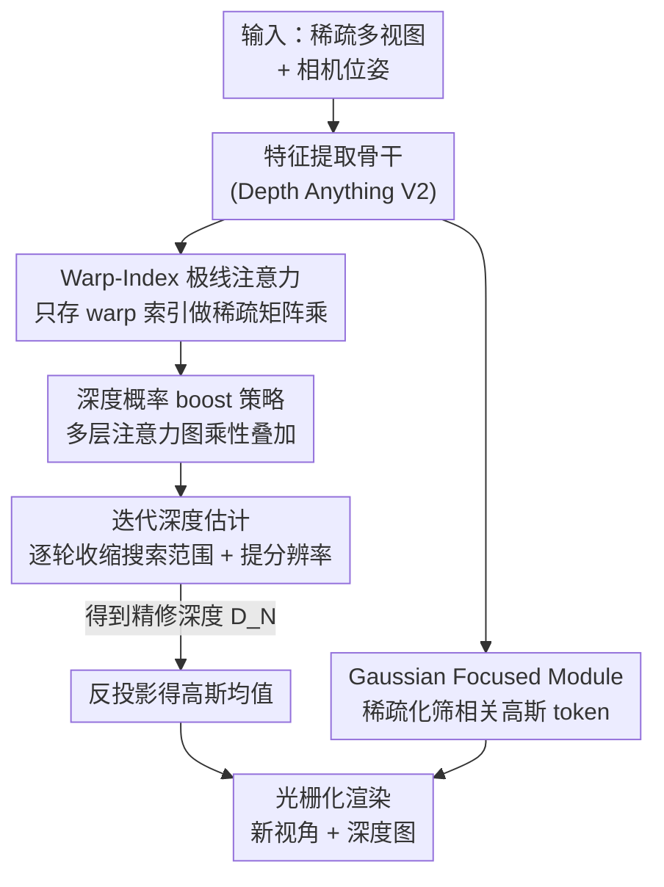

# IDESplat: Iterative Depth Probability Estimation for Generalizable 3D Gaussian Splatting

**会议**: CVPR 2026  
**论文**: [CVF Open Access](https://openaccess.thecvf.com/content/CVPR2026/html/Long_IDESplat_Iterative_Depth_Probability_Estimation_for_Generalizable_3D_Gaussian_Splatting_CVPR_2026_paper.html)  
**代码**: https://github.com/CVL-UESTC/IDESplat  
**领域**: 3D视觉  
**关键词**: 泛化3DGS、前馈高斯重建、深度概率估计、迭代 warp、稀疏注意力

## 一句话总结
IDESplat 把"单次 warp 估深度"换成"多次级联 warp 迭代 boost 深度概率"，让前馈式泛化 3DGS 的高斯中心（深度）预测更准，在 RE10K 上用 DepthSplat 约 1/10 的参数就反超 0.33 dB PSNR，并在跨数据集 DTU 上大涨 2.95 dB。

## 研究背景与动机

**领域现状**：可泛化 3D 高斯泼溅（Generalizable 3DGS）用一个前馈网络直接吐出所有高斯参数（均值 $\mu$、不透明度 $\alpha$、协方差 $\Sigma$、颜色 $c$），无需逐场景优化即可重建未见场景。其中高斯均值（球心位置）最难直接回归，因为高斯梯度只有局部支撑，所以主流做法是先估一张逐像素深度图，再反投影（unproject）得到球心。

**现有痛点**：现有方法（MVSplat、MonoSplat、DepthSplat）几乎都靠**单次 warp** 构造代价体（cost volume）来度量跨视图特征相似度，进而估深度概率。单次 warp 没法充分挖掘多视图几何线索，得到的深度图"既不可靠也粗糙"；而且要把每个深度候选的稠密 warp 特征全部存下来，候选数 $D$ 一大就吃显存。

**核心矛盾**：深度精度 ↔ 单次 warp 的信息上限之间存在天花板——单次相似度度量本身有噪声、有歧义（前景背景纹理相近时分不清），却被直接拿去定高斯球心，误差一路传导到整套高斯参数优化。

**本文目标**：(1) 用多次 warp 渐进增强相似度度量、压低低概率候选；(2) 在不爆显存的前提下做迭代细化；(3) 顺带把"非均值"的其余高斯参数也算得更干净。

**切入角度**：作者借鉴光流/MVS 里"迭代由粗到细"的思路——既然单次度量不可靠，就把多次 warp 的极线注意力图**以乘性方式**叠起来，让"多轮都高概率"的深度候选被放大、"偶然高"的被抑制。

**核心 idea**：用"级联 warp 的乘性 boost + 逐轮收缩深度搜索范围、提升特征分辨率"代替"单次 warp 一锤定音"，迭代地把深度概率推到可靠，从而拿到准确的高斯均值。

## 方法详解

### 整体框架
IDESplat 是一个前馈泛化 3DGS 模型，输入若干张稀疏视图 $\{(I_i,P_i)\}$，输出一组 3D 高斯并渲染新视角。整条管线分三大块：① 多视图特征提取骨干（基于预训练 Depth Anything V2）；② 迭代深度概率估计过程——由 $N$ 个 **Depth Probability Boosting Unit（DPBU）** 级联组成，每个 DPBU 内部又堆 $M$ 个 **Warp-Index Epipolar Attention（WIEA）** 层，逐轮收缩深度候选范围并提高特征分辨率；③ **Gaussian Focused Module（GFM）** 负责其余高斯参数。最终深度 $D_N$ 反投影成高斯均值，连同 GFM 算出的参数一起送进光栅化器渲染。

### 关键设计

**1. Warp-Index 极线注意力（WIEA）：只存索引，省掉稠密 warp 特征的显存**

痛点是传统 cost volume 要对每个深度候选采样目标视图特征 $F^{j\to i}=W(F^j,P_i,P_j,G)$ 并整张存下来，候选数 $D$ 一大显存就爆。WIEA 的做法是只记录 warp 过程中的**索引图** $I^{j\to i}=IW(F^j,P_i,P_j,G)$，然后用稀疏矩阵乘 $C^i=\Psi(F^i,F^j,I^{j\to i})$ 直接按索引取 $F^j$ 的对应位置与 $F^i$ 做点积，避免物化稠密特征体。相关图经一个轻量 2D U-Net 精修得 $\tilde C^i$，再沿深度维 softmax 得到单次估计的注意力（深度概率）图 $A^i=\mathrm{softmax}(\tilde C^i)$。这样既保留了极线几何约束，又把显存从"存全部 warp 特征"降到"存索引"，为后面堆很多层、迭代多次腾出空间。

**2. 深度概率 boost 策略（DPBS）：乘性叠加多层注意力，放大一致高概率、抑制偶发噪声**

单层 WIEA 给的概率不可靠。一个 DPBU 内堆 $M$ 个 WIEA 层得到 $M$ 张独立概率图 $A^i$，DPBS 把它们**乘性**融合：从全 1 矩阵 $P_0$ 出发，逐层更新 $P_m=\mathrm{Norm}(P_{m-1}\odot A_m)$（$\odot$ 为逐元素积，$\mathrm{Norm}$ 为行归一化）。直觉是——只有"多层都判为高概率"的深度候选才会在连乘里被持续放大，偶然在某一层高的会被其它层压下去。这等价于对多次 warp 的相似度证据做"软 AND"，比把它们简单相加平均更能逼出真正的表面点。消融里把"加性/无 boost"换成 DPBS 直接涨 0.46 dB，是单个增益最猛的设计之一。

**3. 迭代深度估计过程（IDE）：逐轮收缩搜索范围 + 提升分辨率，做对称残差细化**

把多个 DPBU 级联成 $N$ 轮迭代，每轮在上一轮深度 $D_{n-1}$ 附近重新采候选。首轮在初始范围 $[d_{min},d_{max}]$ 均匀采样；之后第 $n$ 轮以 $D_{n-1}$ 为中心、用相对偏移向量 $\Delta G_n=[-kI_n,\dots,0,\dots,kI_n]$ 对称采样（能预测正负残差），间隔随轮次收缩 $I_n=I_1/n$。残差深度 $\Delta D_n=P_{M,n}\Delta G_n$ 是概率与偏移沿深度维的加权和，深度按 $D_n=D_{n-1}+\Delta D_n$ 累加更新。关键是特征分辨率也逐轮提高——3 轮时 warp 分别在 $1/4$、$1/2$、原始分辨率上做，最后一轮在 $256\times256$ 原分辨率上算相似度，因此随着搜索范围"再居中"+ 特征更清晰，匹配越来越容易也越精确，由粗到细把深度图磨准。

**4. Gaussian Focused Module（GFM）：稀疏筛选相关高斯 token，去掉窗口注意力里的无关噪声**

非均值的其余高斯参数用窗口注意力交互时，会把一堆无关 token 也拉进来，既慢又引噪。GFM 复用上一层的高斯相关图来引导本层注意力：用三个线性层得 $Q,K,V$，用索引矩阵 $I_G$（初始全 1）记录高相似 token 位置，算相似度 $S^l=\Psi(Q^l,K^l,I^{l-1})$；再做稀疏注意力 $A^l=\mathcal S(\mathrm{Norm}(A^{l-1}\odot\mathrm{Softmax}(S^l)))$，其中 $\mathcal S$ 只保留每行权重的前一半（top-half），保留位置记进 $I_G^l$；输出 $O^l=\Psi(A^l,V^l,I^l)$。随层数增加 $I_G$ 越来越稀，逐渐锁定对每个 query 最重要的高斯关系，过滤掉无关高斯特征的干扰。

### 损失函数 / 训练策略
沿用 DepthSplat 的设置：8 卡 RTX 4090、总 batch 16、AdamW、30 万步、余弦学习率；预训练 Depth Anything V2 骨干用 $2\times10^{-6}$ 小学习率，其余层用 $2\times10^{-4}$。监督用 MSE + LPIPS 损失（渲染新视角与真值对比），不额外依赖深度真值。

## 实验关键数据

### 主实验
两视图输入、$256\times256$ 分辨率，在 RE10K / ACID 上估三张新视角；首位加粗、第二名下划线（此处用文字标注）。

| 数据集 | 指标 | IDESplat | DepthSplat | MonoSplat | 备注 |
|--------|------|----------|------------|-----------|------|
| RE10K | PSNR↑ | **27.80** | 27.47 | 26.68 | +0.33 vs DepthSplat |
| RE10K | SSIM↑ / LPIPS↓ | **0.893 / 0.108** | 0.889 / 0.114 | 0.875 / 0.123 | 均最优 |
| ACID | PSNR↑ | **28.94** | -（原文无） | 28.63 | +0.31 vs MonoSplat |
| 参数量 | M↓ | 37.6 | 354 | 30.3 | 仅 DepthSplat 的 ~10.7% |

跨数据集泛化（仅在 RE10K 训练，零样本测）：

| 迁移 | 指标 | IDESplat | DepthSplat | MonoSplat |
|------|------|----------|------------|-----------|
| RE10K→DTU | PSNR↑ / LPIPS↓ | **18.33 / 0.239** | 15.38 / 0.442 | 15.25 / 0.291 |
| RE10K→ACID | PSNR↑ | **28.79** | 28.37 | 28.24 |

DTU 上比 DepthSplat 高 2.95 dB，说明迭代深度概率估计对跨域几何更稳。效率上（表 3）IDESplat 37.6M 参数、2336M 显存、0.110s/帧——比 DepthSplat 慢一点点，但参数、显存、PSNR 全面更优。ScanNet 深度评测（表 4）Abs Rel 0.039 / RMSE 0.116，优于 UniMatch 与 DepthSplat。

### 消融实验
在 RE10K 上训 2 万步、batch 8（绝对值低于主表，仅看相对增益）。

| 配置 | PSNR↑ | 说明 |
|------|-------|------|
| Baseline | 26.31 | 单 warp 基线 |
| + GFM | 26.63 | 高斯聚焦模块，+0.32 |
| + IDE(3) | 26.88 | 3 轮迭代深度估计，+0.57 |
| + IDE(3) + GFM | 27.07 | 两者叠加 |
| + IDE(3) + DPBS | 27.34 | 加乘性 boost，相比仅 IDE 再 +0.46 |
| Full Model | 27.56 | 三件套全开 |

迭代轮数消融（表 6）：0 轮（单 warp）26.63 → 1 轮 27.08（+0.45）→ 3 轮 27.56（+0.93），4 轮 27.64 但显存/时间继续涨。

### 关键发现
- **DPBS（乘性 boost）性价比最高**：在已有 IDE 的基础上再 +0.46 dB，印证"软 AND 式融合多次 warp"比单纯堆迭代更关键。
- **迭代 3 轮是甜点**：1→3 轮收益明显（+0.48），3→4 轮只 +0.08 却显著增加显存(2336→2745M)与时延(0.110→0.132s)，作者选 3 轮兼顾质量与实时。
- **泛化增益远大于同分布增益**：同分布 RE10K 仅 +0.33，跨域 DTU 却 +2.95，说明可靠深度概率主要帮的是"没见过的几何分布"。

## 亮点与洞察
- **"只存索引的稀疏 warp"是让迭代可行的工程基石**：把 cost volume 的显存瓶颈拆掉，才敢堆多层 WIEA、迭代多轮、最后还在原始分辨率上 warp——否则迭代直接被显存劝退。
- **乘性融合 = 概率上的软 AND**，比加性/平均更适合"多证据找同一个表面点"，这个 trick 可迁移到任何多视图相似度聚合（MVS、光流代价体）。
- **由粗到细的对称残差更新**（$\pm k I_n$、间隔 $I_1/n$）让网络只学小残差、搜索范围逐轮收紧，是迭代深度估计稳定收敛的关键写法。

## 局限与展望
- 推理速度比 DepthSplat 略慢（0.110s vs 0.082s），多轮迭代的串行性限制了进一步提速；可探索轮间并行或自适应轮数。
- 仍依赖预训练单目深度骨干（Depth Anything V2），其先验质量会传导到最终深度，弱纹理/反光区可能受限。⚠️ 论文未给出无预训练骨干的对照，纯迭代设计本身的上限尚不清楚。
- 评测集中在室内/航拍/物体中心三类，对动态、强反射、极稀疏视图等更极端场景的鲁棒性未充分验证。

## 相关工作与启发
- **vs DepthSplat / MonoSplat（单 warp + 预训练单目深度）**：它们用单次 warp 度量相似度、靠大模型补先验，参数动辄数百 M；IDESplat 用迭代级联 warp 把相似度做可靠，仅 37.6M 参数就反超，且跨域泛化优势更大。
- **vs 迭代光流/MVS（GRU/LSTM 逐轮 refine 视差）**：传统迭代法多用循环单元更新视差场；IDESplat 的不同点是提出乘性的 DPBU 来融合多次 warp 概率，而非加性循环更新，配合逐轮收缩范围+提分辨率，更适配泛化 3DGS 的深度→均值链路。

## 评分
- 新颖性: ⭐⭐⭐⭐ 把迭代+乘性 boost 引入泛化 3DGS 深度估计，思路清晰但属"已有迭代思想的精巧适配"
- 实验充分度: ⭐⭐⭐⭐⭐ 三主数据集 + 跨域 + 深度评测 + 效率 + 双重消融，证据链完整
- 写作质量: ⭐⭐⭐⭐ 方法链条交代清楚，部分符号（SMM、索引矩阵）偏简略
- 价值: ⭐⭐⭐⭐ 用 1/10 参数达到 SOTA 且开源，对落地泛化重建有实际意义

<!-- RELATED:START -->

## 相关论文

- [\[CVPR 2026\] Depth Hypothesis Guided Iterative Refinement for Event-Image Monocular Depth Estimation](depth_hypothesis_guided_iterative_refinement_for_event-image_monocular_depth_est.md)
- [\[CVPR 2026\] Eulerian Gaussian Splatting using Hashed Probability Pyramids](eulerian_gaussian_splatting_using_hashed_probability_pyramids.md)
- [\[CVPR 2026\] iSplat: Iterative Learning for Fine-Grained Gaussian Splatting](isplat_iterative_learning_for_fine-grained_gaussian_splatting.md)
- [\[CVPR 2026\] Depth Any Panoramas: A Foundation Model for Panoramic Depth Estimation](depth_any_panoramas_a_foundation_model_for_panoramic_depth_estimation.md)
- [\[CVPR 2026\] iLRM: An Iterative Large 3D Reconstruction Model](ilrm_an_iterative_large_3d_reconstruction_model.md)

<!-- RELATED:END -->
