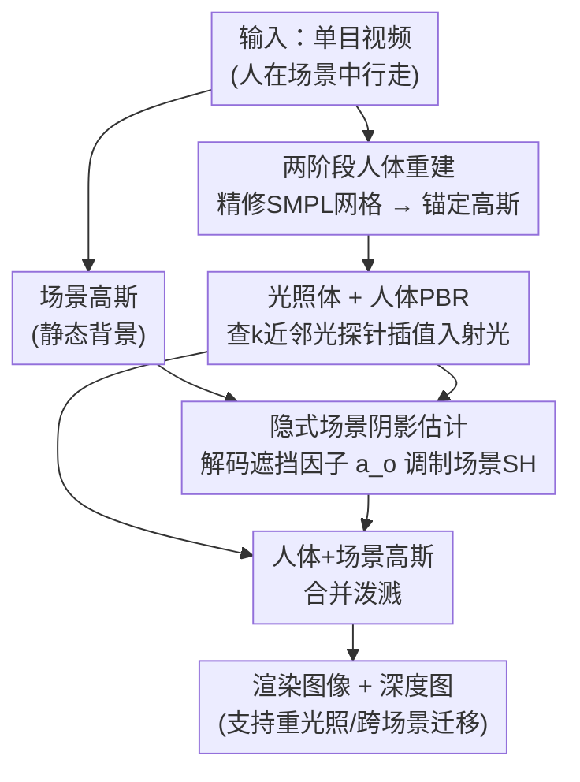

# Illumination-Consistent Human-Scene Reconstruction from Monocular Video

**会议**: CVPR 2026  
**论文**: [CVF Open Access](https://openaccess.thecvf.com/content/CVPR2026/html/Zheng_Illumination-Consistent_Human-Scene_Reconstruction_from_Monocular_Video_CVPR_2026_paper.html)  
**代码**: 待确认  
**领域**: 3D视觉  
**关键词**: 单目视频重建、人-场景联合、3D高斯泼溅、可重光照人体、阴影估计、光照体

## 一句话总结
本文用 3DGS 从单目视频联合重建可驱动人体与静态场景，核心是引入一个"光照体（light volume）"提供空间变化的局部光照线索做人体 PBR、再用隐式阴影模块把人投到场景上的软阴影解耦出来，从而做到人-场景在光照与阴影上一致，并支持重光照与跨场景合成。

## 研究背景与动机

**领域现状**：从单目视频重建 3D 人体（影视/游戏/VR）主流靠 NeRF 或 3DGS。一类方法只建动态人体（要求干净背景、受控光照），一类联合建整个场景但缺显式人体建模、没法驱动新姿态，还有一类把人和场景分开重建再硬拼到一起。

**现有痛点**：分开重建再拼接的方法**忽略了人与环境之间的相互作用**——尤其是光照和阴影：人体出现在场景里时既会受场景局部光照影响外观，也会在地面/附近物体上投下动态阴影。忽略这层关系会导致人体外观不一致、场景真实感下降。

**核心矛盾**：现有可重光照人体方法普遍假设光来自无穷远、用**单一环境贴图**建模，没法表达空间变化（spatially-varying）或被遮挡的局部光照；而传统逆渲染用光线追踪建阴影，面对大场景里数百万个高斯、又是动态人体造成的阴影，计算上不可承受。于是"光照/阴影建得准"与"在大规模动态场景里算得起"互相打架。

**本文目标**：在一个统一框架里联合推断几何、材质和空间变化光照——既要人体外观随局部光照一致，又要把人投在场景上的阴影解耦出来，还得跑得动。

**切入角度**：用一组分布在空间中的"光探针"（light probe）网格把光照局部化（每个探针存球谐系数 + 一个用于阴影推理的隐式特征），而不是全局环境贴图；阴影则用隐式解码替代昂贵的全场景光追。作者称这是首个面向 in-the-wild 视频的"光照一致人-场景重建"探索。

**核心 idea**：用"光照体 + 两阶段人体重建 + 隐式场景阴影估计"三件套，把人体 PBR 所需的局部入射光、人体几何/材质、以及人对场景的软阴影分别解出来，再统一泼溅渲染。

## 方法详解

### 整体框架
输入一段单目视频，方法用 3DGS 分别表示人体和场景。人体高斯定义在基于精修 SMPL 网格的规范空间（canonical space），经 LBS 变形到观测空间（posed space）；渲染前对每个人体高斯，从光照体里查 $k$ 近邻光探针、插值出入射辐射，做物理基渲染（PBR）得到随光照变化的外观；对人体包围盒附近的场景高斯，从光照体取隐式特征 + 空间描述子，解码出遮挡因子来模拟软阴影；最后人体与场景高斯合并送入泼溅光栅器，输出图像与深度图。整套训练加多项正则约束。

### 关键设计

**1. 两阶段人体重建：先磨几何再上 PBR，避免材质-光照在粗几何上互相污染**

直接在不准的几何上解耦材质与光照会引入歧义。作者把人体重建拆两阶段：**阶段一（几何与颜色初始化）** 不做 PBR，沿 SMPL 网格表面上采样并把高斯铺到面片上，用两个哈希编码器学逐顶点偏移 $\Delta v$ 与颜色 $c$，即 $v'=v+\mathcal F_\Delta(v),\ c=\mathcal F_c(v)$，并通过精修这些高斯间接优化网格；**阶段二（物理基外观建模）** 才接入 PBR 管线，每个规范空间高斯带 $\{q,s,x,b(\text{albedo}),\alpha\}$，法线 $n$ 从精修网格提取，粗糙度/金属度用哈希编码器赋值 $\{m,r\}=\mathcal F_m(v)$，并用基于 KL 散度的稠密化/剪枝调整。为缓解自遮挡带来的材质-光照歧义，还引入姿态感知可见性估计器 $vis=\mathcal F_{vis}(v,\theta,\phi)$ 预测逐顶点可见性。这样"先有稳的几何、再谈材质光照"，让后续 PBR 站在可靠表面上。

**2. 光照体（light volume）：用球谐光探针网格表达空间变化的局部光照**

针对"单一环境贴图假设光来自无穷远、无法表达空间变化/遮挡光照"的痛点，作者把光照建成一个**网格**，每个顶点是一个光探针，探针用**球谐**（而非环境贴图）表示。理由是单视图重建下很多入射方向观测不到，环境贴图难以补未见方向，而低阶球谐能在所有方向上平滑辐射、利于新视角渲染。渲染某人体高斯时，定位 $n$ 个最近探针，对每个探针按高斯法线 $n$ 做 Fibonacci 采样入射方向 $\omega_i$、由球谐导出辐射 $L_k$，最终入射辐射由插值给出 $L_i(x,\omega_i)\approx \frac{\sum_k w_k(x)L_k(p_k,\omega_i)}{\sum_k w_k(x)}$。PBR 颜色按蒙特卡洛积分 $c'(\omega_o)=\sum_i (f_d+f_s(\omega_o,\omega_i))V(\omega_i)L_i(\omega_i)(\omega_i\cdot n)\Delta\omega_i$ 算出，其中 $f_d=b/\pi$ 为漫反射、$f_s$ 为简化 Disney BRDF 的镜面项。由此人体外观能随空间位置呈现不同光照（如头发高光、衣物局部光效）。

**3. 隐式场景阴影估计：用解码遮挡因子替代全场景光追，让人在场景上投出软阴影**

动态人体会在地面/附近物体投阴影，但对数百万场景高斯做光追不现实。作者给每个光探针额外挂一个隐式光照特征 $z_i$ 编码局部光照上下文。先在观测空间对人体算轴对齐包围盒、只取盒内的场景高斯；对每个被选中的场景高斯，从周围探针插值出特征 $z$，再加两个空间描述子——该高斯相对人体包围盒中心的距离 $\delta$ 与朝向 $r$，拼接后送进阴影权重解码器 $a_o=\mathcal F_{ao}(\gamma(r),\gamma(\delta),z)$（$\gamma$ 为位置编码），得到遮挡因子 $a_o$。它直接调制场景高斯的球谐 $SH'=a_o\cdot SH$，模拟人造成的软阴影。这套隐式公式避免了全场景光追，又能随人运动产生动态阴影。

### 损失函数 / 训练策略
总目标 $\mathcal L=\lambda_1\mathcal L_{image}+\lambda_2\mathcal L_{depth}+\lambda_3\mathcal L_{smooth}+\lambda_4\mathcal L_{scale}$。其中 $\mathcal L_{image}=\lambda_h\mathcal L_{human}+\lambda_s\mathcal L_{scene}$ 用 L1+SSIM+VGG 感知损失分别监督人体与场景；$\mathcal L_{depth}$ 对泼溅深度图做 L1 监督以稳住几何；$\mathcal L_{smooth}$ 含三项——材质平滑 $\mathcal L_{materials}=\|\nabla R\|\exp(-\|\nabla C_{gt}\|)$、探针平滑 $\mathcal L_{probe}$（约束相邻探针辐射不剧变）、阴影平滑 $\mathcal L_{shadows}$（约束近邻场景高斯遮挡因子一致）；阶段一还有 Laplacian 网格平滑 $\mathcal L_{mesh}$；$\mathcal L_{scale}$ 抑制过大高斯导致的新姿态伪影。

## 实验关键数据

### 主实验
在 NeuMan（6 段手机拍的人在场景行走视频）与 ZJU-MoCap（无背景室内）上评测，指标 PSNR/SSIM/LPIPS。下表取 NeuMan 整场景重建的代表性序列（完整 6 序列原文给全）。

| 序列（整场景） | 指标 | Ours | HUGS | NeuMan |
|----------------|------|------|------|--------|
| Lab | PSNR↑ / LPIPS↓ | **28.604 / 0.055** | 25.994 / 0.070 | 24.960 / 0.149 |
| Bike | PSNR↑ | **29.02** | 25.454 | 25.551 |
| Seattle | PSNR↑ | **29.56** | 25.934 | 23.987 |
| Jogging | PSNR↑ | **26.125** | 23.746 | 22.697 |

仅评人体区域（NeuMan，更能体现人体重建质量）：

| 序列（人体区域） | 指标 | Ours | HUGS | NeuMan |
|------------------|------|------|------|--------|
| Lab | PSNR↑ / LPIPS↓ | **22.106 / 0.108** | 18.789 / 0.152 | 18.756 / 0.193 |
| Bike | PSNR↑ | **22.586** | 19.476 | 19.049 |
| Parkinglot | PSNR↑ | **22.375** | 19.437 | 17.663 |

ZJU-MoCap 新视角合成（表 3）：Ours PSNR 30.73 / SSIM 0.9705 / LPIPS 0.0284，优于 HUGS（30.56 / 0.9703 / 0.03089）、HumanNeRF、Intrinsic Avatar 等。整场景与人体区域两个口径上本文均全面领先。

### 消融实验
在 NeuMan 的 Lab 序列上训练/渲染。

| 配置 | PSNR↑ | SSIM↑ | LPIPS↓ | 说明 |
|------|-------|-------|--------|------|
| w/o light volume | 21.97 | 0.8055 | 0.1061 | 不对人体做 PBR（去光照体） |
| w/o shadow | 21.59 | 0.8100 | 0.1068 | 去阴影估计模块 |
| w/o $\mathcal L_{probe}$ | 21.87 | 0.8035 | 0.1121 | 去探针平滑损失 |
| w/o two-stage | 22.08 | 0.8054 | 0.1130 | 不用两阶段重建 |
| Ours (full) | **22.18** | **0.8104** | **0.1049** | 完整模型 |

### 关键发现
- **阴影模块对 PSNR 影响最大**：去掉后 PSNR 从 22.18 掉到 21.59（−0.59），是四项里掉点最多的，说明把人对场景的软阴影解出来对整体真实感贡献显著。
- **光照体（人体 PBR）是外观一致性的关键**：去掉它 PSNR 掉到 21.97，且定性上人体高光/局部光效消失（蓝框区域），对应 NeuMan/HUGS 因缺光照解耦而出现的错误人体外观。
- **两阶段重建主要稳几何**：去掉后 LPIPS 明显变差（0.1130 vs 0.1049），印证"先磨几何再上 PBR"对避免材质-光照在粗几何上互染的作用。

## 亮点与洞察
- **用球谐光探针网格替代环境贴图**是核心巧思：环境贴图假设无穷远光、补不了未见方向，而空间分布的低阶球谐探针天然表达"局部 + 平滑"光照，特别适配单视图观测受限的场景。
- **隐式阴影解码 = 拿可学习遮挡因子换光追**：把"人投在场景上的软阴影"建成 $a_o\cdot SH$ 的球谐调制，绕开对数百万高斯做全场景光线追踪，是大场景动态阴影可算的关键工程取舍。
- **"人-场景作为一个光照系统"的视角**可迁移到任意动态前景插入静态场景的合成任务（AR 虚拟人、虚拟试衣），下游已展示重光照与跨场景人体迁移并自动带上正确光照。

## 局限与展望
- 阴影只在人体包围盒附近的场景高斯上估计，远处投影或多人互相遮挡的复杂阴影未必覆盖；⚠️ 多人/强烈间接光场景的表现原文未充分给出。
- 依赖 SMPL 网格与较准的位姿，宽松衣物、剧烈非刚性形变下的几何可能受限（两阶段虽改善但仍以参数化人体为基底）。
- 光照体以低阶球谐平滑辐射，利于新视角但可能丢失高频/强方向光细节；探针网格分辨率与显存/精度的权衡值得进一步探索。

## 相关工作与启发
- **vs HUGS（3DGS 人-场景联合，无光照建模）**：HUGS 重建质量高、速度快，但缺光照与材质解耦，导致人体外观错误、无法产生人投场景的阴影；本文用光照体 + 阴影模块补上这层交互，整场景与人体区域两口径全面反超（如 Lab 整场景 +2.6 dB）。
- **vs 可重光照人体方法（R4D / IA / IRAGA）**：它们多用单一环境贴图、且常依赖预提取网格做 3DGS，材质解耦有限、易出几何伪影或 albedo 区域不一致；本文空间变化光照 + 两阶段几何让重光照更稳、albedo 细节（衣褶）更丰富。

## 评分
- 新颖性: ⭐⭐⭐⭐ 首次把"空间变化光照 + 隐式动态阴影"统一进单目人-场景 3DGS 重建，组合新颖
- 实验充分度: ⭐⭐⭐⭐ 两数据集 + 整场景/人体双口径 + 重光照对比 + 四项消融，较扎实；缺多人/复杂光照压力测试
- 写作质量: ⭐⭐⭐⭐ 三模块逻辑清晰、公式完整，部分符号（探针特征、解码器细节）偏简
- 价值: ⭐⭐⭐⭐ 面向 in-the-wild 视频的可重光照人-场景合成，AR/影视落地价值明确

<!-- RELATED:START -->

## 相关论文

- [\[CVPR 2026\] Coherent Human-Scene Reconstruction from Multi-Person Multi-View Video in a Single Pass](coherent_humanscene_reconstruction_from_multiperso.md)
- [\[CVPR 2026\] Color-Encoded Illumination for High-Speed Volumetric Scene Reconstruction](color-encoded_illumination_for_high-speed_volumetric_scene_reconstruction.md)
- [\[CVPR 2026\] PhysHO: Physics-Based Dynamic 3D Gaussian Human and Object from Monocular Video](physho_physics-based_dynamic_3d_gaussian_human_and_object_from_monocular_video.md)
- [\[CVPR 2026\] SCE-SLAM: Scale-Consistent Monocular SLAM via Scene Coordinate Embeddings](sce-slam_scale-consistent_monocular_slam_via_scene_coordinate_embeddings.md)
- [\[CVPR 2026\] 4DEquine: Disentangling Motion and Appearance for 4D Equine Reconstruction from Monocular Video](4dequine_disentangling_motion_and_appearance_for_4d_equine_reconstruction_from_m.md)

<!-- RELATED:END -->
