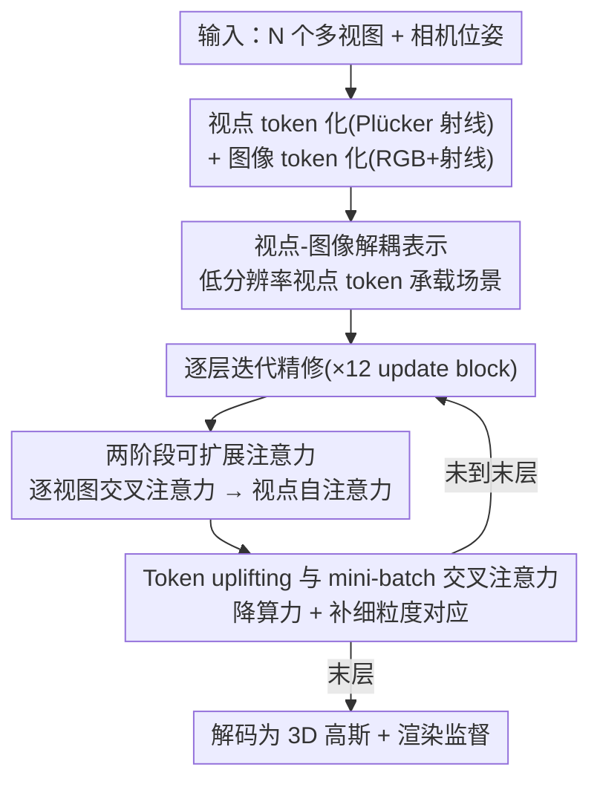

# iLRM: An Iterative Large 3D Reconstruction Model

**会议**: CVPR 2026  
**论文**: [CVF Open Access](https://openaccess.thecvf.com/content/CVPR2026/html/Kang_iLRM_An_Iterative_Large_3D_Reconstruction_Model_CVPR_2026_paper.html)  
**代码**: https://gynjn.github.io/iLRM/ （项目页）  
**领域**: 3D视觉  
**关键词**: 前馈式三维重建、3D 高斯泼溅、迭代精修、可扩展注意力、视点嵌入

## 一句话总结
iLRM 把前馈式 3D 高斯重建从"一次性把所有图像 token 映射成像素对齐高斯"改写成"用低分辨率视点嵌入做载体、逐层用多视图图像做反馈迭代精修"，靠表示解耦 + 两阶段注意力把算力压下来，在 RE10K / DL3DV 上同时刷高画质和速度（32 视图 540×960 推理仅 0.5 秒，对标优化法的 8 分钟）。

## 研究背景与动机

**领域现状**：3D 高斯泼溅（3DGS）火了之后，前馈式三维重建成为主流——训练一个大网络，把多视图图像一次性映射成高斯参数，单次前向就能重建场景，接近实时。其中"像素对齐高斯"（pixel-aligned Gaussian，如 GS-LRM、PixelSplat、MVSplat）是事实标准：直接从每个像素回归一个高斯。

**现有痛点**：像素对齐范式有两个硬伤。其一，**高斯数量被图像分辨率绑死**——1K 分辨率 × 200 视角会产出 2 亿个高斯，而同样场景其实 50 万个高斯就够表达，冗余巨大。其二，**多视图交互的算力爆炸**——GS-LRM 对所有视图的所有图像 token 做全注意力，复杂度随视图数和分辨率二次增长；MVSplat / DepthSplat 还要为每个视图构建代价体。想降分辨率或减视图来省算力，又会丢掉重建必需的几何与外观信息。

**核心矛盾**：现有前馈方法把 3D 重建当成"序列到序列"的**一次性生成**问题，而真正高质量的优化法（per-scene 3DGS）走的是另一条路——**迭代精修**：每步渲染当前估计、量误差、更新表示，逐步抠出细节并保证 3D 一致性。前馈模型恰恰缺这种"反馈驱动"特质。

**本文目标**：在前馈架构里既要 1) 引入反馈驱动的迭代精修，又要 2) 干掉像素对齐范式的算力负担和表示冗余。

**切入角度**：把网络重新解释成一个"优化器"——每一层类比一个优化步，视点 token 类比待更新的 3DGS 表示，多视图图像 token 类比梯度信号。这样在前馈架构内部就模拟出了优化过程。

**核心 idea**：把场景表示从输入图像中**解耦**出来（用低分辨率视点嵌入承载场景），再让它逐层通过与高分辨率图像的交叉注意力被"反馈式"迭代精修，最后解码成紧凑的 3D 高斯。

## 方法详解

### 整体框架
iLRM 的输入是 $N$ 张多视图图像 $\{I_i\}$ 和对应相机位姿 $\{C_i\}$，输出是一组 3D 高斯（均值、不透明度、协方差、颜色）。整条管线的关键转变是：**不再从图像像素直接回归高斯，而是先初始化一批"视点 token"作为场景的可学习载体，再让它们在 12 个 update block 里被多视图图像逐层精修，最后解码成高斯**。视点 token 的分辨率与输入图像分辨率解耦，所以可以用低分辨率视点表示产出紧凑高斯，同时仍用高分辨率图像做细节引导。

视点 token 用 Plücker 射线嵌入构造：把每个视点的内外参编成 Plücker 坐标，切成 $p\times p$ 的 patch，过一个线性层得到 $V_i^{(0)}\in\mathbb{R}^{H^vW^v/p^2\times d}$。因为 Plücker 坐标天然带空间/视角差异，作者不再额外加位置编码。图像 token 则把 RGB patch 和 Plücker 射线 patch 拼起来线性投影：$S_{ij}=\text{Linear}(\text{concat}(I_{ij},P_{ij}))$。

### 关键设计

**1. 视点-图像解耦表示：让高斯数量不再被图像分辨率绑死**

像素对齐范式最致命的就是高斯数 = 像素数，导致冗余和算力爆炸。iLRM 的破法是**把"将被转成高斯的场景表示"从输入图像直接依赖中解耦出来**：场景由一批视点 token 承载，其空间分辨率 $H^v\times W^v$ 是独立设的（实验里常用半分辨率），与输入图像分辨率无关。于是可以用**低分辨率视点 token 产出紧凑高斯**，同时仍把**高分辨率图像**作为交叉注意力的 key/value 提供细节。消融里把图像特征强行约束到视点分辨率（退回 GS-LRM/Long-LRM 的做法），PSNR 从 29.24 掉到 28.47，证明解耦是同时拿到"紧凑"与"高保真"的前提。

**2. 两阶段可扩展注意力：把全注意力的二次复杂度拆成两个便宜的子步**

朴素做法是对所有视图所有 token 做全注意力，算力随视图数和分辨率二次增长。iLRM 把多视图交互拆成两步：**先做逐视图交叉注意力**（每个视点嵌入只和它对应那张图像做注意力，得益于一对一映射，非常省）；**再做视点间自注意力**（所有视点 token 互相交互做全局信息交换）。关键在于第二步运行在**低分辨率的视点表示空间**上，所以全局交互仍可承受。作者给了一组相对算力比：图 2 的 (a)全注意力 : (b)解耦 : (c)降视点分辨率 : (d)两阶段 = $1:1:0.25:0.08$，说明两阶段方案能在显著更低算力下容纳更多视图。

**3. 逐层迭代精修：把"一次性生成"改成前馈架构内的反馈式优化**

这是 iLRM 名字里"iterative"的来源。模型由多个 transformer 模块串成，每个模块 = 一层交叉注意力 + 一层自注意力，视点 token 逐层被更新：

$$\tilde{V}_i^{(l-1)}=\text{cross-attn}^{(l)}(V_i^{(l-1)},S_i),\quad \{V_i^{(l)}\}=\text{self-attn}^{(l)}(\{\tilde{V}_i^{(l-1)}\})$$

注意图像 token $S$ 在所有层固定不变，只反复给视点 token 提供"视觉证据"。作者把它解释成近似梯度下降：$V^{(l)}\approx V^{(l-1)}-\eta\nabla_V E(V^{(l-1)};S)$，每一层是一次**反馈修正**而不是单纯的特征变换——这正是区别于标准堆叠自注意力（$S^{(l)}=S^{(l-1)}+f(S^{(l-1)})$）的地方。各层用独立参数。消融里把"每层交叉注意力"换成"只在第一层做一次交叉、后面 23 层全自注意力"，LPIPS 明显变差（0.109→0.127），说明持续注入图像证据对精修至关重要。

**4. Token uplifting 与 mini-batch 交叉注意力：补低分辨率的细粒度对应、再把交叉注意力的算力压一档**

解耦带来的副作用是视点 token 分辨率低、交叉注意力时难以充分吸收高分辨率图像的细节。**Token uplifting** 的做法是：用一个线性 query 层把每个低分辨率视点 token 的特征维扩 $k$ 倍（实验 $k=2$），reshape 成 $k$ 个更细粒度的 query token 去和高分辨率图像 token 做交叉注意力，之后再投影回原维度。去掉它各项指标都掉（29.24→28.90），因为模型抓不住细粒度空间对应。**Mini-batch 交叉注意力**则借鉴 mini-batch 梯度下降的思路：交叉注意力的算力瓶颈在高分辨率图像 token，于是每层只采样图像/视点 token 的一个子集来算（如 Quarter Cross-attention，每次取四分之一）。它把训练单步从 1.51s/62.5GB 降到 0.94s/39.0GB，PSNR 仅从 30.39 微降到 30.08，是一个划算的算力—质量权衡。

### 损失函数 / 训练策略
从视点 token 解码出的 3D 高斯经光栅化得到渲染图 $\hat{I}_t$，对真值 $I_t$ 用 MSE + 感知损失监督：

$$\mathcal{L}_\text{total}=\sum_{t\in\mathcal{T}}\mathcal{L}_\text{MSE}(\hat{I}_t,I_t)+\lambda\mathcal{L}_\text{perceptual}(\hat{I}_t,I_t)$$

其中 $\lambda=0.5$。模型含 12 个 update layer，隐藏维 $d=768$，patch size $p=8$，12 头注意力，采用 pre-norm + QK-Norm（RMSNorm）。

## 实验关键数据

### 主实验
在 RealEstate10K（RE10K，256×256）上与前馈法及优化法对比（推理时间在 RTX 4090 上测）：

| 方法 | #Param(M) | PSNR ↑ | SSIM ↑ | LPIPS ↓ | #高斯 | 时间(s) |
|------|-----------|--------|--------|---------|-------|---------|
| pixelSplat | 125 | 25.89 | 0.858 | 0.142 | 131,072 | 0.101 |
| MVSplat | 12 | 26.39 | 0.869 | 0.128 | 131,072 | 0.047 |
| GS-LRM* | 300 | 28.10 | 0.892 | 0.114 | 131,072 | — |
| DepthSplat | 354 | 27.47 | 0.889 | 0.114 | 131,072 | 0.065 |
| Ours (2, F, F) | 171 | 28.65 | 0.900 | 0.110 | 131,072 | **0.025** |
| Ours (8, H, F) | 185 | **31.57** | **0.935** | **0.082** | 131,072 | 0.029 |

注：配置记号 $(V, H/F, F)$ 表示视图数、视点 token 分辨率（H 半 / F 全）、图像 token 分辨率。即便最小的 (2,F,F) 也在更少参数、更快速度下超过 GS-LRM。增加到 8 视图能进一步把 PSNR 推到 31.57。

宽覆盖、零样本设置（未失真 DL3DV，540×960，模型用 32 视图训练）下与优化法的对比：

| 方法 | 视图 | 时间 ↓ | PSNR ↑ | SSIM ↑ | LPIPS ↓ |
|------|------|--------|--------|--------|---------|
| 3D-GS（优化法，30k 步） | 32 | 8 min | 24.43 | 0.827 | 0.191 |
| Long-LRM | 32 | 0.84 s | 23.97 | 0.778 | 0.267 |
| Ours (32, H, F) | 32 | **0.53 s** | 24.30 | 0.803 | 0.256 |
| Ours (Unseen) (48, H, F) | 48 | 1.04 s | 24.78 | 0.820 | 0.240 |

iLRM 用 0.53 秒拿到接近优化法（8 分钟）的画质，且能泛化到训练时没见过的 40/48 视图长上下文。

### 消融实验
架构组件消融（12 层 baseline，RE10K）：

| 配置 | PSNR ↑ | SSIM ↑ | LPIPS ↓ | 说明 |
|------|--------|--------|---------|------|
| Baseline (12 layers) | 29.24 | 0.907 | 0.109 | 完整模型 |
| w/o 迭代精修 | 28.58 | 0.893 | 0.127 | 仅首层 1 次交叉 + 23 层自注意力 |
| w/o 分辨率解耦 | 28.47 | 0.891 | 0.123 | 图像特征约束到视点分辨率 |
| w/o token uplifting | 28.90 | 0.901 | 0.113 | 去掉 LR→细粒度扩展 |

mini-batch 交叉注意力的算力—质量权衡（训练时测）：

| 配置 | PSNR ↑ | LPIPS ↓ | 单步(s) | 显存(GB) | GFLOPs |
|------|--------|---------|---------|----------|--------|
| Baseline（全交叉） | 30.39 | 0.095 | 1.51 | 62.5 | 3.83 |
| w/ Half Cross-attn | 30.25 | 0.096 | 1.13 | 47.4 | 1.71 |
| w/ Quarter Cross-attn | 30.08 | 0.098 | 0.94 | 39.0 | 0.81 |

### 关键发现
- **分辨率解耦掉点最多**（−0.77 PSNR），是同时拿"紧凑高斯 + 高保真"的根；其次是迭代精修（−0.66，LPIPS 退化尤其明显），说明持续注入图像证据比单纯堆自注意力更有效。
- **层数即优化步数**：3→6→9→12 层 PSNR 单调上升（28.04→28.68→29.01→29.24），与"更深精修 = 更多优化步"的直觉一致。
- **注意力可视化**显示，随层数加深，参考视点 query patch 在其他视点中 top-3 被注意的 token 逐渐移向几何/语义对应区域，印证了"渐进迭代精修"的设计动机。

## 亮点与洞察
- **把前馈网络重解释成优化器**是全文最"啊哈"的地方：层 = 优化步、视点 token = 待更新表示、图像 token = 固定的梯度信号，于是优化法的"迭代精修"优点被搬进了前馈架构，还能用 $V^{(l)}\approx V^{(l-1)}-\eta\nabla_V E$ 给出梯度下降式解释。
- **"解耦表示分辨率"这个 trick 可迁移**：任何"输出数量被输入分辨率绑死"的回归任务（如点云上采样、体素生成）都可借鉴——用独立分辨率的可学习载体承载输出，输入只做引导。
- **mini-batch 注意力**把优化里的随机采样思想搬到注意力算力上，是个简单且通用的省算力手段，对长序列/多视图场景尤其有价值。

## 局限与展望
- 作者承认的主要局限：**视图数极多时自注意力仍是瓶颈**。虽然紧凑视点嵌入大幅降了算力，但视点自注意力随视图数增长仍会吃紧，未来需要更可扩展的全局交互替代方案。
- 自己观察：mini-batch 交叉注意力的"结构化采样"（Half/Quarter）是为工程实现方便而设计的近似，理论最优的随机采样反而难高效实现 ⚠️——这意味着当前方案可能还没榨干迭代精修的潜力。
- 论文主要在室内/前向场景数据集（RE10K/DL3DV/ACID）验证，对大尺度室外、动态场景的适应性尚未充分检验。

## 相关工作与启发
- **vs GS-LRM / Long-LRM**：它们对所有图像 token 做全分辨率注意力、生成像素对齐高斯，是一次性生成；iLRM 解耦表示 + 两阶段注意力 + 逐层迭代精修，算力更省、高斯更紧凑（4× 更少）、画质更高。
- **vs MVSplat / DepthSplat**：它们靠代价体/深度先验保证多视图一致；iLRM 不依赖显式 3D 先验，靠数据驱动的迭代精修，扩展性更好（视图数增多时算力优势明显）。
- **vs G3R / Gen-Den（迭代精修法）**：它们用真实梯度更新表示，但每次训练迭代要渲染多张图、算力更重，且只用梯度可能忽略原始图像里的信息；iLRM 在前馈层内用交叉注意力注入图像证据，不显式渲染算梯度。
- **vs LRM / Lara / Quark（嵌入式 3D 表示）**：LRM/Lara 仅限物体级表示，Quark 的表示困在目标视图、缺乏持久 3D；iLRM 从视点嵌入构建场景级、显式、持久的 3D 表示。

## 评分
- 新颖性: ⭐⭐⭐⭐⭐ "前馈网络 = 优化器"的重解释 + 表示解耦 + 两阶段注意力，是一套自洽且有洞察的新范式
- 实验充分度: ⭐⭐⭐⭐ 三数据集、多视图/分辨率配置、算力—质量权衡和消融都到位，但缺室外/动态场景验证
- 写作质量: ⭐⭐⭐⭐⭐ 动机推导清晰，梯度下降类比和注意力可视化把"为什么有效"讲透了
- 价值: ⭐⭐⭐⭐⭐ 0.5s 对标 8min 优化法、紧凑高斯 + 强扩展性，对实时前馈三维重建有实用价值

<!-- RELATED:START -->

## 相关论文

- [\[CVPR 2026\] FlexAvatar: Flexible Large Reconstruction Model for Animatable Gaussian Head Avatars with Detailed Deformation](flexavatar_flexible_large_reconstruction_model_for_animatable_gaussian_head_avat.md)
- [\[CVPR 2026\] PatchScene: Patch-based Voxel Diffusion Model for Large-Scale Scene Completion](patchscene_patch-based_voxel_diffusion_model_for_large-scale_scene_completion.md)
- [\[CVPR 2026\] PhysGM: Large Physical Gaussian Model for Feed-Forward 4D Synthesis](physgm_large_physical_gaussian_4d_synthesis.md)
- [\[CVPR 2026\] IDESplat: Iterative Depth Probability Estimation for Generalizable 3D Gaussian Splatting](idesplat_iterative_depth_probability_estimation_for_generalizable_3d_gaussian_sp.md)
- [\[CVPR 2026\] iSplat: Iterative Learning for Fine-Grained Gaussian Splatting](isplat_iterative_learning_for_fine-grained_gaussian_splatting.md)

<!-- RELATED:END -->
