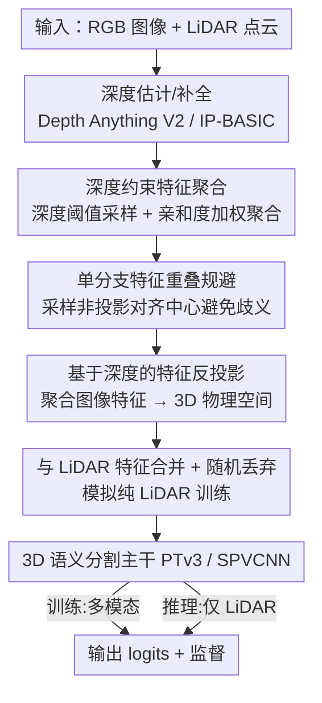

# Image-to-Point Cloud Feature Back-Projection for Multimodal Training of 3D Semantic Segmentation

**会议**: CVPR 2026  
**论文**: [CVF Open Access](https://openaccess.thecvf.com/content/CVPR2026/html/Han_Image-to-Point_Cloud_Feature_Back-Projection_for_Multimodal_Training_of_3D_Semantic_CVPR_2026_paper.html)  
**代码**: 待确认  
**领域**: 3D视觉  
**关键词**: 多模态融合、3D 语义分割、特征反投影、单分支网络、纯 LiDAR 推理

## 一句话总结
IPFP 提出一种"只在训练时启用"的图像-LiDAR 融合策略：把聚合后的图像特征按估计深度**反投影回 3D 物理空间**，与 LiDAR 特征共处同一坐标系、共用单分支主干训练；推理时关掉图像分支即可纯 LiDAR 部署，在 nuScenes/KITTI/Waymo 上一致提升 PTv3、SPVCNN 等 SOTA 分割模型且几乎不增推理成本。

## 研究背景与动机

**领域现状**：自动驾驶/机器人的 3D 语义分割需要给每个 3D 点打语义标签。LiDAR 给精确几何、图像给丰富纹理颜色，二者互补，多模态融合能显著提点，因此成为热门方向。

**现有痛点**：主流多模态法走**双分支架构**——图像和点云各跑一个独立网络，再在高层融合特征。这带来三个问题：① **训练成本高**（两套骨干网络）；② 有些方法被迫把图像裁小，丢掉大量颜色纹理；③ 更根本地，相机和 LiDAR 存在 **FOV（视场角）不一致**——LiDAR 通常 360° 水平覆盖但垂直有限，相机是窄而密的前向视场，于是大量 LiDAR 点（侧/后方）落在图像平面外，点-像素映射根本不存在。依赖严格跨模态对齐的早融合/特征拼接/知识蒸馏方法都被这部分 FOV 重叠卡死。

**核心矛盾**：要么严格对齐（被 FOV 重叠区域限制、丢掉非重叠点）、要么双分支（训练贵且推理时必须有相机）。本质矛盾是：**融合要求像素-点对应，但 FOV 不一致让大量点没有对应**；而且一旦训练强绑多模态，部署时缺相机就崩。

**本文目标**：设计一种 1) 不依赖严格像素-点对应、能绕开 FOV 不一致，2) 单分支、低训练成本，3) 训练用多模态、推理可纯 LiDAR 的融合方法。

**切入角度**：既然问题出在"在 2D 图像平面或 BEV 空间做对齐"，那就**换个统一战场**——把图像特征按深度反投影到 3D 物理空间，让两模态特征在同一个 3D 坐标系里"自然共存"，不再需要显式的像素-点对应。

**核心 idea**：用估计深度把**聚合后的图像特征中心**反投影进点云特征集（IPFP），使图像特征和点云特征同处一个 3D 空间，从而在单分支主干的前向传播里被自然融合；这个过程可按需开关——训练时开、推理无图像时关。

## 方法详解

### 整体框架
IPFP 把任务定义为标准 3D 语义分割 $P\to L$（$P=\{p\in\mathbb{R}^3\}$ 点云，$L$ 语义标签）。核心流程是：对每张图像估计深度图 → 在深度约束下采样聚类中心并按特征亲和度聚合图像特征 → 按深度把聚合特征**反投影**到 3D 物理空间 → 与 LiDAR 点云特征**合并**后送入同一个 3D 分割主干。关键点在于：**整个图像分支只在训练时挂载，推理时直接卸掉，主干结构与纯 LiDAR 基线完全一致**——这就是它能"多模态训练、纯 LiDAR 推理"的根本。

### 关键设计

**1. 深度约束特征聚合：在 LiDAR 可量测深度范围内采样聚类中心、按亲和度把图像特征压成稀疏中心**

直接把每个像素都反投影会产生海量冗余点、且很多落在 LiDAR 量测范围外不可靠。IPFP 先估计/补全度量深度图 $D_m$：稀疏 LiDAR 投到图像平面得到投影深度 $d_m^p$，再用 Gauss–Markov 定理对单目相对深度做尺度恢复 $D_m=sD_r+t$（剔除残差离群点提升精度）。然后用投影深度分布的分位数算上下界 $d_{\alpha_l},d_{\alpha_u}$，生成深度掩膜 $S=\{(x,y)\mid d_{\alpha_l}\le D_m(x,y)\le d_{\alpha_u}\}$，**在掩膜内无放回均匀采样聚类中心** $(u_r,v_r)$——这保证聚类中心的 3D 坐标严格落在 LiDAR 可量测范围内，同时能捕捉 LiDAR FOV 外的有效信息、滤掉近场重复地面纹理这类低熵区域。每个聚类中心的聚合特征按**像素-中心余弦相似度**加权：

$$f_c=\frac{1}{N}\Big(f_v+\sum_{i\in p(f_v)}\text{sigmoid}(\beta_0 S_i+\beta_1)\cdot F^p_{vi}\Big),\quad S_i=\|F^p_{si}\|_2\cdot\frac{f_s^\top}{2}$$

其中 $\beta_0,\beta_1$ 是可学习缩放/偏移，$N$ 是归一化因子。相似度计算用分区域操作以保聚合局部性、提效率。

**2. 单分支下的特征重叠规避：采样非投影对齐的中心，避免一个 3D 位置对应两个特征的歧义**

如果聚类中心取在"与点云投影对齐"的位置，反投影后聚合图像特征会与原始点云**完全重叠**——同一空间位置出现两个不同特征，对依赖位置索引聚合的 3D 网络造成歧义，且网络会偷懒过度依赖好学的图像模态、忽视几何模态，导致纯 LiDAR 推理时大幅掉点。IPFP 的解法是**故意采样非投影对齐的聚类中心**（前述深度掩膜内随机采，而非点云投影点或预定义 patch 中心）。论文还验证：即便把两模态特征分开独立处理（$Z=f(F;\theta)$，$Z_c=f(F_c;\theta)$）并做在线知识蒸馏（KDCL），图像与点云对齐 logits 的余弦相似度从训练 15% 到 100% 始终很高、几乎不再提升——说明严格对齐学不到额外东西，**反而是反投影非对齐图像聚合特征更能提升融合训练效果**。这构成单分支统一架构的理论依据。

**3. 基于深度的特征反投影与纯 LiDAR 适配训练：把聚合特征抬进 3D、与点云合并，并随机丢弃模拟无图像场景**

拿到聚合图像特征 $F_c=\{f_c\}$ 后，按其度量深度 $d_m^r=D_m(u_r,v_r)$ 反投影到 3D：

$$[p_c,1]^\top=T^{-1}K^{-1}(d_m^r\odot[u_r,v_r,1])^\top$$

$T$ 是相机外参（nuScenes 这类异频传感器需经多级坐标系链式变换求得）。随后把 LiDAR 点云 $P$ 与反投影点集 $P_c$ 合并、特征集 $F\cup F_c$ 合并——$F$ 由分割模型的嵌入层（如 PTv3 的 SubMConv3D、SPVCNN 的初始卷积）算出，维度对齐 $F_c$。**3D 分割模型固有的空间邻域聚合机制天然支持这种多模态融合，无需任何显式融合模块**。为模拟推理时无图像的场景，训练时按 $s\sim\text{Bernoulli}(\gamma)$ 决定是否启用丢弃算子、再按 $M_i\sim\text{Bernoulli}(1-\delta)$ 逐点丢弃 $F_c$，显式训练模型适应稀疏纯 LiDAR 输入。

### 损失函数 / 训练策略
最终对合并后特征预测 logits $Z\cup Z_c'=f(F\cup F_c';\theta)$，用 Lovász-Softmax + 交叉熵联合监督：

$$\mathcal{L}=\frac{1}{C}\sum_{c=1}^C\Delta J_c(m_c)-\frac{1}{N_p}\sum_{i=1}^{N_p}\log\!\Big(\frac{\exp(Z_{i,L_i})}{\sum_c\exp(Z_{i,c})}\Big)$$

第一项是 Lovász 扩展（$\Delta J_c$ 为梯度算子、$m_c$ 为类 $c$ 预测误差向量），第二项是 CE。点云数据增强在图像特征反投影**之后**施加，并对反投影点同步施加相同变换以保持几何一致。

## 实验关键数据

### 主实验
在三大数据集上把 IPFP 挂到 PTv3 和 SPVCNN 上（mIoU，L=LiDAR、C=camera，L(C)=训练用多模态/推理仅 LiDAR，三次随机运行 mean±std）：

| 方法 | 模态 | nuScenes | KITTI | Waymo |
|------|------|----------|-------|-------|
| PTv2 | L | 80.2 | 70.3 | 70.6 |
| 2DPASS | L(C) | 79.5 | 69.3 | — |
| MSeg3D | LC | 80.0 | 66.7 | 69.6 |
| PTv3*（复现基线） | L | 80.3 | 68.6 | 71.2 |
| **IPFP(PTv3)** | L(C) | **81.4 (↑1.1)** | **71.1 (↑2.5)** | **72.4 (↑1.2)** |
| SPVCNN | L | — | 63.8 | — |
| **IPFP(SPVCNN)** | L(C) | — | **65.1 (↑1.3)** | — |

IPFP 在三个数据集上一致提升基线，KITTI 上对 PTv3 提了 2.5 mIoU；且 nuScenes/Waymo 训练每场景只用 3 张图就拿到收益。

效率对比（RTX 4090，batch=1，1 图）：

| 方法 | 训练(s/it) | 显存(GiB) | 参数(M) | mIoU |
|------|-----------|-----------|---------|------|
| Baseline-PTv3* | 0.196 | 10.13 | 46.16 | 68.6 |
| PointPainting(PTv3) | 0.397 | 12.02 | 89.66 | 69.0 |
| 2DPASS(PTv3) | 0.381 | 11.69 | 70.75 | 69.6 |
| **IPFP(PTv3)-Offline** | **0.204** | 11.46 | **46.16** | **71.1** |

IPFP 参数量与基线几乎相同（46.16M vs 89.66M 的 PointPainting），训练单步仅 0.204s（双分支法近 0.4s），却拿到最高 mIoU。

### 消融实验
| 配置维度 | 设定 | 关键指标(mIoU) | 说明 |
|----------|------|----------------|------|
| 深度估计法 | IP-BASIC / DepthAnythingV2 / Unidepth / UnidepthV2 | 70.87 / 70.95 / 71.13 / 71.04 | 对深度模型选择不敏感，Unidepth 略优 |
| 深度下界 $\alpha_l$ | 20/30/40/50/60 | 70.7/70.6/70.8/**71.1**/70.9 | $\alpha_l=50$ 最佳 |
| 反投影图像数 #Image | 1→6 (nuScenes) | 81.0→81.5 | 多图小幅提升，3 图已够本 |
| 丢弃概率 $\gamma$ | 0.0/0.3/0.5/0.7 | 70.6/70.8/**71.1**/70.5 | $\gamma=0.5$ 最佳，过高过低都掉 |

### 关键发现
- **非对齐反投影是关键**：实验证明严格对齐的两模态 logits 相似度从训练早期到结束始终很高，说明对齐学不到新信息；故意采非对齐中心反而提升融合效果。
- **训练用图量很省**：nuScenes/Waymo 每场景仅 3 张图就拿到主要收益，验证了 IPFP 不靠密集像素-点对应。
- **随机丢弃 $\gamma$ 的甜点在 0.5**：太低则训练分布与纯 LiDAR 推理不匹配，太高则丢失过多图像证据，呈倒 U 型。
- **对深度模型鲁棒**：RMS 误差从 1.29m 到 1.86m 的不同深度法，mIoU 仅在 70.87–71.13 间波动，说明方法不依赖精确深度。

## 亮点与洞察
- **"换战场到 3D 物理空间"绕开 FOV 不一致**是最巧妙的地方：不再纠结像素-点对应，让两模态特征在同一 3D 坐标系自然共存，FOV 外的点也能受益。
- **"可开关的训练期融合"**极具实用价值：训练吃多模态、推理卸图像分支，主干结构与纯 LiDAR 基线完全一致——legacy 无相机车辆也能直接部署提升后的模型。
- **复用 3D 网络自带的邻域聚合做融合**：无需任何显式融合模块，把图像特征"伪装成几何信号"塞进点云特征集即可，这个思路可迁移到任何带空间邻域聚合的 3D 任务（检测、补全）。
- **随机丢弃训练**是个通用 trick：想让"训练用 A+B、推理只用 A"的模型不崩，就在训练时按概率丢掉 B 模拟缺失。

## 局限与展望
- 依赖**深度估计/补全**：虽然实验显示对深度模型鲁棒，但极端场景（远距离、反光、雨雾）深度误差会直接污染反投影位置，可能引入错误几何 ⚠️。
- 尺度恢复用 Gauss–Markov 假设相对深度与度量深度近似线性，对非刚性/复杂深度分布可能不成立。
- 论文聚焦驾驶场景（nuScenes/KITTI/Waymo），室内、非驾驶多模态分割未验证；且只覆盖语义分割，未扩到检测/全景分割。
- 自己观察：反投影点集大小（聚类中心数）与采样策略是超参，论文给了消融但最优值可能随数据集/传感器配置变化，迁移到新平台需重调。

## 相关工作与启发
- **vs PointPainting**：它把图像分割 logits 投到 LiDAR 空间（BEV/球面投影）画到点云上，受 FOV 重叠限制且需要严格投影；IPFP 反向把图像特征反投影进 3D、采非对齐中心，绕开 FOV 问题且参数更少。
- **vs 2DPASS / CMDFusion（知识蒸馏）**：它们用蒸馏把图像语义先验注入 LiDAR 网络以摆脱推理期多模态依赖；IPFP 同样能纯 LiDAR 推理，但靠的是 3D 空间特征共存 + 随机丢弃训练，单分支、训练更轻。
- **vs MSeg3D / PMF（双分支联合优化）**：它们用独立分支再联合优化缓解 FOV 不匹配；IPFP 直接单分支、无模态专属子网，训练成本显著更低（46M vs 双分支的 70–90M）。
- **vs 早融合/特征拼接**：这类严格跨模态对齐被 FOV 部分重叠卡死；IPFP 在统一 3D 空间操作，无需显式像素-点对应。

## 评分
- 新颖性: ⭐⭐⭐⭐ "把图像特征反投影到 3D 物理空间 + 非对齐采样 + 可开关训练期融合"是一套自洽的新融合范式，绕 FOV 问题角度新颖
- 实验充分度: ⭐⭐⭐⭐⭐ 三大驾驶数据集、两种主干、效率/深度/采样/丢弃全面消融，mean±std 报告规范
- 写作质量: ⭐⭐⭐⭐ 动机和 FOV 矛盾讲得清楚，公式完整；个别记号（如 $\alpha_l$ 与掩膜关系）略密
- 价值: ⭐⭐⭐⭐⭐ 即插即用提升多种 SOTA、几乎零推理开销、支持纯 LiDAR 部署，落地价值高

<!-- RELATED:START -->

## 相关论文

- [\[CVPR 2026\] PointGS: Semantic-Consistent Unsupervised 3D Point Cloud Segmentation with 3D Gaussian Splatting](pointgs_semantic-consistent_unsupervised_3d_point_cloud_segmentation_with_3d_gau.md)
- [\[CVPR 2026\] Adapting Point Cloud Analysis via Multimodal Bayesian Distribution Learning](adapting_point_cloud_analysis_via_multimodal_bayesian_distribution_learning.md)
- [\[CVPR 2026\] GeoFree-CoSeg: Unsupervised Point Cloud-Image Cross-Modal Co-Segmentation Without Geometric Alignment](geofree-coseg_unsupervised_point_cloud-image_cross-modal_co-segmentation_without.md)
- [\[CVPR 2026\] JOPP-3D: Joint Open Vocabulary Semantic Segmentation on Point Clouds and Panoramas](jopp3d_joint_open_vocabulary_semantic_segmentation.md)
- [\[CVPR 2026\] C-GenReg: Training-Free 3D Point Cloud Registration by Multi-View-Consistent Geometry-to-Image Generation with Probabilistic Modalities Fusion](c-genreg_training-free_3d_point_cloud_registration_by_multi-view-consistent_geom.md)

<!-- RELATED:END -->
