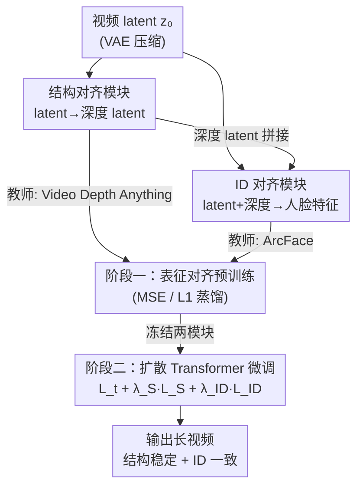

# Improving Human Image Animation via Semantic Representation Alignment

**会议**: CVPR 2026  
**arXiv**: [2605.10523](https://arxiv.org/abs/2605.10523)  
**代码**: 待确认  
**领域**: 3D视觉 / 视频生成 / 人体动画  
**关键词**: 人体图像动画, 表征对齐, 深度蒸馏, ID 一致性, 扩散 Transformer  

## 一句话总结
SemanticREPA 把深度、人脸等语义表征从"额外输入条件"改成"训练期监督信号"，通过两个预训练对齐模块在微调扩散 Transformer 时蒸馏 3D 结构与身份先验，从而在长视频、大幅运动下显著缓解肢体扭曲和面部失真。

## 研究背景与动机
**领域现状**：图像到视频（I2V）生成已经能产出几百帧的高质量视频，人体图像动画作为它在"单人肖像 + 运动"上的特化任务，主流做法是往生成过程里塞各种运动控制条件——稠密/3D 姿态序列、光流、相机轨迹等。

**现有痛点**：这些方法仍然主要依赖 RGB 像素级监督，缺少显式的代理任务去逼模型学 3D 几何、物理合理性和长程一致性。结果就是在长视频、剧烈运动下反复出现肢体扭曲、模糊甚至消失（尤其是手指等细粒度部位），以及面部随运动逐渐漂移、偏离参考图的身份失真。

**核心矛盾**：把语义表征（姿态、ID embedding）当作**条件**喂进去，一方面会牺牲生成灵活性（强行约束输出），另一方面像素监督本身并不强迫网络内部学到几何与时序结构。也就是说，"加条件"治标，模型内部表征其实没变好。

**本文目标**：在不牺牲灵活性的前提下，让 I2V 骨干网络内部表征真正编码 3D 人体几何（治肢体扭曲）和时序身份一致性（治面部失真）。

**切入角度**：作者借鉴图像生成里的 REPA——扩散模型内部特征本身就是很强的语义表征，可以用判别式特征（自监督特征）通过知识蒸馏去对齐、优化它们。把这套思路从图像扩展到视频人体动画：用**深度估计特征**对齐结构表征、用**人脸识别特征**对齐 ID 表征。

**核心 idea**：用语义表征做"监督"而不是"条件"——训练两个轻量对齐模块直接从 VAE latent 预测深度/人脸特征，再冻结它们去监督扩散 Transformer 微调，把 3D 运动与身份先验蒸馏进骨干网络。

## 方法详解

### 整体框架
SemanticREPA 要解决的是"如何让模型内部学到 3D 结构和身份一致性，又不靠加条件"。整体分两阶段：**第一阶段**预训练两个对齐模块——结构对齐模块学会从视频 latent 预测深度 latent，ID 对齐模块学会从视频 latent（拼接深度）预测人脸 embedding；**第二阶段**冻结这两个模块，用它们对扩散 Transformer 骨干（CogVideoX）的预测结果施加额外的结构损失 $\mathcal{L}_S$ 和身份损失 $\mathcal{L}_{ID}$，连同原扩散损失 $\mathcal{L}_t$ 一起微调骨干。推理时两个对齐模块完全不参与，只是把先验"印"进了骨干，因此不增加任何推理条件。

### 关键设计

**1. 语义表征对齐作监督而非条件：把"加约束"换成"教内部表征"**

针对的痛点是：现有方法把姿态/ID 当条件输入，既限制灵活性又没真正改善网络内部几何/时序表征。作者反过来，把语义表征当成训练期的监督目标。具体地，对一个加噪 latent $\mathbf{z}_t$，扩散 Transformer 预测噪声 $\tilde{\boldsymbol{\epsilon}}_\theta(\mathbf{z}_t,t,\mathbf{c})$ 并反推出干净 latent $\tilde{\mathbf{z}}_0$，再让冻结的对齐模块从 $\tilde{\mathbf{z}}_0$ 预测出深度/人脸表征，与真值对齐。最终目标是扩散损失、结构损失、ID 损失的加权和 $\mathcal{L}_{\text{final}}=\mathcal{L}_t+\lambda_S\mathcal{L}_S+\lambda_{ID}\mathcal{L}_{ID}$。这样推理时不需要任何额外条件，灵活性不受损，但骨干内部已经被逼着学到 3D 几何和身份先验——这正是"监督优于条件"的关键区别

**2. 结构对齐模块：用深度蒸馏纠正肢体扭曲**

肢体扭曲的根因是模型对 3D 人体运动建模能力不足。作者把结构表征预测形式化为"以人为中心的视频深度估计"代理任务：用一个层数削减的 CogVideoX Transformer 作结构对齐模块 $f_{\text{SAM}}$，从视频 latent 预测深度 latent，$\tilde{\mathbf{d}}_0(\mathbf{z}_0)=f_{\text{SAM}}(\mathbf{z}_0)$。教师是 Video Depth Anything，它输出的时序一致深度图被着色成 RGB 后经 VAE 编码成深度 latent 真值 $\mathbf{d}_0$，训练时最小化 MSE：$\mathcal{L}_{\text{MSE}}=\|\mathbf{d}_0-\tilde{\mathbf{d}}_0(\mathbf{z}_0)\|^2$。深度监督把注意力引向 3D 几何结构而非纹理，从而抑制肢体扭曲。模块有"干净 latent $\mathbf{z}_0$"和"带噪 latent $\mathbf{z}_t$"两种输入实现，消融发现 $\mathcal{L}_S(\mathbf{z}_t)$ 因噪声破坏纹理而运动分数略好、但细粒度面部细节丢失导致 ID 与清晰度变差，最终选用 $\mathcal{L}_S(\mathbf{z}_0)$ 以更可靠地生成稳定结构

**3. ID 对齐模块：人脸特征蒸馏 + 深度 latent 当隐式人脸掩码**

面部失真源于模型在大幅运动下难以维持细粒度时序一致性。作者用一个 ResNet 卷积网络作 ID 对齐模块 $f_{\text{ID}}$，从干净视频 latent 预测人脸 embedding。一个巧点是输入不只用视频 latent，还沿通道维拼接深度 latent：$\tilde{\mathbf{f}}(\mathbf{z}_0,\mathbf{d}_0)=f_{\text{ID}}(\mathbf{z}_0,\mathbf{d}_0)$——深度 latent 充当"隐式人脸掩码"，帮模块更准地定位人脸区域。教师是 Arc2Face 版 ArcFace，用 L1 损失对齐归一化人脸 embedding：$\mathcal{L}_1=\|\mathbf{f}-\tilde{\mathbf{f}}(\mathbf{z}_0,\mathbf{d}_0)\|$。消融用类内/类间特征距离验证：带深度输入时类间-类内距离差更大（0.1299 vs 0.0417），表明判别性更强，所以采用拼接深度的实现

### 损失函数 / 训练策略
采用**两阶段训练**而非直接监督 RGB 帧，核心原因是显存：长视频若用 VAE 解码再监督像素，即使 VAE 参数冻结，存梯度的开销也大到不可行。因此第一阶段先用知识蒸馏预训练对齐模块（结构模块用 MSE 对齐深度 latent，ID 模块用 L1 对齐人脸 embedding），让它们学会直接从 VAE latent 抽语义表征；第二阶段冻结两个模块，只微调扩散 Transformer 骨干，总损失 $\mathcal{L}_{\text{final}}=\mathcal{L}_t+\lambda_S\mathcal{L}_S+\lambda_{ID}\mathcal{L}_{ID}$。权重需精调：太大会破坏视频生成原有先验，太小则监督无效，最终取 $\lambda_S=0.01$、$\lambda_{ID}=1$。基座为 CogVideoX 1.0（T5 文本编码器，固定 480×720、49 帧 @8fps）。

## 实验关键数据

### 主实验
测试集为 200 段未见过的大幅运动视频，与各 SOTA I2V 模型对比（CogVideoX 为未微调基座）。

| 模型 | SSIM↑ | PSNR↑ | LPIPS↓ | FID↓ | Motion Score↓ | Text Score↑ | ID Score↑ |
|------|-------|-------|--------|------|---------------|-------------|-----------|
| SEINE | 0.3424 | 29.14 | 0.5275 | 556.29 | 28.08 | 0.2879 | 0.1702 |
| SVD | 0.3888 | 29.60 | 0.4590 | 467.95 | 18.58 | 0.2778 | 0.3818 |
| CogVideoX（基座） | 0.7482 | 32.40 | 0.1972 | 247.37 | 0.9426 | 0.2942 | 0.5087 |
| **SemanticREPA** | **0.7502** | **32.51** | 0.2011 | **213.09** | **0.4012** | **0.2956** | **0.6339** |

SemanticREPA 在几乎所有指标上取得最优：FID 从基座 247.37 降到 213.09，Motion Score 从 0.9426 降到 0.4012（运动分布最接近真值），ID Score 从 0.5087 升到 0.6339（身份一致性最高，真值为 0.6465）。LPIPS 略逊基座（0.2011 vs 0.1972）是唯一小幅退步。

### 消融实验
基于 Table 2（CogVideoX_F 为仅在本文数据上微调的基座）。

| 配置 | FID↓ | Motion↓ | ID↑ | 说明 |
|------|------|---------|-----|------|
| CogVideoX_F（仅微调） | 210.99 | 0.7481 | 0.5098 | 无对齐监督基线 |
| w/ $\mathcal{L}_S(\mathbf{z}_t)$ | 212.97 | 0.4427 | 0.5751 | 噪声 latent：运动好但 ID/清晰度差 |
| w/ $\mathcal{L}_S(\mathbf{z}_0)$ | 212.21 | 0.5352 | 0.6118 | 干净 latent：结构与 ID 更稳，最终选用 |
| w/ $\mathcal{L}_{ID}$ | 219.90 | 0.5397 | 0.6223 | 显著提升 ID Score |
| w/ $\mathcal{L}_S+\mathcal{L}_{ID}$（Full） | 213.09 | 0.4012 | 0.6339 | 结构稳定 + ID 一致最佳 |

ID 对齐模块输入消融（Table 3，类间-类内距离差越大越好）：带深度输入类内 0.0417 / 类间 0.1299（差 0.0882），不带深度类内 0.0487 / 类间 0.1084（差 0.0597），证明深度 latent 作隐式人脸掩码有效。

### 关键发现
- **结构损失主要压低 Motion Score 与 CPBD（清晰度），ID 损失主要拉高 ID Score**，两者作用解耦、互不干扰，叠加后取得最佳综合表现。
- **结构对齐用干净 latent 还是带噪 latent 是关键权衡**：带噪 $\mathcal{L}_S(\mathbf{z}_t)$ 破坏纹理后监督更偏整体运动、Motion 更好，但丢失面部细节、ID 与清晰度变差；最终选干净 $\mathcal{L}_S(\mathbf{z}_0)$。
- **损失权重敏感**：$\lambda_S$、$\lambda_{ID}$ 过大会破坏生成先验、过小无监督效果，需精调到 0.01 / 1。

## 亮点与洞察
- **"表征即监督"的范式迁移**：把图像域的 REPA（用判别特征蒸馏扩散内部表征）扩展到视频人体动画，并精准对应到深度（治肢体）和人脸（治面部）两类问题——是把"加条件"老套路换成"教内部表征"的漂亮示范。
- **深度 latent 当隐式人脸掩码**：在 ID 模块输入里拼接深度 latent，不显式做人脸分割就提升了人脸定位与判别性，是个低成本可复用的小 trick。
- **两阶段绕开 VAE 解码显存墙**：先把"从 latent 抽语义"固化成轻量模块再冻结监督，避免长视频反传时存 VAE 解码梯度——这个工程取舍对所有"想在 latent 空间加像素级语义监督"的长视频任务都有借鉴价值。

## 局限与展望
- **仅在 CogVideoX 1.0 上验证**：方法依附特定基座与固定分辨率（480×720、49 帧），是否能无痛迁移到更大/更新的 DiT 骨干未验证。
- **测试集偏小且无 FVD**：仅 200 段视频、明确放弃 FVD 指标，运动评估靠光流 FID 的 Motion Score 这一代理，统计置信度有限。
- **LPIPS 略退步**：相比基座感知相似度略降，说明结构/ID 监督可能与逐像素保真存在轻微 trade-off。
- **质性结果放在补充材料**：正文缺乏直观的失真对比图，肢体扭曲/面部漂移的改善程度难以从正文判断。⚠️ 部分公式（如带噪深度的 $\mathcal{L}_{ID}$ 替代式）原文为简洁省略，细节以原文为准。

## 相关工作与启发
- **vs 姿态/光流条件类方法（如各类 pose/flow guidance）**：它们把语义表征当输入条件约束运动，本文当训练监督，区别在于本文不牺牲推理灵活性、且直接改善骨干内部表征，劣势是需要额外预训练对齐模块。
- **vs REPA（图像域表征对齐）**：REPA 用自监督特征蒸馏图像扩散内部表征，本文沿同一思路但迁到视频人体动画，并具体化为深度+人脸两路监督，新增了时序身份一致性这一维度。
- **vs 同期联合生成深度/分割的工作**：同期工作同时生成并监督分割/深度，但忽略时序身份一致性且需改动 Transformer 骨干；本文不改骨干结构、额外覆盖了 ID 一致性。

## 评分
- 新颖性: ⭐⭐⭐⭐ 把 REPA 范式系统迁移到视频人体动画，深度/人脸双路对齐对应明确，但核心思路承接自图像域 REPA。
- 实验充分度: ⭐⭐⭐ 主实验+多组消融较完整，但测试集仅 200 段、无 FVD、质性对比放补充，说服力受限。
- 写作质量: ⭐⭐⭐⭐ 动机—方法—损失链条清晰，公式与符号交代到位。
- 价值: ⭐⭐⭐⭐ "监督优于条件"思路与两阶段省显存工程取舍对长视频生成有较强可迁移性。

<!-- RELATED:START -->

## 相关论文

- [\[CVPR 2026\] Human Geometry Distribution for 3D Animation Generation](human_geometry_distribution_for_3d_animation_generation.md)
- [\[CVPR 2026\] Selfi: Self-improving Reconstruction Engine via 3D Geometric Feature Alignment](selfi_self-improving_reconstruction_engine_via_3d_geometric_feature_alignment.md)
- [\[CVPR 2026\] SwiftTailor: Efficient 3D Garment Generation with Geometry Image Representation](swifttailor_efficient_3d_garment_generation_with_geometry_image_representation.md)
- [\[CVPR 2026\] VIAFormer: Voxel-Image Alignment Transformer for High-Fidelity Voxel Refinement](viaformer_voxel-image_alignment_transformer_for_high-fidelity_voxel_refinement.md)
- [\[CVPR 2026\] Human Interaction-Aware 3D Reconstruction from a Single Image](human_interaction-aware_3d_reconstruction_from_a_single_image.md)

<!-- RELATED:END -->
