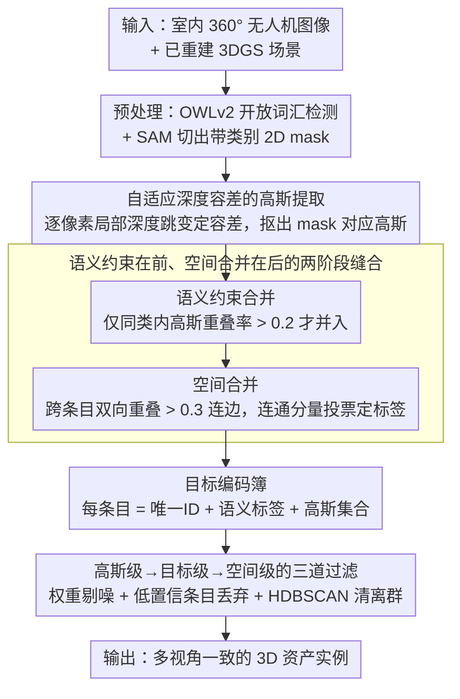

# Indoor Asset Detection in Large Scale 360° Drone-Captured Imagery via 3D Gaussian Splatting

**会议**: CVPR 2026  
**arXiv**: [2604.05316](https://arxiv.org/abs/2604.05316)  
**代码**: 无  
**领域**: 3D视觉  
**关键词**: 室内资产检测, 3DGS分割, 多视图一致性, 目标编码簿, 无人机360°成像

## 一句话总结
提出一种基于3D目标编码簿(Object Codebook)的pipeline，将2D分割mask通过语义+空间约束关联为3DGS中的一致3D物体实例，在大规模室内360°无人机图像上实现目标级检测，F1 score比SOTA GAGA提升65%，mAP提升11%。

## 研究背景与动机
1. **领域现状**: 3DGS已成为室内场景重建的主流方法。语义理解(目标检测/分割)对设施管理、安全评估等下游应用至关重要。2D基础模型(SAM/Grounded SAM)可以产出高质量分割mask。
2. **现有痛点**: 2D mask在不同视角下ID不一致——同一物体在不同帧中被赋予不同标签。现有3DGS分割方法(如GAGA)使用视频追踪或3D记忆库关联mask，但在多视频流、大规模室内场景中（物体重复出现、密集遮挡）效果不佳。许多方法采用"分割所有"范式(包括墙壁/地板等stuff类)，不适合面向特定资产的应用。
3. **核心矛盾**: 2D分割mask质量高但跨视角不一致；3DGS提供3D一致性但缺乏语义信息。需要一个鲁棒的多视角mask关联机制。
4. **本文目标**: 在大规模3DGS场景中对用户预定义的室内资产进行一致的多视角目标检测和分割。
5. **切入角度**: 利用3DGS高斯原语的空间一致性，构建3D目标编码簿——每个条目记录唯一ID、语义标签和关联的高斯集合。通过语义约束+空间约束逐步合并mask。
6. **核心 idea**: 用自适应深度容差提取mask对应的3D高斯，通过语义→空间两阶段合并构建多视角一致的目标编码簿。

## 方法详解

### 整体框架
这篇论文要在一个已经重建好的大规模室内3DGS场景里，把用户指定的若干类资产（桌、灯、门……）一致地检测出来。难点不在"怎么分割单帧"——SAM 这类2D基础模型已经能给出高质量mask——而在于同一个物体在成百上千张360°视角里会被反复看到、且每次都被赋予一个不同的临时ID，必须把这些散落在不同帧里的mask在3D空间里缝成同一个物体实例。

整条流水线分三段走。预处理阶段对每帧先用OWLv2做开放词汇检测、再用SAM切出带类别标签的2D mask。核心的编码簿构建阶段逐帧消费这些mask：每来一张mask，先把它对应的3D高斯精确抠出来，再拿去和已有的"目标编码簿"做合并——编码簿的每个条目记录一个唯一ID、一个语义标签和它累积到的高斯集合。合并先在同类语义内做、再跨条目做空间合并，期间穿插两轮噪声过滤。最后的后处理阶段把置信度太低的条目整体丢掉，并用HDBSCAN清掉空间上离群的高斯。

### 关键设计

**1. 自适应深度容差的高斯提取：让前景mask不再吞进背景高斯**

把一张2D mask"翻译"成3D高斯集合，最朴素的做法是把所有高斯中心投影到图像上、落在mask区域内的就算数。但这样会把mask背后一整条深度方向的高斯都吃进来。GAGA 的改法是给每个mask配一个全局深度区间，可一旦碰上严重透视缩短的物体——比如正下方拍到的天花灯——这个全局区间会被拉得很宽，连天花板的高斯都被算成灯的一部分。

本文的做法是把"能否归属"判断收紧到逐像素的局部几何上。对每个高斯中心 $\mu$，先投影到mask内的像素 $(x_p, y_p)$，再看它的深度 $d_\mu$ 是否落在渲染深度图 $D(x_p, y_p)$ 周围一个自适应容差 $\delta(x_p, y_p)$ 之内。容差不是常数，而是取该像素 7×7 邻域内的最大深度跳变：

$$\delta(x,y) = \max\{|D(x,y) - D(n_x,n_y)| : (n_x,n_y) \in \mathcal{N}_{(x,y)},\ |D(x,y) - D(n_x,n_y)| \leq T\}$$

上界 $T=0.5$ 防止跨越真实的深度断崖。这样平整的墙面区域邻域深度几乎不变、容差极小、判定很严，而曲面或边缘处容差自动放宽——容差跟着局部表面几何走，而不是用一个全局数字一刀切。消融里这一项贡献最大，去掉后走廊场景F1从83.33直接掉到64.21。

**2. 语义约束在前、空间合并在后的两阶段缝合：先按类别归堆，再修跨帧的标签抖动**

抠出高斯之后，新mask要并进编码簿。直接按"高斯重叠率高就合并"会出问题：门上的小窗户和门本身在3D里高度重叠，一旦不分类别地合并，小物体就会被大物体整个吞掉。所以第一阶段只在**同语义标签**内做合并——新mask只和编码簿里同类的条目算高斯重叠率，超过 $\tau_{overlap}=0.2$ 才并入，否则新建一个条目。这一步保证了"门"和"窗"即便空间重叠也各自成条目。

但2D检测器本身会跨帧抖动：同一扇门这帧被OWLv2叫"door"、下帧叫"cabinet"，于是被拆成了两个语义条目。第二阶段的空间合并就是来修这个的：把所有条目当图节点，凡是双向高斯重叠率都超过 $\tau_{spatial}=0.3$ 的两个条目连边，求连通分量后整体合并，最后对每个合并组用置信度加权投票定下它真正的语义标签。先严后松的顺序是关键——先用语义把该分的分开，再用空间把被标签噪声拆碎的同一物体重新拼回去。消融显示语义约束在29类别的办公室场景里尤其要紧，去掉后F1从69.69掉到59.72。

**3. 高斯级→目标级→空间级的三道过滤：让真实资产靠"被反复看见"浮出来**

360°无人机数据的一个天然红利是每个真实物体都被大量视角覆盖，而噪声mask和漂浮高斯不会。三道过滤就是把这个先验用满。第一道在**高斯级**：给每个高斯算一个权重，等于它所有关联mask的(检测置信度/估计深度)之和——又远、又低置信度、又只被零星几帧看到的高斯权重低，先剔掉。第二道在**目标级**：每个条目的置信度定义为

$$\text{conf} = \log(|M|) \cdot \frac{1}{|M|}\sum_{m \in M} c_m$$

其中 $M$ 是该条目累积到的mask集合、$c_m$ 是单帧置信度。后半截是平均置信度，前面的 $\log(|M|)$ 项额外奖励"被看到的次数"——只有又被频繁、又被高置信度观测到的条目才能过关，一闪而过的虚假检测因 $|M|$ 太小被压下去。这一道在多类别的走廊场景里效果最猛，去掉后F1从83.33塌到61.77。第三道用HDBSCAN在3D空间里聚类、把离群高斯当噪声清掉，处理少数穿透到墙外的残余。

### 一个完整示例：一盏天花灯怎么从散落的mask变成一个编码簿条目
设一段360°序列里有一盏天花灯，被120帧从不同角度拍到。先看第30帧：SAM切出它的mask、OWLv2标成"ceiling light"。提取高斯时，朴素全局区间会把灯正上方天花板的高斯也算进来，而自适应容差发现这些高斯深度落在天花板表面（局部深度跳变小、容差紧），把它们挡在外面，只留下灯本体的高斯。这批高斯进编码簿，因为是首次出现、和已有同类条目重叠不足 $0.2$，新建条目 #7（语义=ceiling light）。

往后几十帧里，灯被反复看到，多数mask和 #7 高斯重叠超 $0.2$ 而并入，#7 的 $|M|$ 不断增长。但第88帧OWLv2把它误标成了"lamp"——这帧没并进 #7（语义不同），而是新建了条目 #41。到空间合并阶段，#7 和 #41 的双向高斯重叠率都超 $0.3$，连成一个连通分量合并；投票时 #7 累积了上百帧"ceiling light"、#41 只有零星几帧"lamp"，最终标签定为ceiling light。过滤阶段，这个条目 $|M|$ 大、平均置信度高，conf 值很高，稳稳留下；而某些只在两三帧里冒头的虚假"灯"因 $\log|M|$ 太小被目标过滤丢掉。一盏灯，最终对应编码簿里唯一一个一致的3D实例。

### 损失函数 / 训练策略
整条pipeline不涉及任何训练——完全建立在预训练的2D检测器（OWLv2）、分割器（SAM）和标准30K迭代的3DGS重建之上。所有阈值（$\tau_{overlap}$、$\tau_{spatial}$、$T$ 等）均由消融实验确定。

## 实验关键数据

### 主实验 (多视角Mask一致性)

| 场景 | 方法 | mIoU | Precision | Recall | F1 | 唯一目标数 | 耗时 |
|------|------|------|-----------|--------|-----|-----------|------|
| Cory走廊 | GAGA | 9.28 | 73.33 | 9.73 | 17.19 | 15 (GT:113) | 39min |
| Cory走廊 | **Ours** | **75.84** | **82.61** | **84.07** | **83.33** | **115** | **10min** |
| Cory办公室 | GAGA | 2.10 | 33.33 | 1.64 | 3.12 | 12 (GT:244) | 3hr43min |
| Cory办公室 | **Ours** | **66.01** | **67.05** | **72.54** | **69.69** | **264** | **1hr33min** |

### 目标检测结果

| 场景 | 方法 | mAP↑ | mLAMR↓ |
|------|------|------|--------|
| Cory走廊 | OWLv2 | 28.15 | 78.30 |
| Cory走廊 | **Ours** | **41.78** | **69.77** |
| Cory办公室 | OWLv2 | 33.27 | 73.19 |
| Cory办公室 | **Ours** | **41.62** | **63.92** |

### 消融实验（Cory走廊 / Cory办公室 F1）

| 配置 | Cory走廊 F1 | Cory办公室 F1 | 说明 |
|------|-------------|---------------|------|
| Full pipeline | **83.33** | **69.69** | 完整模型 |
| w/o 深度处理 | 64.21 | 61.30 | 全局深度区间导致背景高斯误包含 |
| w/o 语义约束 | 80.72 | 59.72 | 不同语义物体被错误合并 |
| w/o 第1轮过滤 | 83.33 | 69.05 | 走廊场景无影响，办公室稍降 |
| w/o 空间合并 | 82.61 | 63.47 | 跨帧标签不一致导致重复目标 |
| w/o 第2轮过滤 | 83.33 | 69.69 | 走廊影响小 |
| w/o 目标过滤 | 61.77 | — | 虚假目标大量涌入 |
| w/o HDBSCAN | — | 69.69 | 走廊场景无明显影响 |

### 关键发现
- F1 score提升65%(17.19→83.33)——GAGA的Recall极低(9.73%)说明其mask关联在大规模场景中严重失败，原因是过度合并：GAGA检测到仅15个唯一目标，而GT有113个。
- mAP在目标检测任务上也提升11%（28.15→41.78），证明3D编码簿能改善2D级别的检测覆盖率。
- 处理速度更快(10min vs 39min)——因为语义约束减少了不必要的重叠计算。
- 自适应深度容差是最关键组件：去掉后Cory走廊F1从83.33骤降至64.21（-23%），因为全局深度区间在透视缩短物体上严重失效。
- 语义约束在29类别复杂场景中更为关键：Cory办公室F1从69.69降至59.72(-14%)。
- 目标过滤在Cory走廊上影响最大（F1从83.33降至61.77），说明多类别场景中虚假检测问题严重。
- GAGA的时间性退化问题：批次F1随序列推进单调下降，同一物体在序列前后被赋予相同ID，导致全局评估远低于局部批次评估。

## 亮点与洞察
- **"两阶段合并"的巧妙设计**：先约束语义再放松到空间——防止语义不同的重叠物体被错误合并。这种策略可以迁移到任何需要多视角实例关联的3D场景分割任务。
- **自适应深度容差**：简单但有效地解决了全局深度区间的致命缺陷。利用局部深度变化而非全局统计，一行代码的改进被大幅效果提升。
- **目标编码簿的实用框架**：为"在3DGS中定义和找到特定资产类别"提供了端到端方案——直接服务于设施管理、安全检查等实际场景。

## 局限与展望
- 依赖OWLv2的开放词汇检测能力——当类别名较模糊或物体外观不典型时可能漏检。
- 阈值（$\tau_{overlap}, \tau_{spatial}$等）需要通过消融确定，不同场景可能需要调整。
- 360°无人机拍摄确保了高观测覆盖率——对普通前向视角的场景泛化能力未验证。
- 仅处理thing类不处理stuff类，墻壁/天花板等大面积物体的分割不在范围内。

## 相关工作与启发
- **vs GAGA**: GAGA的全局3D记忆库在大规模多流场景中严重退化(Recall仅9.73%)；本文的语义+空间两阶段编码簿鲁棒得多。
- **vs Gaussian Grouping**: 视频追踪方法无法处理多视频流中的物体重复出现。
- **vs Grounded SAM直接应用**: 2D级别的分割质量高但跨帧不一致；本文通过3D高斯空间实现一致化。

## 评分
- 新颖性: ⭐⭐⭐ 方法是工程pipeline的巧妙组合，每个组件不全新但组合有效
- 实验充分度: ⭐⭐⭐⭐ 两个大规模真实场景+详细消融+与GAGA的公平对比
- 写作质量: ⭐⭐⭐⭐ Pipeline描述清晰，图示辅助理解每个步骤
- 价值: ⭐⭐⭐⭐ 为大规模室内3DGS的实用目标检测提供了可行方案

<!-- RELATED:START -->

## 相关论文

- [\[ICCV 2025\] IM360: Large-scale Indoor Mapping with 360 Cameras](../../ICCV2025/3d_vision/im360_large-scale_indoor_mapping_with_360_cameras.md)
- [\[CVPR 2026\] Few-Shot Incremental 3D Object Detection in Dynamic Indoor Environments](few-shot_incremental_3d_object_detection_in_dynamic_indoor_environments.md)
- [\[CVPR 2026\] Off The Grid: Detection of Primitives for Feed-Forward 3D Gaussian Splatting](off_the_grid_detection_of_primitives_for_feed-forward_3d_gaussian_splatting.md)
- [\[CVPR 2025\] DroneSplat: 3D Gaussian Splatting for Robust 3D Reconstruction from In-the-Wild Drone Imagery](../../CVPR2025/3d_vision/dronesplat_3d_gaussian_splatting_for_robust_3d_reconstruction_from_in-the-wild_d.md)
- [\[CVPR 2026\] Ego-1K: A Large-Scale Multiview Video Dataset for Egocentric Vision](ego-1k_--_a_large-scale_multiview_video_dataset_for_egocentric_vision.md)

<!-- RELATED:END -->
