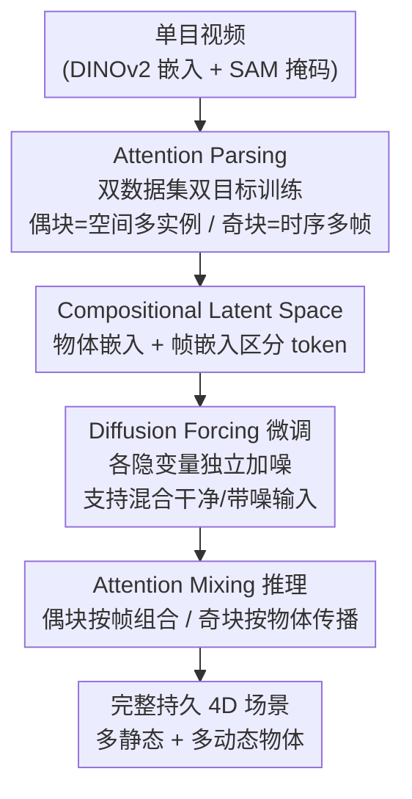

# Inferring Compositional 4D Scenes without Ever Seeing One

**会议**: CVPR 2026  
**论文**: [CVF Open Access](https://openaccess.thecvf.com/content/CVPR2026/html/Gokmen_Inferring_Compositional_4D_Scenes_without_Ever_Seeing_One_CVPR_2026_paper.html)  
**代码**: https://github.com/insait-institute/COM4D  
**领域**: 3D视觉 / 4D重建  
**关键词**: 4D场景重建, 组合生成, 扩散Transformer, 注意力混合, 单目视频

## 一句话总结
COM4D 从单段单目视频里同时重建出"多个静态物体 + 多个动态物体"的完整、持久 4D 场景，关键在于把空间组合推理和单物体时序动态**分别**从两类易得数据里学成两种注意力，再在推理时用 **Attention Mixing** 把它们拼起来——整个过程**从未见过任何 4D 组合训练样本**。

## 研究背景与动机

**领域现状**：真实场景由多个静态和动态物体构成，它们的结构、组合关系和时空配置随时间连续演化。要同时拿下"重建 + 分解 + 时序推理"非常难，所以现有工作往往退而求其次：一次只处理一个物体，或对动态物体套类别特定的参数化形状模型（如人体 SMPL）。

**现有痛点**：(1) 套参数化模型只能覆盖被建模的类别，物体一旦超出先验就失效；(2) 单物体逐个重建再拼接，容易得到几何不一致、互相穿插的场景；(3) 很多 4D 完整场景方法依赖测试时优化（test-time optimization），效率低；(4) 当物体被遮挡、发生复杂交互或大幅视角变化时，4D 结构就跟丢了，表示变得脆弱——"一致性"和"持久性"都保不住。

**核心矛盾**：要学组合式 4D 重建，本应需要"多物体 + 静动态 + 时序"齐全的 4D 组合数据，但这种 in-the-wild 数据极其稀缺，学习严重欠约束。于是多物体 4D 场景重建一直远远落后于单物体/静态场景这些简单设定。

**本文目标**：在**不依赖任何 4D 组合训练数据、不做测试时优化**的前提下，从单目视频推断出包含多个交互物体的完整且持久的 4D 表示。

**切入角度**：作者发现所需的时空推理可以拆成两种"注意力"，而且能从两类**容易获得**的数据里分别学到——静态多物体观测（3D-FRONT）学空间结构，单物体动画（DeformingThings）学时序动态。再加一个朴素但有力的物理假设：**每一时刻所有场景元素都瞬时静止，动态由把物体状态沿时间向前传播展开**。

**核心 idea**：训练时用 **Attention Parsing** 把空间组合注意力和时序动态注意力解耦地学进同一个 DiT 的不同层；推理时用 **Attention Mixing** 交替调度这两类注意力，从而组合出训练时从未见过的多物体 4D 场景。

## 方法详解

### 整体框架
COM4D 建立在 image-to-mesh 生成模型 TripoSG 的 21 层 DiT 骨干上（物体几何用 VAE 隐变量 $z$ 表示，条件是 DINOv2 图像嵌入）。一个场景被表示成 $N$ 个静态物体隐变量 $S=\{z_i\}$ 与 $M$ 个动态物体逐帧隐变量 $D=\{{}_fz_j\}$ 的集合。整条管线分训练与推理两端：训练端用 **Attention Parsing** 双目标策略，让同一个 DiT 的偶数块学空间多实例注意力（从静态多物体数据 3D-FRONT 学）、奇数块学时序多帧注意力（从单物体动画 DeformingThings 学），靠 **Compositional Latent Space** 的物体/帧嵌入区分 token；再用 **Diffusion Forcing** 微调，让模型能处理"部分隐变量已干净、部分还带噪"的混合输入，为历史引导生成铺路。推理端用 **Attention Mixing**，在单次去噪里让偶数块按帧做空间组合、奇数块按物体做时序传播，从而把两种独立学到的能力拼成组合式 4D 重建。

### 关键设计

**1. Attention Parsing：把空间组合与时序动态拆成两套注意力分别学**

这是为了绕开"没有 4D 组合训练数据"这个根本障碍。作者让单个 DiT（21 块、共享权重）在两个数据集上交替训练：每步以等概率采样 3D-FRONT（静态场景 + 物体级分解）或 DeformingThings（单物体动态序列）。块角色按奇偶分工——训练 3D-FRONT 样本时，**偶数块**做多实例注意力（multi-instance attention），让每个物体隐变量 $z_i$ 关注场景里其余物体 $\{z_l\}_{l=1}^N$ 来推理空间关系：$\mathbf{z}^{i_\text{out}} = \text{Attention}(\mathbf{z}^i, \{\mathbf{z}^l\}_{l=1}^N)$；训练 DeformingThings 样本时，**奇数块**做多帧注意力（multi-frame attention），让每个隐变量关注同物体其余帧 $\{{}_lz\}_{l=1}^F$ 来捕捉时序依赖。没被指派的块退化为局部自注意力。这样空间推理和时序推理被解耦地灌进同一组权重的不同层，互不损害，却又共用一个骨干——这是"从未见过组合数据"却能组合的前提。

**2. Compositional Latent Space：用物体/帧嵌入让 token 知道自己是谁**

场景被表示成 $N+M$ 个隐变量，每个 token 是张量 $z\in\mathbb{R}^{K\times C}$。要让多实例/多帧注意力分得清不同物体和不同帧，作者给每个 token 加一个可学习嵌入：3D-FRONT 样本加物体嵌入 $e_i$，DeformingThings 样本加帧嵌入 ${}_fe$。同时做交叉注入——给 3D-FRONT 的物体隐变量补一个单帧嵌入、给 DeformingThings 样本补一个单物体嵌入，让两路训练在表示上对齐，推理时才能无缝混合。训练采用 rectified flow 目标，对每个隐变量独立采样时间步 $t_i$ 并沿各自线性轨迹加噪 $\mathbf{z}_{t_i}^i = t_i\mathbf{z}_0^i + (1-t_i)\boldsymbol{\epsilon}^i$，损失为各隐变量速度预测误差之和 $\mathcal{L}_S = \mathbb{E}[\sum_{i=1}^N \|(\boldsymbol{\epsilon}^i - \mathbf{z}_0^i) - \mathbf{v}_\theta(\mathbf{z}_{t_i}^i, t_i, \mathbf{y})\|^2]$，条件 $\mathbf{y}$ 是去背景的静态物体图像嵌入。

**3. Attention Mixing：推理时交替调度两类注意力，拼出 4D 组合场景**

这是把 Attention Parsing 学到的两种能力在推理时合起来用的机制。在单步去噪里，DiT 块按角色交替：**偶数块（空间）** 接收所有静态物体隐变量 + 每个动态物体当前帧的隐变量，组成"某一时刻场景快照"，对这一整组做多实例注意力，交叉注意力的 key/value 来自全局场景图像 $\mathbf{y}$，保证所有元素相对位置正确；**奇数块（时序）** 对每个动态物体单独处理其隐变量序列，做多帧注意力，key/value 来自该物体逐帧的掩码条件嵌入（掩码用 SAM 从视频里抽），捕捉各自独有的运动；静态物体隐变量穿过时序块时不做运动处理。靠这种信息路由，模型在一次去噪里同时满足从 3D-FRONT 学到的空间约束和从 DeformingThings 学到的时序动态。对任意长度视频，时序块用滑动时间窗顺序传播注意力来维持长程一致性——这正落实了"每时刻瞬时静止、动态靠状态前向传播"的物理假设。

**4. Diffusion Forcing：让模型能用历史帧引导生成、保时序一致**

标准扩散对一份数据里所有隐变量加同一噪声，而 Diffusion Forcing 给不同隐变量独立加噪、一起去噪，使模型能处理"部分隐变量已干净（$t=0$）、部分还带噪"的混合输入。这对本方法是刚需：一方面支持"在已完全去噪的静态物体条件下生成动态隐变量"的稳定静态引导；另一方面支持**历史引导生成**——把已去噪的第 $f-1$ 帧当作干净（$t=0$）上下文来生成第 $f$ 帧，从而保证动态物体的时序一致与连贯演化。作者用两阶段微调引入它（阶段一 8k 步常规微调，阶段二 12k 步开启 Diffusion Forcing 并降学习率）。

### 一个完整示例
给定一段视频（含一个人和一只狗在交互），先用 DINOv2 抽场景嵌入、用 SAM 抽每个动态物体逐帧掩码。推理时第一帧：偶数块把"静态物体（如灯台、家具）+ 人的首帧隐变量 + 狗的首帧隐变量"放进多实例注意力，按全局场景图把它们摆到正确相对位置；奇数块再分别对人、对狗做多帧注意力，让它们沿各自历史向前演化。生成第 $f$ 帧时，已去噪的第 $f-1$ 帧作为干净上下文（Diffusion Forcing）引导，于是动态物体既不会从静态家具里穿插出去（空间约束），又能连贯地接着上一帧动（时序约束）。整段 >90 帧的序列就这样靠滑动窗逐帧传播出来，漂移很小。

### 损失函数 / 训练策略
训练目标为 rectified flow 速度匹配损失，分静态 $\mathcal{L}_S$、时序 $\mathcal{L}_T$ 和取自 TripoSG 的正则损失 $\mathcal{L}_R$。以 0.3 概率训练单部件/单帧的退化样本来正则化、保留物体先验；空间路与时序路监督目标各上限 8 部件 / 8 帧。两阶段训练（共 20k 步、batch 50）在单张 NVIDIA H200 上约 2 天，全量微调 TripoSG DiT 权重。

## 实验关键数据

### 主实验：单物体 4D 重建
在 DeformingThings 与 Objaverse 上对比生成式（L4GM、GVFD）、网格式（V2M4）与逐帧 TripoSG baseline。CD 越低越好，F-Score / IoU 越高越好（Gaussian 类方法缺水密网格故省略 IoU）：

| 数据集 | 方法 | CD ↓ | F-Score ↑ | IoU ↑ |
|--------|------|------|-----------|-------|
| DeformingThings | TripoSG | 0.1558 | 0.5179 | 0.1784 |
| DeformingThings | V2M4 | 0.1678 | 0.4759 | 0.1533 |
| DeformingThings | **Ours** | **0.1144** | **0.8388** | **0.4191** |
| Objaverse | TripoSG | 0.1107 | 0.6585 | 0.2874 |
| Objaverse | **Ours** | 0.1205 | **0.7349** | **0.3413** |

在 DeformingThings 上全指标领先，IoU 0.4191 远超次优；Objaverse 上 F-Score / IoU 最佳，CD 与 TripoSG 接近。

### 3D 场景重建（3D-FRONT）
对比 MIDI 与 PartCrafter（注：为公平给 MIDI 提供了真值实例掩码，本方法不需要）。IoU 此处衡量部件独立性，越低越好：

| 数据集 | 方法 | CD ↓ | F-Score ↑ |
|--------|------|------|-----------|
| 3D-FRONT | MIDI | 0.1445 | 0.7829 |
| 3D-FRONT | PartCrafter | 0.1751 | 0.7569 |
| 3D-FRONT | **Ours** | **0.0909** | **0.8069** |
| 3D-FRONT-Occluded | MIDI | 0.1781 | 0.7387 |
| 3D-FRONT-Occluded | **Ours** | **0.1256** | **0.7521** |

CD 与 F-Score 均 SOTA，遮挡分割上优势依旧。

### 消融实验（3D-FRONT / DeformingThings）
| 配置 | DT: CD ↓ | DT: F ↑ | DT: IoU ↑ |
|------|----------|---------|-----------|
| Baseline（无静动嵌入 + 无 DF） | 0.1525 | 0.7854 | 0.2018 |
| + Static/Dynamic Emb. | 0.1284 | 0.9350 | 0.4034 |
| + Diffusion Forcing | 0.1488 | 0.8189 | 0.4271 |
| Ours（全开） | 0.1144 | 0.8388 | 0.4191 |

### 关键发现
- **静/动态嵌入贡献最大**：单加该嵌入就把 DeformingThings 的 CD 从 0.1525 降到 0.1284、IoU 从 0.2018 近翻倍到 0.4034，说明解耦静动态表示是组合推理的关键。
- **Diffusion Forcing 主要提时序一致**：对 IoU 提升明显（0.2018→0.4271），印证它对历史引导生成的作用。
- **Attention Mixing 是组合质量的命门**：由于没有 4D 组合数据集，主评测靠用户研究——有 Mixing 的重建被偏好 87% vs 无 Mixing 6.9%（约 12 倍）；在 CMU Panoptic 上 Mixing 把首帧配准的平均 CD 从 35.91 cm 降到 7.42 cm，>90 帧长序列漂移很小。
- ⚠️ 缓存里部分公式/编号经 OCR 后有断裂（如奇偶块分工、损失下标），上述定量数字取自表格，机制描述以原文为准。

## 亮点与洞察
- **"分开学、混着用"绕开数据壁垒**：把组合式 4D 拆成"空间组合"和"单物体时序"两个易得子任务分别学注意力，推理时再混合——这种规避稀缺组合数据的思路，对任何"目标分布无训练数据但其因子分布易得"的问题都有借鉴价值。
- **物理假设极简却好用**："每时刻瞬时静止、动态靠状态前向传播"这条假设把 4D 难题降维成"逐帧 3D + 时序传播"，配合 Diffusion Forcing 的历史引导落地得很自然。
- **同一 DiT 按层奇偶分工**：用块的奇偶位置承载空间/时序两种角色、共享权重，既保持 TripoSG 原深宽不变又获得双能力，是很巧的"零额外参数"复用。
- **无需测试时优化、无需类别先验**：相比依赖 test-time optimization 或参数化人体模型的方法，COM4D 纯前馈、对任意形状通用。

## 局限与展望
- **缺真值组合 4D 数据**：因为没有物体级分解的组合 4D 数据集，组合 4D 这一主任务只能靠用户研究 + 首帧配准 CD 间接评测，缺乏严格的逐帧定量基准。
- **动态物体依赖 SAM 掩码**：每个动态物体的时序条件来自 SAM 抽的掩码，掩码质量/分割失败会直接影响时序推理；强遮挡或快速运动下掩码可能不稳。
- **监督上限受限**：空间路与时序路各 cap 在 8 部件 / 8 帧，超大场景或超多物体的可扩展性未充分验证。
- 运行时 4.48 s/帧，慢于逐帧 TripoSG（2.59 s）和部分 Gaussian 方法，长视频推理累计开销不小。

## 相关工作与启发
- **vs MIDI**：MIDI 用多实例注意力 + 物体级掩码条件学相对摆放，但只做静态 3D 且推理需真值掩码；COM4D 不需推理掩码、并扩展到 4D 组合，3D-FRONT 上 CD 0.0909 优于 MIDI 0.1445。
- **vs PartCrafter**：PartCrafter 绕开物体掩码、交替 in-part / inter-part 注意力去噪多隐变量，但仍是静态部件生成；COM4D 借鉴其多实例去噪思路并加入时序多帧注意力实现 4D。
- **vs L4GM / GVFD（生成式 4D）**：它们产出的纹理 Gaussian 在输入视角下合理，但换视角时底层几何不一致；COM4D 产出 per-object 显式网格，几何完整性与跨视角一致性更好。
- **vs 测试时优化类 4D 方法**：多数完整场景 4D 方法靠在线优化、效率低；COM4D 纯前馈、无测试时优化。

## 评分
- 新颖性: ⭐⭐⭐⭐⭐ "分开学空间/时序注意力、推理时混合"是绕开 4D 组合数据壁垒的原创思路，首次实现纯前馈的组合式 4D 场景重建。
- 实验充分度: ⭐⭐⭐⭐ 覆盖组合 4D / 单物体 4D / 3D 场景三任务且消融清楚，但组合 4D 主任务受限于无真值只能用户研究 + 间接 CD。
- 写作质量: ⭐⭐⭐⭐ 动机到方法逻辑清晰，奇偶块分工与注意力混合讲得明白（缓存公式 OCR 有断裂）。
- 价值: ⭐⭐⭐⭐⭐ 多物体 in-the-wild 4D 重建是长期难题，本文给出可落地、无需组合数据与测试时优化的方案。

<!-- RELATED:START -->

## 相关论文

- [\[CVPR 2026\] Efficiently Reconstructing Dynamic Scenes One D4RT at a Time](efficiently_reconstructing_dynamic_scenes_one_d4rt_at_a_time.md)
- [\[CVPR 2026\] OMGTex: One-stage Multi-style Facial Texture Reconstruction without Geometry Guidance](omgtex_one-stage_multi-style_facial_texture_reconstruction_without_geometry_guid.md)
- [\[CVPR 2026\] MoVieS: Motion-Aware 4D Dynamic View Synthesis in One Second](movies_motion-aware_4d_dynamic_view_synthesis_in_one_second.md)
- [\[CVPR 2026\] MotionScale: Reconstructing Appearance, Geometry, and Motion of Dynamic Scenes with Scalable 4D Gaussian Splatting](motionscale_reconstructing_appearance_geometry_and_motion_of_dynamic_scenes_with.md)
- [\[CVPR 2026\] 4D Primitive-Mâché: Glueing Primitives for Persistent 4D Scene Reconstruction](4d_primitive-mache_glueing_primitives_for_persistent_4d_scene_reconstruction.md)

<!-- RELATED:END -->
