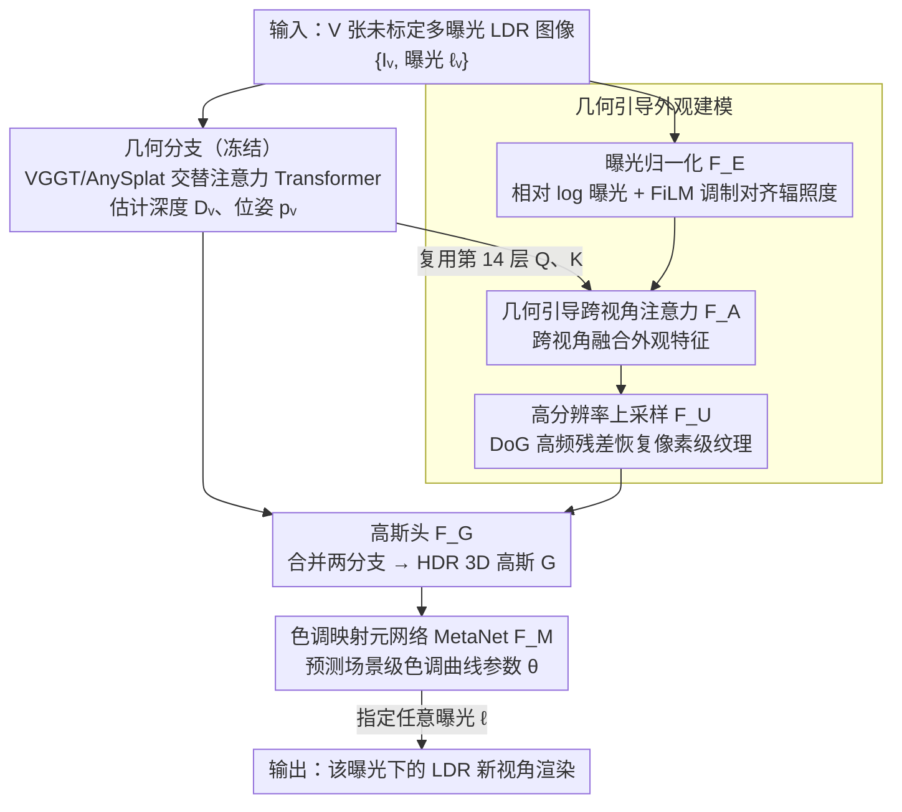

# InstantHDR: Single-forward Gaussian Splatting for High Dynamic Range 3D Reconstruction

**会议**: CVPR 2026  
**arXiv**: [2603.11298](https://arxiv.org/abs/2603.11298)  
**代码**: 无（论文称review后发布）  
**领域**: 3D重建 / 高动态范围成像  
**关键词**: HDR新视角合成, 前馈3D重建, 3D高斯溅射, 多曝光融合, 色调映射元网络

## 一句话总结

提出首个前馈HDR新视角合成方法InstantHDR，设计几何引导的外观建模模块解决多曝光融合中的外观不一致问题，并通过MetaNet预测场景特定色调映射参数实现泛化，从未标定多曝光LDR图像中秒级重建HDR 3D高斯场景，稀疏4视角下PSNR超GaussianHDR +2.90 dB，速度快约700倍。

## 研究背景与动机

**领域现状**：HDR新视角合成（HDR-NVS）旨在从多曝光LDR图像重建HDR场景并渲染任意曝光的新视角。现有方法（HDR-GS、GaussianHDR）基于优化范式，已能产出高质量结果。

**现有痛点**：

1. 优化方法严重依赖已知相机位姿+SfM密集点云初始化+逐场景优化（GaussianHDR需约30分钟/场景），实际部署受限
2. 多曝光导致外观不一致→SfM点云坍缩→稀疏视角下优化方法完全失败
3. 前馈3D模型（AnySplat等）假设外观一致，直接用于多曝光输入产生严重鬼影（同一白墙在不同曝光下亮度差异巨大）
4. 不同相机应用不同色调曲线（AgX/Filmic/Standard），难以学习统一的色调映射
5. 公开HDR数据集极为稀缺（HDR-NeRF仅12场景），无法支撑前馈模型预训练

**核心矛盾**：前馈范式的速度优势 vs HDR场景的曝光不一致+CRF多样性+数据稀缺。

**本文目标** 如何在无需逐场景优化的情况下，从未标定、曝光不一致的多视角LDR图像中快速重建高质量HDR 3D场景？

**切入角度**：冻结几何backbone + 可训练外观分支解耦几何与外观；复用几何编码器中间层attention map做跨视角融合引导；元网络预测CRF参数实现一次前向适配多相机。

**核心 idea**：几何引导的外观建模解决曝光不一致融合 + 元网络预测色调映射实现泛化 = 单次前向HDR重建。

## 方法详解

### 整体框架

输入V张未标定多曝光LDR图像{Iᵥ, ℓᵥ} → 双分支架构：①几何分支（冻结的VGGT/AnySplat预训练交替注意力Transformer）估计深度Dᵥ和位姿pᵥ → ②外观分支：曝光归一化F_E → 几何引导跨视角注意力融合F_A → DoG高分辨率上采样F_U → 高斯头F_G合并两分支输出HDR 3D高斯 → MetaNet F_M预测色调映射参数θ → 任意曝光ℓ的LDR渲染。

### 关键设计

1. **几何引导外观建模（Geo-guided Appearance Modeling）**

    三阶段流水线：

    - **(a) 曝光归一化F_E**：计算相对log曝光 $\tilde{\ell}_v = \ell_v - \bar{\ell}$，正弦位置编码为d维嵌入eᵥ，FiLM层生成逐视角仿射参数 $(\gamma_v, \beta_v) = \text{FiLM}(\mathbf{e}_v, \bar{a}_v, \bar{a})$ 调制外观token → 所有视角对齐到同一辐照度水平
    - **(b) 几何引导跨视角注意力F_A**：关键发现——冻结几何编码器第14层的Q、K矩阵已编码可靠的跨视角几何对应（即使曝光差异达0.5s~32s也能精准匹配同一物体）。直接复用这些Q、K引导外观特征的跨视角融合 $\tilde{t}_v^A = \text{softmax}(QK^\top/\sqrt{d}) \hat{t}_v^A$ → 零额外计算开销
    - **(c) DoG高分辨率上采样F_U**：patch级特征丢失高频纹理细节。用浅层CNN提取全分辨率特征gᵥ，计算高频残差(gᵥ - gᵥ↓↑)加到上采样后的辐照度特征上 → 恢复像素级纹理

2. **色调映射元网络（MetaNet）**

    - 色调映射器g_θ是两层MLP（3→h→3, ReLU+sigmoid），将log辐照度映射到[0,1] LDR值
    - 不同于优化方法对每场景过拟合一个MLP，MetaNet从场景上下文（LDR特征gᵥ + 曝光嵌入eᵥ + 预测HDR高斯G）预测g_θ的全部权重和偏置
    - 输入级联后经strided卷积编码+全局池化 → 场景级描述符θ ∈ R^{d_θ}
    - 支持一次前向适配不同相机色调曲线（AgX/Filmic/Standard），无需逐场景优化

3. **HDR-Pretrain数据集**

    - 168个Blender渲染室内场景，基于HSSD开源室内资产
    - 每场景5×7视角网格(2.5°/5°步进)、5级曝光包围、32bit HDR GT、深度和法线图
    - 随机应用3种色调映射算子（AgX/Filmic/Standard）增加CRF多样性
    - 448×448分辨率，Cycles路径追踪渲染
    - 填补了前馈HDR预训练数据的社区空白（此前最大HDR数据集仅16场景）

### 损失函数 / 训练策略

- $\mathcal{L} = \mathcal{L}_{\text{RGB}} + \lambda_g \mathcal{L}_g$，其中$\mathcal{L}_{\text{RGB}} = \text{MSE}(I_v, L_v(\ell_v)) + \lambda_{\text{perc}} \mathcal{L}_{\text{perc}}$
- $\mathcal{L}_g$为深度一致性损失，仅在置信度top 30%像素上监督——避免反光/天空等不可靠区域影响
- 几何编码器+decoder head完全冻结，仅训练外观分支、高斯头和MetaNet
- AdamW + cosine lr, peak 2e-4, 1K warmup, 30K iterations, bf16, 8×A6000训练约2天
- λ_perc=0.05, λ_g=0.1, 每次迭代采样2~10个上下文视角
- 后优化：剪枝低opacity高斯(σ<0.01)后MSE+SSIM联合优化1K iterations

## 实验关键数据

### 主实验（HDR-NeRF Real数据集）

| 方法 | 4视角PSNR↑ | 4视角SSIM↑ | 8视角PSNR↑ | 18视角PSNR↑ | 时间↓ |
|------|-----------|-----------|-----------|------------|------|
| AnySplat | 12.10 | 0.517 | 13.30 | 13.91 | ~1-2s |
| GaussianHDR | ~19.26 | ~0.691 | ~24.96 | ~29.36 | ~1833s |
| HDR-GS | ~15.40 | - | - | ~28.90 | ~910s |
| InstantHDR(零样本) | 18.44 | 0.721 | 18.95 | 19.48 | ~1-2s |
| **InstantHDR_1K** | **22.16** | **0.762** | **25.32** | 29.19 | ~30-40s |

### 消融实验（HDR-NeRF Real, 8视角）

| 配置 | PSNR↑ | SSIM↑ | LPIPS↓ |
|------|-------|-------|--------|
| 完整InstantHDR | **18.95** | **0.724** | **0.269** |
| 去除曝光归一化 | 13.72 | - | - |
| 去除MetaNet | 16.32 | - | - |
| 去除跨视角注意力 | 17.63 | - | - |
| 去除高分辨率上采样 | - | - | 0.386 |

### 关键发现

- 零样本模式比AnySplat高+5.65~+8.07 dB PSNR——曝光归一化+跨视角融合是核心差异
- 稀疏4视角下InstantHDR_1K超GaussianHDR +2.90 dB(22.16 vs 19.26)——前馈几何先验有效弥补稀疏输入
- 速度：InstantHDR_1K约30-40s/scene vs GaussianHDR约1833s → 约50倍加速
- 消融显示曝光归一化影响最大(-5.23 dB)——亮度不一致会彻底破坏跨视角融合
- 去除MetaNet导致训练不稳定(16.32 dB)——模型无法适配不同CRF
- 密集18视角下与GaussianHDR性能接近(29.19 vs 29.36)但速度快约50倍

## 亮点与洞察

- **首个将前馈3D重建范式引入HDR-NVS**：速度从30分钟降至1秒级的质变
- **复用冻结几何编码器中间层attention map**的思路精巧——零额外计算开销即获得可靠的跨视角几何对应引导
- **MetaNet预测CRF全部参数**实现"一网适配多相机"——从per-scene MLP到meta-learned参数的范式转变
- **构建HDR-Pretrain数据集**填补社区空白——168场景比此前最大HDR数据集大10倍以上

## 局限与展望

- 零样本HDR输出偏亮——极端辐射值在单次前向中难以准确预测
- 合成场景dense view下与GaussianHDR仍有PSNR差距(约2-6 dB)——后者有专门的3D-2D双分支tone mapping
- 仅使用单分支简单色调映射(两层MLP)，更精细的CRF建模是改进方向
- 需在HDR-Plenoxels真实场景上finetune才能泛化到HDR-NeRF真实场景——存在域间gap
- 未探索动态场景HDR重建

## 相关工作与启发

- **vs GaussianHDR**：优化方法，需约30min/场景且依赖SfM点云初始化；稀疏视角下点云坍缩导致伪影。InstantHDR无需位姿和点云，稀疏4视角下PSNR超其+2.90 dB
- **vs AnySplat**：前馈3D重建但假设外观一致，多曝光输入产生严重鬼影。InstantHDR零样本超其+5.65 dB，核心差异在曝光归一化和跨视角注意力融合
- **vs HDR-GS**：优化方法性能强但速度慢。InstantHDR_1K在稀疏设置下大幅超越(22.16 vs 15.40)
- 启发：复用冻结backbone中间层attention map做跨视角引导的思路可推广到多视角分割、跨视角编辑等任务；MetaNet预测模块参数的范式可推广到自适应去雾/白平衡等

## 评分

- 新颖性: ⭐⭐⭐⭐ 首个前馈HDR-NVS，几何引导外观建模和MetaNet设计新颖
- 实验充分度: ⭐⭐⭐⭐ 多视角设置、LDR/HDR双评估、完整消融、定性结果丰富
- 写作质量: ⭐⭐⭐⭐ 问题阐述清晰，方法图示直观，实验组织有条理
- 价值: ⭐⭐⭐⭐ 开创前馈HDR-NVS方向，速度提升具有实际应用价值，但dense view下与优化方法仍有差距

<!-- RELATED:START -->

## 相关论文

- [\[CVPR 2026\] Pano3DComposer: Feed-Forward Compositional 3D Scene Generation from Single Panoramic Image](pano3dcomposer_feed-forward_compositional_3d_scene_generation_from_single_panora.md)
- [\[CVPR 2026\] EMGauss: Continuous Slice-to-3D Reconstruction via Dynamic Gaussian Modeling in Volume Electron Microscopy](emgauss_continuous_slice-to-3d_reconstruction_via_dynamic_gaussian_modeling_in_v.md)
- [\[CVPR 2026\] AMB3R: Accurate Feed-forward Metric-scale 3D Reconstruction with Backend](amb3r_accurate_feed-forward_metric-scale_3d_reconstruction_with_backend.md)
- [\[ICML 2025\] High Dynamic Range Novel View Synthesis with Single Exposure](../../ICML2025/3d_vision/high_dynamic_range_novel_view_synthesis_with_single_exposure.md)
- [\[CVPR 2026\] E2EGS: Event-to-Edge Gaussian Splatting for Pose-Free 3D Reconstruction](e2egs_event-to-edge_gaussian_splatting_for_pose-free_3d_reconstruction.md)

<!-- RELATED:END -->
