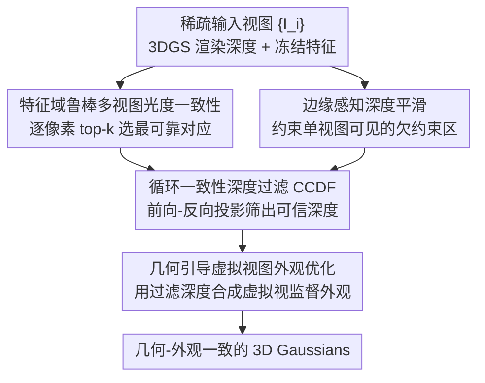

# Intrinsic Geometry-Appearance Consistency Optimization for Sparse-View Gaussian Splatting

**会议**: CVPR 2026  
**论文**: [CVF Open Access](https://openaccess.thecvf.com/content/CVPR2026/html/Xiong_Intrinsic_Geometry-Appearance_Consistency_Optimization_for_Sparse-View_Gaussian_Splatting_CVPR_2026_paper.html)  
**代码**: [项目页 ICO-GS](https://KaiqiangXiong.github.io/ICO-GS/)  
**领域**: 3D视觉 / 稀疏视图新视图合成  
**关键词**: 稀疏视图, 3D高斯泼溅, 几何-外观一致性, 多视图光度一致性, 虚拟视图

## 一句话总结
ICO-GS 把稀疏视图 3DGS 的退化归因为"几何与外观失去内在一致性"，先用特征域多视图光度一致性（配逐像素 top-k 选择和边缘感知平滑）约束几何，再用循环一致性过滤出可靠深度去合成虚拟视图、反过来监督外观，在 LLFF/DTU/Blender 上稳定超过现有稀疏视图基线，尤其在弱纹理区域。

## 研究背景与动机

**领域现状**：3DGS 把场景表示成一堆各向异性 3D 高斯，能实时渲染出高保真新视图，是当前新视图合成（NVS）的主流。每个高斯同时携带**几何属性**（位置 $\mu$、协方差 $\Sigma$、不透明度 $\alpha$）和**外观属性**（视相关颜色 $c(d)$）。

**现有痛点**：3DGS 的标准优化是逐视图独立最小化渲染损失。在稠密视图下没问题，但视图一稀疏，这种独立监督会让外观"作弊"——通过调颜色去补偿错误的几何，把训练视图拟合得很好，结果几何严重欠约束。论文用一组对照图（同场景 15→9→6→3 视图）说明：随着视图减少，训练视图的 RGB 仍拟合得不错，但渲染深度迅速崩坏，到了测试视图就出现漂浮物（floaters）和模糊。

**核心矛盾**：几何与外观之间缺乏**内在一致性**（intrinsic consistency）——几何本应准确刻画 3D 结构、外观本应跨视点一致地反映表面光度，但稀疏监督允许两者各自"凑答案"，弱纹理区域更是因为缺乏外观线索而雪上加霜。

**本文目标**：在不依赖外部深度先验的前提下，恢复几何与外观的耦合正确性，分解为两个互相牵制的子问题——(1) 稀疏观测下如何稳健约束几何；(2) 如何用可靠几何去引导外观优化、防止过拟合。

**切入角度**：作者的关键观察是"忠实的几何和外观来自彼此强化"——约束好的几何能引导外观学到视点一致的光度，可靠的外观监督又能反过来精修几何。已有尝试如 BinocularGS 用渲染深度构造双目虚拟视图，但渲染深度本身不可靠，会形成"坏深度→坏虚拟视图→更坏几何"的恶性循环。

**核心 idea**：用**特征域多视图光度一致性**先把几何约束住，再用**循环一致性过滤**只保留可信深度去合成虚拟视图监督外观，从而把几何正确性"传播"到外观，打破上述循环依赖。

## 方法详解

### 整体框架
ICO-GS（Intrinsic Geometry-Appearance Consistency Optimization）建立在 BinocularGS 之上，整条管线分两块协同：**鲁棒几何正则**把稀疏视图下欠约束的几何先拉正，**几何引导的外观优化**再用被验证过的几何去合成虚拟视图监督外观。输入是 $n$ 张稀疏训练视图 $\{I_i\}$，输出是几何-外观一致的 3D 高斯，可实时渲染任意新视图。两块之间靠"循环一致性过滤"做闸门：只有通过前向-反向投影自洽检验的深度才允许进入外观监督，避免坏几何污染外观。整套训练用三阶段课程学习串起来。

### 关键设计

**1. 特征域鲁棒多视图光度一致性：用特征匹配 + 逐像素 top-k 抵抗光照与遮挡**

这一项针对"几何欠约束"。基本思路是多视图几何常识：一个 3D 点从多个视点看应当光度一致。给定参考视图 $I_0$，按渲染深度把参考像素 $p$ 投到源视图 $p'_j = K T_{0\to j}(D_0(p)\cdot K^{-1}p)$，再逆向 warp 回参考视图得到重建图 $I_{j\to 0}$，理想朗伯面下两者应一致。但直接比 RGB 对光照、阴影、高光很脆弱，作者改用**冻结预训练特征网络**的特征做匹配：$L=\frac{1}{n-1}\sum_j \frac{\|\frac{1}{2}(1-\cos(F_0, F_{j\to 0}))\odot M_j\|_1}{\|M_j\|_1}$。特征在预处理时算一次、训练中冻结，几乎零额外开销却显著抗光照变化。更关键的是**逐像素 top-k 选择**应对遮挡：对每个参考像素，只在所有源视图里挑出特征最一致的 $k$ 个对应做聚合 $L^{\text{Fea}}_{\text{mpc}}(p)=\frac{1}{k}\sum_{j\in T_k(p)}\frac{1}{2}(1-\cos(F_0(p),F_{j\to 0}(p)))$，这样某像素在一半视图里被遮挡时，剩下可见的视图仍能提供有效监督——这是消融里掉点最猛的一项。

**2. 边缘感知深度平滑：补上只被单视图看见的死角**

多视图一致性在"只有一个视图能看到"的区域失效，这些区域几何完全没约束。作者加一项边缘感知深度平滑 $L_{\text{smooth}}=\sum_p \|\nabla D_0(p)\|_1\cdot \exp(-\alpha\|\nabla I_0(p)\|_1)$：图像梯度大（物体边界）的地方放松对深度梯度的惩罚，图像平坦（无纹理）的地方强制深度平滑。这样既在无纹理区给出平滑深度，又在物体边界保留不连续性，避免把锐利结构抹平。

**3. 循环一致性深度过滤（CCDF）：给虚拟视图监督装一个"只放行可信深度"的闸门**

这是打破"坏深度→坏虚拟视图"循环的核心。合成虚拟视图前，先验证渲染深度是否自洽：对参考像素 $p$，先用 $D_0(p)$ 前向 warp 到源视图得 $p'_j$，再用源视图深度 $D_j(p'_j)$ 反向 warp 回参考视图得到重投影深度 $\tilde D_j(p)$，深度误差 $e_j(p)=|D_0(p)-\tilde D_j(p)|$ 衡量几何自洽性。一个像素被判为可靠，当且仅当至少 $m$ 个源视图满足 $e_j(p)<\tau_d$（$\tau_d=0.01\cdot\max(D_0)$），即 $M_{\text{reliable}}(p)=\mathbb{I}[\sum_j \mathbb{I}[e_j(p)<\tau_d]\ge m]$。这个二值掩码圈出"渲染深度被循环一致性背书"的区域，保证后续 warp 出来的虚拟视图贴合真实结构。消融显示去掉 CCDF 在 DTU 上掉 0.52 dB，会出现明显渲染伪影。

**4. 几何引导的虚拟视图外观优化：用可信几何把正确性传播到外观**

有了被 CCDF 验证的可靠深度，就用它合成虚拟视图来监督外观。和此前只造双目对的方法不同，作者在以参考相机位置为心、半径 $r$ 的球内**随机采样**虚拟位姿 $\{P_v\}$，视点多样性更大。对每个虚拟视图，用被掩码过滤的深度 $\{M^{\text{reliable}}_i\odot D_i\}$ 把所有训练图前向 warp 合成虚拟图 $I_v$（带有效掩码 $M_v$，排除不可靠区域），再渲染该虚拟位姿得到 $I^R_v$，在有效像素上施加光度一致性 $L_{\text{app}}=\sum_{p\in M_v}\|I_v(p)-I^R_v(p)\|_1$。它一举两得：既给未见视点提供额外外观观测、防过拟合，又通过新视点监督反向约束几何。因为虚拟图来自可靠性过滤后的深度，监督是"干净"的，不会像依赖原始渲染深度的方法那样把几何畸变带进外观。

### 损失函数 / 训练策略
总损失把四项加在基线之上：$L_{\text{total}}=L_{\text{3DGS}}+L_{\text{consis}}+\lambda_{\text{mpc}}L^{\text{Fea}}_{\text{mpc}}+\lambda_{\text{smooth}}L_{\text{smooth}}+\lambda_{\text{app}}L_{\text{app}}$，其中 $L_{\text{consis}}$ 是继承自 BinocularGS 的双目一致性项，权重 $\lambda_{\text{mpc}}=0.1,\lambda_{\text{smooth}}=0.01,\lambda_{\text{app}}=1.0$。训练用**三阶段课程学习**：阶段 1 只跑 $L_{\text{3DGS}}$ 建立粗几何；阶段 2 激活几何正则（$\lambda_{\text{mpc}}L^{\text{Fea}}_{\text{mpc}}+\lambda_{\text{smooth}}L_{\text{smooth}}$）；阶段 3 再加虚拟视图外观监督 $\lambda_{\text{app}}L_{\text{app}}$。LLFF/DTU 训练 30k 次迭代（几何正则从 20k 起、外观优化从 25k 起），Blender 训练 7k 次（分别从 4k、5k 起），实验在 NVIDIA L40s 上跑、取三个随机种子平均。

## 实验关键数据

### 主实验
三个标准基准：LLFF（前向场景）、DTU（大量弱纹理区，物体中心）、Blender（360° 物体中心）。LLFF/DTU 用 3/6/9 训练视图，Blender 用 8 视图。指标 PSNR↑（峰值信噪比，越高越好）、SSIM↑（结构相似度）、LPIPS↓（感知距离，越低越好）。

| 数据集 | 设置 | PSNR↑(本文) | PSNR↑(BinocularGS) | PSNR↑(ComapGS/最优基线) |
|--------|------|------|------|------|
| LLFF | 3-view | **22.20** | 21.44 | 21.11 |
| LLFF | 6-view | **25.37** | 24.87 | 25.20 |
| LLFF | 9-view | 26.45 | 26.17 | **26.73** |
| DTU | 3-view | **21.77** | 20.71 | 20.21(NexusGS) |
| DTU | 9-view | **27.19** | 26.70 | 27.18(CoR-GS) |
| Blender | 8-view | **25.56** | 24.71 | 25.42(DropGaussians) |

LLFF 上 3 视图 +0.76 dB、6 视图较 ComapGS +0.17 dB；DTU 上 3/6 视图分别 +1.06/+0.58 dB（视图越稀疏优势越大）。Blender 上 PSNR 最优，但 SSIM/LPIPS 略低于个别方法，作者解释这是"优先几何精度而非感知优化"的取舍。

### 消融实验
在 LLFF（3 视图）和 DTU（3 视图）上逐项移除，基线为 BinocularGS。

| 配置 | LLFF-3 PSNR↑ | DTU-3 PSNR↑ | 说明 |
|------|------|------|------|
| Baseline（全去） | 21.44 | 20.71 | BinocularGS |
| w/o $L^{\text{Fea}}_{\text{mpc}}$ | 21.82 | 21.31 | 去鲁棒多视图一致性，掉最多 |
| w/o $L_{\text{smooth}}$ | 22.16 | 21.67 | 去边缘平滑 |
| w/o CCDF | 21.86 | 21.25 | 去循环一致性过滤 |
| w/o $L_{\text{app}}$ | 21.79 | 21.20 | 去虚拟视图外观监督 |
| **Full** | **22.20** | **21.77** | 完整模型 |

### 关键发现
- **鲁棒多视图一致性（$L^{\text{Fea}}_{\text{mpc}}$）贡献最大**：去掉它 LLFF 掉 0.38 dB、DTU 掉 0.46 dB，RGB 和深度都明显变糊变噪，说明特征域 + top-k 的几何约束是地基。
- **CCDF 和 $L_{\text{app}}$ 在 DTU 这种弱纹理数据上尤其关键**：去 CCDF 掉 0.52 dB、去 $L_{\text{app}}$ 掉 0.57 dB，没有过滤闸门时虚拟视图监督会引入伪影。
- **视图越稀疏增益越大**：DTU 3 视图 +1.06 dB，到 9 视图仅 +0.01 dB——方法主要价值在极端稀疏场景。

## 亮点与洞察
- **把"几何-外观一致性"提成一条原则**：作者不是又加一个 loss，而是先诊断出稀疏 3DGS 退化的根因是外观替几何"背锅"，再围绕"互相强化"设计整条管线，框架自洽。
- **CCDF 是个可复用的"深度可信度闸门"**：前向-反向投影自洽检验只用相机内外参和渲染深度、无需额外网络，任何要用渲染深度去做自监督/虚拟视图的工作都能借这个掩码挡掉坏深度。
- **特征匹配换 RGB 匹配近乎零成本**：特征预处理算一次后冻结，却把光照鲁棒性补齐——这是把"前馈模型的特征"嫁接进"逐场景优化"的轻量做法。

## 局限与展望
- **假设外观视点无关**：虚拟视图合成时把外观当作视点无关，在强镜面高光/反射区域 warp 出的外观会给出错误监督（作者承认，但指出稀疏视图下其他方法也一样难）。
- **不显式建模视相关效应**：对玻璃、金属等强 view-dependent 材质，可考虑在虚拟视图监督里引入视相关项或不确定性加权。
- **依赖基线框架**：方法叠在 BinocularGS 之上，$L_{\text{consis}}$ 等仍继承基线，强稀疏（如 2 视图）下的独立有效性未单独验证。⚠️ 以原文为准。

## 相关工作与启发
- **vs BinocularGS**：都用渲染深度造虚拟视图，但 BinocularGS 直接信任渲染深度、易陷入"坏深度→坏虚拟视图"循环；本文用 CCDF 先过滤再合成，且采样范围从双目对扩展到球内随机位姿，监督更干净更多样。
- **vs DNGaussian / FSGS（用预训练深度先验）**：它们引入外部单目深度先验，受尺度模糊和先验噪声困扰、初始几何还会被逐步遗忘；本文不靠外部深度，全靠多视图自一致 + 边缘平滑约束几何。
- **vs CoR-GS / DropGaussians**：同为稀疏 3DGS 改进，本文在弱纹理的 DTU 上优势最明显，因为特征域 top-k 一致性专门补了"无外观线索区域"的几何。

## 评分
- 新颖性: ⭐⭐⭐⭐ 把退化归因为几何-外观一致性、用 CCDF 闸门打破循环依赖，角度清晰但组件多为已有思想的稳健组合
- 实验充分度: ⭐⭐⭐⭐ 三数据集 × 多视图设置 + 四项消融 + 三种子平均，较扎实；强 view-dependent 场景未深入
- 写作质量: ⭐⭐⭐⭐ 动机诊断和公式交代清楚，图文对照充分
- 价值: ⭐⭐⭐⭐ 在极稀疏、弱纹理场景下稳定提升，CCDF 闸门有迁移价值

<!-- RELATED:START -->

## 相关论文

- [\[CVPR 2026\] SGS-Intrinsic: Semantic-Invariant Gaussian Splatting for Sparse-View Indoor Inverse Rendering](sgs-intrinsic_semantic-invariant_gaussian_splatting_for_sparse-view_indoor_invers.md)
- [\[CVPR 2026\] Faster-GS: Analyzing and Improving Gaussian Splatting Optimization](faster-gs_analyzing_and_improving_gaussian_splatting_optimization.md)
- [\[CVPR 2026\] TWINGS: Thin Plate Splines Warp-aligned Initialization for Sparse-View Gaussian Splatting](twings_thin_plate_splines_warp-aligned_initialization_for_sparse-view_gaussian_s.md)
- [\[CVPR 2026\] MotionScale: Reconstructing Appearance, Geometry, and Motion of Dynamic Scenes with Scalable 4D Gaussian Splatting](motionscale_reconstructing_appearance_geometry_and_motion_of_dynamic_scenes_with.md)
- [\[CVPR 2026\] Confidence-Guided Multi-Scale Aggregation for Sparse-View High-Resolution 3D Gaussian Splatting](confidence-guided_multi-scale_aggregation_for_sparse-view_high-resolution_3d_gau.md)

<!-- RELATED:END -->
