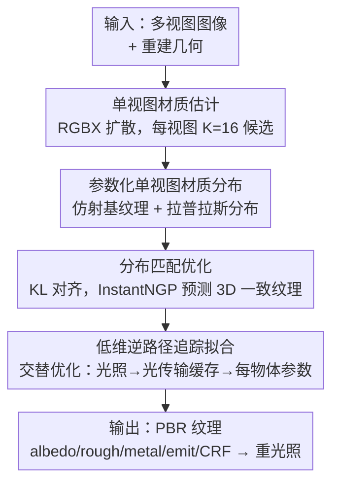

# Intrinsic Image Fusion for Multi-View 3D Material Reconstruction

**会议**: CVPR 2026  
**论文**: [CVF Open Access](https://openaccess.thecvf.com/content/CVPR2026/html/Kocsis_Intrinsic_Image_Fusion_for_Multi-View_3D_Material_Reconstruction_CVPR_2026_paper.html)  
**代码**: [项目页](https://peter-kocsis.github.io/IntrinsicImageFusion/)  
**领域**: 3D视觉 / 逆向渲染 / 材质重建  
**关键词**: PBR材质重建, 逆向渲染, 路径追踪, 单视图先验蒸馏, 分布匹配

## 一句话总结
Intrinsic Image Fusion（IIF）把 2D 扩散材质估计器的单视图先验"蒸馏"进多视图逆向渲染：先用参数化分布把每视图多个不一致的 PBR 预测收进一个低维一致空间，再做分布匹配得到 3D 一致纹理，最后只对每物体的少量参数做逆路径追踪微调，在合成与真实室内场景上的材质解耦质量大幅超越现有逆向渲染方法。

## 研究背景与动机
**领域现状**：把室内场景分解成物理渲染（PBR）成分——反照率 albedo、粗糙度 roughness、金属度 metallic、光照——是图形学与视觉的核心任务，支撑重光照、材质编辑、虚拟物体插入等应用。主流逆向渲染走"分析–合成"路线，用路径追踪模拟光传输来反推材质。

**现有痛点**：路径追踪的真实渲染既昂贵又天然带 Monte-Carlo 噪声，噪声会回传进优化、让材质估计不稳；加之外观分解本身高度歧义——漫反射、镜面、光照紧耦合，复杂室内场景尤甚，结果常把光照"烤进"漫反射材质里、镜面参数也偏。另一条路是 2D 单图材质估计器（如 RGBX，基于扩散模型），泛化强、能从单图采样多个可能解，但正因为概率式建模，**同一视图内或跨视图的预测彼此不一致**，没法直接用于 3D。

**核心矛盾**：逆路径追踪"物理正确但噪声大、参数多"，2D 先验"细节锐利但 3D 不一致、非物理"。如何取两者之长？

**本文目标**：把强 2D 单视图先验嵌进逆向渲染优化，蒸馏出整场景**既 3D 一致又可重渲染**的高质量 PBR 纹理。

**切入角度**：与其平均掉多个不一致的 2D 预测（会糊掉细节），不如把"可能材质的解空间"显式建成一个**低维参数化分布**，再去匹配——这样既能挑出最一致的预测、又把逆路径追踪要优化的自由参数压到极少，从根上压住渲染噪声。

**核心 idea**：用参数化分布 + 分布匹配把 2D 先验蒸馏成 3D 一致纹理，再只对每物体的少量仿射参数做逆路径追踪微调。

## 方法详解

### 整体框架
输入是带位姿的多视图图像 + 重建几何，输出是整场景的 PBR 纹理（albedo/roughness/metallic + 自发光 + 相机响应函数 CRF），可直接重渲染与重光照。流程分三段串行：先用单视图概率估计器（RGBX）给每个视图采 $K$ 个候选 PBR 分解；再把这些候选收进一个**参数化分布**（仿射基纹理 + 拉普拉斯分布），通过**分布匹配优化**聚合成一张 3D 一致纹理；最后只对每物体的少量自由参数做**逆路径追踪**微调，得到物理正确的解耦。

### 关键设计

**1. 参数化单视图材质分布：把歧义的 2D 预测收进低维一致空间**

RGBX 对每张观测图采 $K$ 个候选反照率/粗糙度/金属度，但它们处在"歧义可变"的解空间里，直接平均会产生不一致和过平滑。主要歧义是**尺度不变性**——观察到的 RGB 究竟来自反射率还是光照说不清（如水壶可有多种合理 albedo）。受颜色标定启发，作者对每物体每条预测引入可学习**仿射变换**把它们对齐到一个"歧义不变"的基纹理：$\bar{\mathbf{a}}_{i,k}=T^a_{i,k}[\mathbf{a}_{i,k},1]$，其中反照率 $T^a\in\mathbb{R}^{3\times4}$、粗糙度/金属度各 $T\in\mathbb{R}^{1\times2}$（⚠️ 原文公式 OCR 受损，维度以原文为准）。仿射只能修正每物体的全局不一致，修不了高频图案（如台面）的不一致，所以作者进一步把单视图解空间建成**逐图逐物体的拉普拉斯分布**：用可学习指派 logits 经温度 softmax 得到候选的逐像素混合权重 $\alpha^a_{i,k}=\frac{\exp(z^a_{i,k}/\tau)}{\sum_j \exp(z^a_{n,j}/\tau)}$，混合均值作为分布位置 $\mu^{\mathrm{ref}}_i$，候选对均值的中位偏差作为尺度 $b^{\mathrm{ref}}_i$，即 $p^{\mathrm{ref}}_i\sim\mathrm{Laplace}(\mu^{\mathrm{ref}}_i,b^{\mathrm{ref}}_i)$。

**2. 分布匹配优化：用"挑最一致的单条预测"代替"平均"得到 3D 一致纹理**

要把逐图逐物体的 2D 分布蒸馏成整场景一张 3D 纹理，作者用一个基于 InstantNGP 的 BRDF 网络 $f_\theta$ 在 3D 点 $\mathbf{x}_n$ 上预测材质及其不确定度，构成预测侧拉普拉斯分布 $p^{\mathrm{pred}}_n\sim\mathrm{Laplace}(\mu^{\mathrm{pred}}_n,\mathbf{b}^{\mathrm{pred}}_n)$。优化目标是让渲染回 2D 时两个分布一致——**数据损失**用 KL 散度对齐：$\mathcal{L}_{\mathrm{data}}=\frac{1}{N}\sum_n D_{\mathrm{KL}}(p^{\mathrm{ref}}_{i_n}\parallel p^{\mathrm{pred}}_n)$；为稳住指派 logits，加一个**标签损失**——以渲染材质对各候选的 $L_2$ 误差经 softmax 得软标签 $q_{n,k}$、再对混合权重做交叉熵正则；外加对仿射变换的恒等正则 $\mathcal{L}_{\mathrm{reg}}(T)$，总损失 $\mathcal{L}_{\mathrm{total}}=w_{\mathrm{data}}\mathcal{L}_{\mathrm{data}}+w_{\mathrm{label}}\mathcal{L}_{\mathrm{label}}+w_{\mathrm{reg}}\mathcal{L}_{\mathrm{reg}}$。关键直觉是：分布匹配的目的是在多个视图里**挑出单条最一致的预测**而非平均它们，因此预测越多反而越不会过平滑（见消融）。

**3. 低维逆路径追踪拟合：只优化每物体少量参数以压住渲染噪声**

聚合得到的是"歧义不变"的基分布——跨视图一致，但只是解空间里的独立采样，还需落到物理正确的解耦。作者用分析–合成，仅对**每物体的 PBR 仿射参数** $T^a_o,T^r_o,T^m_o$ 做逆路径追踪（求解渲染方程，表面反射用 Cook-Torrance 微表面模型 $f_r=f_{\mathrm{diff}}+f_{\mathrm{spec}}$）。由于路径追踪的 Monte-Carlo 噪声会回传成"烤进"的阴影效果，**把可训练参数从整张 BRDF 纹理压到每物体少量变换**，本身就是最强的去噪正则。为进一步降方差，沿用 FIPT 做三步**交替优化**：① 光照优化（每三角面均匀自发光，固定 $f_\theta$ 反推、剪掉低强度三角面）；② 光传输缓存（渲染漫反射/镜面预积分着色图，可用更高采样数）；③ BRDF 参数拟合（最终优化每物体变换，并联合优化 CRF 以适配 LDR 输入）。

### 损失函数 / 训练策略
每视图取 $K=16$ 个预测，用 Adam（bs=65536, lr=1e-2，每 2 个 epoch 衰减 0.5）优化，权重 $w_{\mathrm{data}}=w_{\mathrm{label}}=1$、$w_{\mathrm{reg}}=10^{2}$，温度 $\tau_{\mathrm{err}}=\tau_{\mathrm{logit}}=1$ 每 100 次迭代退火 0.85。分布匹配跑 10 个 epoch（约 5 分钟）；参数拟合按 FIPT 用 Mitsuba 3 实现，约 55 分钟收敛（单张 A6000）。

## 实验关键数据

### 主实验
四个合成场景上各方法平均结果（PSNR/SSIM/LPIPS 为 albedo 重渲染质量，后三列为 albedo/rough/metal 的 L2，箭头方向为更优）：

| 方法 | PSNR ↑ | SSIM ↑ | LPIPS ↓ | Albedo L2 ↓ | Rough L2 ↓ | Metal L2 ↓ |
|------|------|------|------|------|------|------|
| NeILF++ | 13.18 | 0.733 | 0.375 | 0.103 | 0.047 | N/A |
| FIPT | 10.63 | 0.661 | 0.403 | 0.110 | 0.006 | 2.208 |
| IRIS | 15.86 | 0.735 | 0.307 | 0.056 | 0.040 | 2.046 |
| **IIF (本文)** | **20.72** | **0.846** | **0.201** | **0.028** | 0.007 | **0.384** |

IIF 在 PSNR 上比次优的 IRIS 高近 5 dB，albedo L2 减半，金属度 L2 从 2.0 量级降到 0.38。真实评估在 ScanNet++ 上用激光扫描网格 + MaskClustering/SAM 的 3D 一致实例分割，定性上避免了先前方法的投影轮廓伪影（如椅子边界印到墙上）。

### 消融实验
不同聚合方式对单视图 RGBX 预测的表达力（合成场景）：

| 配置 | PSNR ↑ | SSIM ↑ | LPIPS ↓ | Albedo L2 ↓ |
|------|------|------|------|------|
| RGBX（原始预测） | 13.11 | 0.787 | 0.228 | 0.187 |
| Per-Object Mean | 13.21 | 0.641 | 0.563 | 0.169 |
| Per-Texel Mean | 13.43 | 0.753 | 0.42 | 0.170 |
| w/ 参数化模型 (§3.1) | 29.53 | 0.909 | 0.176 | 8.16e-4 |
| **Ours full（+分布匹配 §3.2）** | **30.79** | **0.931** | **0.160** | **7.86e-4** |

预测数量的影响（分布匹配优化）：

| 预测数 #Preds | PSNR ↑ | SSIM ↑ | LPIPS ↓ |
|------|------|------|------|
| 1 | 29.62 | 0.908 | 0.177 |
| 4 | 30.37 | 0.926 | 0.160 |
| 8 | 30.72 | 0.930 | 0.160 |
| **16 (本文)** | **30.79** | **0.931** | 0.160 |

### 关键发现
- **参数化模型是质量跃升的主因**：从 per-object/per-texel 平均（PSNR ~13）跳到参数化模型（29.53），SSIM/LPIPS/L2 全面改善——把预测对齐到低维仿射基空间，远比平均更能保住细节。
- **分布匹配再上一层**：在参数化基础上加分布匹配（§3.2）把 PSNR 推到 30.79、SSIM 0.931，验证"挑最一致单条预测"优于继续平均。
- **预测越多越好、不过平滑**：#Preds 从 1→16，PSNR 单调升（29.62→30.79），说明分布匹配是去找最一致解而非抹平，多采样反而帮忙。
- **per-image-per-object 优于 per-image**：仅按图建模会因物体间相对反射率错配而欠拟合（输出趋向场景平均色），按物体分段独立建模表达力显著更高。

## 亮点与洞察
- **"挑最一致"而非"平均"**：把概率式 2D 预测的歧义建成拉普拉斯分布、用分布匹配选出最一致解，是这篇最巧的设计——直接回避了多视图聚合最常见的过平滑/接缝问题。
- **用低维参数化当去噪正则**：把逆路径追踪的可训练量从整张纹理压到每物体少量仿射参数，等于给噪声优化套了个强约束，干净利落地压住"烤进"的阴影；这种"减少自由度即正则"的思路可迁移到任何噪声大的分析–合成优化。
- **2D 生成先验 × 物理逆渲染的混合范式**：既吃到扩散模型的锐利细节与泛化，又保住物理可重渲染性，给"如何把强 2D 先验安全地用进 3D 优化"提供了一个干净模板。

## 局限与展望
- **依赖固定几何**：方法继承底层网格的伪影，联合优化几何是有趣但未做的方向。
- **采样多个材质预测计算昂贵**：把预训练先验直接并入优化、而非反复采样，可能更紧凑。
- **受限于 2D 估计器质量**：错误预测会污染结果，作者建议引入预测不确定度来忽略坏预测。
- 自己看：评估场景规模偏小（四个合成场景 + 少量 ScanNet++），更大规模真实数据上的稳健性与 ~1 小时/场景的优化成本仍是落地门槛。

## 相关工作与启发
- **vs IRIS**：IRIS 也用单视图估计器做正则，但它做的是"每物体单色聚合"当材质代理、且仍在优化整张纹理的噪声渲染损失，导致丢图案 + 烤进阴影；IIF 用参数化分布保住图案、且只优化每物体低维参数，更干净锐利。
- **vs FIPT / NeILF++（纯逆路径追踪）**：它们直接在噪声光传输上优化全纹理，难分离着色与反射率、镜面参数偏；IIF 把优化约束到低维、并引入 2D 先验，PSNR 高出近一倍。
- **vs RGBX（纯 2D 扩散估计）**：RGBX 提供锐利图案先验但 3D 不一致、非物理；IIF 把它蒸馏成一致且可重渲染的 3D 纹理。

## 评分
- 新颖性: ⭐⭐⭐⭐⭐ 参数化分布 + 分布匹配"挑最一致"是把概率 2D 先验安全注入 3D 逆渲染的新颖路径。
- 实验充分度: ⭐⭐⭐⭐ 合成 + 真实 + 聚合方式/预测数消融完整，但评估场景数偏少。
- 写作质量: ⭐⭐⭐⭐ 三段式 pipeline 与动机清晰；⚠️ 缓存中公式 OCR 受损，部分维度需对照原文。
- 价值: ⭐⭐⭐⭐ 为室内 PBR 材质重建与重光照提供了高质量、可重渲染的实用方案。

<!-- RELATED:START -->

## 相关论文

- [\[CVPR 2026\] SMVRT: Implicit Human 3D Modeling Using Sparse Multi-View Volumetric Reconstruction with Transformer Fusion](smvrt_implicit_human_3d_modeling.md)
- [\[CVPR 2026\] C-GenReg: Training-Free 3D Point Cloud Registration by Multi-View-Consistent Geometry-to-Image Generation with Probabilistic Modalities Fusion](c-genreg_training-free_3d_point_cloud_registration_by_multi-view-consistent_geom.md)
- [\[CVPR 2026\] FISHuman: Fine-grained Single-image 3D Human Reconstruction via Multi-view 4D Remeshing](fishuman_fine-grained_single-image_3d_human_reconstruction_via_multi-view_4d_rem.md)
- [\[CVPR 2026\] Changes in Real Time: Online Scene Change Detection with Multi-View Fusion](changes_in_real_time_online_scene_change_detection_with_multi-view_fusion.md)
- [\[CVPR 2026\] MatE: Material Extraction from Single-Image via Geometric Prior](mate_material_extraction_from_single-image_via_geometric_prior.md)

<!-- RELATED:END -->
