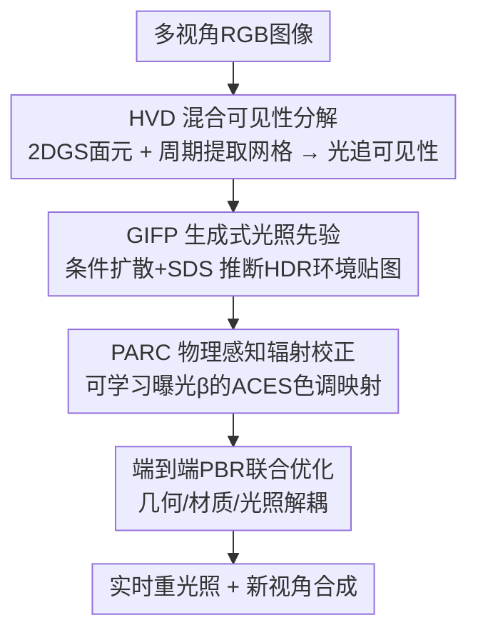

# IR-HGP: Physically-Aware Gaussian Inverse Rendering for High-Illumination Scenes via Generative Priors

**会议**: CVPR 2026  
**论文**: [CVF Open Access](https://openaccess.thecvf.com/content/CVPR2026/html/Zhang_IR-HGP_Physically-Aware_Gaussian_Inverse_Rendering_for_High-Illumination_Scenes_via_Generative_CVPR_2026_paper.html)  
**代码**: 待确认  
**领域**: 3D视觉 / 逆向渲染 / 高斯泼溅 / 重光照  
**关键词**: 3D高斯泼溅、逆向渲染、高光照场景、可见性分解、扩散光照先验、HDR色调映射

## 一句话总结
IR-HGP 用三个协同模块（混合可见性分解 HVD、生成式光照先验 GIFP、物理感知辐射校正 PARC）把 3DGS 逆向渲染拓展到强光照/强镜面反射场景，解决"阴影和高光被烘焙进材质"的难题，在重光照和新视角合成上达到 SOTA（合成集均值 PSNR 33.61），同时保持实时渲染。

## 研究背景与动机

**领域现状**：逆向渲染要从多视角图像里解耦出几何、材质、光照，从而支持物理一致的重光照和编辑。NeRF 路线（TensoIR 等）把 BRDF 塞进体渲染、精度尚可但太慢；3D 高斯泼溅（3DGS）带来实时渲染后，一批工作（GShader、R3DG、GS-IR、DeferredGS、DiscretizedSDF 等）尝试把它拓展到逆向渲染。

**现有痛点**：3DGS 擅长建模辐射度做新视角合成，但缺乏逆向渲染需要的**物理可解释性**。在强光照、强镜面高光这种"光照-材质耦合被放大"的场景里尤其崩——环境贴图分解错误、新视角合成质量差、阴影和高光被"烘焙"（baked-in）进材质反照率里洗不掉。

**核心矛盾**：作者把失败归结为三对紧耦合的冲突——① **渲染-几何脱节**：3DGS 是无结构点云，没有显式表面定义，可见性和阴影推理不可靠；② **光照-材质耦合**：从稀疏 2D 视图同时估材质和光照本就是病态问题，易得非物理解；③ **辐射-优化冲突**：高光区辐射值跨好几个数量级，光度梯度极不稳定，而现有启发式正则或色调映射又会破坏物理一致性。

**本文目标**：在保留 3DGS 实时效率的前提下，给它恢复物理可解释性，让它在高光照场景也能可靠解耦几何/材质/光照。

**切入角度**：三个痛点各打一拳——给可见性补一个显式网格代理、给病态的环境光估计灌一个生成式先验、给不稳定的 HDR 优化做一个可学习的辐射校正。

**核心 idea**：HVD（混合可见性）+ GIFP（扩散光照先验）+ PARC（物理感知辐射校正）三模块协同，把物理保真度重新注入 3DGS 逆向渲染。

## 方法详解

### 整体框架
给定多视角 RGB 图像，IR-HGP 通过统一管线做物理感知的逆向渲染。先用 **HVD** 模块重建几何与外观——2D 高斯面元负责高效光栅化、周期性提取的显式网格负责高保真可见性；可见性调制 PBR 着色，由可学习的 HDR 环境贴图供光。**GIFP** 用条件扩散模型把这张环境贴图正则到"真实 HDR 图像流形"上，缓解光照-材质耦合的病态性。**PARC** 用一个全局可学习曝光参数 $\beta$ 把光度损失搬到非线性、梯度友好的校正空间里计算，稳住 HDR 优化、去掉烘焙阴影。最后所有可学习参数（高斯面元几何、环境贴图、曝光 $\beta$）端到端联合优化。

### 关键设计

**1. HVD 混合可见性分解：给点云补一张显式网格当"几何尺子"**

针对"渲染-几何脱节"——3DGS 没有显式表面，可见性/阴影没法可靠算。HVD 把场景拆成两部分：一组携带外观属性、用于高效光栅化的 **2D 高斯面元** $\mathcal{G}$，和一张为高保真可见性而周期性提取的**显式表面网格** $\mathcal{M}$。面元被约束在 2D 平面内（缩放矩阵 $S=\text{Diag}(s_x,s_y,0)$）形成扁平盘状，泼溅时各属性混合进 G-buffer：

$$X_{pixel}=\sum_{i=1}^{N} x_i T_i \alpha_i$$

其中 $X_{pixel}=[A,N]^\top$ 是最终的外观与法向图，$T_i=\prod_{j=1}^{i-1}(1-\alpha_j)$ 是累积透射率保证正确遮挡。关键在于：作者**周期性**（每 5k 迭代一次，约占总训练时间 18%）用稳健的 TSDF 融合从面元里抽出一张拓扑合理的代理网格，再在这张网格上做光线追踪算可见性项 $V(p,d_{in})\in\{0,1\}$，判断着色点 $p$ 在方向 $d_{in}$ 上是否被遮挡。最终辐射被分解成直接+间接两部分：

$$L(p,\omega_o)=V\cdot L_{dir}(p,\omega_o)+L_{ind}(p,\omega_o)$$

直接光 $L_{dir}$ 用 G-buffer 累积属性算，间接光 $L_{ind}$ 用可训练球谐系数近似。2D 面元让法向更干净、网格让遮挡推理物理可靠，两者合起来既准又不丢实时性。

**2. GIFP 生成式光照先验：用条件扩散把环境贴图钉在"真实 HDR 流形"上**

针对"光照-材质耦合"的病态性——从多视角图恢复 HDR 环境贴图 $\hat{L}_{env}$ 欠约束，即使渲染损失很小也可能得到物理上荒谬的解。GIFP 引入一个预训练条件扩散模型 $\mathcal{D}_{HDR}$ 当**持久先验**，在整个优化过程中把 $\hat{L}_{env}$ 约束在真实 HDR 图像的流形上。具体地，先用轻量编码器从多视角图抽一个粗粒度光照特征作为条件：

$$L_{Coarse}=\text{Encoder}(\{I_i\}_{i=1}^N)$$

它捕捉主光方向、环境色调等主导光照特征，不需要先验几何信息。然后用 SDS（Score Distillation Sampling）构造生成损失 $L_g$：每步往当前 $\hat{L}_{env}$ 注入缩放高斯噪声 $z$ 得到 $\hat{L}_{env}^{(t)}$，扩散模型在条件 $L_{Coarse}$ 下预测噪声 $z_{pred}=\mathcal{D}_{HDR}(\hat{L}_{env}^{(t)}, t \mid L_{Coarse})$，由于精确标量损失不可解，直接用其梯度估计：

$$\nabla_{\hat{L}_{env}} L_g \propto (z_{pred}-z)$$

这把扩散模型的先验蒸馏进环境贴图，既保证感知真实、又阻止优化器往训练视图上硬拟合不合理的高频细节。物理正确性不靠先验单独保证，而是从紧耦合的联合优化里自然涌现。这是据作者所知**首次在 3DGS 高光照场景中用扩散模型做环境贴图推断**。

**3. PARC 物理感知辐射校正：一个可学习曝光参数稳住 HDR 优化**

针对"辐射-优化冲突"——HDR 场景像素辐射跨好几个数量级，标准损失会被少数极端高光像素主导，优化器忽略暗区细节、把阴影/高光烘焙进材质。PARC 的核心是**在非线性、梯度友好的校正空间里算光度损失**。作者基于 ACES 色调映射曲线定义辐射校正函数 $C_{PARC}$，并引入一个全局共享、可学习的逐场景曝光参数 $\beta\in\mathbb{R}^+$：

$$L_{corr}=C_{PARC}(L_{in},\beta)=\frac{x(2.51x+0.03)}{x(2.43x+0.59)+0.14},\quad x=L_{in}\cdot\beta$$

训练时把渲染图和目标图都过一遍 PARC 再算 L1 损失：

$$L_c=\|C_{PARC}(L_{rendered},\beta)-C_{PARC}(L_{target},\beta)\|_1$$

梯度回传到 $\beta$ 让它自己找最优曝光。妙处在于：不像逐像素色调映射网络那样有大量自由度（容易变成吸收光照/材质误差的"黑箱"），PARC 每场景只加**一个自由度**，几乎只能去稳定优化地形、而非掩盖误差，从而强制更好的材质-光照解耦，从根上解决"烘焙阴影"问题、让反照率干净且物理正确。

### 损失函数 / 训练策略
最终辐射 $L(p,\omega_o)$ 用 PBR 着色（Cook-Torrance 微表面 + metallic-roughness 工作流），入射光从可学习环境贴图 $\hat{L}_{env}$ 采样。端到端最小化总损失：

$$L_{total}=L_c+\lambda_g L_g+\lambda_n L_n+\lambda_{smooth}L_{smooth}$$

$L_c$ 是 PARC 空间的光度损失（同时驱动外观和曝光 $\beta$），$L_g$ 是 GIFP 的生成先验损失，$L_n$/$L_{smooth}$ 是法向一致性和边缘感知法向平滑。权重 $\lambda_g=1.0$、$\lambda_n=0.2$、$\lambda_{smooth}=0.05$（$\lambda_g$ 经网格搜索）。Adam 优化、初始学习率 0.001 指数衰减、训练 30k 迭代、单张 RTX 4090，HVD 网格每 5k 迭代提取一次。

## 实验关键数据

### 主实验
自建数据集源自 Relightable Objects benchmark：10 个物体（6 个来自 NeRF Synthetic、4 个高镜面来自 Shiny Blender），每个在 6 张强光 HDR 环境贴图下渲染，共 60 个重光照配置；每配置 100 张训练 + 200 张测试新视角。下表为**所有物体在 6 个 HDR 环境上的均值**（Mean 行）：

| 方法 | 范式 | PSNR ↑ | SSIM ↑ | LPIPS ↓ | 训练时长 | FPS |
|------|------|------|------|------|------|------|
| TensoIR | NeRF-based | 28.22 | 0.9353 | 0.0840 | 5.4h | <1 |
| GS-IR | 3DGS | 29.25 | 0.9278 | 0.0880 | 0.6h | 208 |
| R3DG | 3DGS+光追 | 29.81 | 0.9645 | 0.0493 | 1.1h | 51 |
| DiscretizedSDF（DSDF） | 3DGS+SDF | 32.12 | 0.9700 | 0.0453 | 1.2h | 139 |
| **IR-HGP（本文）** | 3DGS+混合 | **33.61** | **0.9761** | **0.0369** | 1.5h | 92 |

> 指标说明：**PSNR/SSIM** 衡量像素级重建保真度，越高越好；**LPIPS** 衡量感知真实度，越低越好；**FPS** 为渲染帧率。本文在质量三项均最优，训练 1.5h、92 FPS 仍属实时可用范围——周期性网格提取+可见性计算约占 18% 训练时间，GIFP 模块几乎不拖慢训练。

高镜面物体（Shiny Blender）上优势尤其明显：如 Helmet 的 PSNR 35.00 vs DSDF 30.29、Toaster 31.57 vs 27.21，印证了对强反射表面的处理能力。⚠️ 表中各物体明细数字 OCR 较密，个别值以原文 Table 1 为准。

### 消融实验
逐一去掉模块（leave-one-out，Table 2，以 Ficus 和 Car 为例）：

| 配置 | Ficus PSNR ↑ | Ficus LPIPS ↓ | Car PSNR ↑ | Car LPIPS ↓ | 说明 |
|------|------|------|------|------|------|
| w/o 2DGS（HVD 内） | 36.14 | 0.0123 | 34.01 | 0.0224 | 退回普通 3DGS，法向噪声大 |
| w/o visibility（HVD 内） | 35.58 | 0.0243 | 33.78 | 0.0339 | 去掉网格可见性，遮挡推理错 |
| w/o GIFP | 34.77 | 0.0395 | 32.95 | 0.0452 | 去扩散先验，环境贴图糊、串色 |
| w/o PARC | 35.15 | 0.0179 | 33.43 | 0.0254 | 去辐射校正，阴影高光被烘焙 |
| **IR-HGP（完整）** | **36.86** | **0.0102** | **34.63** | **0.0209** | 全模块 |

真实数据集 Mip-NeRF 360 上（Table 3）IR-HGP 的 SSIM 0.807、LPIPS 0.196 也领先 2DGS/GS-IR/DSDF，显示对真实传感器噪声的鲁棒性（PSNR 26.92 略低于 2DGS 的 27.68，但感知指标占优）。

### 关键发现
- **GIFP 去掉掉点最猛**：w/o GIFP 时 LPIPS 从 0.0102 恶化到 0.0395（Ficus），说明扩散光照先验对欠约束的环境光估计是最强的归纳偏置——它不是单纯降噪，而是提供 L2/平滑先验给不了的生成式约束。
- **2DGS 让法向更干净**：去掉 2D 面元退回 3DGS 后法向噪声明显，可见性推理随之变差。
- **PARC 专治烘焙阴影**：可学习 $\beta$ 比固定 ACES 映射更能适配不同场景亮度，反照率最干净。固定 ACES 能缓解但无法自适应。
- **质量-效率平衡好**：用 NeRF 级质量但保持 92 FPS 实时渲染，训练只比最快的 GS-IR 多约 1 小时。

## 亮点与洞察
- **"显式网格当可见性尺子"很巧**：3DGS 点云算不准遮挡，就周期性抽一张网格专门做光追可见性，而渲染仍走高斯泼溅——用低频网格补几何、高频高斯保实时，鱼和熊掌兼得。
- **扩散模型当持久光照先验**：不是用扩散去生成图，而是用 SDS 梯度把欠约束的环境贴图持续拉回真实 HDR 流形，这种"先验当正则项"的用法可迁移到任何病态的逆问题估计。
- **单参数曝光的克制美学**：作者刻意只给 PARC 一个可学习自由度，正是为了防止它变成吸收误差的黑箱——"少给自由度反而更物理正确"是个反直觉但深刻的设计哲学。
- **专攻高光照这个被忽视的死角**：多数 3DGS 逆向渲染在普通光照下还行、强光强镜面下崩，本文三模块各打一个痛点，把这个硬场景啃下来。

## 局限与展望
- **网格提取有开销**：周期性 TSDF 融合+光追可见性占约 18% 训练时间，FPS（92）也低于纯 GS-IR（208），高保真可见性是用一定效率换的。
- **依赖预训练扩散先验**：GIFP 的效果受预训练 HDR 扩散模型质量与覆盖域限制，遇到训练分布外的极端光照可能失效。
- **真实场景 PSNR 未全面领先**：Mip-NeRF 360 上 PSNR 26.92 略低于 2DGS，像素级保真在真实噪声下并非处处最优（虽感知指标更好）。
- **改进方向**：把周期网格提取做成自适应频率以省时间；探索更轻量的光照先验减少对大扩散模型的依赖；把 PARC 的单曝光扩展到空间变化但仍受约束的形式以应对更复杂光照。

## 相关工作与启发
- **vs GS-IR / R3DG（3DGS 逆向渲染）**：它们用简化可见性和无约束球谐建间接光、强光照下易出非物理分解；本文用显式网格光追可见性 + 扩散环境贴图先验，均值 PSNR 33.61 vs 29.25/29.81 大幅领先。
- **vs DiscretizedSDF（DSDF，3DGS+SDF）**：DSDF 用 SDF 提几何精度、是最强基线；本文在质量三项（33.61/0.9761/0.0369 vs 32.12/0.9700/0.0453）全面超它，尤其高镜面物体差距大。
- **vs TensoIR（NeRF-based）**：NeRF 路线慢（<1 FPS、训练 5.4h），本文实时（92 FPS）且质量更高。
- **vs IllumiNeRF 等"扩散引导重光照"**：那类工作多监督渲染输出、需一致光照输入；本文直接用扩散先验解光照估计本身，且面向 3DGS 高光照场景。
- **vs GShader / 3DGS-DR（高斯着色）**：它们改进着色但几何约束弱、法向噪声大；本文 2D 面元+网格把几何收紧。

## 评分
- 新颖性: ⭐⭐⭐⭐ 三模块各有巧思，首次把扩散光照先验用进 3DGS 高光照逆向渲染；但 2DGS+网格、ACES 色调映射等单点是已有技术的组合
- 实验充分度: ⭐⭐⭐⭐ 合成+真实双数据集、对比四类范式基线、逐模块 leave-one-out 消融充分；但自建数据集规模（10 物体）偏小
- 写作质量: ⭐⭐⭐⭐ 三痛点→三模块的对应关系清晰，公式与图示完整；缓存里部分公式/表格 OCR 有噪声但原文应规整
- 价值: ⭐⭐⭐⭐ 把 3DGS 逆向渲染推进到强光照硬场景且保持实时，"扩散当持久先验""单参数曝光校正"对其他逆问题有借鉴

<!-- RELATED:START -->

## 相关论文

- [\[CVPR 2026\] SunFaded: Illumination-Aware Gaussian Splatting for Dark Scenes with Camera-Mounted Active Lighting](sunfaded_illumination-aware_gaussian_splatting_for_dark_scenes_with_camera-mount.md)
- [\[ICCV 2025\] GeoSplatting: Towards Geometry Guided Gaussian Splatting for Physically-based Inverse Rendering](../../ICCV2025/3d_vision/geosplatting_towards_geometry_guided_gaussian_splatting_for_physically-based_inv.md)
- [\[CVPR 2025\] SVG-IR: Spatially-Varying Gaussian Splatting for Inverse Rendering](../../CVPR2025/3d_vision/svg-ir_spatially-varying_gaussian_splatting_for_inverse_rendering.md)
- [\[CVPR 2026\] MVInverse: Feed-forward Multiview Inverse Rendering in Seconds](mvinverse_feed-forward_multiview_inverse_rendering_in_seconds.md)
- [\[CVPR 2026\] VAD-GS: Visibility-Aware Densification for 3D Gaussian Splatting in Dynamic Urban Scenes](vad-gs_visibility-aware_densification_for_3d_gaussian_splatting_in_dynamic_urban.md)

<!-- RELATED:END -->
