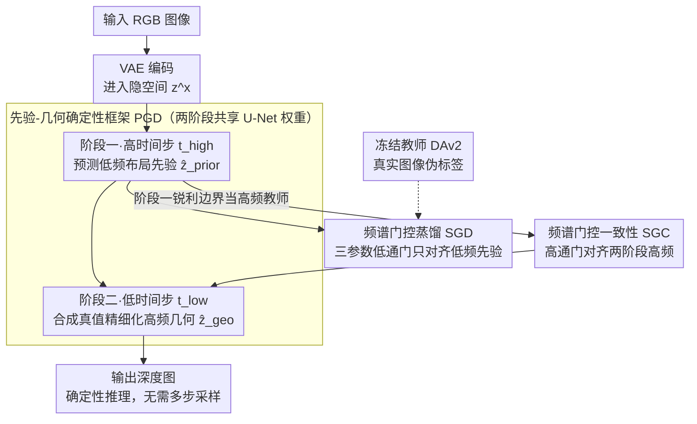

# Iris: Bringing Real-World Priors into Diffusion Model for Monocular Depth Estimation

**会议**: CVPR 2026  
**arXiv**: [2603.16340](https://arxiv.org/abs/2603.16340)  
**代码**: [https://github.com/NUST-Machine-Intelligence-Laboratory/Iris](https://github.com/NUST-Machine-Intelligence-Laboratory/Iris)  
**领域**: 3D视觉 / 单目深度估计  
**关键词**: 单目深度估计, 扩散模型, 频谱门控蒸馏, 先验-几何框架, 确定性扩散

## 一句话总结

Iris 提出一种确定性扩散框架，通过两阶段"先验到几何"(PGD)调度将真实世界先验注入扩散模型：第一阶段在高时间步用频谱门控蒸馏(SGD)从教师模型提取低频布局先验，第二阶段在低时间步用合成数据精细化高频几何细节，同时引入频谱门控一致性(SGC)实现跨阶段高频信息对齐，在有限数据和计算预算下达到 SOTA 零样本深度估计性能。

## 研究背景与动机

1. **领域现状**：单目深度估计(MDE)是计算机视觉的基础任务，现有方法主要分为前馈方法(如 Depth Anything V2)和扩散方法(如 Marigold、Lotus)。前馈方法依赖海量训练数据，扩散方法则利用预训练视觉先验。
2. **现有痛点**：Depth Anything V2 虽然泛化性强，但依赖难以复制的大规模训练流程，且细节和边界精度仍有不足。扩散方法虽能保留细节，但在合成-真实域迁移上表现不佳，泛化能力有限。
3. **核心矛盾**：存在一个"频率-可靠性不匹配"问题——教师模型在真实图像上的伪标签低频结构可靠但高频细节不准确，合成数据的真值高频精确但缺乏真实世界分布。单步训练同时学习两种信号会导致梯度干扰。
4. **本文目标**：在有限标注数据和计算预算下，构建一个既能保留细粒度细节、又能跨域强泛化、还能达到大规模训练方法精度的模型。
5. **切入角度**：观察到扩散模型在不同时间步对应不同信噪比(SNR)，高时间步适合学习全局布局，低时间步适合精细几何。
6. **核心 idea**：将先验注入和几何精细化解耦到两个扩散状态，通过频谱域的门控机制精确控制知识传递的频率范围。

## 方法详解

### 整体框架

Iris 要解决的核心问题是：在标注数据和算力都有限的前提下，让一个扩散模型既学到真实世界的全局布局先验，又能抠出合成数据级别的几何细节。难点在于这两类监督信号"打架"——教师模型在真实图像上的伪标签全局布局可靠但高频细节不准，合成数据的真值高频精确却没有真实分布。Iris 的做法是把这两件事拆到扩散过程的两个不同时间步上分头进行。

整体流程是这样的：输入 RGB 图像先经 VAE 编码进入隐空间，然后同一组 U-Net 权重连跑两个阶段。阶段一停在高时间步 $t_{\text{high}}$（低信噪比），此时模型天然偏向全局结构，专门从冻结的教师模型那里蒸取低频布局先验；阶段二切到低时间步 $t_{\text{low}}$（高信噪比），以阶段一的输出为起点，用合成真值把高频几何细节磨精。整个推理是确定性的，不需要多步采样，时间步只作为条件索引区分两个阶段。

### 关键设计

**1. 先验-几何确定性框架（PGD）：把"学先验"和"抠几何"拆到扩散的两个时间步，避免两种监督信号在同一步里互相干扰**

如果在单步训练里同时回归真实伪标签和合成真值，两路梯度会互相拉扯——前者想拉全局布局，后者想抠局部纹理，结果两边都学不干净。Iris 观察到扩散模型在不同时间步对应不同信噪比：高时间步噪声大，预测器自然只能盯住全局布局和大尺度边界，弱化细纹理；低时间步噪声小，才有条件雕琢精细几何。于是它把两件事顺次安排：阶段一在高时间步预测携带真实先验的布局表示 $\hat{z}^y_{\text{prior}} = f_\theta(z^x, t_{\text{high}})$，阶段二把这个结果当输入、在低时间步用合成真值精细化几何 $\hat{z}^y_{\text{geo}} = f_\theta(\hat{z}^y_{\text{prior}}, t_{\text{low}})$。两阶段共享同一套权重，靠时间步本身的频率偏好把"低频先验"和"高频几何"自然分流，不必再加额外网络。

**2. 频谱门控蒸馏（SGD）：只把教师可靠的低频先验蒸过来，放手让扩散模型自己生成高频细节**

教师模型（DAv2）的伪标签在低频段（全局布局、深度尺度）可靠，但高频细节其实并不准；如果像普通蒸馏那样整张图直接回归伪标签，反而会把扩散模型本来擅长的高频生成能力一并压死。SGD 的办法是只在频率上做选择性对齐——它设计了一个极轻量的低通门 $\mathcal{G}^{\text{low}}_\phi$，整个门只有三个可学习参数 $\phi = \{\kappa, \beta, s\}$，在傅里叶域用 Sigmoid 实现一个软截断曲线（$\kappa$ 控截止频率、$\beta$ 控过渡陡度、$s$ 控整体缩放），低频分量放行、高频分量逐渐衰减。蒸馏损失只比较门控之后的低频部分：

$$\mathcal{L}_{\text{sgd}} = \|\mathcal{G}^{\text{low}}_\phi(\hat{z}^y_{\text{prior}}) - \mathcal{G}^{\text{low}}_\phi(z^y_{\text{teach}})\|^2$$

这样学生只在"教师靠谱的频段"向它看齐，高频部分完全不受约束，留给扩散先验自由发挥。

**3. 频谱门控一致性（SGC）：把阶段一意外长出的锐利边界当成高频教师，回头去教阶段二**

这里有个反直觉的发现：阶段一明明在高时间步、只受低通监督，却反而产生了更陡峭的边界转换和更锐利的纹理。原因是低通对齐把监督集中在稳定的全局结构上，不再用模糊的高频伪标签去"污染"模型，扩散先验得以在高频上自由表达。SGC 顺势把阶段一的这份高频信号利用起来：设计一个可微的高通门，在高频域把阶段二的输出与阶段一对齐，相当于让阶段一充当阶段二的高频教师；同时加一条辅助约束，抑制阶段一在高频上的过度激活，防止把噪声也一并传下去。

### 损失函数 / 训练策略

总训练目标结合 SGD 损失（阶段一，真实图像）、合成监督损失（阶段二，合成数据）和 SGC 一致性损失（跨阶段高频对齐）。两阶段共享权重，按高到低时间步顺序执行。使用 Depth Anything V2 作为教师模型，在 Hypersim 和 Virtual KITTI 合成数据集上训练。

## 实验关键数据

### 主实验

| 数据集 | 指标 (AbsRel↓) | Iris | DAv2-L | Lotus | 提升 |
|--------|---------------|------|--------|-------|------|
| NYUv2 | AbsRel | 4.6 | 4.3 | 5.5 | 与 DAv2 接近，优于 Lotus |
| KITTI | AbsRel | 5.4 | 5.5 | 7.3 | 优于 DAv2 和 Lotus |
| ETH3D | AbsRel | 4.8 | 5.3 | 5.6 | 显著优于两者 |
| DIODE-Indoor | AbsRel | 14.1 | 16.0 | 18.8 | 大幅领先 |

Iris 在多数真实图像基准上取得最佳综合性能，特别是跨域泛化显著优于其他扩散方法。

### 消融实验

| 配置 | AbsRel (NYU) | 说明 |
|------|-------------|------|
| Full Iris | 4.6 | 完整模型 |
| w/o SGD (直接蒸馏) | 5.2 | 低频门控的贡献 |
| w/o SGC | 4.9 | 高频一致性的贡献 |
| 单阶段训练 | 5.4 | PGD 两阶段解耦的贡献 |
| w/o 教师蒸馏 | 5.8 | 真实世界先验的重要性 |

### 关键发现

- SGD 是最关键的模块，去掉后退化最大，说明频谱感知的先验注入至关重要
- 阶段一在高时间步下意外产生锐利边界是一个重要发现，启发了 SGC 的设计
- 与 DAv2 相比，Iris 训练数据量少 1-2 个数量级，但在大部分数据集上达到相当甚至更优性能
- 在边界和细节保真度方面，Iris 显著优于 DAv2

## 亮点与洞察

- **频率-可靠性不匹配的洞察**：教师标签不同频段可靠性不同，这是一个可推广到其他蒸馏场景的重要观察
- **仅 3 参数的频谱门**：用极简设计实现精准的频率选择性知识传递，优雅且高效
- **高时间步产生锐利边界的反直觉发现**：低通约束下模型反而在高频上表现更好，揭示了扩散模型内部的有趣特性

## 局限与展望

- 仍依赖预训练 VAE 的重建质量，极端细节可能受限于 VAE 的分辨率
- 当前教师模型固定为 DAv2，使用更强教师可能进一步提升
- 两阶段训练增加了调参复杂度（两个时间步的选择）
- 未来可将 PGD 框架扩展到法线估计、光流等其他密集预测任务

## 相关工作与启发

- **vs Depth Anything V2**: DAv2 依赖大规模数据蒸馏，Iris 用频谱门控在小数据上实现类似效果
- **vs Marigold/Lotus**: 这些扩散方法只在合成数据上微调，缺乏真实世界先验注入，域迁移能力弱
- **vs GenPercept**: GenPercept 也用单步扩散，但未解耦先验注入和几何精细化

## 评分

- 新颖性: ⭐⭐⭐⭐⭐ 频谱域解耦先验注入和几何精细化的思路新颖
- 实验充分度: ⭐⭐⭐⭐ 多数据集评测充分，消融详细
- 写作质量: ⭐⭐⭐⭐ 动机清晰，方法描述细致
- 价值: ⭐⭐⭐⭐⭐ 在小数据下达到大规模方法的精度，实际意义大

<!-- RELATED:START -->

## 相关论文

- [\[ECCV 2024\] DiffusionDepth: Diffusion Denoising Approach for Monocular Depth Estimation](../../ECCV2024/3d_vision/diffusiondepth_diffusion_denoising_approach_for_monocular_depth_estimation.md)
- [\[ECCV 2024\] Diffusion Models for Monocular Depth Estimation: Overcoming Challenging Conditions](../../ECCV2024/3d_vision/diffusion_models_for_monocular_depth_estimation_overcoming_challenging_condition.md)
- [\[CVPR 2026\] NeoVerse: Enhancing 4D World Model with in-the-wild Monocular Videos](neoverse_enhancing_4d_world_model_with_in-the-wild_monocular_videos.md)
- [\[CVPR 2026\] DuoMo: Dual Motion Diffusion for World-Space Human Reconstruction](duomo_dual_motion_diffusion_for_world-space_human_reconstruction.md)
- [\[CVPR 2025\] Helvipad: A Real-World Dataset for Omnidirectional Stereo Depth Estimation](../../CVPR2025/3d_vision/helvipad_a_real-world_dataset_for_omnidirectional_stereo_depth_estimation.md)

<!-- RELATED:END -->
