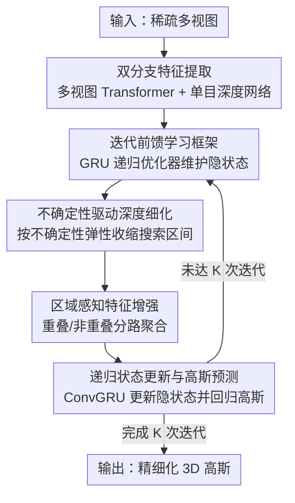

# iSplat: Iterative Learning for Fine-Grained Gaussian Splatting

**会议**: CVPR 2026  
**论文**: [CVF Open Access](https://openaccess.thecvf.com/content/CVPR2026/html/Wu_iSplat_Iterative_Learning_for_Fine-Grained_Gaussian_Splatting_CVPR_2026_paper.html)  
**代码**: https://github.com/haifengwu205/iSplat  
**领域**: 3D视觉  
**关键词**: 前馈高斯泼溅, 迭代细化, GRU 递归优化, 不确定性深度, 跨域泛化

## 一句话总结
iSplat 把前馈式 3D 高斯泼溅从"一次预测"改造成"GRU 递归的多次迭代细化"，靠不确定性驱动的深度细化和区域感知特征增强逐步自我纠错，用 42.6M 参数在 RealEstate10K 上超过 354M 的 DepthSplat，并在跨域 DTU 上把 PSNR 拉高 2.88 dB。

## 研究背景与动机
**领域现状**：前馈式 3DGS（pixelSplat、MVSplat、DepthSplat 等）从稀疏多视图一次前向就预测出所有高斯参数（位置、旋转、尺度、颜色、不透明度），不需要逐场景优化，能做到实时高保真渲染，是当前可泛化重建的主流范式。

**现有痛点**：这些方法几乎都遵循"先估一张深度图当几何骨架、再据此一步回归高斯"的单次级联管线。这个 one-shot 结构有个致命弱点——它对初始深度骨架形成了脆弱依赖：深度估计一旦出错，误差会不可逆地传播到颜色等外观属性，而且模型完全没有任何机制去回头修正。在弱约束的非重叠区、纹理缺失区，初始的粗糙几何就直接决定了最终的细节质量。

**核心矛盾**：优化式方法（per-scene 拟合）能靠漫长的迭代逐步纠错、拿到高保真，但代价是巨大的计算开销；前馈式方法快，却缺了"迭代纠错"这一环。效率和保真之间存在 trade-off，而本文要的是同时占两头的好处。

**本文目标**：在保持前馈推理效率的前提下，给前馈 3DGS 注入"渐进式自我纠错"的能力——把几何和外观放进一个可学习的循环里反复打磨。

**切入角度**：作者借鉴了光流、立体匹配、深度估计里成熟的"迭代细化"思路（共享权重的 recurrent 更新 + 上下文反馈），把它迁移到前馈高斯重建上。

**核心 idea**：用一个 GRU 递归优化器把"单次预测"重写成"典型 3 次的迭代前馈过程"，每一步都同时细化几何与外观，让改进后的几何为外观提供更可靠的骨架、增强后的特征又反过来引导更精确的几何修正，形成良性循环。

## 方法详解

### 整体框架
iSplat 的输入是稀疏多视图图像，输出是逐步精细化的 3D 高斯集合。它由两大块组成：一个双分支特征提取模块，和一个执行 $K$ 次迭代的循环学习模块。原始单次方法是 $D_i=f_D(F_i),\ G_i=f_G(F_i,D_i)$ 的严格级联；iSplat 则维护一个隐状态张量 $H_k$ 作为跨迭代的"记忆"，每一轮按 $H_k=f_{GRU}(H_{k-1},F,G_{k-1})$、$D_k=f_D(H_k)$、$G_k=f_G(H_k,F,D_k)$ 更新，让深度头和高斯头共享同一个隐状态，从而把几何与外观估计紧紧耦合成一个协同细化的回路。

每一个迭代阶段内部依次跑三件事：不确定性驱动的深度细化、区域感知特征增强（RAE）、以及 ConvGRU 的递归状态更新与高斯预测。三者环环相扣——深度先被细化，再用细化后的深度去判定哪些像素是多视图可靠区、哪些要靠单目先验，最后 GRU 汇总所有信息更新隐状态并吐出该阶段的高斯。

### 关键设计

**1. 迭代前馈学习框架：把 one-shot 预测改写成 GRU 递归的多次细化**

这是全文的根本变化，直接针对"单次预测无法纠错"的痛点。作者引入一个基于 ConvGRU 的递归优化器，用隐状态 $H_k$ 累积跨迭代的几何与光度上下文。整个过程从初始隐状态 $H_0$（由多视图与单目高层特征拼接后投影得到）出发，迭代 $K$ 次（默认 3 次）：每一步先 $H_k=f_{GRU}(H_{k-1},F,G_{k-1})$ 更新记忆，再分别驱动深度头 $f_D$ 和高斯头 $f_G$。隐状态在这里扮演双重角色——既给深度头产生细化深度，又给高斯头在最新几何下更新外观，由此建立几何↔外观的双向信息流。每一次 GRU 更新等价于一次轻量的优化迭代，于是前馈网络第一次获得了"逐步自我纠错"的能力，把优化式方法的适应性塞进了前馈推理的效率框架里。

**2. 不确定性驱动的深度细化（UDR）：用上一步的不确定性弹性调整深度搜索空间**

针对"对静态深度骨架的脆弱依赖"，作者让深度搜索区间随迭代动态收缩，而且收缩幅度由模型自己估的不确定性决定。第一轮把全局深度范围 $[d_{min},d_{max}]$ 离散成 $B$ 个 bin，深度取各 bin 中心按概率分布 $P_1$ 的期望 $D_1(u)=\sum_b P_{1,b}(u)B^c_{1,b}$。关键在后续轮次：先把几何不确定性量化为上一步概率分布的标准差 $U_{k-1}(u)=\sqrt{\sum_b P_{k-1,b}(u)\,(B^c_{k-1,b}(u)-D_{k-1}(u))^2}$，再围绕上一步落入的 bin 把区间按不确定性弹性外扩成 $[B^e_{k-1,b^\star}-\varphi U_{k-1},\,B^e_{k-1,b^\star+1}+\varphi U_{k-1}]$（$\varphi$ 控制弹性，取 0.5），然后在这个更窄/更宽的区间里重新离散、重估深度。这样模型能在"自信区"放心 zoom-in 精修、在"不确定区"保持较宽搜索以从大误差里恢复——这正是单次固定搜索范围做不到的鲁棒几何自纠错。

**3. 区域感知特征增强（RAE）：按几何可靠性分路融合多视图与单目特征**

多视图特征在重叠区给出强对应线索，但在纹理缺失或非重叠区会严重退化；单目特征反过来能在这些模糊区提供合理的语义/几何先验。RAE 用当前轮细化出的深度 $D_k$ 把每个参考视图像素投影到其它源视图，落在图像边界内即判为有效，从而算出二值重叠掩码 $M_k$。对重叠区（$M_k=1$）把源视图特征 warp 过来得 $\tilde F^h_m$，把对应误差 $F^h_m-\tilde F^h_m$ 连同原特征一起喂给子模块 $f_O$；对非重叠区（$M_k=0$）用另一子模块 $f_N$ 调动单目先验 $F^h_s$。两路输出拼成 $F^{RAE}_k=\mathrm{Concat}(F_O,F_N)$ 再送入高斯头。它的巧妙之处是按区域自适应分配能力——有多视图一致性的地方就强制执行，没有的地方退回学到的单视图先验，避免了"无脑融合"导致的纹理糊化。

**4. 递归状态更新与多阶段渲染监督：ConvGRU 汇总信息并对每一阶段都施加监督**

ConvGRU 在每轮接收上一隐状态 $H_{k-1}$ 和上下文-运动输入 $X_k$（拼接静态上下文特征、代价体、$F^{RAE}_k$ 和上一轮高斯特征 $G_{k-1}$），按标准门控 $Z_k,R_k,\tilde H_k$ 算出 $H_k=(1-Z_k)\odot H_{k-1}+Z_k\odot\tilde H_k$。更新后的 $H_k$ 一头预测下一轮的深度分布、一头联合 $F^{RAE}_k$ 和 $D_k$ 回归不透明度、协方差、颜色（位置由最准深度反投影得到）。因为每个阶段都产出一组高斯，训练时对全部 $K$ 阶段都加监督：$L_{total}=L^{render}_1+\sum_{k=2}^{K}\gamma^{K-k}L^{render}_k$，用指数衰减 $\gamma<1$（取 0.85）给越靠后、越精细的预测越大权重；单阶段渲染损失是 L1 加 LPIPS：$L^{render}_k=\|I^{render}_k-I^{gt}\|_1+\lambda\,\mathrm{LPIPS}(I^{render}_k,I^{gt})$。这种多阶段监督是稳定收敛、引导几何与外观协同细化的关键。

## 实验关键数据

### 主实验

域内重建质量（RealEstate10K / ACID，256×256）：

| 方法 | Re10K PSNR↑ | Re10K SSIM↑ | Re10K LPIPS↓ | ACID PSNR↑ | 参数量(M)↓ |
|------|------|------|------|------|------|
| MVSplat | 26.39 | 0.869 | 0.128 | 28.25 | 12.0 |
| MonoSplat | 26.68 | 0.875 | 0.123 | 28.63 | 30.3 |
| DepthSplat$^2_S$ | 27.12 | 0.884 | 0.119 | – | 41.0 |
| DepthSplat$^2_L$ | 27.47 | 0.889 | 0.114 | – | 354.0 |
| **iSplat (本文)** | **27.67** | **0.891** | **0.110** | **29.01** | 42.6 |

亮点是参数效率：iSplat 仅 42.6M（约 DepthSplat$^2_L$ 的 1/8），PSNR 反超 0.2 dB；在最简基线 DepthSplat$^1_S$（38M，26.84 dB）上只加 4.6M 参数就换来 +0.83 dB（3.09%）的增益。

跨域零样本泛化（仅在 RealEstate10K 训练后直接测试）：

| 方法 | Re10K→DTU PSNR↑ | DTU SSIM↑ | DTU LPIPS↓ | Re10K→ACID PSNR↑ |
|------|------|------|------|------|
| MonoSplat | 15.25 | 0.605 | 0.291 | 28.24 |
| DepthSplat | 15.38 | 0.415 | 0.442 | 28.37 |
| **iSplat (本文)** | **18.26** | **0.698** | **0.256** | **28.65** |

最显著的是远域 DTU（室内→物体中心扫描）上 PSNR 直接拉高 2.88 dB（18.26 vs 15.38），SSIM 也从 0.415 跳到 0.698，说明迭代学习学到了对分布漂移更稳健的几何/外观先验。

### 消融实验

| 配置 | PSNR↑ | SSIM↑ | LPIPS↓ | 说明 |
|------|------|------|------|------|
| iSplat（完整） | 27.67 | 0.891 | 0.110 | 完整模型，3 次迭代 |
| w/o UDR | 27.10 | 0.883 | 0.120 | 用固定搜索范围替代不确定性自适应，掉 0.57 dB |
| w/o RAE | 27.42 | 0.886 | 0.115 | 去掉区域感知融合，掉 0.25 dB |
| w/o IL | 26.95 | 0.880 | 0.119 | 退化为单次前馈，掉 0.72 dB（最多） |

迭代次数（训练→测试同步）的影响：1→1 为 26.95，2→2 为 27.60，3→3 为 27.67，4→4 为 27.65 已饱和，故默认取 3 次；运行时（RTX 3090，256×256）3 次迭代约 0.124s/2337MB，与 DepthSplat 的 0.098s 同量级但参数小近一个数量级。

### 关键发现
- **迭代学习（IL）本身贡献最大**：去掉迭代回路掉点最多（−0.72 dB），直接验证了"单次前馈不足以解决稀疏视图重建中的几何/光度歧义"这一核心论点。
- **训练与测试迭代次数要一致**：表 5 显示 $a\to a$ 时性能最优，错配（如 3→1）会打乱优化器学到的细化轨迹。⚠️ 表中 2→1 给出 27.53，略低于 2→2 的 27.60，整体支持"同步最优"。
- **UDR 比 RAE 更关键**：不确定性自适应搜索（−0.57 dB）比区域感知融合（−0.25 db）掉点更多，说明把几何先修准是后续外观增强的前提。

## 亮点与洞察
- **把"迭代细化"范式干净地嫁接到前馈 3DGS**：用一个共享权重的 GRU 把 one-shot 改成 recurrent，既不要 per-scene 优化、又拿到了类似优化方法的逐步纠错能力，思路朴素但效果扎实。
- **不确定性当作搜索区间的"调节阀"**：用概率分布标准差度量几何不确定性，再据此弹性外扩/收缩深度 bin，是个很可复用的 trick——任何带概率深度/视差头的方法都能借此做自适应细化。
- **重叠掩码把"多视图 vs 单目"的取舍显式化**：不是简单加权融合，而是用细化深度反投影算出可靠性掩码再分路处理，这种"先判区域、再选先验"的设计可迁移到任何多源特征融合任务。
- **参数效率的"啊哈"点**：42.6M 打过 354M，说明前馈 3DGS 的瓶颈不在容量而在"有没有纠错机制"。

## 局限与展望
- **迭代次数固定且训练/测试需一致**：默认 3 次、超过即饱和，且错配会掉点，缺乏推理时按场景难度自适应调迭代数的机制。
- **依赖预训练单目深度网络**：单目分支用了现成网络提特征，其质量与偏置会影响非重叠区的先验，论文未深入分析其失效边界。
- **几何不确定性的建模较简化**：仅用概率分布标准差度量，⚠️ 是否能区分"真歧义"与"模型欠拟合"导致的高熵尚不清楚；自己看，弹性系数 $\varphi$ 为单一全局超参，可能在不同深度尺度下并非最优。
- **实验分辨率统一为 256×256**：高分辨率下迭代细化的显存/时间增长与质量收益的权衡未充分展开。

## 相关工作与启发
- **vs DepthSplat / MonoSplat（单次前馈 3DGS）**：它们一步预测、误差不可逆传播；iSplat 用 GRU 递归把预测改成多步可纠错过程，用约 1/8 参数反超质量，核心区别是"有没有自我纠错回路"。
- **vs HiSplat（coarse-to-fine）/ ReSplat（迭代残差）**：这两者也引入细化，但依赖显式渲染误差、计算开销大；iSplat 用轻量 ConvGRU 以隐状态和不确定性引导细化，在质量/效率间取得更好平衡。
- **vs 光流/立体里的迭代细化（RAFT 系）**：iSplat 把"共享权重 recurrent 更新 + 上下文反馈"的范式从 2D 对应任务扩展到 3D 高斯重建，并额外引入不确定性驱动的搜索区间调整。

## 评分
- 新颖性: ⭐⭐⭐⭐ 把迭代细化范式系统地引入前馈 3DGS，UDR/RAE 设计具体且贴合痛点，但 recurrent 细化思路本身属于成熟范式迁移。
- 实验充分度: ⭐⭐⭐⭐⭐ 域内+跨域两类基准、详尽消融、迭代次数与运行时分析齐全，跨域增益尤其有说服力。
- 写作质量: ⭐⭐⭐⭐ 逻辑清晰、动机与方法对应紧密，公式记号稍密但可读。
- 价值: ⭐⭐⭐⭐ 42.6M 超 354M 的参数效率 + 强跨域泛化，对可部署的可泛化重建有实际意义。

<!-- RELATED:START -->

## 相关论文

- [\[CVPR 2026\] Fresco: Frequency-Spatial Consistent Optimization for Fine-Grained Head Avatar Modeling](fresco_frequency-spatial_consistent_optimization_for_fine-grained_head_avatar_mo.md)
- [\[CVPR 2026\] IDESplat: Iterative Depth Probability Estimation for Generalizable 3D Gaussian Splatting](idesplat_iterative_depth_probability_estimation_for_generalizable_3d_gaussian_sp.md)
- [\[CVPR 2026\] FISHuman: Fine-grained Single-image 3D Human Reconstruction via Multi-view 4D Remeshing](fishuman_fine-grained_single-image_3d_human_reconstruction_via_multi-view_4d_rem.md)
- [\[AAAI 2026\] GSAP-ERE: Fine-Grained Scholarly Entity and Relation Extraction Focused on Machine Learning](../../AAAI2026/3d_vision/gsap-ere_fine-grained_scholarly_entity_and_relation_extraction_focused_on_machin.md)
- [\[CVPR 2026\] Learning Differentiable Hierarchies in 3D Gaussian Splatting](learning_differentiable_hierarchies_in_3d_gaussian_splatting.md)

<!-- RELATED:END -->
