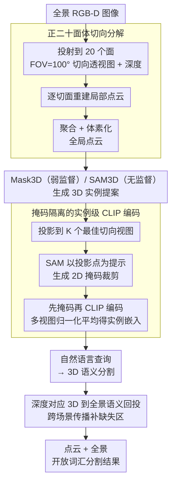

# JOPP-3D: Joint Open Vocabulary Semantic Segmentation on Point Clouds and Panoramas

**会议**: CVPR 2026  
**arXiv**: [2603.06168](https://arxiv.org/abs/2603.06168)  
**代码**: 无  
**领域**: 3D视觉  
**关键词**: 开放词汇 3D 分割, 点云-全景图联合分割, 正二十面体切向分解, SAM+CLIP 语义对齐, 3D-全景回投

## 一句话总结

提出 JOPP-3D——首个联合处理 3D 点云和全景图的开放词汇语义分割框架：通过正二十面体切向分解将全景图转为 20 张透视图以适配 SAM/CLIP，提取掩码隔离的实例级 CLIP 嵌入实现 3D 语义分割，再经深度对应回投到全景域，免训练即在 S3DIS 上以 80.9% mIoU 超越所有监督方法。

## 研究背景与动机

**领域现状**：3D 语义分割依赖大规模标注和固定类别集。CLIP 等视觉语言模型在 2D 开放词汇分割上表现出色，但直接用于全景图（球面畸变）和 3D 点云（缺乏预训练）效果差。

**现有痛点**：

1. 全景图的球面畸变使 CLIP/SAM 等针对透视图预训练的基础模型无法直接适用
2. Cubemap（6面x90度）有边界不连续伪影；DAN 适配器需要监督训练
3. 2D 视觉语言特征到 3D 的跨模态对齐难——直接逐点 CLIP 编码引入大量语义噪声
4. 全景图和点云的联合开放词汇语义分割尚未被探索

**核心矛盾**：需要免训练地将 CLIP/SAM 的能力同时扩展到全景图和 3D 点云，但两者各有独特的几何挑战。

**本文目标** 建立统一框架同时实现点云和全景图的开放词汇语义分割。

**切入角度**：将全景图投射到正二十面体的 20 个切面得到透视图（适配 CLIP/SAM），从透视图重建 3D 点云后在 3D 实例级进行语义对齐，最后回投到全景域。

**核心 idea**：切向分解 - 3D 实例提取 - 掩码 CLIP 语义对齐 - 深度对应全景回投。

## 方法详解

### 整体框架

三阶段 Pipeline（全部免训练）：(1) **切向分解**——将每张全景 RGB-D 图像投射到正二十面体 20 个面，生成 20 张切向透视图（640x480，FOV=100度）及对应深度图，聚合所有视角的 3D 点并体素化得到全局点云；(2) **3D 实例提取 + 语义对齐**——用 Mask3D（弱监督）或 SAM3D（无监督）生成 3D 实例提案，每个实例投影到 K 个最佳切向视图，用 SAM 生成 2D 掩码裁剪，CLIP 编码掩码裁剪的图像，多视图平均得实例语义嵌入；(3) **语言查询 + 3D到全景回投**——自然语言查询得到 3D 语义分割，通过深度对应回投到全景域。

### 关键设计

1. **正二十面体切向分解**

    - 将球面全景图投射到正二十面体的 20 个面，每面 FOV=100度（超越先前 Eder 等人的 73.1度和 Cubemap 的 90度）
    - 相邻面间有视场重叠，避免 Cubemap 的边界不连续伪影
    - 每个像素的射线方向通过面旋转矩阵计算，映射到等距矩形坐标后双线性插值采样 RGB、最近邻插值采样深度
    - 焦距由水平视场角决定，在几何稳定范围内最大化上下文覆盖
    - 从所有 20 个切面重建局部 3D 点云，聚合所有全景图后体素化得到全局重建

2. **掩码隔离的实例级 CLIP 编码**

    - 对每个 3D 实例，投影到所有切向视图并选择投影点最多的 K 个
    - 用 SAM 以投影点为提示生成 2D 实例掩码和裁剪
    - **先掩码再 CLIP 编码**——将掩码应用于裁剪后再送 CLIP，K 个视图的特征向量归一化平均得到实例语义嵌入
    - 掩码是消融证实的关键设计——不 masking 时大面积类别（地板/天花板）的语义严重污染其他实例，Open mIoU 从 74.6% 暴跌至 33.6%

3. **深度对应 3D到全景语义回投**

    - 将全景深度图每个像素反投影为 3D 点，通过最近邻在语义点云中查找标签
    - **跨场景深度对应传播**：相邻全景在门廊/走廊处有深度重叠时，从已有语义标签的邻居全景向当前缺失区域传播标签
    - 解决了直接最近邻在大深度不连续区域（门口/走廊）语义不完整的问题

### 损失函数 / 训练策略

JOPP-3D 是**完全免训练**的推理 Pipeline：冻结的 Mask3D/SAM3D 做 3D 实例提案，冻结的 SAM 做 2D 分割，冻结的 CLIP 做语义编码，自然语言查询做开放词汇分类。弱监督版使用 S3DIS Area 1,2,3,4,6 预训练的 Mask3D；无监督版用 SAM3D。推理耗时：4.8 min/全景图（单 RTX A6000），单次语言查询 1.7 秒。

## 实验关键数据

### 主实验

**3D 点云语义分割**

| 数据集 | 方法 | 监督 | mIoU(%) | mAcc(%) |
|--------|------|------|---------|---------|
| S3DIS | PointTransformerV3 | 全监督 | 73.4 | 78.9 |
| | Concerto | 全监督 | 77.4 | 85.0 |
| | OpenMask3D | 弱监督 | 36.7 | 43.6 |
| | JOPP-3D(u) | 无监督 | 59.4 | 70.1 |
| | **JOPP-3D** | **弱监督** | **80.9** | **87.0** |
| ToF-360 | SFSS-MMSI | 无监督 | 23.2 | 46.3 |
| | **JOPP-3D(u)** | **无监督** | **30.9** | **47.5** |

**全景图语义分割**

| 数据集 | 方法 | mIoU(%) | Open mIoU(%) |
|--------|------|---------|-------------|
| Stanford-2D-3D-s | PanoSAMic (全监督) | 61.7 | -- |
| | OPS (弱监督) | 41.1 | 42.6 |
| | SAM3 (无监督) | 54.2 | 62.8 |
| | **JOPP-3D** | **70.1** | **74.6** |
| ToF-360 | HoHoNet | 27.5 | -- |
| | **JOPP-3D(u)** | **30.7** | **47.4** |

### 消融实验

| 配置 | Open mIoU(%) | 影响 |
|------|-------------|------|
| Full JOPP-3D | **74.6** | -- |
| w/o SAM Mask（不掩码直接 CLIP） | 33.6 | -41.0 |
| w/o Tangential Decomp.（直接全景） | 41.4 | -33.2 |
| w/o Depth Correspondence | 67.0 | -7.6 |

### 关键发现

- 掩码 CLIP 编码贡献惊人：33.6 到 74.6%（+41.0%），不隔离实例的 CLIP 特征被大面积类严重污染
- 切向分解不可省：41.4 到 74.6%（+33.2%），CLIP/SAM 在球面畸变图上几乎失效
- 深度对应提升 7.6%，门口/走廊区域改善最显著
- Mask3D vs SAM3D：弱监督 74.6% vs 无监督 59.9%，高质量 3D 实例提案是性能瓶颈
- 开放词汇方法能检索 GT 中标为"clutter"的细粒度物体（时钟、海报等），展现实际价值

## 亮点与洞察

- 首个联合处理 3D 点云和全景图的开放词汇分割框架，免训练即超越所有监督方法
- 正二十面体切向分解设计优雅：100度 FOV 比 Cubemap 更好的上下文覆盖和更少边界伪影
- 掩码 CLIP 编码的 +41.0% 消融结果令人震撼——简单但效果巨大
- 3D 作为 2D 一致性"锚"的思路可推广到视频理解、多视角一致分割等任务

## 局限与展望

- 依赖 RGB-D 全景图输入，纯 RGB 全景场景无法使用
- Mask3D 弱监督版需预训练数据，跨域（如室外）泛化性待验证
- 推理速度偏慢（4.8 min/image），实时应用困难
- "clutter"等笼统标签在定量评估中惩罚了开放词汇方法的细粒度识别能力
- 仅在室内场景验证，大规模室外场景适用性未探索

## 相关工作与启发

- **vs OpenMask3D**：同为开放词汇 3D 分割，但 OpenMask3D 基于透视 RGB-D 序列做实例分割，本文基于全景+点云做场景级语义分割，mIoU 80.9 vs 36.7
- **vs OPS**：OPS 需训练 DAN 适配器处理全景畸变，本文免训练的切向分解更优（70.1 vs 41.1），且 OPS 不做 3D 分割
- **vs SAM3**：RGB-only 方法，全景 54.2% mIoU，本文通过引入深度信息和 3D 对齐达到 70.1%
- 启发：切向分解+基础模型是处理全景图的通用范式；掩码裁剪+CLIP 实例级语义对齐可推广到任何需要开放词汇实例级特征的任务

## 评分

- 新颖性: ⭐⭐⭐⭐ 首次提出点云+全景联合开放词汇分割，切向分解和深度对应设计新颖
- 实验充分度: ⭐⭐⭐⭐⭐ 两数据集、2D+3D 双任务评估、4 项消融、丰富定性分析
- 写作质量: ⭐⭐⭐⭐ 框架清晰，图表优质，方法描述系统化
- 价值: ⭐⭐⭐⭐⭐ 免训练超越监督方法，切向分解和掩码 CLIP 范式可广泛复用

<!-- RELATED:START -->

## 相关论文

- [\[CVPR 2026\] Ov3R: Open-Vocabulary Semantic 3D Reconstruction from RGB Videos](ov3r_open-vocabulary_semantic_3d_reconstruction_from_rgb_videos.md)
- [\[CVPR 2026\] EmbodiedSplat: Online Feed-Forward Semantic 3DGS for Open-Vocabulary 3D Scene Understanding](embodiedsplat_online_feed-forward_semantic_3dgs_for_open-vocabulary_3d_scene_und.md)
- [\[CVPR 2026\] PointGS: Semantic-Consistent Unsupervised 3D Point Cloud Segmentation with 3D Gaussian Splatting](pointgs_semantic-consistent_unsupervised_3d_point_cloud_segmentation_with_3d_gau.md)
- [\[CVPR 2026\] Image-to-Point Cloud Feature Back-Projection for Multimodal Training of 3D Semantic Segmentation](image-to-point_cloud_feature_back-projection_for_multimodal_training_of_3d_seman.md)
- [\[CVPR 2026\] OnlinePG: Online Open-Vocabulary Panoptic Mapping with 3D Gaussian Splatting](onlinepg_online_open-vocabulary_panoptic_mapping_with_3d_gaussian_splatting.md)

<!-- RELATED:END -->
