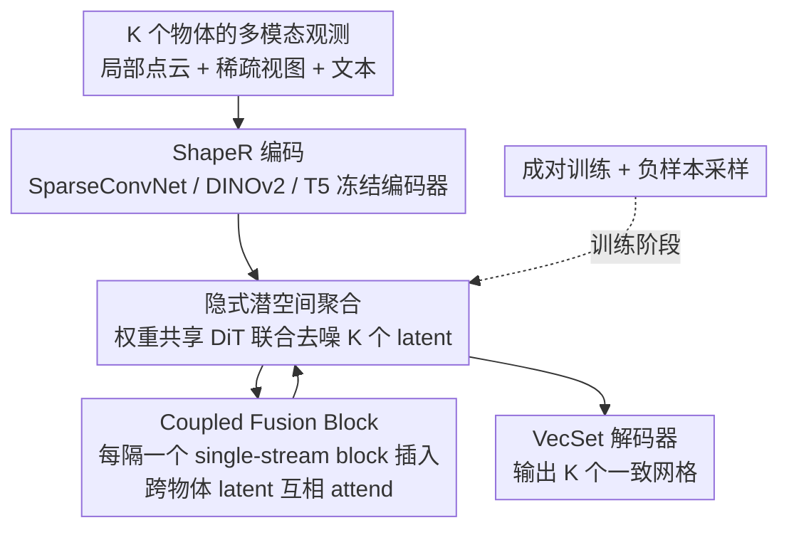

# JRM: Joint Reconstruction Model for Multiple Objects without Alignment

**会议**: CVPR 2026  
**论文**: [CVF Open Access](https://openaccess.thecvf.com/content/CVPR2026/html/Wu_JRM_Joint_Reconstruction_Model_for_Multiple_Objects_without_Alignment_CVPR_2026_paper.html)  
**代码**: 项目页 https://qiruiw.github.io/jrm  
**领域**: 3D视觉  
**关键词**: 物体级重建, 流匹配生成, 重复物体, 隐式聚合, 关节物体  

## 一句话总结
JRM 把"同一物体在场景中被重复观测"的重建问题重新表述为**个性化生成**——用一个 3D 流匹配生成模型在 latent 空间里隐式聚合多份未对齐的观测，无需显式匹配/刚性配准就能联合重建一组物体，对关联错误和关节形变都更鲁棒，重建质量超过独立重建和基于对齐的基线。

## 研究背景与动机
**领域现状**：物体级（object-centric）3D 重建把场景表示成一组各自完整的物体，天然支持物体级编辑与交互，且可以让每个物体独立重建。近年的 3D 生成模型（如 ShapeR）已能从清晰的单/少视图重建出高保真单物体。

**现有痛点**：真实场景里物体很少孤立出现，独立重建会丢掉大量上下文线索。作者聚焦两类被浪费的强信号——**空间重复**（同款椅子围着餐桌、各自被部分遮挡）和**时间重复**（多次稀疏扫描里同一物体被反复看到，哪怕它移动或形变了）。把这些重复观测整合起来，本可以互相补全各自被遮挡的部分。

**核心矛盾**：现有整合方法（如 LivingScenes / MORE²、Splat-and-Replace）走的是"显式匹配 → 刚性对齐 → 配准 → 重建"的链式流水线。每一步都可能出错且误差累积；更要命的是刚性对齐假设无法处理**子物体级变化**（如两次扫描间抽屉被拉开），关节物体直接失效。

**本文目标**：在不做显式对齐的前提下，让一组相关物体的观测互相补全，且要能容忍匹配错误、扩展到非刚性形变。

**切入角度**：作者借鉴个性化图像生成（如 JeDi）——多张图共享同一个"主体"、需要在每张图里被一致地生成。类比过来，目标物体就是被多份观测共享的"主体"，应该在每份观测下被一致重建，同时各自尊重自己的姿态/状态。

**核心 idea**：用一个流匹配 3D 生成模型，在它的**高维 latent 空间里隐式聚合未对齐观测**，让"如何跨实例聚合"以数据驱动的方式被学出来，而不是靠手工的硬约束。

## 方法详解

### 整体框架
JRM 以单物体生成模型 ShapeR 为骨架。ShapeR 先训练一个基于 VecSet 的 VAE，把 3D 网格 $S$ 编码成 $n$ 个 $L$ 维 latent token $z\in\mathbb{R}^{n\times L}$，解码器 $D$ 通过预测查询点的有符号距离 $s=D(z,x)$ 还原网格；再训练一个去噪 DiT，用 rectified flow-matching 把标准正态采样 $z_1\sim\mathcal N(0,I)$ 运输到训练形状流形 $z_0$。去噪过程以多模态观测条件 $C$ 为输入：分割后的局部点云、稀疏视图、VLM 生成的文本描述，分别经 SparseConvNet、冻结 DINOv2、预训练 T5 编码。

JRM 在这个骨架上做两件事把"单物体"扩成"联合多物体"：① 用一个**权重共享的 DiT** 同时对一组 $K$ 个物体的 latent $Z=\{z_k\}_1^K$ 去噪；② 在 DiT 内部插入 **Coupled Fusion Block**，让不同物体的形状 latent 在 latent 空间里互相 attend，实现隐式聚合。训练上采用**成对训练 + 负样本采样**，使得只用"物体对"训练就能在推理时泛化到任意数量的物体。整个流程把"对齐"这一步彻底从观测空间挪进了 latent 空间。

### 关键设计

**1. 隐式潜空间聚合：把"对齐"从观测空间挪进生成 latent 空间**

针对的痛点是显式流水线（匹配→刚性对齐→配准）误差累积、且无法处理关节形变。JRM 不再在观测空间里把多份观测拼齐，而是让一个**权重共享的 DiT** 同时对一组物体的 latent token 去噪——每个物体 $z_k$ 连同它自己的观测条件 $C_k$ 走同一套网络。聚合发生在哪？发生在高维去噪 latent 空间里，"该如何融合跨实例信息"完全由数据学出来，没有任何显式相似性硬约束。这样做的好处在实验里很直接：当源物体与目标只是"相似"甚至"不匹配"时，显式对齐的 FM 基线会被错误关联污染、重建急剧变差，而 JRM 因为是软性的隐式聚合，能自适应地决定借多少信息，鲁棒性显著更好。

**2. Coupled Fusion Block：让不同物体的形状 latent 互相 attend**

这是隐式聚合的具体载体。原始 DiT 由一串 single-stream block 组成，JRM 把其中**每隔一个**single-stream block 替换成 coupled fusion block。在该 block 里，把一组所有物体的 latent token 拼接起来 $z_O=\oplus\{z_k\}_1^K$，用一个 single-stream block 处理，使组内所有物体的 latent 互相 attend，再沿拼接维切回各自的 token。关键的设计取舍是：**普通 single-stream block 同时处理 latent 和该物体自己的观测 token，而 coupled attention 只作用在组内各物体的形状 latent 之间**。动机很具体——生成的"主体"（形状 latent）在组内应当一致，而每个具体实例又必须尊重自己的观测，因此让 latent 互相耦合、却不让观测条件互相串味。

**3. 成对训练与负样本采样：只用物体对就能泛化到任意数量**

严格物体级方法只能用"孤立观测的单物体"大数据集训练，而整张场景/多扫描数据集很稀缺。JRM 绕开这个瓶颈：不去整场景里抠物体组，而是**用一对对独立观测的物体**来训练，靠基于 attention 的耦合策略，使得推理时可以扩展到任意数量物体。训练对里物体可能相似也可能不同——用 DuoDuoCLIP 从 12 个随机渲染视角抽形状 embedding 算余弦相似度，$>0.9$ 视为正对（相似），否则为负对。训练时以 $0.1$ 的概率采样负对，逼模型学会"自适应判断该不该从另一支借信息"。每个物体用标准流匹配目标，预测速度场 $v_t^k=\mathrm dz_t^k/\mathrm dt$，采用条件最优传输路径 $z_t^k=(1-t)z_0^k+t\varepsilon^k$、$v_t^k=z_0^k-\varepsilon^k$，损失为

$$\mathcal L(\theta)=\mathbb E_{z^k,C^k,\varepsilon^k}\Big[\textstyle\sum_{k=1}^{2}\|v_t^k-v_\theta(z_t^k,t,C^k)\|^2\Big].$$

负样本比例是个敏感旋钮：消融显示比例为 0（只训相似对）会让模型对匹配错误极度敏感，比例为 1（只训负对）又会让模型彻底无视支持物体，$0.1$ 左右取得最佳平衡（详见实验）。

### 损失函数 / 训练策略
基础 FM 骨架先在 ObjaverseXL、Amazon Berkeley Objects、Wayfair 加自制网格混合的 40 万高质量 3D 物体上做物体级预训练；其中 8 万子集用于上述成对训练。损失即上文流匹配 MSE，成对样本共享一套去噪 DiT 权重。

## 实验关键数据

### 指标说明
- **CD（Chamfer Distance，cm）**：重建网格与真值的双向最近点距离，越低越好。
- **NC（Normal Consistency）**：法向一致性，越高越好。
- **F1 / F-Score**：在距离阈值下的重建完整度，越高越好。
- 表中灰色数字表示给 FM 基线喂入 **oracle（真值）对齐** 后的"理想上限"，用来对照显式对齐的敏感度。

### 主实验：时间重复（带真值匹配）
| 方法 | 模态 | Target-only CD↓ | 1 次重扫 CD↓ | 3 次重扫 CD↓ |
|------|------|------|------|------|
| MORE² | 点云 | 10.43 | 9.89 | 10.04 |
| FM（点云）| 点云 | 3.07 | 3.71 | 4.43 |
| **JRM**（点云）| 点云 | 3.46 | **2.95** | **3.07** |
| FM（全模态）| 点/图/文 | 3.12 | 3.50 | 3.62 |
| **JRM**（全模态）| 点/图/文 | 2.84 | **2.55** | **2.49** |

关键现象：**FM 随重扫次数增加反而变差**（CD 从 3.07→4.43），因为它对实例间对齐误差敏感；**JRM 随上下文增多稳步变好**（3.46→3.07，全模态 2.84→2.49）。同样架构下生成式 FM 已优于 MORE²，说明改进既来自架构也来自聚合策略。

### 空间重复（不同源物体类型）
| 方法 | Identical CD↓ | Similar CD↓ | Negative CD↓ |
|------|------|------|------|
| FM | 2.77 | 4.78 | 8.83 |
| **JRM** | **2.49** | **2.72** | **3.04** |

源物体从"完全相同"变到"相似"再到"完全不匹配"时，FM 的 CD 从 2.77 暴涨到 8.83（被干扰物污染），而 JRM 仅小幅波动到 3.04——隐式聚合对错误关联鲁棒得多。

### 关节物体重建
| 方法 | State0 CD↓ | State1 CD↓ | State2 CD↓ |
|------|------|------|------|
| FM-align（刚性对齐）| 5.83 | 5.37 | 5.49 |
| FM-ind.（独立）| 4.92 | 5.44 | 4.92 |
| **JRM** | **4.69** | **3.66** | **3.66** |

刚性对齐的 FM-align 表现最差，印证"物体级刚性对齐无法迁移到形变物体"；JRM 联合重建 3 个不同状态副本，CD 与 F1 明显领先，且重建出"一致但不强行相同"的物体。

### 真实场景
| 方法 | Replica CD↓ / F1↑ | ScanNet++ CD↓ / F1↑ |
|------|------|------|
| DPRecon | 4.65 / 71.95 | 5.53 / 65.98 |
| FM | 3.74 / 79.21 | 4.20 / 72.96 |
| **JRM** | **3.21 / 81.78** | **2.69 / 85.53** |

JRM 只在合成物体对上训练却能泛化到真实捕获；ScanNet++ 上领先幅度更大，作者推测因其测试场景重复物体更多。

### 消融：负样本采样比例
| 负样本比例 | Identical F1↑ | Similar F1↑ | Negative F1↑ |
|------|------|------|------|
| 0.0 | 88.30 | 83.52 | 72.42 |
| **0.1** | **91.15** | **88.34** | **88.69** |
| 0.5 | 86.97 | 86.39 | 86.52 |
| 1.0 | 88.07 | 87.92 | 88.63 |

比例 0 时对负样本极不鲁棒（Negative F1 仅 72.42）；0.1 在三种配对上全面最优，是聚合能力与抗误匹配的最佳折中。

### 关键发现
- **隐式 vs 显式**是全文主线：所有"FM 崩、JRM 稳"的对比都指向同一结论——把对齐从观测空间挪进 latent 空间，换来对匹配/对齐误差的鲁棒性。
- **场景越难、增益越大**：源物体越不匹配（空间重复）、重扫次数越多（时间重复）、状态变化越大（关节），JRM 相对 FM 的优势越明显。
- **训练可扩展性**：只用物体对训练即可泛化到任意数量物体和真实场景，规避了整场景数据稀缺问题。

## 亮点与洞察
- **问题重述很漂亮**：把"重复物体重建"重新框成"个性化生成里的共享主体"，一下子把显式匹配/配准这条脆弱链路整条替换掉——这是从生成式个性化（JeDi）迁移过来的视角，迁移思路可复用到任何"多份未对齐观测需融合"的任务。
- **耦合只发生在 latent、不发生在观测**：coupled attention 只让形状 latent 互相 attend、隔离各自观测条件，既共享"主体一致性"又保留"实例独立性"，是个干净的解耦设计。
- **"只训对、推任意数量"**：靠 attention 耦合 + 负样本采样，用稀缺性最低的单物体资产撑起多物体训练，工程上很务实。

## 局限与展望
- 作者明确承认：重建质量**继承自上游输入**（相机位姿、深度/点云、实例分割都假设由上游管线提供），上游错则下游错。
- 只在"重复观测"这一具体情境验证；作者指出 JRM 其实是更通用的框架，可进一步利用周边场景的其他线索（如支撑、相交等物理合理性），但本文未展开。
- 训练只用"物体对"，推理虽能扩到多物体，但更大物体组需拆分（真实场景里最多 9 个一组联合重建），拆分策略对结果的影响未深入分析。
- 负样本比例等超参对结果敏感，需要按数据调。

## 相关工作与启发
- **vs LivingScenes / MORE²**：它们用多阶段显式流水线（关联→点云配准→重建）跨扫描整合观测，对每一步误差敏感、且刚性对齐无法处理子物体形变；JRM 用 latent 隐式聚合，免对齐、抗误匹配、天然支持关节。
- **vs Splat-and-Replace**：它把重复物体用估计的刚性变换realign 到共享坐标系来提升 3DGS 保真度，仍是观测空间显式对齐；JRM 绕过观测空间对齐。
- **vs MIDI-3D / SceneGen（多实例扩散）**：它们用多实例 attention 改善空间排布与一致性，但需完整场景训练、可扩展性受场景数据稀缺限制，且没清晰展示多物体生成如何改善几何建模；JRM 训练随单物体资产数扩展、规模大得多，并用合成基准系统验证联合生成对几何的增益。
- **vs DPRecon**：它用神经隐式场 + SDS loss 做逐场景优化，几何噪声大、耗时数小时；JRM 前向生成、更锐利且几何更准。

## 评分
- 新颖性: ⭐⭐⭐⭐⭐ 把重复物体重建重述为个性化生成、用 latent 隐式聚合替换整条显式对齐流水线，视角新且自洽
- 实验充分度: ⭐⭐⭐⭐ 合成（时间/空间/关节）+ 真实双场景 + 负样本比例消融较完整，但主要对比集中在 FM/MORE²/DPRecon，外部 SOTA 覆盖偏少
- 写作质量: ⭐⭐⭐⭐ 动机与方法清晰、图示到位；部分实现细节推到补充材料
- 价值: ⭐⭐⭐⭐ 为"组合式/重复感知重建"提供了通用且抗误差的框架，对具身交互、场景重建有实际意义

<!-- RELATED:START -->

## 相关论文

- [\[CVPR 2026\] 2D-LFM: Lifting Foundation Model without 3D Supervision](2d-lfm_lifting_foundation_model_without_3d_supervision.md)
- [\[CVPR 2026\] GeoFree-CoSeg: Unsupervised Point Cloud-Image Cross-Modal Co-Segmentation Without Geometric Alignment](geofree-coseg_unsupervised_point_cloud-image_cross-modal_co-segmentation_without.md)
- [\[CVPR 2026\] DMAligner: Enhancing Image Alignment via Diffusion Model Based View Synthesis](dmaligner_enhancing_image_alignment_via_diffusion_model_based_view_synthesis.md)
- [\[ECCV 2024\] 3D Reconstruction of Objects in Hands without Real World 3D Supervision](../../ECCV2024/3d_vision/3d_reconstruction_of_objects_in_hands_without_real_world_3d.md)
- [\[CVPR 2026\] Selfi: Self-improving Reconstruction Engine via 3D Geometric Feature Alignment](selfi_self-improving_reconstruction_engine_via_3d_geometric_feature_alignment.md)

<!-- RELATED:END -->
