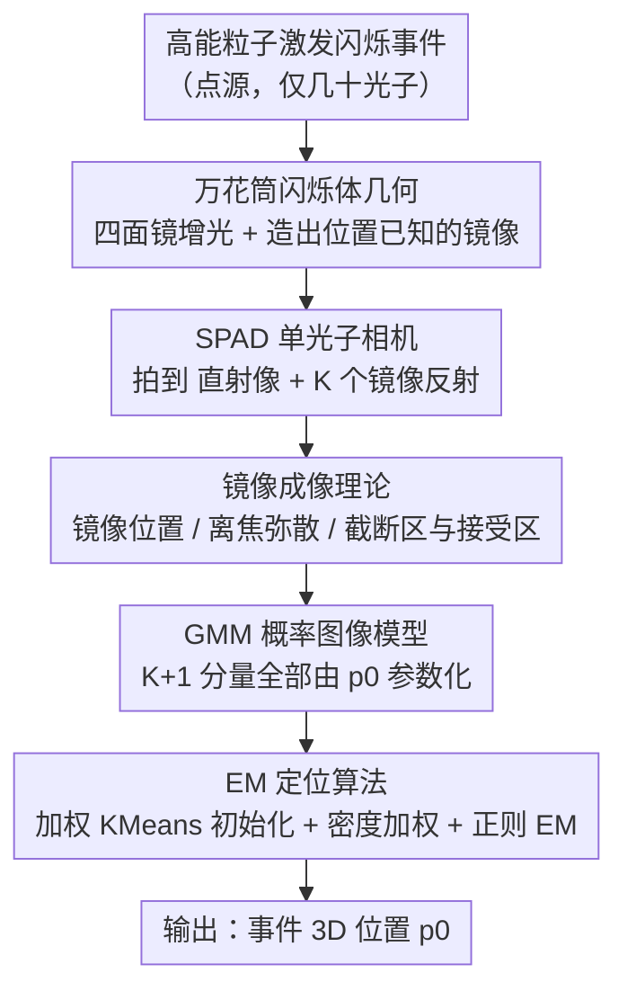

# Kaleidoscopic Scintillation Event Imaging

**会议**: CVPR 2026  
**论文**: [CVF Open Access](https://openaccess.thecvf.com/content/CVPR2026/html/Bocchieri_Kaleidoscopic_Scintillation_Event_Imaging_CVPR_2026_paper.html)  
**代码**: [项目页](https://bocchs.github.io/kaleidoscopic_scintillator)  
**领域**: 3D视觉 / 计算成像  
**关键词**: 闪烁体, 单光子相机, 万花筒成像, 3D 定位, 高斯混合模型

## 一句话总结
把辐射探测重新表述为一个计算机视觉问题：用一个"万花筒"形（四面镜面的金字塔）闪烁体，让单次闪烁事件在单光子相机里同时成出"直射像 + 多个镜像反射像"，再用一个所有分量都由事件 3D 坐标 $p_0$ 参数化的高斯混合模型 + EM 算法反解出事件的三维位置，在极端缺光（每个事件几十个光子）条件下把 3D 定位误差从约 0.8 mm 压到约 0.14 mm。

## 研究背景与动机
**领域现状**：高能粒子（如 γ 射线）探测依赖闪烁体——一种被电离辐射激发后发出可见光的透明晶体。要测量单个粒子激发的"闪烁事件"的位置/时间/能量，主流要么用单像素快速探测器（有速度无空间分辨），要么用普通相机（有空间分辨但只能对大量事件求平均，无法分辨单次事件）。新出现的单光子雪崩二极管（SPAD）相机同时具备速度和空间分辨，使得"给单次闪烁事件拍一张图、再用机器视觉去分析"成为可能。

**现有痛点**：单次事件极其暗——每个事件只发出有限个光子，且 SPAD 还有暗计数噪声。已有的单相机 3D 定位方案靠"离焦深度（depth from defocus）+ 透视投影"来估深度，但这类设计光收集率低、对暗计数敏感，深度信息编码薄弱。而探测又偏好又大又厚的闪烁体（事件发生概率高），可体积一大、单事件 3D 定位就更难。

**核心矛盾**：缺光环境下，增加曝光时间并不能增加"单个事件"的光子数，反而拉低信噪比，所以唯一出路是在几何上最大化光通量——但常规做法增加光收集往往会破坏事件的空间信息（把多视角混在一起）。如何既多收光、又保住事件的空间/深度线索，是核心张力。

**本文目标**：设计一种几何，使单光子相机在收集到更多光子的同时仍保留事件空间信息，并给出一套在极少光子下估计事件 3D 位置的概率模型与算法。

**切入角度**：作者注意到"万花筒/光阱"几何（金字塔状排布的平面镜）在传统成像里被用来从单张图获取扩展物体的多视角，但从没被用在"光子匮乏下重建一个点源"。镜面会在已知位置生成事件的镜像反射——这相当于给同一事件免费提供了多个视角，并把深度信息编码进镜像间的几何关系里。

**核心 idea**：把辐射探测问题转写成计算机视觉问题——用万花筒闪烁体把单事件变成"直射 + 多镜像"的多视角图像，把所有像（事件与镜像）建成一个由事件 3D 坐标统一约束的高斯混合模型，用 EM 求最大似然反解 3D 位置。

## 方法详解

### 整体框架
系统输入是 SPAD 相机拍到的一张极稀疏单光子图（一个真实闪烁事件 + 它的若干镜像反射，外加少量暗计数），输出是事件在闪烁体内的三维坐标 $p_0=(x_0,y_0,z_{w0})$。整条链路分四步：① **万花筒闪烁体几何**用四面镜把事件的光多次反射进相机，既增光又造出位置已知的镜像；② **镜像成像理论**给出每个镜像反射在传感器上的位置、离焦弥散圈、以及被相邻镜面边缘"切掉"形成的截断区/接受区；③ **GMM 概率图像模型**把"事件 + K 个镜像"建成一个 $K{+}1$ 分量高斯混合，且每个分量的均值/方差都被同一个 $p_0$ 约束；④ **EM 定位算法**先用加权 KMeans 初始化（判断有几个镜像、分别是哪个方向的镜），再用带密度加权与正则的 EM 迭代反解 $p_0$。

### 关键设计

**1. 万花筒闪烁体几何：用镜面把单事件变成多视角、同时增光保形**

针对"缺光环境下既要多收光、又要保住空间信息"的核心矛盾。作者把闪烁体做成一个**正四棱锥（金字塔台/frustum）**，除底面外的四个侧面都是镜面（涂增强镜面反射层）。一个闪烁事件被近似为各向同性发光的点源，它的光除了直射进相机，还会被四面镜反射后进相机——于是相机里出现一个"直射像"加若干"镜像反射像"。镜像的几何严格已知：对真实位置 $p_0$，第 $k$ 面镜产生的镜像位置为 $p_k=T_k p_0$，其中镜面变换 $T_k=I_{3\times3}-2 n_k n_k^{\top}$（$n_k$ 为镜面法向）。这些镜像反射等价于给同一事件提供了**多个视角**，深度信息被编码进事件与镜像之间的相对几何中，从而对暗计数和低光子数更鲁棒。相比靠单一离焦深度的非万花筒设计，多视角让深度可观测性大幅提升，这是后面定位精度提升的物理根源。

**2. 镜像成像理论与截断区：把"哪儿能收到光、哪儿收不到"算清楚**

针对"镜面有限大、镜像会被切掉一部分，若不建模就会把光子错配"的问题。由于镜面尺寸有限，当 $p_k$ 从相机看处在另一面镜后方时，镜像像会沿对应镜面边缘被截断：那些本该从相邻镜面共享边附近反射来的光子到不了传感器某些区域。作者把传感器上"该镜像光子到不了"的区域称为**截断区（truncation zone）**，其补集为**接受区（acceptance zone）**，两者分界线为**截断线**。镜面 $k$ 在这里实际扮演了点源 $p_k$ 的**光阑（aperture）**角色。作者进一步把"反射阶数（order）"定义为成像前经历的反射次数，多次反射（如 $p_l=T_l p_k$）的光会被途经任一镜面边缘进一步截断，逐阶递推。论文用光线追踪 + 薄透镜仿真验证：理论推导的接受区与仿真图里的光子落点高度吻合（实验中刻意把顶角设为 120° 以抑制二阶反射，降低复杂度）。这套理论是 GMM 里"某个镜像分量是否存在、其光子该落在哪"的依据。

**3. GMM 概率图像模型：把所有像统一约束到同一个 $p_0$**

针对"如何在仅几十个光子、还混着暗计数时把多视角信息融成一个可优化目标"。作者把相机点扩散函数取为各向同性二维高斯 $N(t;\mu,\sigma^2)$，协方差 $\Sigma=\sigma^2 I$；事件或镜像在传感器上的像就是绕均值 $\mu_k$、标准差 $\sigma_k$ 的高斯，其中 $\mu_k=\big[\tfrac{S_2}{z^{(a)}_{ck}}x_k,\ \tfrac{S_2}{z^{(a)}_{ck}}y_k\big]$ 来自透视投影、$\sigma_k\propto$ 弥散圈直径（由式 (1) 的混淆圆模型给出，含光圈 $A$、物距 $S_1$、像距 $S_2$ 与表观深度 $z^{(a)}_{ck}$）。整张图被建成 $K{+}1$ 分量的**高斯混合模型**，每个光子是一次采样。关键在于：每个镜像位置 $p_k=T_k p_0$ 都能写成 $p_0$ 的线性组合，于是**所有分量的 $\mu_k,\sigma_k$ 都被同一个 $p_0$ 约束**——这就把多视角变成了一个对 $p_0$ 的全局最大似然问题：

$$\arg\max_{x_0,y_0,z_{w0},\pi}\ Q-\lambda\sum_{k=0}^{K}\lVert \mu_k-\mu_k'\rVert_2^2$$

其中 $Q$ 是加权完全数据对数似然的期望，$r_{ik}$ 为光子 $i$ 属于分量 $k$ 的后验责任，$\mu_k'$ 是初始化锚点，$\lambda$ 是正则系数。这一步把"复杂的多视角几何"压回成一个标准 GMM 似然，是全文把物理问题转成可解优化的枢纽。

**4. EM 定位算法：加权初始化 + 密度加权 + 正则，硬刚稀疏与暗计数**

针对"GMM 非凸、缺光稀疏、暗计数干扰，朴素 EM 会塌成一个大方差分量"的问题。作者设计三件套：(a) **密度加权** $w_i=\sum_{j\in S^q_i}\exp(-\lVert t_i-t_j\rVert_2^2/\nu)$（$S^q_i$ 为光子 $i$ 的 $q$ 近邻），让稀疏分布的暗计数权重很低、稠密的真实光子簇权重高，抑制噪声影响；(b) **初始化过程**：用带光子权重的加权 KMeans 在 $C\in\{3,4,5\}$（事件 + 镜像数）个簇上取质心，再按质心相对方位判定它们分别是事件还是 $\pm x/\pm y$ 镜像（靠子集沿 x/y 的标准差判断水平/竖直对齐），并沿深度均匀撒一组候选事件位置，取使目标式最大者作为存在的镜像集合与 $p_0$ 初值；(c) **正则项** $\lambda\sum_k\lVert\mu_k-\mu_k'\rVert_2^2$ 把各分量均值拉向其初始锚点，避免当镜像光子簇彼此靠近时，算法把事件和多个镜像并成一个大 $\sigma$ 分量、而别的分量飘到没有光子的地方。E 步按式更新责任 $r_{ik}$（远离所有 $\mu_k$ 导致下溢的光子直接置 $r_{i:}=0$ 丢弃），M 步固定 $\pi$ 用梯度上升更新 $p_0$、再更新混合权重 $\pi_k=\tfrac1N\sum_i r_{ik}$；只有判定存在的镜像分量才参与计算。

### 损失函数 / 训练策略
本文是计算成像 + 概率推断，无网络训练。优化目标即上面 GMM 的（带正则的）最大似然，用 EM 求解。实验取 $\lambda=10$；把所有 $\sigma_k$ 下限裁剪到 10 像素（对应 $z_w=0.82$ mm）以应对非理想点源与对焦误差并防奇异，被裁剪时其梯度置 0。

## 实验关键数据

### 仿真主结果（3D 定位精度，单位 mm，越小越好）
在与实验一致的几何/相机参数下，于 463 个有效事件位置上对比三种算法，分别在每个事件亮度 $N_0\in\{10,20,30\}$（每分量泊松光子均值）下评测。指标含 3D 误差（欧氏距离）与三个轴向的空间分辨（定义为 $2.355\sigma_e$，即半高全宽 FWHM）。

| 亮度 $N_0$ | 算法 | 3D 误差 | x 分辨 | y 分辨 | z 分辨 |
|---|---|---|---|---|---|
| 30 | 万花筒（本文） | **0.14** | 0.16 | 0.14 | 0.14 |
| 30 | 非万花筒（本文） | 0.83 | 1.36 | 1.41 | 1.32 |
| 30 | 去噪法 [8] | 0.64 | 1.04 | 1.02 | 1.04 |
| 20 | 万花筒（本文） | **0.16** | 0.15 | 0.17 | 0.16 |
| 20 | 非万花筒（本文） | 0.79 | 1.17 | 1.24 | 1.21 |
| 20 | 去噪法 [8] | 0.68 | 1.05 | 1.03 | 1.06 ⚠️ |
| 10 | 万花筒（本文） | **0.29** | 0.27 | 0.31 | 0.27 |
| 10 | 非万花筒（本文） | 0.95 | 1.36 | 1.33 | 1.28 |
| 10 | 去噪法 [8] | 0.80 | 1.20 | 1.13 | 1.14 |

> ⚠️ $N_0{=}20$ 的"去噪法 [8]"一行在缓存中 OCR 有错位（出现多余数字），3D 误差/各轴分辨以原文 Table 1 为准。

**关键发现**：万花筒设计在所有亮度下 3D 误差都比非万花筒和先前去噪法 [8] 低**约一个量级**（如 $N_0{=}30$：0.14 vs 0.83 vs 0.64 mm），且优势在最暗的 $N_0{=}10$ 时仍保持（0.29 vs 0.95 vs 0.80 mm）——印证镜像多视角对缺光环境的鲁棒增益。各轴分辨同样从 ~1.0–1.4 mm 改善到 ~0.14–0.31 mm。

### 实验交叉验证（真实硬件，无真值）
真实闪烁事件位置不可控、无真值，作者用"移除镜像后位置估计的一致性"间接验证。对含事件 + 四个镜像的测试图，按已得 $r_{ik}$ 把光子归到各镜像，移除 1 个（4 种组合）或 2 个（6 种组合）镜像，得 11 张图 → 11 次位置估计；以各图估计与 11 次均值之间的距离衡量一致性（短距离=好）。

| 量 | 数值 | 说明 |
|---|---|---|
| 测试图数 | 1,606 张 | 含四镜像且 ≥60 计数 |
| 距离样本 | 17,666 个 | 跨所有图 |
| 距离 中位 / 均值 / 标准差 | 0.10 / 0.17 / 0.22 mm | 一致性好，亦反映实验精度 |
| 移除 1 镜像被去光子占比（中位/均值/标准差） | 0.19 / 0.18 / 0.07 | 期望 ≈ 1/5（6,424 张）|
| 移除 2 镜像被去光子占比（中位/均值/标准差） | 0.38 / 0.37 / 0.08 | 期望 ≈ 2/5（9,636 张）|

被去光子比例几乎正中 1/5、2/5，说明镜像确实被正确识别并剥离（前提：事件与各镜像平均亮度相近）。

### 硬件与数据
SPAD512（Pi Imaging，512×512、16 µm 像元，加微透镜提填充因子）；50 mm f/1.2 Nikkor 镜头；GAGG(Ce)-HL 闪烁体（150 ns 衰减、530 nm 发射峰、折射率 $n=1.91$，正四棱锥：底 20 mm、高 5.77 mm、顶角 120°）；1 µCi Co-60 γ 源（1.17、1.33 MeV）。1-bit 图、1.5 µs 积分；先拍 130,000 张无源图标定并清零暗计数最高的 5% 像元（清零后每图中位暗计数约 4）。共采 13,000,000 张含源图，丢弃 <60 计数后剩 4,379 张。

## 亮点与洞察
- **把辐射探测重述成计算机视觉问题**：核心"啊哈"是用万花筒几何把"单点源 + 缺光"变成"多视角 + 已知几何约束"，再用 GMM/EM 这套视觉里的成熟工具反解 3D——物理设计与算法设计互相成就。
- **几何即正则**：镜像位置由 $T_k=I-2n_k n_k^{\top}$ 严格决定，所有 GMM 分量被同一个 $p_0$ 约束，等于把强先验直接焊进似然，这是缺光下还能精确定位的关键，可迁移到任何"多镜面/多视角 + 点源"的稀疏重建场景。
- **密度加权 + 锚点正则**这套抗稀疏/抗噪的小技巧，对一切"光子级稀疏 + 噪点干扰"的 EM 拟合问题（如单光子 LiDAR、荧光定位）都有借鉴价值。

## 局限与展望
- **仅一阶反射、需 ≥2 个镜像**：算法假设正四棱锥几何、最多一阶反射，且图中至少存在两个镜像反射；靠近相机视场边缘、镜像不足两个的事件直接被丢弃（仿真里 463/约 1000 个网格点有效），适用范围受限。
- **真值缺失**：真实事件无法在受控位置产生，硬件端只能用"移除镜像的一致性"间接验证，定量精度主要来自实验标定后的仿真，存在仿真-现实差距。
- **顶角折中**：120° 大顶角虽抑制二阶反射、简化模型，但也限制了镜像数量与几何编码的丰富度；更小顶角能给更多视角却带来高阶反射建模负担。
- **暗计数偏高未完全解释**：实测图暗计数高于无源时中位 4 的水平，作者列了串扰/荧光/不完美反射等多种可能但未定论。

## 相关工作与启发
- **vs 离焦深度去噪法 [8]**：[8] 在无镜像的单视角图上靠 depth-from-defocus 估深度并分类去暗计数，深度可观测性弱、对暗计数敏感；本文用万花筒造多视角把 3D 误差降一个量级，且把去噪融进密度加权而非单独分类。
- **vs 立体视觉双目闪烁体 [11]**：[11] 用两个物镜 + 系统内镜面把立方闪烁体的两视角投到混合光子探测器；本文用单台商用 CMOS 单光子相机即提供更多视角、更高效。
- **vs 万花筒/光阱多视角重建 [29,35]**：传统万花筒/光阱用于光照充足时重建扩展物体；本文首次把它用在光子匮乏下重建单个点源，并系统建模镜像截断。

## 评分
- 新颖性: ⭐⭐⭐⭐⭐ 把万花筒几何 + GMM/EM 用于缺光单事件 3D 定位，问题表述与方法都新。
- 实验充分度: ⭐⭐⭐⭐ 真实 SPAD 硬件 + 仿真对比完整，但真值缺失只能间接验证、且限一阶反射。
- 写作质量: ⭐⭐⭐⭐ 理论—模型—算法—实验逻辑清晰，公式扎实；部分细节压在附录。
- 价值: ⭐⭐⭐⭐ 对核安全、医学成像（PET/SPECT、Compton 相机）等辐射成像有实用潜力，思路可迁移到其他单光子稀疏重建。

<!-- RELATED:START -->

## 相关论文

- [\[CVPR 2026\] Unsupervised 3D Motion Estimation Using Event Camera](unsupervised_3d_motion_estimation_using_event_camera.md)
- [\[CVPR 2026\] Geometric-Photometric Event-based 3D Gaussian Ray Tracing](geometric-photometric_event-based_3d_gaussian_ray_tracing.md)
- [\[CVPR 2026\] From Corners to Fiducial Tags: Revisiting Checkerboard Calibration for Event Cameras](from_corners_to_fiducial_tags_revisiting_checkerboard_calibration_for_event_came.md)
- [\[CVPR 2026\] Bidirectional Cross-Modal Prompting for Event-Frame Asymmetric Stereo](bidirectional_cross-modal_prompting_for_event-frame_asymmetric_stereo.md)
- [\[CVPR 2026\] AIMDepth: Asymmetric Image-Event Mamba for Monocular Depth Estimation](aimdepth_asymmetric_image-event_mamba_for_monocular_depth_estimation.md)

<!-- RELATED:END -->
