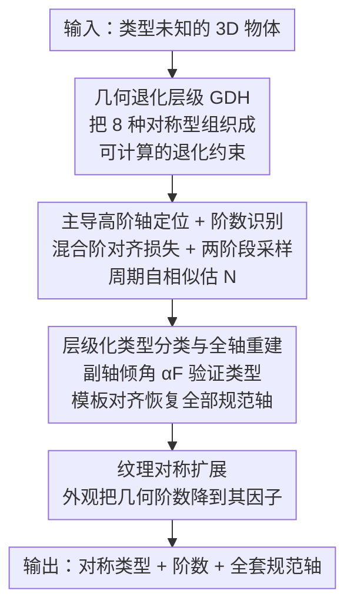

# KASALv2: Fully Automatic 3D Rotational Symmetry Classification and Axis Localization

**会议**: CVPR 2026  
**论文**: [CVF Open Access](https://openaccess.thecvf.com/content/CVPR2026/html/Zhang_KASALv2_Fully_Automatic_3D_Rotational_Symmetry_Classification_and_Axis_Localization_CVPR_2026_paper.html)  
**代码**: https://github.com/WangYuLin-SEU/KASAL  
**领域**: 3D视觉  
**关键词**: 旋转对称, 6D位姿估计, 轴定位, 几何先验, 无参考分析

## 一句话总结
KASALv2 提出一个完全自动、无需任何参考几何的框架，对 3D 物体的旋转对称类型、旋转阶数和全部规范轴一次性完成识别，覆盖全部 8 种规范旋转对称类型，在 GSO 的 438 个对称物体上达到 94.75% 准确率，并把估计出的对称先验喂给 FoundationPose 训练，使 5 个 BOP 数据集上的位姿精度最高提升 0.9%。

## 研究背景与动机

**领域现状**：旋转对称是 6D 位姿估计里非常重要的几何先验——它能消解位姿歧义、稳定优化，并支撑 ADD-S、MSSD、MSPD 这类"对称感知"评测指标。HccePose(BF)、ZebraPose 等近期系统都用对称先验把规范位姿映射成离它最近的等价表示，从而提升精度。

**现有痛点**：但要拿到对称标注，目前几乎全靠人工或半自动方法，而且往往**要求事先指定对称类型或阶数**。当数据集动辄上万个 3D 模型（无见过物体的大规模合成训练、网格生成、3D 资产处理都需要逐物体的对称信息），人工标注根本不现实。已有自动方法要么只覆盖部分对称类型，要么依赖质心/关键点等几何参考、对噪声和遮挡敏感，最接近全覆盖的 Wang et al. 仍要人工指定类型和阶数。

**核心矛盾**：3D 旋转对称结构本身高度多样——对应 SO(3) 的保向子群，涵盖连续型 $C_\infty/D_\infty$、有限循环群 $C_n$、二面体群 $D_n$ 以及柏拉图立体的旋转群 $A_4/S_4/A_5$ 共 8 种规范型，各自的轴数、阶数、轴间关系都不同。要做到"全自动 + 全覆盖"，必须有一个统一框架能联合推理类型和轴结构，而不是逐类型套规则。

**本文目标**：把任务从"给定类型再定位轴"升级为"既不给类型也不给参考，自动判定对称类型 + 旋转阶数 + 全部规范轴"。

**切入角度**：作者观察到，高阶对称轴天然满足低阶旋转的周期性，因此在对齐损失上会形成更深的"下降盆地"——优化会自动被吸向主导高阶轴，无需先验阶数。

**核心 idea**：用一个可计算的"几何退化层级"（GDH）把 8 种对称型组织成自上而下的退化关系，先无参考地锁定主导高阶轴并自一致地估出阶数，再借 GDH 约束的轴间倾角验证类型、重建全部规范轴，最后用纹理扩展处理外观引起的阶数退化。

## 方法详解

### 整体框架
输入是一个对称类型未知的 3D 物体（点云/网格），输出是它的对称类型、旋转阶数和全套规范轴。方法的"理论底座"是 Geometric Degeneration Hierarchy（GDH，几何退化层级）：它把全部 SO(3) 旋转子群按"轴数/阶数随几何退化如何减少"重组成一棵可计算的层级树，给出哪些类型可行、轴间该满足什么倾角的约束。在 GDH 指引下，系统先定位主导高阶轴 → 估计它的旋转阶数 → 由阶数缩小候选类型并用副轴倾角验证类型 → 重建全部规范轴 → 纹理对称扩展处理外观退化。整条流水线完全无参考、无需任何人工输入。

### 关键设计

**1. 几何退化层级 GDH：把 8 种对称型变成一棵可计算的退化树**

已有"全类型"方法之所以仍要人工指定类型，是因为缺一个能把多样的对称结构统一推理的结构化先验。GDH 把 SO(3) 的保向子群重组成层级：最顶端是各向同性的球面（任意方向都是旋转轴），向下分两条退化谱系——**二面体—循环谱系**和**柏拉图谱系**。二面体—循环谱系从圆柱型 $D_\infty$ 出发，沿两条路径退化：一是连续旋转离散化 $D_\infty\Rightarrow D_n$、$C_\infty\Rightarrow C_n$（$n\ge2$），二是失去正交二重轴 $D_\infty\Rightarrow C_\infty$、$D_n\Rightarrow C_n$；柏拉图谱系刻画多高阶轴结构的离散退化 $A_5\Rightarrow A_4$、$S_4\Rightarrow A_4$。GDH 的关键不在于它是一个概念分类法，而是它把"轴数、阶数、特征轴间关系如何随退化演变"编码成**可计算的约束**：定位到的主导高阶轴先缩小可行子类，估出的阶数进一步压候选集，再验证一个满足规定倾角的副轴即可锁定类型——后续每一步都靠这套约束才变得可操作。

**2. 主导高阶轴定位 + 阶数识别：用周期自一致性把高阶轴"自动吸"出来**

要无参考地找轴，难点在于不知道阶数就没法定义对齐误差。作者用一个**混合阶对齐损失**同时聚合多个候选阶下的对齐误差：$L_\text{mix}(a)=\sum_{n\in N}L_n(a)$，其中 $L_n(a)=\sum_{k=1}^{n-1}\text{Chamfer}(P,\,R(a,\theta_k)P)$、$\theta_k=2\pi k/n$。因为高阶轴本身满足低阶旋转的周期性，它在聚合损失上会更低、形成更深的下降盆地，优化于是被自然偏向主导高阶方向（候选阶集取 $N=\{3,4,5,6\}$）。定位分两阶段：先在上半球均匀粗采样（128 个方向）找出低损区域的 top-$k_\text{cand}$，再在每个候选周围 $10^\circ$ 球冠内细采样、最后用 Adam 优化（lr=0.04，5 步）收敛。锁定主导轴 $a^*$ 后，沿该轴密集旋转（典型 360 个角度）算每步 Chamfer 距离，构成旋转自相似信号，取其主频得到阶数粗估 $N_\text{fft}$，再在 $\{N_\text{fft}, N_\text{fft}\pm1\}$ 里选重建误差最小者作为 $N_\text{est}$；歧义情形用层级验证（$N_\text{est}\ge3$ 视为离散旋转对称，$=2$ 用 $180^\circ$ 旋转测试区分真二重与反射结构，$\le1$ 用 $45^\circ$ 小角测试区分连续型与非对称）。

**3. 层级化类型分类与全轴重建：用副轴倾角 αF 一锤定音，再用模板对齐补全所有轴**

有了主轴和阶数，GDH 把假设空间缩到与 $N_\text{est}$ 相容的子集，剩下的歧义只在"副高阶轴相对主轴的朝向"。每种候选类型在 GDH 里都规定了一个特征轴间倾角 $\alpha_F$（对姿态和尺度不变），于是在以 $a^*$ 为中心、固定倾角 $\alpha_F$ 的圆形轨迹上搜索副轴：$b^*=\arg\min_{b\in S(\alpha_F)}L_\text{Chamfer}(b;N)$，对 top-k 种子做沿环参数的一维梯度精修（Adam，天然满足倾角约束）。由阶数对 $(N_{a^*},N_{b^*})$ 和实测倾角即可定类型：连续型 $C_\infty/D_\infty$ 看主轴上有无离散周期、有无正交二重轴；离散型 $C_n/D_n$ 看有无正交二重轴；柏拉图型用实测倾角对照理论常数 $70.53^\circ$（$A_4$）、$90^\circ$（$S_4$）、$63.43^\circ$（$A_5$）判别。类型一定，GDH 给出其规范轴模板，估一个把模板对 $(\hat a,\hat b)$ 对齐到检测对 $(a^*,b^*)$ 的刚性变换 $Q$，全部轴即 $u_i^\text{final}=Q\,\hat u_i$，完成紧凑、无参考的全轴重建。

**4. 纹理对称扩展：把外观当作叠加在几何上的二次阶数退化**

真实物体几何很少完美规整，表面纹理/色彩会在图像域打破旋转不变性。作者把纹理视为叠在几何对称之上的**二次阶数退化**：它只改各轴的有效阶数、不动轴朝向，且有效阶数必须落在几何阶数的因子集合里——$n_\text{tex}\in\{d\mid d\text{ 整除 }n_\text{geo}\}\cup\{1\}$。于是几何六重的物体在周期纹理下可能呈现三重或二重，连续型圆柱也能因重复表面结构表现为离散 $D_n$。给定恢复出的几何类型和轴配置，纹理精修通过解析地评估每根轴周围的外观一致性算出，得到同时纳入几何与纹理诱导对称的统一表示。

### 损失函数 / 训练策略
方法本身是**无训练的几何优化**：所有对齐损失都基于 Chamfer 距离，主轴/副轴定位用 Adam 做少步优化（主轴 lr=0.04、5 步；副轴 lr=0.05、5 步）。采样预算由球冠半径 $r$ 单参数驱动，粗采样下界由球面与球冠面积比导出 $N_\text{min}=\frac{2}{1-\cos r}$（限上半球避免对极冗余、向上取 8 的倍数），最大阶（$\ge3$）轴数上限设为 6（对应二十面体）。整套实验在 i5-13400F + RTX 3050 + 32GB 上即可跑，单物体约 1.3–1.8 秒。论文唯一涉及"训练"的环节是下游：用 KASALv2 生成的对称先验在约 100 万张渲染图上训 FoundationPose（先验仅在标签层经 ZebraPose 的对称感知规范化注入）。

## 实验关键数据

### 主实验
跨 DSRSTO、BOP、GSO 三个数据集评测，指标包括类型准确率 $acc_t$、阶数准确率 $acc_o$、整体准确率 $acc_T$、归一化轴对齐误差 $e_{ADI}/d$（$d$ 为物体直径）和单物体耗时。

| 数据集 | 物体规模 | $acc_T$ | $e_{ADI}/d$（本文 / Wang et al.） | 耗时(s) |
|--------|---------|---------|-----------------------------------|---------|
| GSO（438 对称物体） | 944 扫描模型中 438 个对称 | **94.75%** | 0.00262 / 0.00256 | 1.37 |
| BOP（重标注 50 实例） | 真实场景物体 | **84.00%**（原标注 80.00%） | 0.00256 / 0.00290 | 1.61 |
| DSRSTO | 38 CAD，覆盖全部规范型 | 81.48% | 0.00212 / 0.00172 | 1.46 |
| DSRSTO$_\text{tex}$（纹理子集） | 11 个纹理对称模型 | 72.32% | 0.00195 / 0.00181 | 1.16 |

GSO 上类型准确率 $acc_t$ 高达 96.58%、阶数准确率 $acc_o$ 98.10%；BOP 重标注后 $e_{ADI}/d$ 从 0.00290 降到 0.00256，说明定位精度优于参考方法 Wang et al.。各数据集里 $C_n$ 始终是最低准确率类别（GSO 上 83.53%、DSRSTO 上仅 28.57% ⚠️ 该极低值疑因 DSRSTO 中 $C_n$ 样本只有 7 个且多为高阶/视觉歧义个例，以原文为准）。

### 消融实验
在 DSRSTO 上考察"候选阶集 $N$"的组成（球冠半径 $r$ 另有单独消融，最优在 $r=10^\circ$、$acc_T=81.48\%$）：

| 候选阶集 $N$ | $acc_T$ | $e_{ADI}/d$ | 耗时(s) | 说明 |
|--------------|---------|-------------|---------|------|
| {3,4} | 70.37% | 0.00419 | 1.02 | 阶集太小，明显掉点 |
| {3,4,5} | 77.78% | 0.00423 | 1.20 | 仍不足 |
| {3,5,6} | 77.78% | 0.00411 | 1.69 | 缺 4-fold，难分立方/二面体 |
| **{3,4,5,6}** | **81.48%** | 0.00418 | 1.46 | 最小有效配置（默认） |
| {3,4,5,6,7} | 81.48% | 0.00419 | 1.77 | 扩集只增耗时无收益 |
| {2,3,4,5,6} | 77.78% | 0.00659 | 2.28 | 引入 2-fold 反而不稳 |

### 关键发现
- **候选阶集 {3,4,5,6} 是最小有效配置**：去掉任一关键阶（尤其 4-fold）就难以区分立方与二面体对称；继续往上扩到 7、9 只增加耗时、无精度收益。
- **加入 2-fold 反而有害**：平凡的半圈对齐会主导优化，把若干 3-fold 高阶模型误判成 2-fold，$e_{ADI}/d$ 从 0.00418 恶化到 0.00659，这正是作者刻意把阶集从 3 起步的原因。
- **下游位姿提升**：用 KASALv2 先验训练的 FoundationPose 在 5 个 BOP 数据集上最高提升 0.9%，证明自动估计的旋转先验对高精度位姿估计有实打实的价值。

## 亮点与洞察
- **"高阶轴天然落在更深损失盆地"是全文的支点**：正因为高阶旋转满足低阶周期性，混合阶损失才能无先验地把主导轴自动吸出来——这把"需要先知道阶数"的鸡生蛋问题直接绕开了，思路很巧。
- **GDH 把分类法变成可计算约束**：很多对称工作停在"罗列 8 种类型"，KASALv2 把退化关系编码成主轴→阶数→副轴倾角的逐级约束，让全自动推理真正可操作，这套"层级约束缩小假设空间"的范式可迁移到其他需要联合判类型+几何的任务。
- **纹理退化用因子集约束**，是一个干净的建模：把"外观把六重压成三重/二重"形式化为"有效阶必整除几何阶"，既保住轴朝向又解析可算，避免了对纹理再做一遍重优化。
- **几乎零成本部署**：无训练、RTX 3050 上单物体 1–2 秒，使得给上万模型逐个打对称标注从"不可行"变成"可批处理"。

## 局限与展望
- **$C_n$ 类别是明显短板**：在 DSRSTO 上 $C_n$ 准确率仅 28.57%、BOP/GSO 上也最低，作者归因于高阶和视觉歧义的循环对称难分；这类物体仍是方法的主要失败来源。
- **依赖几何规整度**：方法核心是 Chamfer 自对齐，对扫描噪声、不完整点云、严重遮挡的鲁棒性论文未充分压力测试（真实 BOP 子集对称多样性也有限）。
- **纹理扩展较理想化**：把纹理当作严格"整除几何阶"的周期退化，对非周期/局部纹理、光照导致的伪对称可能不适用。
- **下游收益偏小**：0.9% 的位姿提升虽实打实但幅度有限，且先验只在标签规范化层注入，是否能在更强的对称感知训练方式下放大收益值得探索。

## 相关工作与启发
- **vs Wang et al.（key-axis 定位）**：是本文直接扩展的对象。Wang 能处理全部对称型含纹理，但**必须人工指定类型和阶数**、且用穷举式方向枚举；KASALv2 用 GDH 的可计算约束替掉枚举，并把类型/阶数也自动化，BOP 上 $e_{ADI}/d$ 0.00256 优于其 0.00290。
- **vs 基于参考的方法（质心/主轴锚点）**：它们在受控条件下好用，但对表面噪声、遮挡、错位高度敏感；KASALv2 完全无参考，靠球面上的全局对齐目标定位，鲁棒性更适合真实 6D 位姿场景。
- **vs 无参考但覆盖受限的方法（如 Hruda et al. 反射框架、Rajkumar et al. 混合法）**：前者在圆柱/圆锥等连续对称上失效，后者只覆盖连续型和二阶离散锥形；KASALv2 一套框架覆盖全部 8 种规范型。
- **vs 位姿端的对称利用（HccePose(BF)、ZebraPose）**：它们用**预定义**对称矩阵做位姿规范化；KASALv2 提供的是上游的**自动对称标注**，二者互补——本文正是把估出的先验经 ZebraPose 式规范化喂给 FoundationPose 训练。

## 评分
- 新颖性: ⭐⭐⭐⭐⭐ GDH + 高阶自一致定位把"全自动 + 全覆盖"的对称分析第一次打通，思路自洽且优雅。
- 实验充分度: ⭐⭐⭐⭐ 三数据集 + 阶集/半径双消融 + 下游位姿验证较完整，但 $C_n$ 失败分析和噪声鲁棒性主要放在补充材料。
- 写作质量: ⭐⭐⭐⭐ 理论到操作的递进清晰，符号规范；个别指标（如 DSRSTO $C_n$ 28.57%）需结合样本量理解。
- 价值: ⭐⭐⭐⭐ 把对称标注从人工瓶颈变成可批量自动化，对大规模 6D 位姿训练和 3D 资产处理实用价值明确。

<!-- RELATED:START -->

## 相关论文

- [\[CVPR 2026\] Long-SCOPE: Fully Sparse Long-Range Cooperative 3D Perception](long_scope_fully_sparse_long_range_cooperative_3d_perception.md)
- [\[CVPR 2026\] Towards Visual Query Localization in the 3D World](towards_visual_query_localization_in_the_3d_world.md)
- [\[CVPR 2026\] Sparse-View Localization via Online Neural 3D Regression](sparse-view_localization_via_online_neural_3d_regression.md)
- [\[CVPR 2026\] PP-Brep: Few-Shot B-rep Classification with Hybrid Graph Representation](pp-brep_few-shot_b-rep_classification_with_hybrid_graph_representation.md)
- [\[CVPR 2026\] Fusion of Depth and Semantics for Probabilistic Floorplan Localization](fusion_of_depth_and_semantics_for_probabilistic_floorplan_localization.md)

<!-- RELATED:END -->
