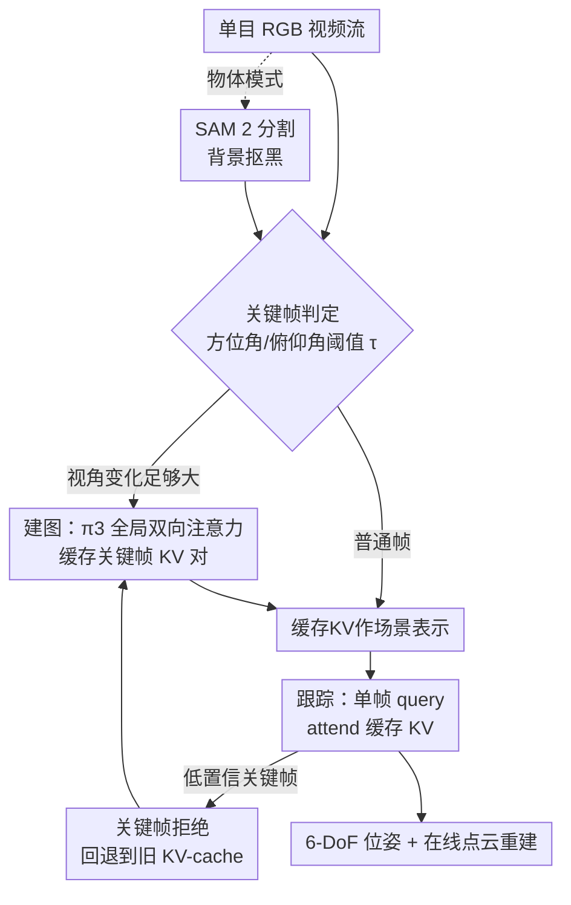

# KV-Tracker: Real-Time Pose Tracking with Transformers

**会议**: CVPR 2026  
**论文**: [CVF Open Access](https://openaccess.thecvf.com/content/CVPR2026/html/Taher_KV-Tracker_Real-Time_Pose_Tracking_with_Transformers_CVPR_2026_paper.html)  
**代码**: 项目页 https://marwan99.github.io/kv_tracker/（未明确开源代码）  
**领域**: 3D视觉  
**关键词**: 多视图几何, 实时位姿跟踪, KV-cache, 在线重建, 物体跟踪

## 一句话总结
KV-Tracker 把离线多视图几何大模型（π3）改造成实时系统：把建图阶段关键帧在全局注意力里算出的 Key-Value 对缓存下来当作场景表示，跟踪时只用单帧 query 去 attend 这份缓存，把每帧推理从 $O((NM)^2)$ 降到 $O(M^2(N{+}1))$，在 TUM/7-Scenes/ARCTIC/OnePose 上以约 27 FPS 实现无漂移的 6-DoF 相机与零先验物体跟踪。

## 研究背景与动机

**领域现状**：DUSt3R、MASt3R、VGGT、π3、MapAnything 这类基于 Transformer 的前馈多视图几何网络正在重塑 3D 视觉——给一组图像，一次前向就能回归出每帧相机位姿、点云和置信度，提供了极强的免标定几何先验。它们靠的是**全局全对全（all-to-all）双向自注意力**让所有视图的 patch token 互相看到彼此，从而产出全局一致的 3D 输出。

**现有痛点**：这种全局注意力的代价是计算量随输入帧数 $N$ 二次增长（$O((NM)^2)$，$M$ 为每帧 patch 数）。两视图网络（$N=2$）可以当 SLAM 前端实时用（如 MASt3R-SLAM），但多视图模型（$N\ge2$）是"powerful but monolithic"的庞然大物：跑完 50 帧得到一个重建后，来了第 51 帧该怎么办？从头把 51 帧再算一遍显然不可扩展。

**核心矛盾**：要么用流式模型（Spann3R / CUT3R / TTT3R / Long3R）把历史压进一个不断被更新的隐式 memory/hidden state——但这类 state 每来一帧就被改写，序列一长就**漂移和灾难性遗忘**，没法"闭环"；要么每帧重算全局注意力——精度在线但慢到没法实时。物体跟踪里这个矛盾尤其尖锐：旋转的物体很快转回之前看过的相对位姿，特别需要稳定的全局记忆。

**本文目标**：在**不重训、不微调**任何网络的前提下，让现成的多视图几何大模型能吞流式图像、实时输出 6-DoF 位姿，同时保住"看过的历史不被污染"。

**切入角度**：作者注意到 π3 这类网络有一个关键结构性质——**每帧的 token $X_n$ 是被独立解码的**，且全局注意力本质就是 query 去检索一堆 key-value。那么一旦某些帧的几何已经"算定"了，它们贡献的 K、V 其实是固定的，没必要每帧重算。

**核心 idea**：把建图阶段关键帧在每个全局自注意力层产出的 $(\tilde K, \tilde V)$ 缓存下来，**把这份 KV-cache 直接当成场景表示**；跟踪新帧时只编码这一帧、只算它自己的 query，去 attend 缓存的 KV——既复用了多视图先验，又因为不写回缓存而天然免漂移。

## 方法详解

### 整体框架
KV-Tracker 把系统拆成两个可像 PTAM 一样并行交错的进程：**建图（Mapping）**和**跟踪（Tracking）**。建图阶段自动从输入流里挑一批关键帧 $KF_{1:B}$，用 π3 跑**完整的全对全双向全局注意力**，并把每层全局注意力里关键帧产生的 Key-Value 对 $(\tilde K^l_{1:B}, \tilde V^l_{1:B})$ 缓存为隐式场景表示。跟踪阶段对最新帧 $I_t$ 只做单帧编码与单帧 query 的注意力，拿缓存的 KV 当场景去做重定位，实时（约 27 FPS）估计它的相机位姿和几何，而**不改写缓存**。当相机转到足够新的视角时触发插入新关键帧，KV-cache 被整体刷新；物体模式下额外接入 SAM 2 分割把背景抠黑。

### 关键设计

**1. KV-cache 当场景表示：把"算定"的关键帧冻结成可复用记忆**

痛点直指多视图网络的二次瓶颈：全局自注意力把所有帧的 token 拼成 $X\in\mathbb{R}^{NM\times d_k}$ 投影出 $Q,K,V$，注意力图随帧数二次增长，$O((NM)^2)$。作者的做法是只在建图阶段对关键帧 $KF_{1:B}$ 跑一次完整双向注意力，把每个全局注意力层算出的 $\tilde K^l_{1:B}, \tilde V^l_{1:B}$ 存下来。这份缓存之所以能当"场景表示"，是因为它是多视图信息充分交换后的产物——和 SLAM 里用稀疏 3D 点或 MLP 当场景 primitive 是一个意思，给定一个 query 帧就能从中恢复几何与位姿。关键在于它**只读不写**：跟踪帧来 attend 它但不更新它，所以不会像 CUT3R/TTT3R 那样被每一帧的观测逐步污染，这正是免漂移、能"闭环"的根。

**2. 单帧 query 的缓存注意力：把二次复杂度压成线性**

这是把上面的表示真正变快的机制。当新帧 $I_t$ 到来，只编码它 $X_t=\text{Enc}(I_t)$，在特征聚合阶段只对 $X_t$ 做帧内自注意力；在全局注意力层把 $X_t$ 投影成 $Q_t,K_t,V_t$，然后让它去 attend 缓存的 keys/values：

$$\text{Attention}(Q_t,\ [\tilde K, K_t],\ [\tilde V, V_t])$$

此时注意力图为

$$Q K^T = \underbrace{Q_t}_{M\times d_k}\ \underbrace{\big[\tilde K^T_{kf_1}\ \cdots\ \tilde K^T_{kf_M}\ \tilde K^T_t\big]}_{d_k\times M(N+1)}$$

复杂度从 $O((NM)^2)$ 降到 $O(M^2(N{+}1))$，对关键帧数从二次变线性。直觉上：那些几何已知的关键帧不再当"重新发问"的 query，只当"被检索的记忆"提供 K、V；建图是双向注意力，跟踪退化成"单 query 对缓存的单向交叉注意力 + 自注意力"。配合 π3 三个解码头相互独立的特性，跟踪时可关掉点云和置信度解码头进一步提速（不影响跟踪质量，只在需要恢复几何时全开）。实测带来最高约 15× 加速、27 FPS。

**3. 角度阈值关键帧选择 + 置信度拒绝：让缓存既覆盖全又不冗余**

缓存当记忆的代价是显存随关键帧数线性涨，所以"挑哪些帧进缓存"很关键。作者用一个**基于视角角度的关键帧准则**：当新帧与**所有**已有关键帧的最小方位角或俯仰角差超过阈值 $\tau$ 时才设为新关键帧——

$$\min_{kf\in KF}|\phi_t-\phi_{kf}|>\tau \quad\text{or}\quad \min_{kf\in KF}|\theta_t-\theta_{kf}|>\tau$$

其中 $\phi,\theta$ 是相机方位角与俯仰角。和"只跟最近一帧比"不同，跟全部关键帧比能保证相机转回旧视角时不会重复加帧，自然适配运动快慢：视角变化大时多采、静止时不采。为提升鲁棒，还有一条**关键帧拒绝策略**：新关键帧若预测置信度过低就剪掉、系统回退到上一份 KV-cache，避免烂帧污染地图。物体模式下方位/俯仰阈值取 10°，作者指出通常 50–60 个关键帧就足以覆盖一个物体的完整视角，因此能边重建边保持高帧率。

**4. 零先验在线物体跟踪：把"对着模型跟踪"扩展到无 CAD/无深度的物体**

物体跟踪比场景难——物体只占图像一小块像素、被操纵时相对相机快速移动旋转，所以传统方法普遍要 CAD 模型（DeepIM/FoundationPose）或深度（BundleTrack/BundleSDF）。作者把同一套 KV-cache 机制直接搬过来：用 SAM 2 给定初始 mask 后在整段序列上传播分割，所有方法都把背景抠成黑像素，然后用上面的角度关键帧策略在线建物体地图、实时跟踪。它的妙处在于 π3 学到的通用几何先验能 zero-shot 迁移到被遮挡背景的物体上——即便这些网络从没在 masked 图像上训练过——从而**既不要 CAD、也不要深度、也不要离线重建**，把 OnePose 那类"先离线扫描建图再跟踪"的限制松绑成纯在线。

### 损失函数 / 训练策略
本文**不涉及任何训练或微调**，是一个 training-free 的推理期适配方法，直接复用现成 π3 权重。选 π3 而非 VGGT 是因为 π3 去掉了相机 register token、对参考视角更不敏感（用置换不变损失训练）；但缓存时除了 patch token 的 KV，作者也缓存了每帧 register token 的 KV 对。该缓存策略是 model-agnostic 的，可套到 VGGT、MapAnything 等同构网络上而无需重训。

## 实验关键数据

### 主实验

相机跟踪（ATE RMSE，米，越低越好），与流式重建方法对比。本文在更低分辨率（350×266）下仍全面领先在更高分辨率运行的基线：

| 数据集 | Point3R | CUT3R | TTT3R | DPVO | 本文 |
|--------|---------|-------|-------|------|------|
| TUM-RGBD（平均） | 0.331 | 0.272 | 0.132 | 0.095 | **0.098** |
| 7-Scenes（平均） | 0.439 | 0.205 | 0.143 | — | **0.059** |

本文在 TUM-RGBD 比最强基线 TTT3R 好 25%（8 个场景赢 6 个），在 7-Scenes 好 58%（7 个全赢）；对手 CUT3R/TTT3R 还得每 100 帧重置一次 state 才能避免漂移。难例提升尤其明显："teddy" 0.057m vs TTT3R 0.214m，"fire" 0.039m vs 0.124m。DPVO 是稀疏 patch 里程计（无稠密几何，仅作参考），本文与它平均 ATE 仅差 0.003m。

物体跟踪：ARCTIC 数据集（egocentric，被手操纵的物体），ATE RMSE（米）：

| 方法 | 平均 ATE |
|------|----------|
| CUT3R | 0.305 |
| TTT3R | 0.303 |
| 本文 @308 | **0.228** |

OnePose / OnePose-LowTexture（recall %，基线用离线 3D 重建+3D Bbox，本文纯在线）：

| 方法 | 输入 | OnePose 5cm5° | LowTex 5cm5° | FPS |
|------|------|---------------|--------------|-----|
| OnePose | 3D Bbox | 84.1 | 45.4 | 15 |
| OnePose++ | 3D Bbox | 87.7 | 72.1 | 11 |
| 本文 @518 | 2D Bbox | **92.9** | **94.4** | 16 |

在最宽松的 5cm/5° 阈值下本文（在线、无离线重建）反超两条离线基线；但在最严的 1cm/1° 上明显落后（本文 seg-mask 10.7% vs OnePose++ 51.1%），因为离线方法有更完整精确的 3D 模型，而在线重建初期覆盖不全。

### 运行时分析 / 消融

KV-cache 适配的核心消融——与"每帧对所有关键帧重算全双向注意力"对比（308×308 合成负载）：

| 配置 | 行为 | 帧率表现 |
|------|------|----------|
| 全双向注意力（fresh KV） | $O(N^2)$ 重算所有关键帧 KV | 随帧数二次衰减，很快掉速 |
| KV-cache（本文） | 单 query attend 缓存 KV | 50 帧内稳 30 FPS；70 帧 25 FPS；110 帧仍 >20 FPS |

测到 24GB 显存耗尽为止。这条消融直接验证了"缓存复用"是加速来源，而非别的工程技巧。

### 关键发现
- **免漂移来自"只读缓存"而非更新型 state**：CUT3R/TTT3R 必须每 100 帧 reset 才不漂，本文锚定在关键帧集合、跟踪不写回，所以长序列/物体旋转回旧视角时天然稳定——这是它赢基线 25%–58% 的根因。
- **加速纯由 KV 复用贡献**：运行时消融显示全双向注意力二次掉速，缓存版把复杂度压成线性，是 15×/27 FPS 的直接来源。
- **2D Bbox 略优于 seg-mask**：跨两个 OnePose 数据集，膨胀 2D 框平均比纯分割 mask 好，作者归因于框内保留了物体边界周围的背景上下文，提供了额外判别特征（这些数据集物体静止、相机扫描，边界区域信息丰富）。
- **精度-在线性的权衡很清楚**：粗阈值（5cm/5°）本文凭高帧率+在线灵活性反超离线方法；细阈值（1cm/1°）离线完整 3D 模型仍占优——本文卖点是"实时 + 无先验"，不是极致精度。

## 亮点与洞察
- **把 KV-cache 从"加速 trick"升格成"场景表示"**：LLM 推理里 KV-cache 只是省重算，这里作者把它重新解读为 SLAM 意义上的 scene primitive（类比稀疏点/MLP），一举打通"多视图大模型"与"对着模型实时跟踪"两个范式——这是最让人"啊哈"的概念跨界。
- **training-free 且 model-agnostic**：不碰权重、不微调，靠的是看穿 π3"每帧 token 独立解码 + 全局注意力即检索"的结构性质，所以同一招能迁移到 VGGT/MapAnything 等任何同构网络，复用成本极低。
- **免漂移的机理干净**：漂移的病根是"state 被每帧改写"，作者的解法不是更稳的更新规则（TTT3R 那条路），而是干脆不更新、把记忆钉在关键帧上——从机制上消除而非缓解问题。
- **可迁移思路**：任何"重的双向编码器 + 独立解码"结构，只要某些输入的表示已算定，都能把其 KV 冻结复用、新输入只发单 query，把交互式/流式场景的二次成本压成线性。

## 局限与展望
- **显存是硬天花板**：缓存随关键帧数线性增长，作者明确说当前只能用于空间受限的小工作区或单物体，撑到 110 帧（24GB）就接近极限，无法直接做大场景全 SLAM。
- **缓存不可增量、刷新代价高**：插入新关键帧时 KV-cache 是**整体重算**的（论文写 "recomputed fully"），关键帧多时这步本身是开销；作者把 cache pruning / 压缩 / 增量 KV 计算列为未来工作。
- **细粒度精度落后离线方法**：1cm/1° 这类严格阈值上明显不及 OnePose++，在线重建初期覆盖不全是结构性短板，对高精度位姿需求场景不够用。
- **依赖外部分割**：物体模式强依赖 SAM 2 的 mask 传播质量，mask 漂/丢会直接污染建图；且 2D Bbox 优于 mask 的现象部分源于数据集"物体静止+相机扫描"的特性，对快速运动物体是否成立存疑。
- **未给出闭环/重定位失败的失败案例分析**，长时间跟踪累计误差的上界缺乏量化。

## 相关工作与启发
- **vs CUT3R / TTT3R（更新型隐式记忆）**: 它们把历史压进一个每帧更新的 hidden state，长序列漂移、需周期性 reset；本文把记忆锚在只读的关键帧 KV-cache 上，跟踪不写回，从机制上免漂移，故 ATE 大幅领先且无需 reset。
- **vs Point3R / StreamingVGGT（训练流式网络）**: 它们靠重训/因果注意力让网络原生支持流式；本文是 training-free 的推理期适配，复用现成 π3 权重，零训练成本但受显存约束。
- **vs OnePose / OnePose++（离线物体重建）**: 基线先离线扫描建稀疏/半稠密 3D 模型再跟踪、还要 3D Bbox 先验；本文纯在线建图、只要初始 mask，粗阈值反超、帧率更高，代价是细阈值精度落后。
- **vs FoundationPose / BundleSDF（CAD/深度先验）**: 这些靠 CAD 模型或深度做 render-and-compare；本文 zero-shot、单目 RGB、无任何物体先验，把先验要求松绑到只需一个分割 mask。
- **vs MASt3R-SLAM（两视图前端）**: 它把 $N=2$ 网络当 SLAM 前端实时用；本文解决的是更难的多视图（$N\ge2$）模型如何在线化，把全局注意力的二次墙拆成线性。

## 评分
- 新颖性: ⭐⭐⭐⭐⭐ 把 KV-cache 从加速 trick 重新诠释为 SLAM 场景表示，打通多视图大模型与实时跟踪，且 training-free、model-agnostic，概念跨界很漂亮。
- 实验充分度: ⭐⭐⭐⭐ 覆盖 4 个数据集（场景+物体）、含运行时二次 vs 线性消融，对比充分；但缺关键帧阈值 τ 等超参敏感性与失败案例分析。
- 写作质量: ⭐⭐⭐⭐⭐ 动机推导（多视图模型为何难在线化）层层递进，公式与复杂度分析清晰，图文对照到位。
- 价值: ⭐⭐⭐⭐ 让现成几何大模型即插即用地实时化，对 AR/VR、机器人很实用；但显存上限把它锁在小场景/单物体，离全 SLAM 尚有距离。

<!-- RELATED:START -->

## 相关论文

- [\[CVPR 2026\] Tracking by Predicting 3-D Gaussians Over Time](tracking_by_predicting_3-d_gaussians_over_time.md)
- [\[CVPR 2026\] Tracking-Guided 4D Generation: Foundation-Tracker Motion Priors for 3D Model Animation](tracking-guided_4d_generation_foundation-tracker_motion_priors_for_3d_model_anim.md)
- [\[CVPR 2026\] AnthroTAP: Learning Point Tracking with Real-World Motion](anthrotap_learning_point_tracking_with_real-world_motion.md)
- [\[CVPR 2026\] Fast-FoundationStereo: Real-Time Zero-Shot Stereo Matching](fast-foundationstereo_real-time_zero-shot_stereo_matching.md)
- [\[CVPR 2026\] GHPT: Real-Time Relightable Gaussian Splatting using Hybrid Path Tracing](ghpt_real-time_relightable_gaussian_splatting_using_hybrid_path_tracing.md)

<!-- RELATED:END -->
