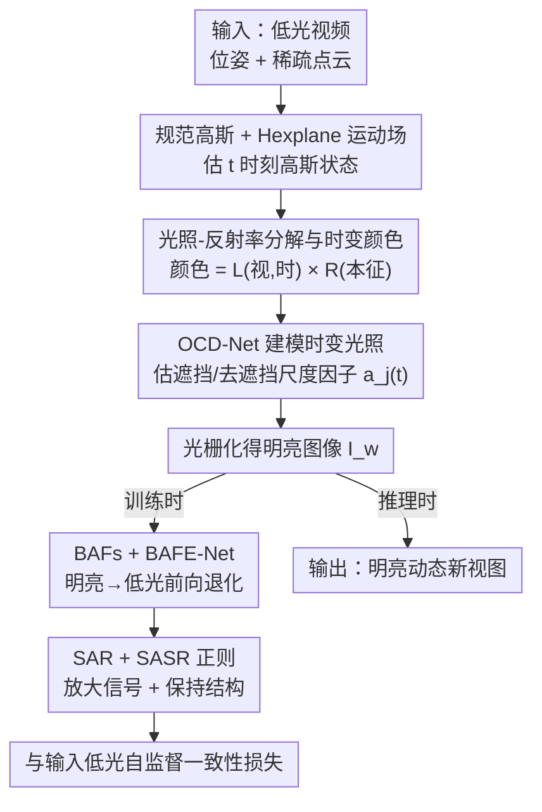

# $L^{2}DGS$: Low-Light Dynamic Gaussian Splatting

**会议**: CVPR 2026  
**论文**: [CVF Open Access](https://openaccess.thecvf.com/content/CVPR2026/html/Kumar_L2DGS_Low-Light_Dynamic_Gaussian_Splatting_CVPR_2026_paper.html)  
**代码**: https://github.com/akumar005/L2DGS  
**领域**: 3D视觉  
**关键词**: 4D高斯泼溅, 低光重建, 动态场景, 自监督, 光照-反射率分解

## 一句话总结
L2DGS 是首个直接从低光视频自监督重建"明亮动态场景"的 4D 高斯泼溅框架，把每个高斯的颜色拆成"随视角和时间变的光照 × 场景本征反射率"，用 OCD-Net 建模运动引起的时变光照、再用 BAFs+BAFE-Net 把明亮场景前向退化成低光来实现自监督，在合成与真实低光动态数据上大幅超越现有方法。

## 研究背景与动机
**领域现状**：NeRF 与 3DGS 已能从图像/视频做高保真新视图合成，并各自扩展到了动态（4D）场景；也有一批工作专攻低光重建。但这两条线几乎不相交。

**现有痛点**：低光重建方法（Lighting-up NeRF、Aleth-NeRF、Luminance-GS 等）几乎都只处理**静态**场景，且大多只盯着"提亮"而忽略底层场景结构；而动态场景方法又默认输入是**良好打光**的。把"低光增强"和"动态新视图合成"当两个独立步骤串起来，会丢一致性、也难保证运动下的鲁棒。

**核心矛盾**：在有运动物体的低光场景里，重建本质上高度欠定——相机调曝光会引入运动模糊；单相机下每个时刻只观测一次，天然稀疏；尤其是物体运动会让阴影在背景上漂移（cast shadow）、还会在自身投下自阴影（self-shadow），导致一块区域"到底是本来就暗、还是被遮挡才显暗"难以判定。这种由运动诱发的阴影/遮挡/去遮挡造成了严重的纹理与亮度歧义。

**本文目标**：用一个端到端、全自监督的单一模型，直接从低光 sRGB 视频里重建出明亮的动态场景，并能在时空上合成新视图——不依赖运动掩码、相机元数据，也不需要任何明亮参考的显式监督。

**切入角度**：作者主张联合做"增强 + 动态合成"而非分两步，因为统一模型能学到统一的几何-光度特征空间，让增强方式天然延伸到视图合成、并保证跨帧的运动一致性。

**核心 idea**：不再像普通 GS 那样给每个高斯一个"仅随视角变"的颜色，而是给每个高斯关联两个属性——随视角和时间变的光照 $l$ 与场景本征反射率 $r$，最终颜色取两者乘积；并设计一条"明亮→低光"的前向退化通路，让没有明亮 GT 的低光输入也能自监督。

## 方法详解

### 整体框架
输入是 $N$ 帧低光观测 $\{I^t_d\}$、对应相机位姿与内参、以及稀疏点云。L2DGS 以 4DGS 为基线：从一组规范高斯 $G^c_i(\mu^c_i,\Sigma^c_i)$ 出发，用 Hexplane 运动场把它变换到查询时刻 $t$ 的状态 $G^t_i(\mu^t_i,\Sigma^t_i)$。每个高斯不再带"视依赖颜色"，而是带视依赖光照 $l^c_i(v)$（用球谐编码）、视不变反射率 $r_i$、不透明度 $o_i$。光栅化后得到光照图 $L_w(v,t)$ 与反射率图 $R_w$，两者 Hadamard 乘积即明亮图像 $I_w(v,t)=L_w\circ R_w$。

关键在训练时的自监督：因为没有明亮 GT，作者反过来把估出的明亮图像 $I_w$ 通过一条"明亮→低光"的前向通路退化成低光估计 $\hat I^t_d$，再和真实低光输入 $I^t_d$ 对齐。这条通路靠每个高斯额外携带的两个亮度衰减特征（BAFs）$b_{1i},b_{2i}$ 和一个 BAFE-Net 实现。推理时 BAFs 与 BAFE-Net 直接丢弃，只渲染明亮新视图，可做到 30+ FPS 实时。

### 关键设计

**1. 光照-反射率分解与时变颜色建模：把颜色拆成"视-时光照 × 本征反射率"**

普通 GS/NeRF 把像素颜色只建成视角的函数，无法解释运动带来的颜色变化。L2DGS 给每个高斯关联视依赖光照 $l^c_i(v)=\sum_{j=1}^{(k+1)^2} b_j B_j(v)$（$B_j$ 为球谐基、$b_j$ 为混合系数）和视不变反射率 $r_i$，颜色是两者乘积，于是每个高斯的颜色同时是时间和视角的函数。光栅化时分别对 $l^t_i$、$r_i$ 做 alpha-blending 得到光照图 $L_w(v,t)$ 与反射率图 $R_w$，再相乘得明亮图像。作者强调这与 Retinex 类静态分解不同——后者只分静态视依赖/视不变两块、不含时间维，而本文把时间维显式引入，正好用来吸收物体运动等外因导致的色变。

**2. OCD-Net（遮挡-去遮挡网络）：建模运动引起的时变光照**

观测强度会因物体运动而变，作者把这种外因强度变化归到光照的时变项 $l^t_i=\sum_j a_j(t)\,b_j B_j(v)$，其中 $a_j(t)\in\mathbb{R}^+$ 是控制时变（遮挡/去遮挡）的尺度因子。这个因子由 OCD-Net 估计：$a_j(t)=\mathcal{F}_2(\mathcal{F}_1(G^t_i,G^t_m;t))=\text{OCD-Net}(f(\mu^t_i))$，其中 $\mathcal{F}_1$ 关联场景中所有会影响 $G^t_i$ 光照的其它高斯 $G^t_m$、$\mathcal{F}_2$ 估有效的增/减光量；网络输入是运动场聚合出的时空特征 $f(\mu^t_i)$（来自 Hexplane 六个特征平面 $XY,Zt,YZ,Xt,ZX,Yt$ 的乘积聚合），输出 $a_j(t)$，隐式学到 $\mathcal{F}_1,\mathcal{F}_2$。这样运动诱发的阴影漂移、自阴影等时变亮度就被显式吸收进光照项，而不会被错当成场景本征的暗。

**3. BAFs + BAFE-Net：明亮→低光的前向退化，撑起自监督**

没有明亮 GT，必须想办法让低光输入自己当监督信号。作者选择"前向建模"——从估出的明亮图像合成低光，而不是反向去增强低光（后者会放大噪声）。具体给每个高斯加两个随机初始化、联合优化的亮度衰减特征 BAFs $b_{1i},b_{2i}$，光栅化得到 2D 的 $\hat B_1,\hat B_2$。但作者发现仅靠这两张图不足以完成退化，于是加一个卷积网络 BAFE-Net，把拼接后的 $[\hat B_1,\hat B_2]$（$H\times W\times2$）增强成最终的 $B_1,B_2$，再按 $\hat I^t_d=L_w(v,t)^{\circ B_2}\circ R_w^{\circ B_1}$ 合成低光估计（$a^{\circ b}$ 是逐元素幂，灵感来自可微的 gamma 校正）。这条前向通路的好处是对场景各分量有更强的控制力、能选择性增强以拿到更高 SNR，且 BAFs/BAFE-Net 推理时全部丢弃，不增加部署成本。

**4. SAR + SASR 正则：放大信号、保持结构，约束欠定解**

明亮场景估计是欠定的——多组 $L_w,R_w,B_1,B_2$ 能给出同一低光观测，必须加约束。**信号放大正则（SAR）**针对低光下光子稀缺、噪声大的问题，把光照图往最大推：$\mathcal{L}_L=\frac{1}{HW}\sum_{i,j}|1-[L_w(v,t)]_{i,j}|$，因为 $R_w\in[0,1]$、要靠 $L_w$ 抬亮度；有趣的是同样去最大化 $R_w$ 几乎没用，作者解释是 $R_w$ 不依赖视角和时间，多视聚合时噪声被平均掉了。**场景自适应结构正则（SASR）**要求"明亮→低光"的退化尊重场景结构：因 $B_1,B_2$ 分别作用于 $R_w,L_w$，就约束它们的梯度对齐——$\mathcal{L}_{B1}=\|\beta_1\nabla B_1-\nabla R_w\|_1$、$\mathcal{L}_{B2}=\|\beta_2\nabla B_2-\nabla L_w\|_1$，让 BAF 捕捉到反射率/光照的结构一致性。配合光度数据项 $\mathcal{L}_{photo}$（L1+SSIM，SSIM 的指数 $\eta$ 从 0.95 指数衰减到 0.5）、曝光正则 $\mathcal{L}_{exp}$（约束 $R_w$ 在 16×16 窗口的均值贴近理想曝光 $e=0.6$）、边缘感知深度平滑 $\mathcal{L}_D$，构成总目标 $\mathcal{L}=\mathcal{L}_{photo}+\lambda_1\mathcal{L}_{exp}+\lambda_2\mathcal{L}_L+\lambda_3\mathcal{L}_{B1}+\lambda_4\mathcal{L}_{B2}+\lambda_5\mathcal{L}_D$。

### 损失函数 / 训练策略
以 4DGS 为基线，运动场在 $X,Y,Z$ 轴分辨率 64、$t$ 轴 $N/2$。分两阶段：前 3000 步粗训练（运动场与 OCD-Net 不激活），随后 20000 步细训练（全部组件激活）；场景分解在粗、细两阶段都做，全程端到端自监督。BAFE-Net 学习率从 0.0016 指数衰减到 0.00016，OCD-Net 从 0.00016 衰减到 0.000016，BAFs 与反射率固定 1e-5、光照 0.0025；$\beta_1=\beta_2=0.5$，$\lambda_{1..5}=\{0.01,0.05,1.0,1.0,0.001\}$。单张 RTX 3090，450×800 分辨率约 90 分钟训练。

## 实验关键数据

### 主实验
合成低光动态场景上的对比（指标在明亮图像上计算，⚠️ 越亮越好的区域分 Dynamic/Static/Overall）。下表摘 Mochi 与 Apple 两个场景，对比本文最强竞品 Luminance-GS：

| 场景/区域 | 方法 | PSNR↑ | SSIM↑ | LPIPS↓ |
|------|------|------|------|------|
| Mochi · Dynamic | Luminance-GS | 14.06 | 0.59 | 0.14 |
| Mochi · Dynamic | **L2DGS** | **21.00** | **0.78** | **0.07** |
| Mochi · Overall | Luminance-GS | 14.51 | 0.66 | 0.32 |
| Mochi · Overall | **L2DGS** | **17.61** | **0.77** | **0.16** |
| Apple · Overall | Luminance-GS | 12.50 | 0.43 | 0.44 |
| Apple · Overall | **L2DGS** | **13.31** | **0.63** | **0.24** |

L2DGS 在动态区域的增益尤其大（Mochi 动态区 +6.94 dB），印证它对运动诱发的阴影/遮挡处理得更好；作为对照，直接拿明亮动态方法 4DGS 跑低光会彻底崩（Mochi 动态区仅 7.03 dB）。

真实数据 L2DyV 上的用户研究（62 人，二选一偏好% / 1–5 平均分，5 个评测维度）：

| 维度 | LLNeRF | Luminance-GS | **L2DGS** |
|------|------|------|------|
| (i) 自然亮度/光照 | 23.14 / 3.05 | 0.02 / 2.39 | **75.20 / 4.05** |
| (ii) 前景重建 | 2.01 / 2.97 | 2.01 / 2.81 | **93.57 / 4.33** |
| (iii) 结构保持 | 1.12 / 2.91 | 1.10 / 2.36 | **94.34 / 4.08** |
| (iv) 颜色自然度 | 25.80 / 2.84 | 0.001 / 2.67 | **72.36 / 4.36** |
| (v) 伪影最少 | 6.03 / 2.83 | 6.11 / 2.55 | **80.41 / 4.28** |

L2DGS 在全部 5 个维度上的二选一偏好率与平均分都远超其它方法，说明它合成的结果最贴合人类感知。

### 消融实验
单场景上逐项移除组件（Overall 指标）：

| 配置 | PSNR↑ | SSIM↑ | LPIPS↓ | 说明 |
|------|------|------|------|------|
| W/o SSIM | 13.20 | 0.49 | 0.49 | 去 SSIM，可见度/锐度下降 |
| W/o $\mathcal{L}_{exp}$ | 7.65 | 0.27 | 0.31 | 输出重新偏暗，掉点严重 |
| W/o $\mathcal{L}_D$ | 14.27 | 0.60 | 0.25 | 深度不约束，输出模糊 |
| W/o $\mathcal{L}_B$ | 14.56 | 0.62 | 0.26 | 不随场景动态，边缘涂抹 |
| W/o $\mathcal{L}_L$（SAR） | 6.99 | 0.22 | 0.37 | 可见度极低，近乎崩溃 |
| W/o BAFE-Net | 6.14 | 0.19 | 0.68 | 退化通路失效，结果仍低光 |
| W/o OCD-Net | ⚠️ 显著下降 | – | – | 时变光照失建，质量明显劣化（原文未给完整数值） |

### 关键发现
- **SAR（$\mathcal{L}_L$）与 BAFE-Net 是承重组件**：去掉后 PSNR 跌到 6–7 dB 量级，几乎完全失效——前者负责把信号抬起来，后者负责把明亮场景正确退化成低光以提供监督，二者缺一自监督就垮。
- **只最大化 $L_w$ 有效、最大化 $R_w$ 无效**：因为 $R_w$ 视-时无关，多视聚合会把噪声平均掉；这解释了为何 SAR 只作用在光照图上。
- **$B_1=1$ 或 $B_2=1$ 都会导致色偏**：说明 BAFs 的双特征设计对抑制颜色失真是必要的，而非冗余。

## 亮点与洞察
- **"颜色 = 视-时光照 × 本征反射率"的分解**：把时间维显式引入颜色建模，正好用来解释运动诱发的阴影漂移与自阴影，这个表示比 Retinex 静态分解更适配动态低光，思路很可迁移。
- **用前向退化代替反向增强做自监督**：从明亮合成低光（BAFs+BAFE-Net），而非从低光去增强，避免了放大噪声，是低光自监督里一个干净的设计取舍。
- **推理零开销的自监督脚手架**：BAFs 与 BAFE-Net 只在训练用、推理全丢，既享受了自监督又不牺牲实时性（30+ FPS）。
- **首个真实低光动态视频数据集 L2DyV**：12 段手持拍摄、100–300 帧、多类动态物体，填补了该方向无 benchmark 的空白。

## 局限与展望
- **合成低光数据有筛选偏置**：用 Led-Net 把明亮视频退化成低光，作者承认部分合成结果不像真实低光、有色偏/闪烁伪影并被人工剔除，⚠️ 这可能让合成基准偏乐观。
- **真实数据无 GT，只能靠用户研究**：L2DyV 没有明亮真值，定量只能在合成集上做，真实场景的客观评估仍缺手段。
- **依赖较多正则与超参**：$\lambda_{1..5}$、$\beta_{1,2}$、曝光目标 $e=0.6$ 等需"大量实验"调定，跨场景鲁棒性与自动化程度未充分讨论。
- **OCD-Net/BAFE-Net 细节进了补充材料**：正文未给两个核心网络的架构与完整消融数值，复现需依赖补充与开源代码。

## 相关工作与启发
- **vs Lighting-up NeRF（最相近）**：它把静态场景分成视依赖/视不变两块并增强视依赖项，但仅限静态、不含时间；L2DGS 联合变换光照与反射率、用 SASR 强制结构一致、并把光照建成时-视依赖以吃下运动，且是 3D 场景感知、训练更快、可实时。
- **vs Luminance-GS / Lita-GS（低光静态 GS）**：它们做视依赖色映射或提取光照不变先验，但都假设静态；L2DGS 在动态区的 PSNR/SSIM 大幅领先，核心差异是显式建模了运动导致的时变光照与遮挡。
- **vs 4DGS（明亮动态基线）**：L2DGS 以 4DGS 为骨架，但直接喂低光会让 4DGS 崩到个位数 PSNR；本文通过光照-反射率分解 + 前向退化自监督把动态重建拓展到低光域。

## 评分
- 新颖性: ⭐⭐⭐⭐⭐ 首个低光动态 4D-GS、时-视颜色分解 + 前向退化自监督 + OCD-Net 的组合，问题设定与方案都很新。
- 实验充分度: ⭐⭐⭐⭐ 合成定量 + 真实用户研究 + 详尽消融，但真实数据缺客观 GT、OCD-Net 完整数值进了补充。
- 写作质量: ⭐⭐⭐⭐ 动机层层递进、设计与痛点对应清晰，公式较多但记号规范。
- 价值: ⭐⭐⭐⭐ 拓展了低光重建到动态场景、提供首个真实数据集，对夜间/暗光动态新视图合成有实际意义。

<!-- RELATED:START -->

## 相关论文

- [\[CVPR 2026\] eRetinexGS: Retinex Modeling for Low-Light Scene Enhancement via Event Streams and 3D Gaussian Splatting](eretinexgs_retinex_modeling_for_low-light_scene_enhancement_via_event_streams_an.md)
- [\[CVPR 2026\] MSCD-GS: Motion-Separated Cooperative Deblurring Dynamic Reconstruction via Gaussian Splatting](mscd-gs_motion-separated_cooperative_deblurring_dynamic_reconstruction_via_gauss.md)
- [\[CVPR 2026\] MotionScale: Reconstructing Appearance, Geometry, and Motion of Dynamic Scenes with Scalable 4D Gaussian Splatting](motionscale_reconstructing_appearance_geometry_and_motion_of_dynamic_scenes_with.md)
- [\[CVPR 2026\] AeroGS: Scale-Aware Gaussian Splatting for Pose-Free Dynamic UAV Scene Reconstruction](aerogs_scale-aware_gaussian_splatting_for_pose-free_dynamic_uav_scene_reconstruc.md)
- [\[CVPR 2026\] SharpTimeGS: Sharp and Stable Dynamic Gaussian Splatting via Lifespan Modulation](sharptimegs_sharp_and_stable_dynamic_gaussian_splatting_via_lifespan_modulation.md)

<!-- RELATED:END -->
