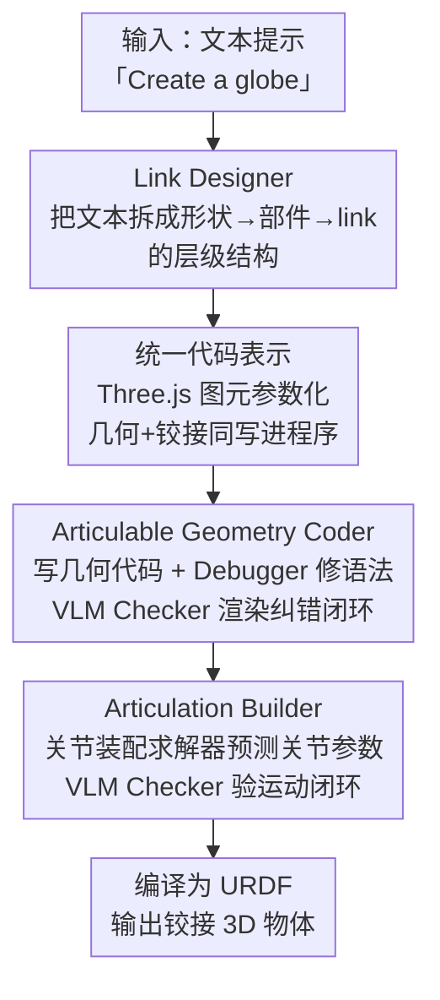

# LAM: Language Articulated Object Modelers

**会议**: CVPR 2026  
**论文**: [CVF Open Access](https://openaccess.thecvf.com/content/CVPR2026/html/Gao_LAM_Language_Articulated_Object_Modelers_CVPR_2026_paper.html)  
**代码**: https://gaoypeng.github.io/LAM （项目页）  
**领域**: 3D视觉  
**关键词**: 铰接物体生成, 文本到3D, 代码生成, 多智能体协作, URDF

## 一句话总结
LAM 把"从文本生成铰接物体"重新表述为统一的代码生成任务，让一队由 LLM 和 VLM 组成的专门模块协作——先规划层级结构，再写几何代码、写关节代码并各自跑 VLM 闭环纠错——直接从一句话造出几何与运动学都正确的铰接 3D 物体，无需任何视觉先验或预制 3D 资产，关节预测成功率达 77.1%，远超 Articulate Anything 的 40.3%。

## 研究背景与动机

**领域现状**：铰接物体（门、抽屉、剪刀、键盘这类带可动部件的物体）在机器人、具身智能、游戏、VR/AR 里无处不在，是搭建可交互虚拟环境的关键。但和静态 3D 物体不同，铰接 3D 模型需要专家手工标注——把物体表示成"部件/子部件的层级树（文献里叫 link）+ 对应的关节、铰接类型、运动范围"，极其耗时，导致现有铰接数据集只有几千个实例。

**现有痛点**：以往工作大多依赖**含结构信息的输入**（图像、视频、图、网格）来重建或生成可动部件，常需预定义标注和部件图来引导。这不仅把输入限死在结构化数据上，还有个根本的可扩展性天花板：基于扩散/图架构的训练方法基本只在部件数很少的物体上演示，想扩到复杂物体（比如 20 个键的键盘）几乎不可行——一是这种高部件数资产的训练数据极度稀缺，二是端到端生成要显式表示每个部件的高分辨率几何，部件一多就计算爆炸、要么显存溢出要么严重过简化。

**核心矛盾**：几何生成和铰接生成是**强耦合**的两个子问题，但显式 3D 表示（网格/体素）的内存随几何分辨率直接增长，部件数一上去就无法承受；而要保证 link 之间关系正确，又必须联合设计几何和铰接，不能分而治之。

**本文目标**：从纯文本（无视觉/结构先验）出发，自动生成几何与铰接都正确、物理合理的铰接 3D 物体，并能扩展到高部件数的复杂物体。

**切入角度**：作者发现**代码**是一种高度压缩的参数化 3D 表示——和网格/体素不同，代码的成本几乎与几何分辨率无关，因此能高效定义部件数大且可变的复杂物体。

**核心 idea**：把几何+铰接统一成单一、可解释的代码表示，让代码充当 link 之间的"结构桥梁"，再用一队 LLM/VLM 专门模块协作生成、并用 VLM 渲染—反馈的闭环自我纠错。

## 方法详解

### 整体框架
输入是一句文本描述 $x$，输出是一个铰接物体 $A=(\mathcal{L},\mathcal{J})$——link 集合 $\mathcal{L}=\{L_i=(M_i,T_i)\}$（每个 link 含网格 $M_i$ 和位姿 $T_i\in SE(3)$）和关节集合 $\mathcal{J}=\{J_{pc}=(T_{pc},t_{pc},a_{pc},\ell_{pc})\}$（关节位姿、类型、运动轴、运动范围），编译器 $\Psi$ 把 $A$ 转成物理合理的 URDF。LAM 用一队专门模块串起来：**Link Designer**（LLM）先把文本拆成"形状→部件→link"的层级结构；**Articulable Geometry Coder** 把结构翻译成 Three.js 几何代码、再经 Debugger 修语法、VLM Checker 渲染图像看几何错误并反馈精修；**Articulation Builder** 在对齐好的 link 上预测关节参数、写关节代码、再经 Debugger 和 VLM Checker 看运动是否物理合理并闭环精修。代码自始至终是统一表示，最后编译成 URDF。

### 关键设计

**1. 统一代码表示：用代码当作几乎与分辨率无关的 3D 生成介质**

端到端文本到 3D 之所以扩不上去，是因为显式几何的内存随分辨率和部件数暴涨。LAM 把代码当作高度压缩的参数化表示——它的成本基本与几何分辨率无关，因此能高效定义部件数大且可变的物体。为让结构对 LLM 可处理，作者引入**层级代码表示**，从形状图元 $S=\{s_k(\phi_k)\}$（调用 Three.js 的 `<BoxGeometry>(l,w,h)` 等图元工厂函数、全部归一到共享坐标系）逐级组装成部件再到 link，每个 link 的网格 $M_i$ 和位姿 $T_i$ 都在程序里定义。这种结构化表示绕开了端到端方法的可控性局限，也让代码成为 link 之间的**可解释结构桥梁**，确保彼此关系正确——这正是它能造出 20 键键盘这类高部件数物体的根本原因。

**2. Link Designer：先想清楚层级结构再动手写代码**

直接让模型一次性吐出整个铰接物体容易结构混乱。Link Designer（默认用 GPT-4o）先对文本做推理，把目标物体分解成"形状→部件→link"的层级结构以及它们之间的关系，相当于先出一张装配蓝图。后续 Coder 都按这张蓝图施工，使得复杂物体的部件归属和父子关系从一开始就清晰，而不是在代码生成时临时拼凑。

**3. Articulable Geometry Coder：VLM 渲染—反馈的闭环把几何错误逐轮修掉**

LLM 初版几何代码常因幻觉含几何错误或物理不合理（比如球和拱错位）。Geometry Coder 把 link 蓝图翻译成可执行代码（用图元工厂函数实例化每个 link 的网格、定位姿 $T_i$ 含位置 $p_i$ 和朝向 $\theta_i$），先由 **Geometry Debugger** 自动修语法，再由 **Geometry Checker**（2D VLM 如 GPT-4o 或 3D VLM 如 PointLLM）纠几何错误：**Geometry Visualizer** 渲染多视角图像和点云（每个 link 上不同颜色便于 Checker 指代），Checker 给出针对性反馈（如"球和拱错位"）驱动迭代精修，直到几何被确认合理。这个**多模态闭环反馈**是系统的基石——它让纯文本生成也能像人改图一样逐轮逼近正确几何。

**4. Articulation Builder：先用装配求解器简化关节，再用 VLM 验运动闭环**

关节预测的难点在相对位姿很难直接预测。作者的 **Joint Assembly Solver** 先做简化：因为几何阶段产出的 link 已在共享世界坐标系里对齐，于是**绕过预测复杂相对关节位姿**，只预测关节类型 $t_{pc}$、父子对 $(L_p,L_c)$ 和关节的绝对 3D 位置 $p_{pc}$。装配时指定一个基座 link 并逐关节迭代：prismatic 和 fixed 关节无需更新位置；revolute 关节则重算子 link 位置以保证绕关节正确转动 $p_c^\text{new}=p_{pc}+R_{pc}(p_c-p_{pc})$，并沿运动学链递归传播位姿更新。之后 **Articulation Coder**（默认 o3，配 Joint Assembly Solver）生成关节代码、**Articulation Debugger** 修语法、**Articulation Visualizer** 给每个关节的子 link 上唯一颜色并模拟出一串运动图像，**Articulation Checker**（2D VLM）评判运动是否物理合理（如柜门是否朝错方向开、抽屉运动是否自然）并反馈，直到运动被确认正确，得到最终关节集 $\mathcal{J}$。

### 一个例子：从"Create a globe"到桌面地球仪
用户输入"Create a globe"。Link Designer 先把它拆成层级 link：底座（Base）、子午线拱（Meridian arch）、球体（Sphere）、轴销（Axis pins）。Geometry Coder 用 Three.js 图元写出每个 link 的 `createScene()` 几何代码并定位姿；Geometry Visualizer 渲出多视角图，Geometry Checker 反馈"sphere 和 arch 错位"，Coder 据此修正坐标直到"object is well built"。随后 Articulation Builder 以底座为基座，预测"base→meridian_arch"为 continuous 关节、轴为 $[0,1,0]$、定关节位置，写成 JSON/代码；Articulation Visualizer 模拟转动序列，Articulation Checker 发现"arch 与 axis pins 的铰接不对"并反馈，Coder 迭代修正，最终编译成一个能正确绕轴旋转的桌面地球仪 URDF。

### 损失函数 / 训练策略
LAM 不训练一个端到端生成网络，而是**编排现成 LLM/VLM** 生成代码：Link Designer 用 GPT-4o，几何用 Gemini-2.5-pro + Three.js，Articulation Coder 用 o3，Checkers 用 Gemini-2.5-flash 和 PointLLM，Debuggers 用 Gemini-2.5-flash 加确定性 Python/JS 脚本验证（以上记为 zero-shot 设定，即各模块都用商用/开源模型直接跑）。为支持微调和验证，作者构建 **LAMBench**：2K 组"文本—代码—铰接物体"配对，用来指令微调开源模型（如 Qwen3-VL-8B）让它学会生成代码。

## 实验关键数据

### 主实验
在 Part-Mobility 数据集（Real2Code 的 5 类、CAGE/SINGAPO 共享 6 类、全部 46 类 General Classes，以及 LAMBench 里 27 个复杂物体的 Open-World Classes）上评测。`LAM*` 指各模块用默认商用模型，zero-shot 指全用 Qwen3-VL-8B，finetuned 指在 LAMBench 上微调 Qwen3-VL-8B。

| 关节预测成功率 | Five Classes | General Classes |
|----------------|--------------|-----------------|
| Real2Code | 13.5% | – |
| URDFormer | – | 14.6% |
| Articulate Anything | 40.3% | 48.9% |
| **LAM\*** | **77.1%** | **68.2%** |
| LAM (zero-shot) | 36.8% | 44.3% |
| LAM (finetuned) | 51.6% | 49.6% |

视觉对齐（CLIP/BLIP，越高越好）和铰接合理性（GPT-5 通过率）在共享类上对比：

| 方法 | CLIP ↑ | BLIP ↑ | GPT-5 ↑ |
|------|--------|--------|---------|
| CAGE | 27.65 | 53.92 | 53.9% |
| SINGAPO | 30.43 | 56.21 | 58.8% |
| Articulate Anything | 28.23 | 56.99 | 65.3% |
| **LAM\*** | **31.94** | **63.76** | **77.0%** |
| LAM (finetuned) | 29.55 | 58.38 | 69.3% |

### 消融实验
分布内生成质量（MMD 越低越好、COV 越高越好、1-NNA 越低越好），用以验证统一代码表示和 LAMBench 的有效性：

| 方法 | MMD ↓ | COV ↑ | 1-NNA ↓ | 说明 |
|------|-------|-------|---------|------|
| CAGE | 0.0193 | 0.6064 | 0.5319 | 扩散+图注意力基线 |
| ArtFormer-PR | 0.0214 | 0.6400 | 0.3950 | 较强基线 |
| **LAM\*** | **0.0149** | **0.6871** | **0.3599** | 商用模型，全面最优 |
| LAM (zero-shot) | 0.0238 | 0.5978 | 0.4887 | 开源模型直接跑 |
| LAM (finetuned) | 0.0210 | 0.6235 | 0.4369 | LAMBench 微调后明显改善 |

### 关键发现
- **统一代码表示带来全面领先**：LAM* 在 MMD、COV、1-NNA 上全部最优，说明生成形状分布既更接近真值又更多样，验证了"代码作生成介质 + 多智能体协作"的有效性。
- **LAMBench 微调显著提升开源模型**：Qwen3-VL-8B 经 LAMBench 微调后，关节成功率从 36.8%→51.6%（Five Classes）、44.3%→49.6%（General），GPT-5 通过率从 66.1%→69.3%，证明该数据集的训练价值。
- **越难越能拉开差距**：在 Open-World 评测里 LAM 的用户偏好达 91.7%，General Classes 上 GPT-5/人类偏好分别 83.2%/84.6%，泛化和复杂物体处理上对 Articulate Anything 形成压倒性优势，而 SINGAPO 在 OOD 类上直接失败。

## 亮点与洞察
- **把"代码当 3D 表示"用到铰接物体上是最聪明的一步**：代码成本与几何分辨率解耦，直接把"部件一多就显存爆"的端到端瓶颈绕开，使 20 键键盘这类高部件数物体可生成——这条思路可迁移到任何"高部件数/可变结构"的 3D 生成。
- **Joint Assembly Solver 的"借力对齐"很巧**：因为几何阶段已在共享世界坐标系里把 link 对齐，关节阶段就无需预测复杂相对位姿，只预测类型/父子对/绝对位置，把难题大幅简化——这是"让上游帮下游减负"的好例子。
- **VLM 渲染—反馈闭环把生成变成可纠错过程**：给每个 link/子 link 上不同颜色让 VLM 能精确指代并给"球和拱错位"这种具体反馈，使纯文本生成也能像人改图一样逐轮收敛，远比一次性生成鲁棒。
- **几何与铰接分两段但共享代码**：用同一份 shape code 串起几何和关节两个闭环，既解耦了两个难题又保住了 link 间关系一致。

## 局限与展望
- **强依赖商用大模型**：LAM* 的高分建立在 GPT-4o/Gemini-2.5-pro/o3 之上，开源 zero-shot 版（Qwen3-VL-8B）成功率掉到 36.8%，微调后也只到 51.6%，说明能力上限受底座模型制约。
- **几何受限于 Three.js 图元库**：用预定义图元参数化组装，对有机/高度不规则形状的表达能力可能不足，论文未充分讨论自由曲面物体。
- **评测部分依赖 LLM 裁判**：铰接合理性用 GPT-5 pass rate 和成对偏好衡量，存在评判者偏置；客观的物理仿真级验证（如真实抓取/操作）尚未给出。
- **闭环成本与收敛性**：多模块多轮 VLM 渲染—反馈的时间/调用成本、以及 Checker 反馈错误时是否会陷入坏循环，论文正文着墨不多。

## 相关工作与启发
- **vs Articulate Anything**：同样走"代码→URDF"路线，但 LAM 用统一代码同时建几何与铰接、且有 VLM 闭环纠错，关节成功率 77.1% vs 40.3%、GPT-5 通过率 77.0% vs 65.3%，复杂/OOD 类上差距更大。
- **vs Real2Code**：Real2Code 用 LLM 为每个关节生成代码、最多重建约 10 个铰接部件，但仍依赖观测输入；LAM 纯文本起步、无视觉先验，Five Classes 成功率 77.1% vs 13.5%。
- **vs CAGE / ArtFormer（扩散/图生成）**：它们靠扩散或图注意力、受高部件数训练数据稀缺和显式几何内存所限难以扩展；LAM 用代码表示绕开内存瓶颈，分布内质量 MMD 0.0149 / COV 0.6871 / 1-NNA 0.3599 全面更优。
- **vs SINGAPO（单图生成）**：SINGAPO 学习几何变体但需图像输入，在 OOD 类上直接失败；LAM 仅凭文本即可对新类泛化（Open-World 用户偏好 91.7%）。

## 评分
- 新颖性: ⭐⭐⭐⭐⭐ "统一代码表示 + 多智能体闭环"把铰接物体生成从结构化输入和部件数天花板里解放出来，切口新颖。
- 实验充分度: ⭐⭐⭐⭐ 关节成功率、视觉对齐、生成质量、人类/GPT 偏好多维评测且含开源微调对比，但客观物理验证和闭环成本分析偏弱。
- 写作质量: ⭐⭐⭐⭐ 框架图清晰、模块职责分明、示例直观；部分实现细节推到补充材料。
- 价值: ⭐⭐⭐⭐⭐ 直击铰接 3D 资产稀缺这一具身/机器人训练瓶颈，能从文本批量造可交互资产，落地价值高。

<!-- RELATED:START -->

## 相关论文

- [\[CVPR 2026\] ArtLLM: Generating Articulated Assets via 3D LLM](artllm_generating_articulated_assets_via_3d_llm.md)
- [\[CVPR 2026\] DICArt: Advancing Category-level Articulated Object Pose Estimation in Discrete State-Spaces](dicart_advancing_category-level_articulated_object_pose_estimation_in_discrete_s.md)
- [\[CVPR 2026\] ArtHOI: Taming Foundation Models for Monocular 4D Reconstruction of Hand-Articulated-Object Interactions](arthoi_taming_foundation_models_for_monocular_4d_reconstruction_of_hand-articula.md)
- [\[CVPR 2026\] ART: Articulated Reconstruction Transformer](art_articulated_reconstruction_transformer.md)
- [\[CVPR 2026\] Clay-to-Stone: Phase-wise 3D Gaussian Splatting for Monocular Articulated Hand-Object Manipulation Modeling](clay-to-stone_phase-wise_3d_gaussian_splatting_for_monocular_articulated_hand-ob.md)

<!-- RELATED:END -->
