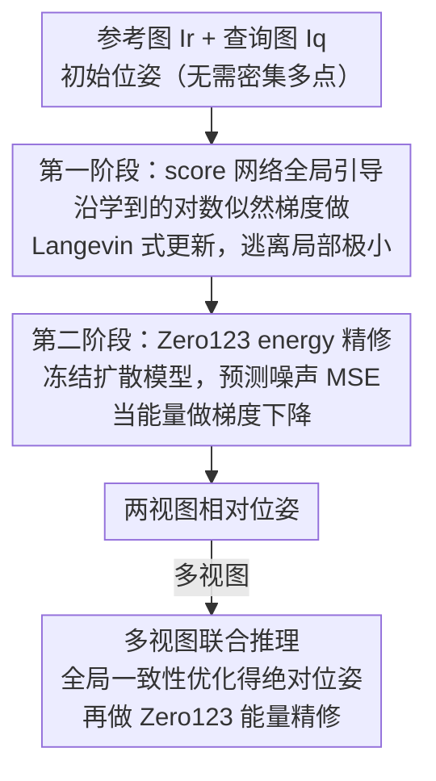

# Landscape-Awareness for Geometric View Diffusion Model

**会议**: CVPR 2026  
**论文**: [CVF Open Access](https://openaccess.thecvf.com/content/CVPR2026/html/Chen_Landscape-Awareness_for_Geometric_View_Diffusion_Model_CVPR_2026_paper.html)  
**代码**: 待确认  
**领域**: 3D视觉 / 相机位姿估计  
**关键词**: 两视图位姿估计, 扩散模型, score-based 优化, 优化 landscape, Zero123

## 一句话总结
针对"用 Zero123 噪声空间 MSE 做两视图相机位姿估计时，损失曲面布满局部极小、必须靠暴力多初始化才能收敛"的痛点，本文先把优化失败的根因归结为物体几何对称/自相似造成的 landscape 局部极小，再用一个 score 网络在第一阶段把更新方向重塑到真值位姿的高似然区，第二阶段再用冻结的 Zero123 MSE 做精修，从而在几乎不依赖多初始化的前提下大幅提升成功率与采样效率。

## 研究背景与动机

**领域现状**：在稀疏视角（尤其是仅两张图、视角差极大）下做相机相对位姿估计时，传统特征匹配会因重叠区太少而失效。近期一类有代表性的做法是"反用"位姿条件扩散模型 Zero123：给定参考图、查询图和一个候选相对位姿，让冻结的 Zero123 预测噪声，把预测噪声与真实噪声的 MSE 当作能量函数，对位姿做梯度下降（如 ID-Pose、iFusion）。相比 RelPose 这类要暴力采样上万候选位姿的能量方法，它把 MSE 当能量、可直接端到端梯度优化，平滑度更好。

**现有痛点**：即便有了扩散模型平滑的梯度，这些方法仍要从多个初始位姿出发、取损失最小的那次，才能避免收敛到错误视角——也就是说优化对初始化极其敏感。

**核心矛盾**：作者把 Zero123 MSE 在固定图像对、变动条件位姿下的损失曲面真正画出来（球坐标下经纬度为 x/y 轴、归一化 MSE 为 z 轴），发现曲面并非单一盆地：有的物体只有一个清晰极小（梯度下降轻松到全局最优），但很多物体因为**几何对称、自相似**会出现沿经度方向的平台、或相距 180° 的两个深谷。一旦轨迹滑进某个局部极小就停在那里——这正是"必须多初始化"的根因，是 landscape 本身的几何性质，而非优化器调参问题。

**本文目标**：把位姿估计从"在坏曲面上反复多点重启"变成"先把曲面/梯度场重塑好，再精修"，从而砍掉对密集多初始化的依赖、提升采样效率。

**切入角度**：既然局部极小源于数据分布本身，那就训练一个能逼近数据分布对数似然梯度（score）的网络，用它在第一阶段把任意初始位姿"推"向高似然区、跨过坏极小；第二阶段再交给精度更高的 Zero123 能量做局部精修。

**核心 idea**：用一个 score 网络重塑优化 landscape 与梯度场来逃离局部极小，再用 Zero123 MSE 精修——score 提供全局引导、扩散能量提供局部细化。

## 方法详解

### 整体框架
方法是一个**两阶段优化框架**，目标是估计参考图 $I_r$ 与查询图 $I_q$ 之间的相对位姿（球坐标 $(\Theta,\Phi,\rho)$，即经纬度与半径差）。第一阶段用一个轻量 score 网络 $s_\theta(I_r,I_q,\tilde{x})$ 预测位姿的更新方向，沿学到的对数似然梯度做 Langevin 式迭代，把位姿推向高概率区、跨过 Zero123 MSE landscape 上的局部极小；当优化大致逃离坏极小后（用固定迭代阈值切换），第二阶段把冻结的 Zero123 当能量函数，用预测噪声与真实噪声的 MSE 梯度做精修。两阶段都靠梯度更新，区别只是梯度来源不同：第一阶段从学到的 score 显式得到，第二阶段从能量损失隐式得到。多视图场景下，先用 score 推出各对相对位姿、再做一次全局一致性优化得到一组绝对位姿作为强初始化，最后再用 Zero123 能量精修。

### 关键设计

**1. score-based 全局引导阶段：用学到的 score 重塑梯度场、逃离局部极小**

这一阶段直接对准"landscape 上有局部极小"的痛点。作者训练一个 score 网络 $s_\theta$ 去逼近在图像对 $y$ 条件下、合理位姿分布的对数似然梯度——网络很轻：ResNet-50 提图像特征，条件位姿用正弦嵌入编码，拼接后过三层 MLP 输出 score。训练用去噪 score matching（DSM）的条件版本 $L(\theta)=\tfrac12\mathbb{E}_{x,y}\mathbb{E}_{\tilde{x}}\|s_\theta(\tilde{x},y)-\nabla_{\tilde{x}}\log p_\sigma(\tilde{x}\mid x,y)\|_2^2$。一个关键简化：因为 score 网络工作在低维位姿空间，作者把 $\tilde{x}$ 从均匀分布 $U$ 采样、并把噪声尺度固定为 $\sigma=1$，从而免去噪声等级条件化——均匀采样让模型学到的是**整个位姿空间的全局梯度结构**而非只围绕真值的局部邻域。推理时按 $\tilde{x}_t=\tilde{x}_{t-1}+\alpha s_\theta(\tilde{x}_{t-1},y)+G z_t$（$G=\mathrm{diag}(\gamma_1,\gamma_2,\gamma_3)$ 控制各坐标噪声尺度）做类 Langevin 更新：学到的 score 提供朝高似然区的漂移、高斯噪声鼓励探索，使期望位姿误差范数按 $\|\mathbb{E}[\tilde{x}_t-x_{gt}]\|=M(1-\alpha)^t$ 指数衰减。作者还在附录证明：在"每个图像对对应唯一真值位姿（条件分布塌成 Dirac delta）"的假设下，均匀采样的简化目标与原始高斯核目标拥有同一个最优解（Lemma 2），因此这个简化是理论无损的。相比 iFusion 直接在坏曲面上多点重启，这里是把梯度场本身换成了指向真值的 score 场。

**2. Zero123 energy 精修阶段：借生成先验做局部细化**

逃出坏极小后，位姿已落到几何一致的区域，但还不够精确。第二阶段直接复用冻结的 Zero123：把查询图编码进潜空间并注入高斯噪声得 $z_t$，Zero123 在参考图与当前位姿条件下预测噪声，预测噪声与真实噪声的 MSE 作为能量 $E$，对位姿求梯度做下降，本质上是在解 $\hat{T}_{r\to q}=\arg\min_{T}\,L(I_q,(I_r,T))+L(I_r,(I_q,T^{-1}))$ 这个双向对称的反问题。它和第一阶段互补：score 给全局引导避免落坑、扩散能量给细粒度局部校正。由于精修阶段吃的是 Zero123 强大的生成先验，即便第一阶段的 score 模型只在较有限的数据上训练，对未见物体也能被精修拉回正确位姿。

**3. 多视图联合推理：用全局一致性纠正个别错对**

两视图方法直接推广到多视图最朴素的做法是各对独立处理，但这会丢掉多视图一致性。作者改为在高维位姿空间做能量优化：$\hat{T}=\arg\min_{\{T_1,\dots,T_n\}}\sum_i\sum_{j\neq i}L\big(I^{(j)},(I^{(i)},T_i^{-1}T_j)\big)$，用一组绝对位姿参数化（$T_{i\to j}=T_i^{-1}T_j$）消除冗余、强制全局一致，从而让可靠的相对关系去纠正错误的那些。但该目标解空间随视角数指数增长，多点重启代价高且易陷局部极小——于是仍套用两阶段框架：先用 score 推出所有成对相对位姿、做一次全局优化得到一致的绝对位姿作为强初始化，再用 Zero123 能量精修得最终位姿集合。

### 损失函数 / 训练策略
score 网络用条件 DSM 损失（式 3）训练，$\tilde{x}\sim U$ 均匀采样、$\sigma=1$ 固定；第二阶段 Zero123 全程冻结、不训练，仅在推理时被当作能量函数对位姿求梯度。两阶段切换采用固定迭代阈值（因为精确判断"何时已逃离局部极小"在实践中很难）。

## 实验关键数据

### 主实验
合成数据集 GSO 与 OO3D 上的位姿估计结果。这里区分两个核心自定义指标：**Recall (R)** 取 $N$ 次随机初始化里损失最小的那次预测是否达阈值（衡量"最好情况"）；**Success Rate (SR)** 评估全部 $N$ 次预测中达阈值的比例（衡量对初始化的鲁棒性）。`R(R)/SR(R)` 是只看旋转阈值的版本。@5/@15/@30 为旋转阈值（度），平移阈值固定 0.2；Rot./Trans. 为误差中位数。

| 数据集 | 方法 | SR@15 ↑ | SR@30 ↑ | R@30 ↑ | Rot.↓ |
|--------|------|---------|---------|--------|-------|
| GSO | ID-Pose | 0.118 | 0.146 | 0.607 | 10.29 |
| GSO | iFusion | 0.365 | 0.382 | 0.918 | 3.07 |
| GSO | **本文** | **0.811** | **0.836** | 0.927 | 3.63 |
| OO3D | iFusion | 0.306 | 0.332 | 0.882 | 4.76 |
| OO3D | **本文** | **0.780** | **0.848** | 0.905 | 5.15 |

成功率（SR）是提升最猛的一栏：GSO 上 SR@30 从 iFusion 的 0.382 提到 0.836、OO3D 上从 0.332 提到 0.848，说明本文方法对初始化远更鲁棒，不再依赖暴力多初始化；而 Recall（最好情况）与旋转/平移误差与 SoTA 基本持平（GSO Rot. 3.63 vs iFusion 3.07，略逊但同量级）——这正符合预期：本文要解决的不是"最好一次能不能对"，而是"是不是每次都能对"。

真实数据 HOPEv2（28 个杂货物体、50 个场景）上同样验证了鲁棒性，且强几何对称物体靠纹理差异得到有效消歧：

| 数据集 | 方法 | SR@30 ↑ | Rot.↓ | Trans.↓ |
|--------|------|---------|-------|---------|
| HOPEv2 | VGGT | 0.631(R) | 8.10 | 0.132 |
| HOPEv2 | iFusion | 0.206 | 14.78 | 0.151 |
| HOPEv2 | **本文** | **0.786** | 8.96 | **0.059** |

HOPEv2 上 SR@30 从 iFusion 的 0.206 跳到 0.786、平移误差从 0.151 降到 0.059，真实场景下的稳健性提升非常明显。

### 消融实验
多视图联合推理的分阶段消融（Recall@15，随视角数变化），用以验证两阶段各自的贡献：

| 配置 | 2 视图 | 3 视图 | 4 视图 | 5 视图 | 说明 |
|------|--------|--------|--------|--------|------|
| w/o Stage 1 | 0.200 | 0.103 | 0.065 | 0.075 | 去掉 score 引导，视角越多越差 |
| w/o Stage 2 | — | — | — | — | 去掉 Zero123 精修 |
| Stage 1 + 2（完整） | 更高 | 更高 | 更高 | 更高 | 两阶段互补 |

去掉第一阶段后，多视图召回随视角数增加反而快速下滑（2→5 视图从 0.200 掉到 0.075），说明在指数增长的高维位姿解空间里，没有 score 全局引导、仅靠能量优化极易陷入局部极小；两阶段配合才能稳住多视图一致性。

### 关键发现
- 第一阶段（score 引导）是"鲁棒性"的来源：它对成功率（SR）和多视图召回的贡献最大，去掉后掉点最严重。
- 第二阶段（Zero123 精修）是"精度与泛化"的来源：借生成先验，即使 score 模型训练数据有限，对未见物体也能精修到正确位姿。
- 在采样数 $N$ 较小时本文相对 iFusion 的召回优势更明显（图 6），印证了"减少对暴力多初始化依赖、提升采样效率"的核心主张。

## 亮点与洞察
- 把"位姿估计为什么会失败"具象成可视化的损失 landscape，并将根因精确归到几何对称/自相似导致的局部极小——这种"先把曲面画出来再设计方法"的诊断式叙事，比直接堆网络更有说服力，是这篇最"啊哈"的地方。
- 低维位姿空间允许 score 的训练目标大幅简化（均匀采样 + 固定 $\sigma=1$ 免噪声条件化），且作者证明在"唯一真值位姿"假设下与高斯核目标同最优——把工程简化做成了理论无损，值得借鉴。
- "score 全局引导 + 扩散能量局部精修"这套两阶段思路可迁移到其它"曲面非凸、易陷局部极小"的反问题优化（如基于生成模型反演的形状/光照估计）：先学一个 score 重塑梯度场逃坑，再用强先验能量精修。

## 局限与展望
- 两阶段切换用的是**固定迭代阈值**而非自适应判据，因为"何时已逃离局部极小"难以精确判断——阈值设置可能在不同物体/数据集上需要调整。
- 在 Recall 与旋转误差等"最好情况"指标上，本文只是与 SoTA 持平甚至略逊（GSO Rot. 3.63 vs iFusion 3.07），核心增益集中在成功率/采样效率；对只关心单次最优精度的场景吸引力有限。
- score 网络的训练数据规模相对 VGGT 这类方法更有限，对未见物体主要靠第二阶段 Zero123 的生成先验兜底；若目标域与 Zero123 预训练分布差异大，泛化可能受限。⚠️ 多视图全阶段消融的 w/o Stage 2 等具体数值原文表格未完整给出，以原文为准。

## 相关工作与启发
- **vs iFusion / ID-Pose**：它们同样反用 Zero123 把 MSE 当能量做梯度优化，但直接在非凸曲面上靠多初始化取最优；本文先用 score 重塑梯度场逃离局部极小，再做能量精修，大幅提升成功率与采样效率。
- **vs RelPose 等能量采样法**：后者要暴力采样上万候选位姿、计算低效；本文用平滑的扩散能量 + score 引导支持端到端梯度优化。
- **vs DUSt3R / VGGT / MASt3R**：这类预测稠密射线或点图、提供更强几何约束，Recall 上很强；本文走"反演生成模型 + 重塑优化"的另一条路，在成功率与真实场景平移误差上有独到优势。

## 评分
- 新颖性: ⭐⭐⭐⭐⭐ 把位姿估计失败归因到可视化 landscape 的局部极小，并用 score 重塑梯度场，视角新颖且诊断扎实。
- 实验充分度: ⭐⭐⭐⭐ 合成（GSO/OO3D）+ 真实（HOPEv2）+ 未见物体 + 多视图消融，覆盖较全，但部分消融数值未完整呈现。
- 写作质量: ⭐⭐⭐⭐ landscape 可视化与两阶段动机叙述清晰，理论部分较密集需对照附录。
- 价值: ⭐⭐⭐⭐ 显著降低对多初始化的依赖、提升采样效率，对生成模型反演类位姿估计有方法论启发。

<!-- RELATED:START -->

## 相关论文

- [\[CVPR 2026\] DMAligner: Enhancing Image Alignment via Diffusion Model Based View Synthesis](dmaligner_enhancing_image_alignment_via_diffusion_model_based_view_synthesis.md)
- [\[CVPR 2026\] PromptDepth: Efficient and Promptable Geometric 3D Vision Model for Embodied Intelligence](promptdepth_efficient_and_promptable_geometric_3d_vision_model_for_embodied_inte.md)
- [\[CVPR 2026\] Iris: Bringing Real-World Priors into Diffusion Model for Monocular Depth Estimation](iris_bringing_realworld_priors_into_diffusion_model_for_monocular_depth_estimation.md)
- [\[CVPR 2026\] SmokeSVD: Smoke Reconstruction from A Single View via Progressive Novel View Synthesis and Refinement with Diffusion Models](smokesvd_smoke_reconstruction_from_a_single_view_via_progressive_novel_view_synt.md)
- [\[CVPR 2025\] MVGD: Zero-Shot Novel View and Depth Synthesis with Multi-View Geometric Diffusion](../../CVPR2025/3d_vision/zero-shot_novel_view_and_depth_synthesis_with_multi-view_geometric_diffusion.md)

<!-- RELATED:END -->
