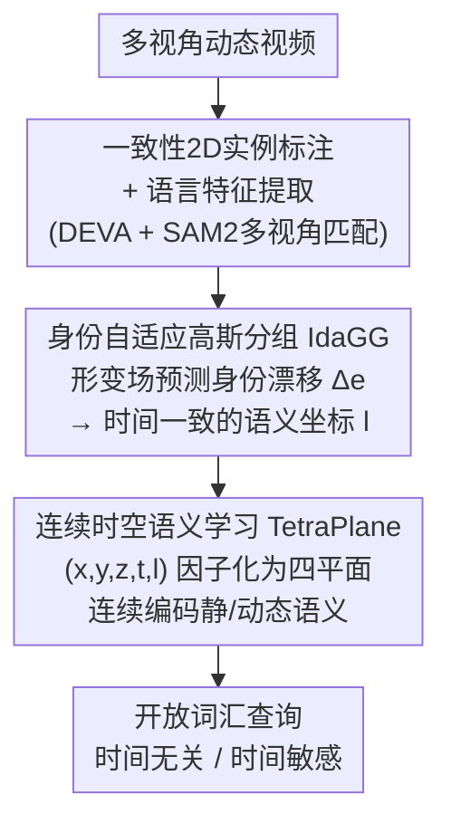

# LangField4D: Learning Identity-Adaptive and Spatio-Temporal Continuous 4D Language Fields for Dynamic Scenes

**会议**: CVPR 2026  
**论文**: [CVF Open Access](https://openaccess.thecvf.com/content/CVPR2026/html/Xu_LangField4D_Learning_Identity-Adaptive_and_Spatio-Temporal_Continuous_4D_Language_Fields_for_CVPR_2026_paper.html)  
**代码**: 待确认  
**领域**: 3D视觉  
**关键词**: 4D语言场, 高斯泼溅, 开放词汇查询, 身份自适应, 时空连续语义

## 一句话总结
LangField4D 在 4D 高斯泼溅上构建开放词汇语言场，用「身份自适应高斯分组」解决高斯随形变跨物体边界漂移导致的语义不一致，再用「TetraPlane 连续时空语义表示」替代离散状态原型，在动态场景的时间无关 / 时间敏感查询上都刷新了 SOTA。

## 研究背景与动机

**领域现状**：把 CLIP 之类视觉-语言模型的语义嵌入注入 NeRF / 3D 高斯泼溅（3D-GS）已经能在静态场景上做开放词汇查询（如 LERF、LangSplat）。当需求扩展到动态场景时，自然的一步是在 4D 高斯泼溅（4D-GS，用形变场建模高斯随时间的运动）上建「4D 语言场」，4DLangSplat 是这条线的代表 SOTA。

**现有痛点**：4DLangSplat 用双场设计——静态场编码时间无关语义（沿用 LangSplat 的 CLIP 特征）、动态场建模时间变化语义。但它有两个致命假设站不住：（1）认为每个高斯的物体身份固定不变，可现实里形变场会把同一个高斯「拧」到不同物体上，作者称之为**高斯 ID 振荡（Gaussian ID Oscillation）**，导致同一实例的语义忽明忽暗、前后不一致；（2）动态语义被建模成 $K$ 个离散预定义状态原型再做插值，这会引入**动作边界偏差（Action Boundary Bias）**，无法刻画连续的状态变化、模糊掉细粒度的时间边界（如「饼干被掰开」这一瞬间）。

**核心矛盾**：4D 语言场要同时把「时间无关语义」（这是什么物体）和「时间变化语义」（它此刻在做什么）建好，而前者要求**身份在时间上稳定**，后者要求**状态在时间上连续可微**——旧方法在身份上用了静态假设、在状态上用了离散原型，两头都没满足。

**本文目标**：（1）让每个高斯在任意时刻都能正确对应到它所属的物体实例；（2）把时变语义建成连续函数而非离散原型插值。

**切入角度**：身份漂移的根源是形变场，那就让形变场自己来「预测身份的漂移量」；既然 4D-GS 已经能把时空场分解成多平面（HexPlane）来解耦几何，那语义场也可以用类似的因子化平面、并把「实例身份」当成一个新的可查询维度塞进去。

**核心 idea**：用「身份自适应」取代「身份静态」来消除 ID 振荡，用「连续 TetraPlane 语义」取代「离散状态原型」来消除动作边界偏差。

## 方法详解

### 整体框架
LangField4D 建在 4D-GS 之上，是一条两阶段串行的流水线。输入是动态场景的多视角视频，输出是一个支持开放词汇文本查询、并能区分「时间无关 / 时间敏感」语义的 4D 语言场。

先做数据预处理（脚手架，沿用 4DLangSplat 路线）：用 DEVA 在每个视角内得到时间一致的层级实例掩码，再用一套基于 SAM2 的提示式多视角匹配机制——把同一时刻的多视角图当成「伪视频」，挑参考视角的物体掩码塞进 SAM2 记忆库往其他视角传播、按匹配频率投票——得到跨视角一致的全局实例 ID，并提取像素级 CLIP / 文本语言特征作为监督信号。

随后是两个真正的贡献模块：**身份自适应高斯分组（IdaGG）**先给每个高斯算出一个随时间漂移修正过的离散实例标签 $l$（语义坐标），把 ID 振荡压住；**连续时空语义学习（TetraPlane）**再以这个语义坐标为锚，把 $(x,y,z,t,l)$ 的 5D 空间因子化成四张 2D 平面，连续地编码静态语义与动态语义，最终经两个轻量 MLP 解码出可被文本查询的静/动态语义嵌入。

### 关键设计

**1. 身份自适应高斯分组（IdaGG）：让形变场自己预测身份漂移，消除高斯 ID 振荡**

针对「高斯随形变被拧到别的物体上、身份忽变」这个痛点。原始 Gaussian Grouping 给每个高斯一个**静态**身份编码 $e\in\mathbb{R}^{16}$，静态场景没问题，但动态场景里这个编码跟不上运动。IdaGG 的做法是：给定高斯的空间位置 $(x,y,z)$ 与时刻 $t$，用 4D-GS 的 HexPlane 时空编码器查询得到形变感知特征 $f_d$（它隐含了运动引起的实例归属变化信息），再在多头 MLP 解码器 $D$ 里加一个轻量的身份自适应头 $\phi_{id}$，预测身份编码的漂移修正量，得到时刻 $t$ 的自适应身份编码：

$$e' = e + \phi_{id}(f_d).$$

把 $e'$ 经可微泼溅渲染成 2D 身份特征图、再过一个线性层 $FC_{cls}$ 恢复到 $n$ 维（$n$ 为 4D 场景中掩码标签总数）做 softmax 分类，用 2D 身份损失 $\mathcal{L}_{2d}$（标准 $n$ 类交叉熵）和 3D 正则 $\mathcal{L}_{3d}$（鼓励形变空间里相邻高斯局部一致）来优化。训练完对动态身份嵌入取 $\arg\max$，同一物体的高斯在任意时刻都被一致地赋成同一个离散标签 $l\in\{1,\dots,n\}$。这个 $l$ 就是后续语义表示空间里的**语义坐标**——一个不随形变漂移的稳定实例标识。相比静态 $e$，它把「身份在时间上的变化」显式交给形变场来学，从根上掐断了 ID 振荡。

**2. 连续时空语义学习（TetraPlane）：把实例身份当成新维度因子化，消除动作边界偏差**

针对「离散状态原型插值导致动作边界模糊」这个痛点。语义坐标 $l$ 只是个抽象标识，缺乏开放词汇查询所需的丰富语义；本设计要把 $l$ 连同其时空上下文 $(x,y,z,t)$ 映射到语言特征。借鉴因子化思想，作者把这个 5D 语义空间分解成四张多分辨率 2D 平面（合称 **TetraPlane**）：三张**空间-语义平面** $P_{xl}, P_{yl}, P_{zl}$ 编码时间无关的物体级语义，一张**时间-语义平面** $P_{tl}$ 把物体级线索与时间融合、连续地建模物体状态。每张平面 $P_c\in\mathbb{R}^{h\times mN\times mN}$。对每个高斯，把它的两两坐标投影到对应平面上做双线性插值取特征，各平面特征经 Hadamard 积融合，跨 $m$ 个分辨率级拼接后过小 MLP $\phi_d$ 得到最终语义特征：

$$f_{sem}(g) = \phi_d\!\left(\prod_{c}^{m} f(g)_c\right).$$

再用两个轻量 MLP 解码器把 $f_{sem}$ 拆成静态语义 $\phi_{static}$（时间无关）和动态语义 $\phi_{dynamic}$（时间相关）。关键在于：把离散原型插值换成在连续潜空间里以 $t$ 为自变量的可微查询，于是任意时间点都能取到平滑语义，动作边界不再被插值「拍平」。训练用交替策略在静/动态目标间切换，主监督是渲染语义特征与目标嵌入的 $\mathcal{L}_{lang}$（L1），并加空间 TV 正则 $\mathcal{L}_{TV}$ 与沿时间维的 1D Laplacian 平滑正则 $\mathcal{L}_{smooth}$（惩罚时间「加速度」过大，逼出平滑状态演化）。

### 损失函数 / 训练策略
- 重建阶段：$\mathcal{L}_{render} = \mathcal{L}_{rgb} + \lambda_{id}(\mathcal{L}_{2d} + \mathcal{L}_{3d})$，其中 $\mathcal{L}_{rgb}$ 是 4D-GS 的图像重建损失。
- 语义 TetraPlane 阶段：$\mathcal{L}_{tetra} = \mathcal{L}_{lang} + \mathcal{L}_{TV} + \mathcal{L}_{smooth}$，静/动态目标交替优化。

## 实验关键数据

**评测指标说明**：时间无关查询用 **mIoU**（所有测试帧上的平均交并比）；时间敏感查询用 **Acc**（$=n_{correct}/n_{all}$，命中正确时间段的比例）和 **vIoU**（video IoU，衡量分割在时间上的一致性）。

### 主实验
数据集：4DLangSplat 基准（建在 HyperNeRF 与 Neu3D 上）。主要对比 4DLangSplat（4D 开放词汇 SOTA），时间无关查询另对比若干 3D 语言特征渲染方法。

时间敏感查询（HyperNeRF，%，越高越好）：

| 测试场景 | 4DLangSplat vIoU | Ours vIoU | 4DLangSplat Acc | Ours Acc |
|----------|------------------|-----------|-----------------|----------|
| chickchicken | 72.83 | 75.61 | 88.04 | 88.04 |
| split-cookie | 33.36 | **79.95** | 47.17 | **92.45** |
| espresso | 50.46 | 51.23 | 82.51 | 84.61 |
| americano | 31.49 | 50.46 | 52.88 | 74.04 |
| **overall** | 47.04 | **64.31** | 67.65 | **84.79** |

时间无关查询（mIoU %）：

| 方法 | HyperNeRF | Neu3D |
|------|-----------|-------|
| Feature-3DGS | 36.63 | 34.96 |
| Gaussian Grouping | 50.49 | 49.93 |
| LangSplat | 74.92 | 61.49 |
| 4DLangSplat | 80.93 | 55.18 |
| **Ours** | **83.09** | **71.62** |

时间敏感整体 vIoU 47.04→64.31、Acc 67.65→84.79，提升主要来自 split-cookie 这类有明显动作边界的场景（vIoU 33→80）；时间无关在 Neu3D 上提升尤为夸张（55.18→71.62），说明身份自适应对动态物体的静态定位也有正向收益。

### 消融实验
TetraPlane 与 IdaGG 的消融（HyperNeRF）：

| 配置 | 时间无关 mIoU | 时间敏感 vIoU | 时间敏感 Acc | 说明 |
|------|--------------|--------------|-------------|------|
| MLPs | 80.85 | 51.61 | 71.95 | 双 MLP 解码器基线 |
| MLPs + IdaGG | 82.63 | 52.59 | 70.79 | 加身份自适应 |
| TetraPlane | 81.94 | 60.03 | 80.97 | 换连续平面表示 |
| TetraPlane + IdaGG | **83.09** | **64.31** | **84.79** | 完整模型 |

### 关键发现
- **TetraPlane 是时间敏感性能的主力**：从 MLPs（vIoU 51.61）换到 TetraPlane（60.03）跳了近 9 个点，证明连续表示对刻画状态演化、消除动作边界偏差至关重要。
- **IdaGG 主要补时间无关 + 稳定边界**：在两种语义骨干上都一致抬高时间无关性能，并在定性上抑制 ID 振荡、保持运动中物体边界锐利稳定。
- 两者叠加才拿到最优，说明「稳定身份」与「连续语义」是互补而非冗余的。

## 亮点与洞察
- **把「身份的时间变化」交给形变场预测**，是很顺的一招：形变场本来就在算高斯怎么动，顺手让它输出身份漂移量 $\Delta e$，几乎零额外结构就解决了 ID 振荡，可迁移到任何基于形变场的 4D 编辑 / 跟踪任务。
- **把实例身份当成可查询维度塞进因子化平面**，是这篇最「啊哈」的地方：HexPlane 因子化几何、TetraPlane 把它扩成「空间×语义」「时间×语义」，等于用一个 5D 解耦空间统一了静态身份与动态状态，结构紧凑又连续可微。
- 用 1D 时间 Laplacian 正则惩罚状态「加速度」来逼平滑演化，这个思路对任何需要连续时序语义的场（音频、动作理解）都能借用。

## 局限与展望
- 作者承认：方法依赖 DEVA 做分割与时间一致 ID，上游一致性不好时整个语义场会跟着崩；当 MLLM 对物体细粒度动作状态的描述不够精确时，时间敏感语义建模仍然吃力。
- 自己看：评测仅在 HyperNeRF / Neu3D 两个相对小的合成/受控基准上，真实大规模动态场景（强遮挡、快速运动、多实例交错）的泛化未验证；两阶段串行也意味着第一阶段身份标签错了会直接污染第二阶段语义。
- 改进方向：把数据预处理的实例一致性与语义学习端到端联合优化，减少对 DEVA / SAM2 离线产物的硬依赖。

## 相关工作与启发
- **vs 4DLangSplat**：同样建 4D 语言场，4DLangSplat 用静态身份 + 离散状态原型插值，本文用身份自适应 + 连续 TetraPlane，针对性消除了 ID 振荡和动作边界偏差，时间敏感整体大幅领先。
- **vs Gaussian Grouping / SA4D**：Gaussian Grouping 给静态高斯固定身份编码做 3D 分割，SA4D 加时间身份特征场扩到 4D；本文进一步让身份编码随形变**自适应漂移**，而不是只加一个时间维特征。
- **vs LangSplat**：LangSplat 在静态 3D 上用 SAM 多粒度掩码支持开放词汇，本文把这套思路连续化、动态化到 4D，并解决了动态特有的身份漂移问题。

## 评分
- 新颖性: ⭐⭐⭐⭐⭐ 「身份漂移交给形变场预测」+「身份当作可查询维度的 TetraPlane」两个 idea 都很对症且优雅。
- 实验充分度: ⭐⭐⭐⭐ 两阶段消融清晰、定性丰富，但基准偏小、真实场景泛化未充分验证。
- 写作质量: ⭐⭐⭐⭐ 痛点（ID 振荡 / 动作边界偏差）定义清楚，图文对照到位。
- 价值: ⭐⭐⭐⭐ 为动态 4D 语言场提供了可复用的身份自适应与连续语义范式。

<!-- RELATED:START -->

## 相关论文

- [\[CVPR 2026\] ST4R-Splat: Spatio-Temporal Referring Segmentation in 4D Gaussian Splatting](st4r-splat_spatio-temporal_referring_segmentation_in_4d_gaussian_splatting.md)
- [\[CVPR 2026\] STS-Mixer: Spatio-Temporal-Spectral Mixer for 4D Point Cloud Video Understanding](sts_mixer_4d_point_cloud.md)
- [\[CVPR 2026\] MotionScale: Reconstructing Appearance, Geometry, and Motion of Dynamic Scenes with Scalable 4D Gaussian Splatting](motionscale_reconstructing_appearance_geometry_and_motion_of_dynamic_scenes_with.md)
- [\[CVPR 2026\] SLARM: Streaming and Language-Aligned Reconstruction Model for Dynamic Scenes](slarm_streaming_and_language-aligned_reconstruction_model_for_dynamic_scenes.md)
- [\[CVPR 2026\] Revisiting Monocular SLAM with Spatio-Temporal Scene Modeling](revisiting_monocular_slam_with_spatio-temporal_scene_modeling.md)

<!-- RELATED:END -->
