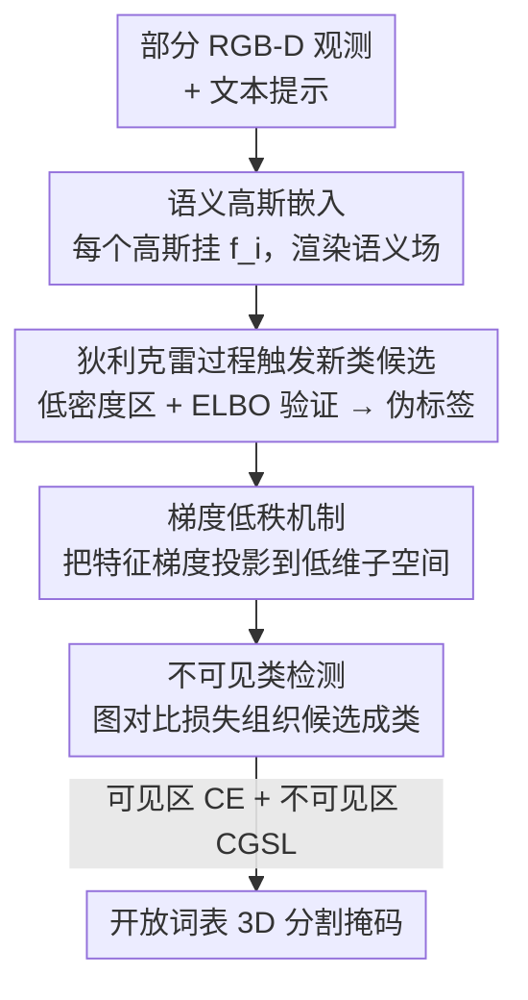

# LangRef3DGS: Natural Language-Guided 3D Referential Segmentation from Partial Observations via 3D Gaussian Splatting

**会议**: CVPR 2026  
**论文**: [CVF Open Access](https://openaccess.thecvf.com/content/CVPR2026/html/Ye_LangRef3DGS_Natural_Language-Guided_3D_Referential_Segmentation_from_Partial_Observations_via_CVPR_2026_paper.html)  
**代码**: https://github.com/Tap12345/LangGS （有）  
**领域**: 3D视觉  
**关键词**: 3D高斯泼溅, 语言引导分割, 开放词表, 狄利克雷过程, 低秩梯度

## 一句话总结
在 3D Gaussian Splatting 表示上构建一个语义连续场，用狄利克雷过程自动发现新类、用梯度低秩约束压缩语义特征、再用图对比损失把零散候选组织成"不可见类"，从而在 RGB-D 视角稀疏/遮挡的部分观测条件下，依然能按自然语言提示稳健地做开放词表 3D 分割。

## 研究背景与动机
**领域现状**：语言引导的 3D 分割把"几何感知"和"语义理解"连了起来——给一句自然语言提示（如 "segment the tea glass"），方法要在 3D 场景里定位并分割出对应物体。近年主流是把 CLIP 等 2D 视觉-语言特征蒸馏进 NeRF / 3DGS 表示（如 LERF、LangSplat、OpenGaussian），或借 SAM 掩码把高斯分组成实例。

**现有痛点**：真实 RGB-D 数据里相机覆盖有限、场景动态变化，**视角天然稀疏且互相遮挡**。监督式网络依赖密集标注、且在闭集上训练后会把"没见过/被遮挡"的区域强行误判成某个已知类；自/无监督方法假设数据分布固定，无法泛化到开放词表描述；很多 RGB-D 管线还隐式依赖颜色/深度线索的完整性，线索一缺语义推理就崩。

**核心矛盾**：作者把失败归结为两个纠缠的因素。其一，**部分观测导致特征嵌入模糊纠缠**——小物体或被遮挡物体只对应稀疏、低密度的高斯，难以从已有类别里分离出来；其二，**当前网络学到的语义特征空间是高秩、冗余的**，分布一漂移，不同类的特征流形就互相重叠、不稳定，在开集/语言驱动/部分视角下错误被放大。

**本文目标**：在部分 RGB-D 观测下，既要发现预定义标签空间之外的新类，又要让特征空间足够紧凑可分，从而同时分割"可见"和"不可见"类别。

**切入角度**：作者选 3DGS 作为载体——它是显式、点状、可微的表示，支持实时栅格化渲染，又能把语义特征作为高斯属性挂上去，构成一个语义连续场，天然能把信息传播到未观测区域。在此之上引入两个统计/优化工具：狄利克雷过程负责"无监督开类"，梯度低秩负责"压冗余、增可分"。

**核心 idea**：用"3DGS 语义连续场 + 狄利克雷过程自动开类 + 梯度低秩压特征 + 图对比组织新类"这一套组合，把部分观测下的开放词表 3D 分割做稳。

## 方法详解

### 整体框架
方法以 3DGS 为底座：每个高斯基元除了几何（中心 $\mu_i$、协方差 $\Sigma_i$）和外观 $c_i$，还挂一个可学习语义嵌入 $f_i\in\mathbb{R}^d$，并像渲染颜色一样把语义沿光线 alpha 合成出语义场 $S(u)=\sum_i T_i\alpha_i f_i$。在这个语义场上，先用狄利克雷过程从"低密度高斯区域"触发潜在新类候选并打伪标签；同时用梯度低秩机制把语义特征的更新限制在一个低维子空间里，去冗余、增类间紧凑；最后把零散的 DP 候选放进一张全局语义相似图，用图对比损失把同类候选聚成高亲和子图、异类推开，从而把"点级证据"升级成"成型的不可见类"。可见区用交叉熵监督，不可见区用图对比损失，二者混合优化。

### 关键设计

**1. 语义高斯嵌入：把语义做成可微连续场，让信息能传到没看见的地方**

针对"部分观测下信息缺失、离散点表示不可微"的痛点，作者给每个高斯基元 $i$ 关联一个可学习语义向量 $f_i\in\mathbb{R}^d$，堆叠成全局语义特征矩阵 $F=[f_1,\dots,f_N]^\top\in\mathbb{R}^{N\times d}$。渲染时类比颜色的 alpha 合成，得到像素 $u$ 处的语义场 $S(u)=\sum_{i=1}^{N}T_i\,\alpha_i\,f_i$，其中 $T_i=\prod_{j<i}(1-\alpha_j)$ 是透射率。由于高斯本身提供解析的投影与混合规则，整个语义场对高斯参数可微、可直接由图像观测监督。这个连续场是后续一切的基础：它既能算与文本原型的相似度做语言查询，又能把已观测区的语义沿几何"涂抹"到未观测区，缓解部分视角下的信息空洞。

**2. 狄利克雷过程触发新类候选：把低密度高斯当成"新概念"的信号**

针对"闭集网络会把没见过的区域强行塞进已知类"的痛点，作者观察到一个朴素但关键的现象：稀疏/遮挡视角下，大物体积累密集稳定的高斯，而小物体或部分观测物体只剩稀疏低密度高斯，这些区域很难被已有语义类别解释——它们正是潜在新类的天然指示器。于是用狄利克雷过程混合高斯（DP-GMM）对语义特征建模：$p(f_i)=\sum_{k}\pi_k\,\mathcal{N}(f_i\mid\mu_k,\Sigma_k)$，混合权重由 stick-breaking 过程 $\pi_k=v_k\prod_{j<k}(1-v_j),\ v_k\sim\mathrm{Beta}(1,\alpha)$ 生成，$\alpha$ 控制开新簇的灵活度。当某特征落在现有混合的低密度区 $\max_k\mathcal{N}(f_{\text{new}}\mid\mu_k,\Sigma_k)<\varepsilon$ 时，它成为新类候选。为防止滥开簇，每个候选要通过变分 ELBO 增量验证，只有 $\Delta\text{ELBO}=\mathcal{L}_{\text{new}}-\mathcal{L}_{\text{exist}}>0$ 才真正实例化一个新成分，并对权重过小的成分（$\pi_k<\gamma_{\text{merge}}$）做合并/剪枝以保持紧凑。被接受的成分给出软分配 $q(z_i=k)$，构成伪标签项 $L_{DP}=-\sum_i\sum_k q(z_i{=}k)\log\mathcal{N}(f_i\mid\mu_k,\Sigma_k)$，去监督下游聚类。这相当于把"开放词表"问题转成"非参贝叶斯按需开类"，避免了固定标签空间的死板。

**3. 梯度低秩机制：把语义特征压进低维子空间，去冗余、增类间可分**

针对"语义特征空间高秩冗余、相邻类语义坍塌"的痛点，作者借用 GaLore 系的观察——训练中神经网络的梯度矩阵天然趋于低秩（即便参数矩阵满秩），说明优化主要发生在一个紧凑子空间里。于是不直接用全梯度更新 $F$，而是把特征梯度投影到低秩子空间：$\tilde\nabla_F L=P^\top(\nabla_F L)Q$，其中 $P\in\mathbb{R}^{N\times r}$、$Q\in\mathbb{R}^{d\times r}$ 是正交投影、$r\ll\min(N,d)$。论文进一步给出稳定秩 $\mathrm{sr}(\nabla_F L_t)=\|\cdot\|_F^2/\|\cdot\|_2^2$ 随训练以 $\big(\tfrac{1-\eta\lambda_2}{1-\eta\lambda_1}\big)^{2(t-t_0)}$ 指数衰减的界（⚠️ 公式较繁、以原文为准），说明正交残差能量逐步消失、梯度集中到低维主子空间。更新规则 $F_{t+1}=F_t-\eta\,\tilde\nabla_F L$，其中 $P,Q$ 通过对 $\nabla_F L$ 做截断 SVD 周期性重算。这样特征在结构化低秩子空间里演化，既减优化负担又增类间紧凑，对新类发现和稳定语义对齐都有利。

**4. 不可见类检测：用图对比损失把零散候选组织成成型的类别**

针对"DP 候选只是点级证据、缺乏关系结构、不能当稳定语义类"的痛点，作者把所有高斯嵌入放进一张全局语义相似图 $G\in\mathbb{R}^{N\times N}$：可见点从渲染伪掩码拿到监督边，不可见点（含全部 DP 候选）靠图推断的亲和度建立结构，从而把弱 DP 线索传播成强关系证据。核心是对比图语义损失（CGSL）：对一对高斯 $(i,j)$，$\Phi=\sum_{i,j}\big(\|f_i-f_j\|_2^2-G_{ij}\big)^2$，同类时 $G_{ij}=0$ 拉近特征、异类时 $G_{ij}=\eta>0$ 推开；图里未知的亲和度用语义空间 KNN 估计以保拓扑连续。再加 $\ell_1$ 稀疏正则 $L_{CGSL}=\Phi+\phi\sum_i\|f_i\|_1$ 把特征推向近离散值、让未见簇更清晰可分。最终混合损失 $L_{\text{total}}=\delta L_{CE}+\mu L_{CGSL}$：可见区用交叉熵对齐伪标签、不可见区让新类在图结构对比学习中自然涌现。

### 损失函数 / 训练策略
整体目标是混合损失 $L_{\text{total}}=\delta L_{CE}+\mu L_{CGSL}$，其中可见区交叉熵 $L_{CE}$ 由渲染语义掩码对伪 GT 监督，不可见区由对比图语义损失 $L_{CGSL}$（含 $\ell_1$ 稀疏项）驱动；狄利克雷过程侧另有伪标签项 $L_{DP}$。梯度低秩机制在反传层面通过对 $\nabla_F L$ 的截断 SVD 周期性更新投影矩阵 $P,Q$ 实现，不引入额外的渲染损失。

## 实验关键数据

### 主实验
在 LERF-Mask 与 LERF-OVS 上评测（前者物体中心、边界清晰，用 mIoU/mBIoU；后者复杂布局、多指代表达，用 mIoU/mAcc）。密集视角设定下，本文在两个基准上都取得最好的整体均值。

| 数据集（密集视角） | 指标 | 本文 | 之前最好 | 说明 |
|--------|------|------|----------|------|
| LERF-Mask（mean） | mIoU / mBIoU | **84.9 / 79.1** | OpenSplat3D 84.0 / 78.8 | 整体均值领先 |
| LERF-OVS（mean） | mIoU / mAcc | **60.69 / 82.41** | —（见原文表 2） | 开放词表场景 |

LERF-Mask 分场景看：figurines 92.8/88.7、teatime 84.3/79.1、ramen 84.3/75.5，相比 LangSplat（57.6/53.6 均值）、Gaussian Grouping（72.8/67.6 均值）有大幅提升。

### 部分视角鲁棒性（核心卖点）
随机移除/遮挡 20% 的 RGB-D 帧来模拟部分观测，本文的相对增益反而更大：

| 数据集（20% 视角缺失） | 指标 | 本文 | 说明 |
|------|------|------|------|
| LERF-Mask | mIoU / mBIoU | 79.6 / 74.9 | 部分观测下仍稳健 |
| LERF-OVS | mIoU / mAcc | 57.3 / 78.6 | 开放词表 + 缺视角 |

### 关键发现
- 部分视角下稳健性来自三个因素叠加：① 3DGS 连续语义场把信息传播到未观测区；② DP 模块通过开新簇避免错误的强行归类；③ 梯度低秩约束去冗余、稳定分布漂移下的决策边界。
- 两个核心组件（DP + 梯度低秩 GLR）在密集视角下也一致提升分割质量，说明它们不只是"补缺视角"的补丁，而是对特征空间本身的改善。
- ⚠️ 论文正文给出的多为整体均值与定性比较，未在主表里逐项列出完整消融数字（DP/GLR 各自贡献的逐项掉点表，原文称在附录），引用时以原文附录为准。

## 亮点与洞察
- **把"低密度高斯"当新类信号**：这是很巧的物理直觉——部分观测下小物体/被遮挡物体本就只剩稀疏高斯，于是"稀疏"本身就成了"可能是新概念"的免费监督信号，配 DP 做非参开类，省掉了人工标注。
- **梯度低秩而非特征低秩**：约束的是特征梯度（更新方向）而非特征本身，借了"训练中梯度天然趋于低秩"的经验现象，用截断 SVD 周期性投影，思路可迁移到任何挂语义特征的 3DGS / NeRF 场景做表示压缩。
- **DP 给候选、图对比给结构**：把"发现"（DP 点级触发）和"组织"（图对比把点聚成类）解耦成两步，比单一聚类更稳——点级证据弱、易碎，图传播把它升级成成型类别。

## 局限与展望
- 实验只在 LERF 系（LERF-Mask / LERF-OVS）室内场景验证，对室外大场景、自动驾驶级别的稀疏 LiDAR/RGB-D 是否成立未知；部分视角实验固定在 20% 缺失，缺失比例更极端时的退化曲线未给。
- 方法组件偏多（DP-GMM 推断 + ELBO 验证 + 周期性截断 SVD + 全局相似图 KNN），实时性虽因 3DGS 栅格化得到保证，但训练侧的计算/超参（$\varepsilon,\alpha,\gamma_{\text{merge}},\phi,\delta,\mu$）调参负担可能较重，原文未充分给出敏感性分析。⚠️ 以原文为准。
- 不可见类的图亲和度用 KNN 估计，当新类样本极少（极端部分观测）时 KNN 的拓扑连续假设可能失效，这块的失败模式值得补充分析。

## 相关工作与启发
- **vs LangSplat / LERF**：它们把 CLIP 特征蒸馏进 3DGS/NeRF 做语言查询，但本质是闭集对齐，对开放词表与部分观测脆弱；本文加了 DP 开类 + 低秩压缩，专门针对"没见过/被遮挡"的类。
- **vs OpenGaussian / OpenSplat3D**：同样在显式高斯上做开放词表实例分割（对比对齐 / 特征 splatting），本文在密集视角与它们相当（84.9 vs 84.0 LERF-Mask mIoU），但强调的是**部分观测鲁棒性**这一被它们忽视的设定。
- **vs Gaussian Grouping / ClickGaussian**：它们靠 SAM 掩码把高斯分组成实例，依赖 2D 掩码质量；本文走"语义连续场 + 统计开类"路线，不强依赖外部分割器给的实例先验。

## 评分
- 新颖性: ⭐⭐⭐⭐ 把狄利克雷过程开类 + 梯度低秩 + 图对比三件套组合到 3DGS 语义场上做部分观测分割，组合新颖但每个组件均有出处
- 实验充分度: ⭐⭐⭐ 在 LERF 系两基准 + 部分视角设定上验证了主张，但消融逐项数字主要在附录、场景多样性有限
- 写作质量: ⭐⭐⭐⭐ 动机推导清晰、公式完整，但部分公式（稳定秩界）偏繁、正文未充分落地
- 价值: ⭐⭐⭐⭐ "部分观测鲁棒的开放词表 3D 分割"是真实痛点，3DGS + 统计开类的思路有可复用性

<!-- RELATED:START -->

## 相关论文

- [\[CVPR 2026\] RnG: A Unified Transformer for Complete 3D Modeling from Partial Observations](rng_a_unified_transformer_for_complete_3d_modeling_from_partial_observations.md)
- [\[CVPR 2026\] NG-GS: NeRF-Guided 3D Gaussian Splatting Segmentation](ng_gs_nerf_guided_3d_gaussian_splatting_segmentation.md)
- [\[CVPR 2026\] Geometry-Aware Cross-Modal Graph Alignment for Referring Segmentation in 3D Gaussian Splatting](geometry-aware_cross-modal_graph_alignment_for_referring_segmentation_in_3d_gaus.md)
- [\[CVPR 2026\] Confidence-Guided Multi-Scale Aggregation for Sparse-View High-Resolution 3D Gaussian Splatting](confidence-guided_multi-scale_aggregation_for_sparse-view_high-resolution_3d_gau.md)
- [\[CVPR 2026\] Action-guided Generation of 3D Functionality Segmentation Data](action-guided_generation_of_3d_functionality_segmentation_data.md)

<!-- RELATED:END -->
