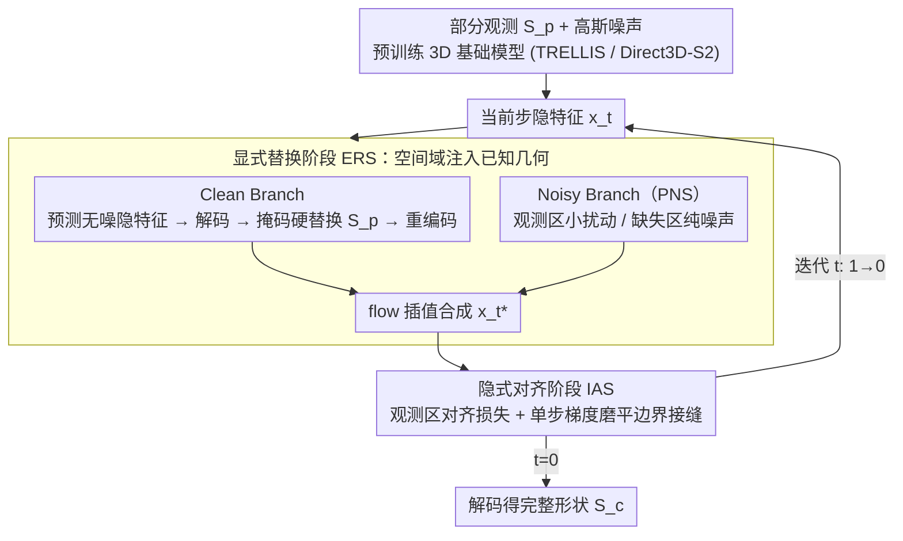

# LaS-Comp: Zero-shot 3D Completion with Latent-Spatial Consistency

**会议**: CVPR 2026  
**arXiv**: [2602.18735](https://arxiv.org/abs/2602.18735)  
**代码**: [https://github.com/wylyan/LaS-Comp](https://github.com/wylyan/LaS-Comp)  
**领域**:3D视觉
**关键词**: 3D形状补全, 零样本, 3D基础模型, 隐空间-空间一致性, 点云补全

## 一句话总结
提出 LaS-Comp，一种零样本、类别无关的 3D 形状补全框架，通过 Explicit Replacement Stage 在空间域注入已知几何 + Implicit Alignment Stage 在隐空间梯度优化边界一致性，桥接了预训练 3D 基础模型的隐空间与空间域之间的 gap，在多种部分观测模式下达到 SOTA。

## 研究背景与动机
3D 形状补全是计算机视觉和图形学的基础问题，目标是从部分观测重建完整 3D 形状，广泛应用于机器人、自动驾驶和 AR/VR。一个理想的补全方法需要：(i) 鲁棒处理多样化的部分缺失模式（单视角扫描、随机裁剪、语义部件缺失）；(ii) 跨类别泛化；(iii) 不依赖配对数据；(iv) 支持文本引导和自动补全。

传统监督方法依赖配对数据且无法泛化到未见类别。近期利用生成先验的方法（SDS-Complete, ComPC, GenPC）依赖"部分输入至少能渲染出一张完整图像"的假设——当缺失区域从任何视角都可见时，不完整的渲染导致结果退化。

而最新的 3D 基础模型（TRELLIS, Direct3D-S2）采用"隐空间生成"pipeline：先用 VAE 将形状编码到紧凑隐空间，再在隐空间训练扩散/flow-matching 模型。这产生了一个独特挑战：**完整形状和部分输入即使在重叠区域几何完全相同，其隐空间编码也存在显著差异**。因此，直接在隐空间补全不可靠。

LaS-Comp 的核心 idea 是：通过显式空间域替换 + 隐式隐空间对齐，桥接 latent 与 spatial 之间的 domain gap，释放 3D 基础模型的补全潜力。

## 方法详解

### 整体框架
LaS-Comp 想解决的是：怎样在不做任何额外训练的前提下，让一个在紧凑隐空间里生成形状的预训练 3D 基础模型（TRELLIS / Direct3D-S2）老老实实地补全部分观测。难点在于这类模型的隐空间和真实空间不是一一对应的——同一块几何，作为"完整形状的一部分"和作为"部分输入"被 VAE 编码出来的隐特征并不相等，所以不能直接在隐空间里把已知部分"贴"回去。

整个补全就是一次标准的 flow-matching 去噪：从高斯噪声出发，沿 $t$ 从 1 到 0 多步迭代，每一步都被部分输入 $\boldsymbol{S}_p$ 牵引着往完整几何收敛。关键是每一步内部串了两个互补阶段——先用 Explicit Replacement Stage（ERS）在**空间域**把已知几何注入进去（绕开 domain gap），得到更新后的隐特征 $\boldsymbol{x}_t^*$；再用 Implicit Alignment Stage（IAS）在**隐空间**做一步梯度修补，把替换在边界留下的接缝磨平，得到 $\boldsymbol{x}_{t-dt}$。迭代到底后解码 $\boldsymbol{S}_c = \mathcal{D}(\boldsymbol{x}_0)$ 就是完整形状。

### 关键设计

**1. Explicit Replacement Stage（ERS）：在空间域而非隐空间注入已知几何，绕开 domain gap**

这一步直接针对前面那个核心矛盾：隐空间里"贴回已知部分"会因 domain gap 失败，那就退回到几何本身确定的空间域去做替换。ERS 走两条并行分支。Clean Branch 先让生成器预测无噪隐特征 $\hat{\boldsymbol{x}}_{0|t} = \boldsymbol{x}_t - t \cdot \mathcal{G}(\boldsymbol{x}_t, t)$ 并解码成完整形状 $\boldsymbol{S}_{0|t}$，然后用掩码 $\boldsymbol{M}$ 在空间域做硬替换——观测到的体素用 $\boldsymbol{S}_p$、其余用模型生成的，即 $\boldsymbol{S}'_{0|t} = \boldsymbol{S}_p \odot \boldsymbol{M} + \boldsymbol{S}_{0|t} \odot (1-\boldsymbol{M})$，替换完再重新编码回隐空间 $\boldsymbol{x}^*_{0|t} = \mathcal{E}(\boldsymbol{S}'_{0|t})$。"解码—替换—重编码"这一圈是绕开 domain gap 的关键：替换发生在几何上一一对应的空间域，重编码得到的隐特征自然就是自洽的。

Noisy Branch 则负责给这一步注入合理的随机性，这里用到 Partial-aware Noise Schedule（PNS）——观测区域和缺失区域不该被同等对待：观测区域 $\boldsymbol{M}=1$ 已经有可信几何，只施加随 $t$ 递减的小扰动保持稳定；缺失区域 $\boldsymbol{M}=0$ 还需要探索，直接给纯高斯噪声鼓励多样性，即 $\boldsymbol{x}^*_{1|t} = \boldsymbol{M} \odot (\sqrt{1-t} \cdot \hat{\boldsymbol{x}}_{1|t} + \sqrt{t} \cdot \boldsymbol{\epsilon}_1) + (1-\boldsymbol{M}) \odot \boldsymbol{\epsilon}_2$。两条分支最后按 flow 插值合成本步输出：

$$\boldsymbol{x}^*_t = (1-t) \cdot \boldsymbol{x}^*_{0|t} + t \cdot \boldsymbol{x}^*_{1|t}$$

**2. Implicit Alignment Stage（IAS）：在隐空间一步梯度修补 ERS 留下的边界接缝**

ERS 的空间硬替换保证了已知区域的忠实度，但"贴"出来的边界——观测部分和生成部分的交界——容易出现不连续的伪影。IAS 不再回空间域，而是直接在隐空间用一步梯度把这条缝磨平。它从 $\boldsymbol{x}_t^*$ 预测无噪隐特征、解码后只在观测区域算一个几何对齐损失 $\mathcal{L}_{\text{align}} = \text{BCE}(\boldsymbol{S}_{0|t} \odot \boldsymbol{M}, \boldsymbol{S}_p \odot \boldsymbol{M})$，衡量当前重建在已知部分和真值差多少，再对隐特征本身做单步梯度下降：

$$\boldsymbol{x}^{\text{aligned}}_{0|t} = \hat{\boldsymbol{x}}_{0|t} - \eta \cdot \nabla_{\hat{\boldsymbol{x}}_{0|t}} \mathcal{L}_{\text{align}}$$

要强调的是这一步**不更新任何模型参数**，梯度只作用在当前这一步的隐特征上，所以整个方法仍然是 training-free 的；而且只走一步更新（$\eta = 1\times10^{-5}$），计算开销几乎可以忽略，却能让边界一致性明显改善。

**3. Omni-Comp Benchmark：补齐多模式、跨类别补全评测的空白**

作者顺带指出现有评测的短板：Redwood 只有 10 个样本、KITTI/ScanNet 类别 ≤2 且都只覆盖单一缺失模式，没法检验一个补全方法在不同缺失形态下是否都稳。Omni-Comp 因此把规模和多样性补上——30 个不同类别对象、180 个样本，覆盖三种典型缺失模式（单视角扫描、随机裁剪、语义部件缺失），样本来源也刻意混合了 10 个 Redwood 真实扫描、10 个 YCB 日常物体和 10 个合成形状，让真实噪声和干净几何都在评测里。

### 一个完整示例

以补全一把**单视角扫描的椅子**（只扫到正面，背面缺失）为例，看某一步 $t$ 内部怎么转。当前隐特征 $\boldsymbol{x}_t$ 先进 ERS：Clean Branch 解出一把模型"猜"的完整椅子 $\boldsymbol{S}_{0|t}$，掩码替换把正面那些**已扫到**的体素换回真实的 $\boldsymbol{S}_p$、背面缺失体素保留模型生成的，重编码得到自洽的 $\boldsymbol{x}^*_{0|t}$；Noisy Branch 同时给正面体素小扰动、给背面体素纯噪声继续探索，插值合成 $\boldsymbol{x}^*_t$。接着进 IAS：解码 $\boldsymbol{x}^*_t$ 发现正面椅腿和背面新生成的椅腿在接缝处错位了一点，对齐损失捕捉到这个偏差，一步梯度把隐特征往"接缝对齐"的方向推一点，得到 $\boldsymbol{x}_{t-dt}$ 进入下一步。如此迭代约 20 秒、几十步后，背面被补成与正面风格一致、接缝平滑的完整椅子。

### 损失函数 / 训练策略
LaS-Comp 是 **training-free** 的——不需要任何额外训练，直接利用预训练 3D 基础模型（TRELLIS 或 Direct3D-S2）进行推理。唯一的"优化"是 IAS 里对隐特征本身的单步梯度更新，学习率 $\eta = 1 \times 10^{-5}$，不触碰模型权重。每个形状补全仅需 ~20 秒，比现有零样本方法快 3 倍以上。

## 实验关键数据

### 主实验

| 数据集/指标 | 本文 (TRELLIS) | ComPC (之前SOTA) | 提升 |
|------------|---------------|-----------------|------|
| Redwood CD↓/EMD↓ | **1.42/1.84** | 1.95/2.59 | 27.2%/29.0% |
| Synthetic CD↓/EMD↓ | **1.11/1.41** | 1.61/2.09 | 31.1%/32.5% |
| ScanNet-Chair UCD↓/UHD↓ | **0.8/2.0** | 2.0/5.3 | 60%/62% |
| KITTI-Car UCD↓/UHD↓ | **1.4/4.5** | 1.1/5.7 | - |
| Omni-Comp Single Scan CD↓ | **2.21** | 4.24 | 47.9% |
| Omni-Comp Random Crop CD↓ | **2.60** | 5.48 | 52.6% |
| Omni-Comp Semantic Part CD↓ | **3.30** | 6.37 | 48.2% |

### 消融实验

| 配置 | Redwood CD↓ | 说明 |
|------|-------------|------|
| 完整 LaS-Comp (TRELLIS) | 1.42 | 最优 |
| 仅 ERS（无 IAS） | 1.68 | IAS 提供~15%改善 |
| 仅 IAS（无 ERS） | 2.31 | ERS 是核心 |
| 无 PNS（均匀噪声调度） | 1.89 | PNS 重要 |
| Direct3D-S2 backbone | 1.64 | TRELLIS 更优 |

### 关键发现
- 在 Omni-Comp 上，之前方法对 Random Crop 和 Semantic Part 模式性能急剧下降（因为依赖"至少一个视角完整"假设），而 LaS-Comp 表现稳健
- 兼容不同 3D 基础模型（TRELLIS 和 Direct3D-S2），且都显著优于 baseline
- 支持 text-guided 补全（通过基础模型的 CFG 机制），可控制生成结果的语义
- 推理速度 ~20 秒/形状，比 ComPC（~60s）和 SDS-Complete（>5min）快很多

## 亮点与洞察
- **Training-free**：不需要任何额外训练，直接利用预训练模型，部署成本极低
- **解决了核心 domain gap**：发现并解决了"隐空间编码的部分形状 vs 完整形状差异"这一之前未被重视的关键问题
- **ERS+IAS 互补设计精妙**：显式替换保证忠实度，隐式对齐保证平滑性，二者缺一不可
- **Partial-aware Noise Schedule**：对已知/未知区域采用不同噪声策略，体现了对补全任务不对称性的深刻理解
- **Omni-Comp benchmark** 填补了多模式补全评估的空白

## 局限与展望
- 依赖预训练 3D 基础模型的质量，若基础模型对某类别生成能力弱，补全效果也会受限
- 每步需要编码-解码往返（ERS），增加了推理开销
- IAS 仅做单步梯度更新，更多步优化可能进一步提升边界质量但增加时间
- 当前仅处理刚性物体，对铰接物体、变形物体等未验证

## 相关工作与启发
- **RepPaint/FlowDPS** 启发了 ERS 的 clean-noisy 双分支设计，从 2D 图像修复迁移到 3D
- **TRELLIS/Direct3D-S2** 等 3D 基础模型的隐空间生成范式为本工作提供了基础
- 与 ComPC/GenPC 的关键区别：不依赖 2D 渲染假设，直接在 3D 隐空间操作
- 启发：在其他隐空间生成任务（如 3D 编辑、风格迁移）中，latent-spatial 一致性可能同样是关键挑战

## 评分
- 新颖性: ⭐⭐⭐⭐⭐ 首次系统解决隐空间3D基础模型的补全问题，ERS+IAS设计原创性强
- 实验充分度: ⭐⭐⭐⭐⭐ 4个已有benchmark+自建Omni-Comp，2个backbone，多种部分模式
- 写作质量: ⭐⭐⭐⭐ 结构清晰，方法描述详细，图示直观
- 价值: ⭐⭐⭐⭐⭐ training-free方案实用性强，Omni-Comp benchmark有持续价值

<!-- RELATED:START -->

## 相关论文

- [\[CVPR 2025\] GenPC: Zero-shot Point Cloud Completion via 3D Generative Priors](../../CVPR2025/3d_vision/genpc_zero-shot_point_cloud_completion_via_3d_generative_priors.md)
- [\[ICLR 2026\] pySpatial: Generating 3D Visual Programs for Zero-Shot Spatial Reasoning](../../ICLR2026/3d_vision/pyspatial_generating_3d_visual_programs_for_zero-shot_spatial_reasoning.md)
- [\[ECCV 2024\] Zero-Shot Multi-Object Scene Completion](../../ECCV2024/3d_vision/zero-shot_multi-object_scene_completion.md)
- [\[CVPR 2026\] Lite Any Stereo: Efficient Zero-Shot Stereo Matching](lite_any_stereo_efficient_zero-shot_stereo_matching.md)
- [\[CVPR 2026\] PromptStereo: Zero-Shot Stereo Matching via Structure and Motion Prompts](promptstereo_zero-shot_stereo_matching_via_structure_and_motion_prompts.md)

<!-- RELATED:END -->
