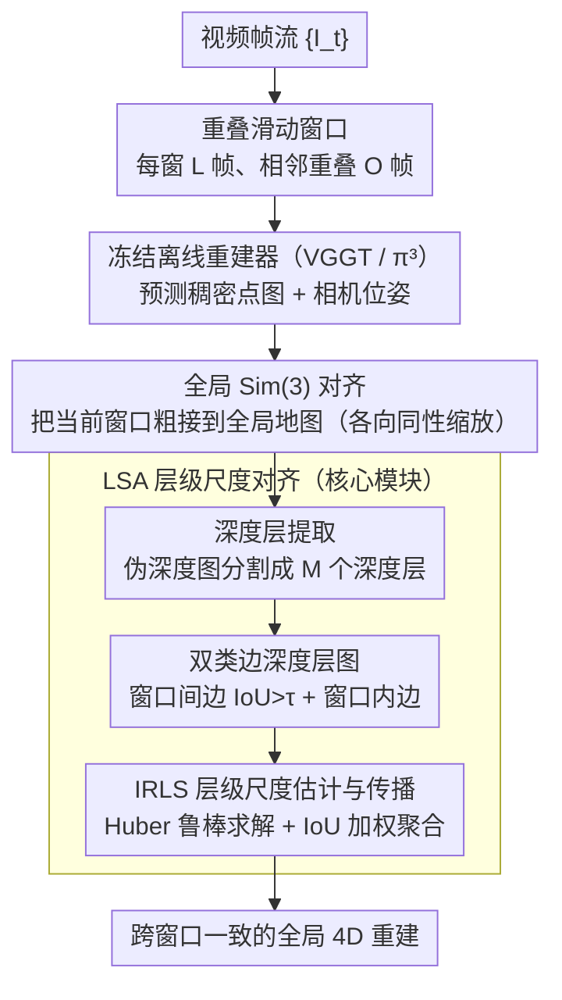

<!-- 由 src/gen_stubs.py 自动生成 -->
# LASER: Layer-wise Scale Alignment for Training-Free Streaming 4D Reconstruction

**会议**: CVPR2026  
**arXiv**: [2512.13680](https://arxiv.org/abs/2512.13680)  
**代码**: [项目主页](https://neu-vi.github.io/LASER/)  
**领域**:3D视觉
**关键词**: 流式4D重建, 无训练框架, 层级尺度对齐, 滑动窗口, Sim(3)配准

## 一句话总结

提出 LASER，一个无需重训练的框架，通过层级深度尺度对齐（Layer-wise Scale Alignment）将离线前馈重建模型（如 VGGT、π³）转换为流式系统，在 RTX A6000 上以 14 FPS、6GB 峰值显存实现千米级视频的实时流式 4D 重建。

## 研究背景与动机

**离线模型的局限**：VGGT、π³ 等前馈重建模型在静态图像集上表现出色，但由于二次方内存复杂度，无法处理流式视频输入，在 KITTI 等长序列上直接 OOM。

**现有流式方法需要重训练**：CUT3R、StreamVGGT、STream3R 等流式方法通过学习记忆机制或因果注意力实现增量处理，但都需要大量重训练或知识蒸馏，计算成本高昂。

**递归设计的漂移问题**：CUT3R 等递归设计在长序列上存在漂移和灾难性遗忘问题；依赖增长记忆的方法面临可扩展性限制。

**简单 Sim(3) 对齐不够**：并行工作 VGGT-Long 尝试无训练方法，通过分块+Sim(3) 对齐，但简单的刚性对齐在深度方向上不够充分。

**层级深度不一致问题**：单目尺度模糊性导致不同场景层（如前景 vs 背景）的相对深度尺度在窗口间不一致变化，全局 Sim(3) 变换的均匀缩放无法解决此各向异性缩放。

**实际部署需求**：自动驾驶、机器人、AR/VR 等应用要求模型高效且一致地处理视频流，需要在保持重建质量的同时实现在线处理。

## 方法详解

### 整体框架

LASER 要解决的问题是：让 VGGT、π³ 这类只能离线处理图像集的前馈重建器，不重训练就能流式吃进千帧级长视频，同时保持全局几何一致。它的做法是把视频切成重叠滑动窗口，每个窗口交给冻结的离线重建器各自重建出局部点图与位姿，再把这些局部子图逐个配准、拼接成全局地图。

具体来说，给定视频 $\{I_t\}$ 形成重叠窗口 $\{W_i\}$（每窗 L 个连续帧、相邻窗重叠 O 帧），冻结重建器预测稠密点图和相机位姿后，先做一次全局 Sim(3) 对齐把当前窗口粗略接到全局地图上，再用核心模块 LSA（层级尺度对齐）逐层修正深度方向的尺度漂移，最终得到跨窗口一致的重建。

### 关键设计

**1. 深度层提取：把窗口拼接的尺度问题从"整体一个缩放"细化到"逐层一个缩放"**

全局 Sim(3) 配准假设各向同性缩放——整张点图乘同一个尺度因子。但在低视差运动下，深度方向的尺度约束本就不可靠，前景和背景会出现不一致的缩放（前景相对背景被过缩放或欠缩放），单一全局尺度无法同时拉对两者。LASER 的对策是先把对齐空间拆细：对 Sim(3) 配准后的伪深度图，用一个高效分割算法划分成 M 个互不相交的深度层 $\{L_{t,m}\}$，每层对应一片深度连续的几何表面，从而让尺度可以逐层独立估计。

**2. 双类边深度层图：把跨窗口、跨时间的层对应关系组织成可优化的图**

要逐层对齐就得先知道"这一窗的某层对应那一窗的哪一层"。LASER 把所有深度层组织成有向图 $H=(V,E)$，用两类边建立对应：窗口间边 $E_{\text{inter}}$ 连接重叠时间戳处两个窗口里 IoU $>\tau$（默认 0.3）的对应层，给出跨窗口的尺度约束；窗口内边 $E_{\text{intra}}$ 连接同一窗口内相邻帧的同一深度层，作为把尺度沿时间轴传下去的通路。这张图让"哪些层该对齐、尺度该往哪传"变成显式可解的结构。

**3. IRLS 层级尺度估计与传播聚合：鲁棒求解每层尺度并保证时空一致**

有了图之后，对每条窗口间边用 IRLS（带 Huber loss）优化层级缩放因子 $\hat{s}$，使相邻窗口中对应层的深度值对齐——Huber loss 抑制误匹配层带来的异常值，比直接最小二乘更稳。尺度先沿 $E_{\text{inter}}$ 在重叠区域估计，再沿 $E_{\text{intra}}$ 时间传播到非重叠帧；每层的最终尺度取以 IoU 为权重的加权平均，让重叠多、对应可靠的层主导结果，从而在跨窗口和时间轴上都保持一致。这正是 LASER 用经典分层几何弥补全局 Sim(3) 各向异性缺陷的关键。

### 损失函数 / 训练策略

LASER 全程无训练，所有"优化"都是推理期的几何配准：全局尺度 $s_i^w$ 用 IRLS + Huber loss 鲁棒估计以抑制异常值，旋转和平移在估计出的尺度下用 Kabsch 算法求解，层级尺度同样走 IRLS + Huber loss。整套流程不更新任何网络权重，因此新的离线重建器一出现即可即插即用。

## 实验

### 主要结果

**视频深度估计**（Table 1）：

| 方法 | 类型 | Sintel Abs Rel↓ | Bonn Abs Rel↓ | KITTI Abs Rel↓ |
|------|------|---------|---------|---------|
| π³ (离线) | 离线 | 0.245 | 0.050 | 0.038 |
| CUT3R | 流式 | 0.421 | 0.078 | 0.118 |
| STream3Rβ | 流式 | 0.264 | 0.069 | 0.080 |
| **π³+Ours** | **流式** | **0.247** | **0.048** | **0.054** |

**相机位姿估计**（Table 2）：

| 方法 | Sintel ATE↓ | ScanNet ATE↓ | TUM ATE↓ |
|------|-------------|--------------|----------|
| π³ (离线) | 0.073 | 0.030 | 0.014 |
| CUT3R | 0.213 | 0.099 | 0.046 |
| TTT3R | 0.201 | 0.064 | 0.028 |
| **π³+Ours** | **0.061** | **0.031** | **0.016** |

在 Sintel 上 ATE 降低 68.6%（vs 之前最优流式方法），在 7-Scenes 上 Acc 降低 63.9%。

**大规模 KITTI 里程计**（Table 3）：离线模型 VGGT 和 π³ 全部 OOM，CUT3R 大部分 OOM，LASER(π³) 在所有 11 个序列上保持稳定，平均 ATE 24.17，优于 VGGT-Long (27.64) 和 π³-Long (30.72)。

### 消融实验

**LSA 组件消融**（Table 5，Sintel 深度）：

| 配置 | Abs Rel↓ | δ<1.25↑ |
|------|----------|---------|
| 完整 LASER | 0.247 | 68.8 |
| 去掉 LSA | 0.328 | 51.4 |
| 用 SAM 2 替换分割 | 0.251 | 67.8 |
| 去掉 E_intra | 0.261 | 64.7 |

**关键发现**：
- 去掉 LSA 导致 Abs Rel 恶化 32.8%，证明层级尺度对齐是核心贡献
- SAM 2 尽管分割更精细但未带来提升，简单高效的分割已足够
- 去掉窗口内时间传播边 E_intra 损害全局一致性
- IoU 阈值 τ 在 0.2–0.6 范围内鲁棒，默认 0.3 最优
- 窗口大小 L=20 取得最佳平衡

### 效率分析

- π³+Ours：~14.2 FPS，6GB 峰值显存（RTX A6000）
- VGGT+Ours：~10.9 FPS，10GB 峰值显存
- 在所有流式方法中速度最快、显存最低

## 亮点

- **零训练成本**：完全无需重训练，直接将任意离线重建模型转为流式系统，新模型出现即可即插即用
- **识别并解决了层级深度不一致问题**：深刻洞察到全局 Sim(3) 对齐的各向异性缩放失败模式，提出基于经典分层场景表示的解决方案
- **全面的 SOTA**：在深度估计、位姿估计、点图重建三个任务上全面超越现有流式方法，多项指标接近甚至超过离线模型
- **实际可部署**：14 FPS + 6GB 显存，支持千米级长序列，具备真实应用价值
- **优雅的设计哲学**：用经典几何原理弥合深度学习模型的缺陷，无需端到端重训练

## 局限性

- 受限于底层离线模型的能力上限（如 π³ 的法线精度较弱导致 NC 指标不占优）
- 分层分割依赖深度图的质量，在极端场景（如纯旋转、无纹理区域）可能失效
- 滑动窗口策略引入固定延迟，不适合超低延迟要求的场景
- 大规模场景仍需额外的回环检测（loop closure）来减少长程漂移
- 论文分类在 human_understanding 下，但实际是通用 3D/4D 重建工作

## 相关工作

- **离线前馈重建**：DUSt3R → VGGT → π³，从图像对回归到任意视角集的稠密重建
- **流式重建（需训练）**：CUT3R（递归记忆）、StreamVGGT（因果注意力）、STream3R（滑动窗口+token池）、WinT3R、TTT3R（测试时适应）
- **无训练流式（并行工作）**：VGGT-Long 分块+Sim(3)，本文证明简单 Sim(3) 不够
- **经典方法**：ORB-SLAM2、DROID-SLAM 等，精度高但需标定且仅稀疏重建
- **4D 重建**：从 NeRF/3DGS 的逐场景优化到前馈式动态重建

## 评分

- 新颖性: ⭐⭐⭐⭐ — 层级深度不一致问题的识别和 LSA 方案设计新颖，经典几何+现代深度学习的结合优雅
- 实验充分度: ⭐⭐⭐⭐⭐ — 三个任务、六个数据集、大量基线对比、完整消融、效率分析，非常全面
- 写作质量: ⭐⭐⭐⭐ — 问题动机阐述清晰，图示直观，方法描述规范
- 价值: ⭐⭐⭐⭐⭐ — 无训练、即插即用、高效实用，对实际部署有重要价值

<!-- RELATED:START -->

## 相关论文

- [\[CVPR 2026\] Fast3Dcache: Training-free 3D Geometry Synthesis Acceleration](fast3dcache_training-free_3d_geometry_synthesis_acceleration.md)
- [\[NeurIPS 2025\] Motion Matters: Compact Gaussian Streaming for Free-Viewpoint Video Reconstruction](../../NeurIPS2025/3d_vision/motion_matters_compact_gaussian_streaming_for_free-viewpoint_video_reconstructio.md)
- [\[CVPR 2026\] RetimeGS: Continuous-Time Reconstruction of 4D Gaussian Splatting](retimegs_continuous-time_reconstruction_of_4d_gaussian_splatting.md)
- [\[ICLR 2026\] Reducing Class-Wise Performance Disparity via Margin Regularization](../../ICLR2026/3d_vision/reducing_class-wise_performance_disparity_via_margin_regularization.md)
- [\[ICLR 2026\] UFO-4D: Unposed Feedforward 4D Reconstruction from Two Images](../../ICLR2026/3d_vision/ufo-4d_unposed_feedforward_4d_reconstruction_from_two_images.md)

<!-- RELATED:END -->
