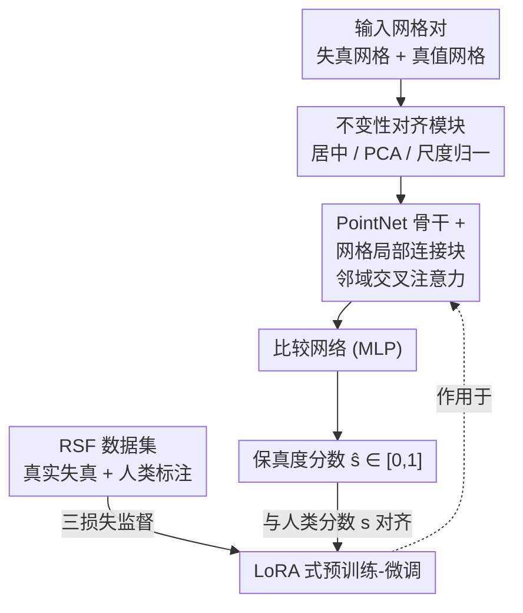

# Learning 3D Shape Fidelity Metric from Real-world Distortions

**会议**: CVPR 2026  
**论文**: [CVF Open Access](https://openaccess.thecvf.com/content/CVPR2026/html/Feng_Learning_3D_Shape_Fidelity_Metric_from_Real-world_Distortions_CVPR_2026_paper.html)  
**代码**: 无  
**领域**: 3D视觉  
**关键词**: 形状保真度, 感知度量, 网格局部连接, LoRA微调, 人类标注数据集

## 一句话总结
本文提出可学习的 3D 形状保真度度量 LoCaSE：用网格拓扑的局部注意力捕捉细节、用 LoRA 式预训练-微调缓解模型偏差，并配套构建带真实失真和人类标注的 RSF 数据集，使度量结果显著比 Chamfer Distance 等几何度量更贴近人类感知。

## 研究背景与动机

**领域现状**：3D 生成与重建被广泛用于游戏、影视、内容创作等场景，这些应用都期望产出的 3D 形状"看起来真实"。因此评估 3D 形状质量时，普遍依赖 Chamfer Distance（CD）、IoU、F-score、单向 Hausdorff 距离（UHD）等几何度量，以及近期的频域度量 SAUCD。

**现有痛点**：这些度量都不能反映人类感知的保真度。CD 等几何度量只关注两个形状之间的平均几何误差，一个光滑表面和一个细节丰富的表面可能 CD 几乎相同（如论文图 1 中 CD=0.0058m），但人眼看上去保真度天差地别；频域度量 SAUCD 试图用谱分析关注细节，但频域信息同样无法覆盖人类感知的全部复杂性。

**核心矛盾**：几何精度与人类感知保真度之间存在系统性错位——人类对局部细节高度敏感，而手工设计的全局/频域度量抓不住这种局部细节带来的感知差异。

**本文目标**：直接从人类标注数据中**学习**一个与人类感知对齐的保真度度量，同时解决学习路线绕不开的两类偏差——数据偏差（已有数据集多用合成失真，与真实重建/生成失真存在 domain gap）和模型偏差（网络要既能抓形状细节又能泛化）。

**切入角度**：作者观察到人类对网格质量的判断依赖于嵌在几何与**连接关系**里的局部细节，于是把网格拓扑邻接信息显式注入特征提取；同时用大规模无标注形状数据集（ModelNet）预训练的先验来对抗小规模标注数据导致的过拟合。

**核心 idea**：用"局部连接注意力 + LoRA 式预训练微调"构建度量网络，配上"真实失真 + 人类标注"的 RSF 数据集，把人类对 3D 形状保真度的偏好学进一个可微度量里。

## 方法详解

### 整体框架
LoCaSE（Local-Connection-based Shape Evaluation）把保真度度量形式化为 $\hat{s} = F(\hat{m}, m; \theta)$：输入失真网格 $\hat{m}$ 与真值网格 $m$，输出一个保真度分数 $\hat{s}$（越高越好，最终归一化到 $[0,1]$），训练目标是 $\min_\theta \mathcal{L}(\hat{s}, s)$，让预测分数对齐人类标注分数 $s$。

整条管线：输入的失真网格与真值网格先各自经过**非学习的不变性对齐模块**消除平移/旋转/尺度差异；对齐后的顶点送入以 **PointNet 为骨干、嵌入网格局部连接块**的形状编码器，分别提取两个网格的特征；再由一个 MLP **比较网络**对两组特征评分，输出保真度分数。骨干网络在 ModelNet 上预训练，并对其中 MLP 层做 **LoRA 式微调**以适配真实失真分布和人类标注，而比较网络与局部连接块从零训练。

### 关键设计

**1. 不变性对齐模块：在不学习参数的前提下消除全局变换干扰**

人类对形状质量的判断本就不受平移、视角旋转、尺度变化影响，所以作者用一个**纯几何、无参数**的模块先把输入和真值网格归一化，避免网络把精力浪费在学这些已知不变性上。三步依次进行：平移不变性把所有顶点减去质心 $v'_i = v_i - \frac{1}{N}\sum_{i=1}^{N} v_i$ 使中心移到原点；旋转不变性对中心化后的顶点矩阵 $V$ 算协方差 $\Sigma = \frac{1}{N}V^\top V$ 并做特征分解 $\Sigma = U\Lambda U^\top$，再用 $v''_i = U^\top v'_i$ 把三个主成分对齐到坐标轴；尺度不变性把所有顶点到原点的平均距离归一化到 1，即 $v^{\text{norm}}_i = \frac{1}{\frac{1}{N}\sum_i \|v''_i\|_2} v''_i$。这样无论输入网格被怎样摆放/缩放，进入骨干网络的几何都是规范化的，提升了度量的鲁棒性。

**2. 网格局部连接块：用邻域交叉注意力补足 PointNet 缺失的连接信息**

PointNet 最初是为点云设计的，不含显式连接关系，难以提取人类最在意的局部细节。作者为每个顶点构造一个局部注意力块：以顶点自身特征 $x_i$ 为 query，以其邻居顶点特征集合 $x_{n,i}$ 为 key/value 做交叉注意力，再过前馈网络得到局部特征 $x_{l,i} = \mathrm{FFN}(\mathrm{Attention}(x_i, x_{n,i}, x_{n,i}))$。之所以只在邻域内做注意力而非全顶点自注意力，一是网格动辄上万顶点，$N \times N$ 注意力图在显存和复杂度上不可行、也难学到有效关系；二是局部连接已足以弥补 PointNet 在局部细节上的短板。邻居按网格邻接矩阵 $A$ 的 $k$ 阶邻域确定：$I_i(k) = \mathrm{supp}((A^k)_i)$，论文取 $k=5$ 并按拓扑距离排序后截断到 64 个邻居（数据集中 >95% 顶点在 5 阶邻域内有 ≥64 个邻居 ⚠️ 以原文为准；不足 64 个时重复采样一阶邻居补齐）。

**3. LoRA 式预训练-微调：保住大规模形状先验的同时学到人类偏好**

高质量人类标注的保真度数据采集昂贵、规模有限，单靠它训练容易过拟合、缺乏形状先验。作者先用 ModelNet 预训练的 PointNet 作为骨干（携带大规模形状先验），再对其 MLP 层做 LoRA 式低秩旁路微调：把原 $x' = \mathrm{MLP}(x)$ 改写为 $x' = \mathrm{MLP}(x) + x L_d L_u$，其中 $L_d \in \mathbb{R}^{C \times r}$、$L_u \in \mathbb{R}^{r \times C'}$ 是降维/升维投影矩阵，秩 $r$ 经实验设为 32。这样每个 MLP 只额外引入 $r \times (C + C')$ 个可训参数，预训练学到的形状先验被冻结保留，而 LoRA 旁路专门吸收"人类保真度标注"相关的信息，从而同时抑制了数据偏差和模型偏差。

**4. RSF 数据集与三损失训练：用真实失真和人类标注做监督**

为消除合成失真带来的 domain gap，作者构建了两分支的 Real Shape Fidelity（RSF）数据集：主子集从多个数据集选取 16 个图像/物体对，用 16 种真实的重建与生成算法产生失真网格（文本生成模型还先用 GPT-4o 把输入图转成 prompt）；test-only 子集另含 8 个主子集中未见的物体和更新的失真算法（如 CraftsMan3D、Hunyuan2.1、SPAR3D 等），用于跨域评测。标注上沿用瑞士轮成对比较：每位受试者对一个参考物体的 28 个失真网格做 6 轮比较，得分 0–6 后归一化到 $[0,1]$，每个物体收集 25–35 人，并用 IQR 法（超出 $1.5\times$ IQR 的离群分剔除）提升可靠性，去离群后误差约 6.9%。训练用三个互补损失：Smooth L1、Pearson 相关损失（PLCC）、Spearman 排序损失（SROCC），合成总损失 $\mathcal{L} = \lambda_{\text{smooth}}\mathcal{L}_{\text{smooth}} + \lambda_{\text{plcc}}\mathcal{L}_{\text{plcc}} + \lambda_{\text{srocc}}\mathcal{L}_{\text{srocc}}$，权重取 $\lambda_{\text{smooth}}=5,\ \lambda_{\text{plcc}}=1,\ \lambda_{\text{srocc}}=1$，让网络既拟合绝对分值又对齐排序关系。

### 损失函数 / 训练策略
总损失为 Smooth L1、Pearson 相关、Spearman 排序三项加权和（权重 5:1:1）。比较 MLP 为 4 层（2048→1024→512→256→1），局部连接模块用 2 个块、每块 $C=C'=64$，前馈网络 4 层（维度 16）。骨干用 ModelNet10 预训练权重，LoRA 秩 32；优化器 AdamW，学习率 $1\times10^{-3}$、权重衰减 $1\times10^{-4}$，单卡 RTX A6000 训练（PyTorch 实现）。

## 实验关键数据

评测用三种相关系数衡量度量与人类评分的一致性，取值均在 $[-1,1]$、越高越好：**PLCC**（Pearson 线性相关，衡量线性相关程度）、**SROCC**（Spearman 秩相关，衡量排序一致性）、**KROCC**（Kendall 秩相关，另一种排序一致性）。

### 主实验

RSF 主子集上做 16 折物体级交叉验证（每个物体轮流留出做测试），下表为 16 个物体上的平均值与标准差（标准差越小越稳健）：

| 度量 | PLCC Avg ↑ | PLCC Std ↓ | SROCC Avg ↑ | KROCC Avg ↑ |
|------|-----------|-----------|-------------|-------------|
| Chamfer Distance | 0.513 | 0.311 | 0.424 | 0.328 |
| P2S | 0.488 | 0.297 | 0.468 | 0.360 |
| IoU | 0.383 | 0.313 | 0.410 | 0.311 |
| UHD | 0.410 | 0.395 | 0.375 | 0.269 |
| SAUCD | -0.021 | 0.322 | 0.014 | -0.028 |
| **LoCaSE（本文）** | **0.728** | **0.106** | **0.757** | **0.614** |

LoCaSE 在三种相关系数上均大幅领先，且标准差最低（PLCC Std 0.106 vs 次优 0.276+），说明它在不同物体类别上既贴近人类感知又稳定。值得注意 SAUCD 的平均 PLCC 近 0，频域度量在真实失真上几乎失效。

跨域泛化方面，在与主子集物体完全不同的 test-only 子集上**直接推理**（不再微调）：

| 度量 | PLCC Avg ↑ | SROCC Avg ↑ | KROCC Avg ↑ |
|------|-----------|-------------|-------------|
| Chamfer Distance | -0.46 | -0.46 | -0.40 |
| F-score | 0.51 | 0.41 | 0.30 |
| IoU | 0.38 | 0.28 | 0.28 |
| SAUCD | 0.15 | 0.09 | 0.08 |
| **LoCaSE（本文）** | **0.68** | **0.64** | **0.55** |

多数传统度量在跨域时甚至呈负相关（CD 全线为负），而 LoCaSE 仍保持正向高相关，体现真实失真训练 + 形状先验带来的泛化力。训练/测试集划分实验（留出 dog/bus/female/hand 四物体）中 LoCaSE 同样领先：PLCC 0.6968、SROCC 0.7025、KROCC 0.5335，对比次优 P2S 的 SROCC 0.4490。

### 消融实验

| 配置 | PLCC ↑ | SROCC ↑ | KROCC ↑ |
|------|--------|---------|---------|
| 仅用合成数据 ShapeGrading 训练 | 0.380 | 0.395 | 0.312 |
| 从零训练（无预训练） | 0.697 | 0.708 | 0.556 |
| 用 ball query 替代局部注意力 | 0.645 | 0.671 | 0.533 |
| w/o LoRA | 0.671 | 0.638 | 0.488 |
| w/o 局部注意力 | 0.605 | 0.632 | 0.482 |
| w/o 局部注意力 & w/o LoRA | 0.597 | 0.627 | 0.485 |
| **Full（本文）** | **0.728** | **0.757** | **0.614** |

### 关键发现
- **真实失真数据是基础**：只用合成 ShapeGrading 训练时 PLCC 仅 0.380，与真实数据存在明显 domain gap，凸显域适配的必要性。
- **局部注意力与 LoRA 互补**：单去局部注意力掉到 0.605、单去 LoRA 掉到 0.671，两者全去降到 0.597（最大降幅），说明它们分别贡献"局部细节捕捉"和"先验保留 + 偏差缓解"，缺一不可；用 ball query 替代局部注意力（0.645）证明邻域交叉注意力对局部几何刻画更优。
- **超参敏感性**：LoRA 秩在 32 时最佳（PLCC 0.728），秩太低（8/16）表达力不足、太高（64，0.730）反而略降；损失权重以 $5{:}1{:}1$ 最优，去掉 Smooth L1 主导（如 1:1:1 得 0.677）会下降。
- **骨干选择**：换成 MeshCNN/DiffusionNet/PointNet++/DGCNN 等更复杂骨干结果都合理但都不如简单的 PointNet 骨干（DGCNN 0.699 vs 本文 0.728），说明性能来自局部连接 + LoRA 设计而非骨干堆复杂度。

## 亮点与洞察
- **把"人类感知"显式学进度量**：跳出手工几何/频域度量的局限，用人类标注 + 三种相关损失（含排序损失）直接优化与人类判断的一致性，思路可迁移到任何"几何精度≠主观质量"的评估任务（如点云、纹理网格质量评估）。
- **无参数不变性对齐很省力**：用 PCA + 居中 + 尺度归一这种零参数前处理把平移/旋转/尺度不变性"白送"给网络，省去网络学习不变性的负担，是一个干净可复用的工程 trick。
- **LoRA 不只用于大模型微调**：这里把 LoRA 当作"保留大规模无标注先验 + 小标注集低秩适配"的偏差缓解工具，给小数据感知任务提供了一个对抗过拟合的范式。
- **局部 vs 全局注意力的权衡**：邻域交叉注意力既避免了 $N\times N$ 全局注意力的显存爆炸，又比 ball query 更能抓局部几何，是细节敏感任务里值得借鉴的折中。

## 局限与展望
- **只评形状不评纹理**：方法刻意剥离纹理只评几何形状，对带颜色/材质的网格（纹理常是感知主因）不直接适用，扩展到带纹理质量评估是自然方向。
- **依赖网格拓扑**：局部连接块需要显式邻接信息，对仅有点云、拓扑残缺或非流形网格的输入如何稳健工作，文中未充分讨论。
- **标注成本与规模**：RSF 主子集仅 16 物体、人类标注昂贵，尽管用 LoRA + 预训练缓解，更大规模物体类别下的泛化仍待验证；test-only 子集物体数（8 个 ⚠️ 以原文为准）也偏小。
- **邻居截断的影响**：把邻居固定截断到 64、不足时重复采样一阶邻居，对极不规则网格可能引入偏差，可探索自适应邻域大小。

## 相关工作与启发
- **vs Chamfer Distance / P2S / IoU / UHD**：这些是纯几何匹配度量，只看平均几何误差、不建模人类感知，因而在细节差异和跨域失真上与人类评分错位甚至负相关；LoCaSE 用可学习网络直接拟合人类标注，PLCC/SROCC/KROCC 全面反超。
- **vs SAUCD（频域度量）**：SAUCD 用谱分析关注形状细节，但频域信息无法覆盖人类感知全貌，本文实验中其相关性近 0 甚至为负；LoCaSE 在空间域用局部连接捕捉细节，更贴合人类判断。
- **vs 以往感知度量与数据集**：以往可学习度量多用合成失真、且偏重带纹理网格，存在 domain gap；本文的核心区别是用真实重建/生成算法产生的失真 + 大规模人类标注构建 RSF，专注无纹理 3D 形状本身的保真度。
- **vs 复杂网格骨干（MeshCNN / DiffusionNet / DGCNN）**：直接换更强骨干并未带来增益，反衬出"局部连接注意力 + LoRA 微调"才是性能来源，提示该任务的瓶颈在于细节建模与偏差控制而非骨干容量。

## 评分
- 新颖性: ⭐⭐⭐⭐ 首次用"局部连接注意力 + LoRA 预训练微调 + 真实失真人类标注数据集"系统地学习 3D 形状保真度，组合新颖但各部件较成熟。
- 实验充分度: ⭐⭐⭐⭐⭐ 16 折交叉验证 + 训练/测试划分 + 跨域 test-only + 大量消融（骨干/损失权重/LoRA 秩/邻域）覆盖全面。
- 写作质量: ⭐⭐⭐⭐ 动机清晰、图表充分，但部分公式与符号（邻域统计、test-only 物体数）存在 OCR/表述噪声。
- 价值: ⭐⭐⭐⭐ 给 3D 生成/重建提供了贴近人类感知的可微评估工具，RSF 数据集对社区有实用价值。

<!-- RELATED:START -->

## 相关论文

- [\[CVPR 2026\] Learning a Particle Dynamics Model with Real-world Videos](learning_a_particle_dynamics_model_with_real-world_videos.md)
- [\[CVPR 2026\] AnthroTAP: Learning Point Tracking with Real-World Motion](anthrotap_learning_point_tracking_with_real-world_motion.md)
- [\[CVPR 2026\] OLATverse: A Large-scale Real-world Object Dataset with Precise Lighting Control](olatverse_a_large-scale_real-world_object_dataset_with_precise_lighting_control.md)
- [\[CVPR 2026\] ICTPolarReal: A Polarized Reflection and Material Dataset of Real World Objects](ictpolarreal_a_polarized_reflection_and_material_dataset_of_real_world_objects.md)
- [\[CVPR 2026\] Iris: Bringing Real-World Priors into Diffusion Model for Monocular Depth Estimation](iris_bringing_realworld_priors_into_diffusion_model_for_monocular_depth_estimation.md)

<!-- RELATED:END -->
