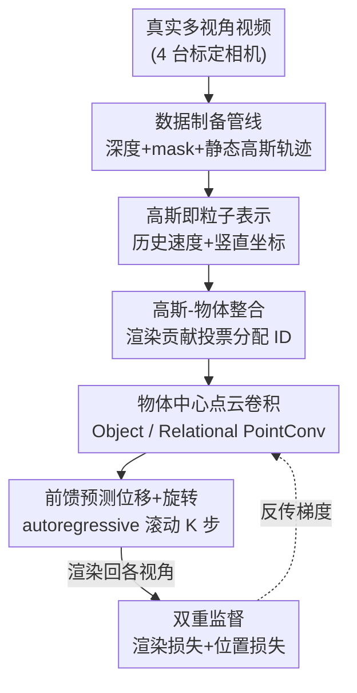

# Learning a Particle Dynamics Model with Real-world Videos

**会议**: CVPR 2026  
**arXiv**: [2605.23845](https://arxiv.org/abs/2605.23845)  
**代码**: https://chkim403.github.io/gs_physics (项目主页，承诺开源数据+代码)  
**领域**: 3D视觉 / 神经物理仿真 / 世界模型  
**关键词**: 粒子动力学, 高斯泼溅, 渲染监督, 多物体碰撞, 真实视频

## 一句话总结
提出一套直接从无标注真实视频学习多物体碰撞动力学的框架：把 3D Gaussian 当作粒子喂进点云骨干网络预测每个高斯的位移和旋转，用可微渲染损失代替昂贵的 3D 真值标注作监督，并配套发布约 500 段多视角碰撞视频数据集。

## 研究背景与动机

**领域现状**：用神经网络学习"粒子动力学模型"（一类可微的物理世界模型）近年很热——给定一组粒子的历史状态，网络前馈预测它们下一帧的运动，因为可微所以能嵌进更大的端到端系统（机器人、生成模型等）。代表性做法是把场景表示成点云、用图网络或点云卷积建模物体间的力传播。

**现有痛点**：这类模型几乎都在**仿真环境**里训练，因为它们依赖"完美状态"——完整场景点云、逐帧点对应关系、每个粒子的物体归属 ID。这些信息在真实世界里极难获得：稠密点云跨帧对应要么靠昂贵标注，要么靠 Chamfer 距离这种**近似且带噪**的监督信号。结果就是 sim-to-real gap 一旦变大，模型就失效。

**核心矛盾**：想从真实视频学，就拿不到粒子级 3D 真值；想要干净真值，就只能退回仿真。可微渲染（Gaussian Splatting / NeRF）本来给了第三条路——让梯度从 2D 图像回流到 3D，从而无需 3D 标注。但已有的渲染监督动力学工作几乎只做**单物体**场景（机器人操纵单个物体），无法处理多物体碰撞这种**不连续、强交互**的动力学。

**本文目标**：第一次实现"仅凭真实视频 + 2D mask + 渲染损失"学习**多物体碰撞**动力学，需要同时解决三个新难题——从局部 2D 线索恢复 3D 轨迹、在遮挡和碰撞中把每个高斯分配给正确物体、前馈预测未来高斯状态。

**核心 idea**：把 Gaussian Splatting 产出的稠密高斯**直接当成带 scale/rotation 的粒子**送进点云卷积网络，用可微渲染损失（配合点云跟踪得到的伪位置标签）作监督，从而摆脱对粒子级 3D 真值和物理参数预设的依赖。

## 方法详解

### 整体框架

方法分两条腿：一条是**数据制备管线**（把多视角真实视频转成网络能吃的"带物体一致 ID 的 3D 高斯轨迹 + 监督信号"），另一条是**粒子动力学模型**（把高斯当粒子，前馈预测下一帧位移和旋转，autoregressive 滚动多步）。训练时模型预测未来 $K=3$ 帧高斯，把预测的高斯渲染回多个标定视角，与真实图像比对得到渲染损失，同时与点云跟踪的伪标签比对得到位置损失。

输入是三帧历史高斯（$t-2,t-1,t$），每个高斯 $i$ 提取最近两帧速度 $\mathbf{v}_{t-1}^{(i)},\mathbf{v}_t^{(i)}$ 和两帧竖直坐标 $z_{t-1}^{(i)},z_t^{(i)}$（后者帮助网络感知重力和地面），拼成逐点特征 $\mathbf{f}_t^{(i)}=[\mathbf{v}_{t-1}^{(i)},\mathbf{v}_t^{(i)},z_{t-1}^{(i)},z_t^{(i)}]$。网络输出下一帧中心 $\hat{\mathbf{x}}_{t+1}^{(i)}$（预测速度或加速度）和增量旋转 $\Delta\mathbf{R}_t^{(i)}\in SO(3)$。

### 关键设计

**1. 高斯即粒子 + 渲染监督：用 2D 图像反传代替 3D 真值标注**

痛点是真实世界拿不到粒子级 3D 真值。作者注意到 Gaussian Splatting 产出的每个高斯本质就是一个带 scale、rotation 等属性的 3D 点 $G^{(i)}=(\mathbf{x}^{(i)},\mathbf{R}^{(i)},\mathbf{s}^{(i)},\mathbf{c}^{(i)},o^{(i)})$，于是直接把整组高斯当点云送进点云卷积骨干，**不做启发式下采样选锚点**，在原始稠密高斯上预测。监督来自可微渲染方程 $I(u)=\sum_{j}\mathbf{c}^{(j)}\alpha_c^{(j)}(u)\prod_{k<j}(1-\alpha_c^{(k)}(u))$——把预测的未来高斯渲染成图像与真实帧比对，梯度从 2D 像素回流到 3D 运动预测。这样既不需要稠密点云对应标注，也不需要预设任何物理参数（密度、杨氏模量、摩擦），相比 NeRF 隐式形变场的做法更显式、更容易加"物体"和刚性约束。

**2. 高斯-物体整合：用渲染贡献跨视角投票给每个高斯分配物体 ID**

多物体场景的核心难题是高斯本身**不带物体 ID**，而碰撞建模又必须知道谁是谁。作者假设有跨视角、跨时间一致的 2D 分割 mask（SAM 类模型已能稳定提供），然后用"每个高斯对渲染各物体 mask 的贡献"来反推归属。具体地，高斯 $i$ 对视角 $c$ 中像素 $u$ 的渲染贡献为 $\gamma_c^{(i)}(u)=\alpha_c^{(i)}(u)\prod_{j\in\mathcal{F}_c(i)}(1-\alpha_c^{(j)}(u))$（$\mathcal{F}_c(i)$ 是挡在它前面的高斯集合）；对每个 mask 取 mask 内像素的最大贡献 $\Gamma_{c,m}^{(i)}=\max_{u\in\text{mask}(c,m)}\gamma_c^{(i)}(u)$，得到张量 $\Gamma\in\mathbb{R}^{N\times C\times M}$。每个视角投一票 $\text{ID}_c^{(i)}=\arg\max_m\Gamma_{c,m}^{(i)}$，跨 $C$ 个视角做多数投票，转成 one-hot 的 $\mathbf{w}^{(i)}$（也支持软分布）。这样把"遮挡/碰撞下的物体归属"问题转成了渲染证据聚合，无需任何 3D 物体标注。

**3. 物体中心点云卷积：用一次性 KNN + ID 亲和权重区分"同物体内"与"跨物体"力传播**

碰撞动力学既要建模物体**内部**的刚性力传播，也要建模物体**之间**的接触作用。前作[12]靠维护每个物体专属的邻域来区分，需要低效的逐物体循环。本文改成：先做一次**物体无关**的 KNN，再用上一步得到的 ID 向量算亲和权重来决定每个邻居该进哪种卷积——Object PointConv 用 $m_{i,0}=(\mathbf{w}^{(i)})^\top\mathbf{w}^{(0)}$（同物体接近 1），Relational PointConv 用 $m_{i,0}=1-(\mathbf{w}^{(i)})^\top\mathbf{w}^{(0)}$（异物体接近 1），把权重插进点卷积：

$$\mathbf{y}_0=\mathbf{W}_l\,\mathrm{vec}\!\left(\frac{1}{\sum_i m_{i,0}}\sum_{\mathbf{p}_i\in\mathcal{N}(\mathbf{p}_0)}m_{i,0}\,h(\mathbf{p}_i-\mathbf{p}_0)\,\mathbf{x}_i^\top\right)$$

其中 $h(\cdot)$ 是把相对位置 $\mathbf{p}_i-\mathbf{p}_0$ 编码成卷积核权重的 MLP。这等价于"不显式建邻域就实现了物体级划分"，既高效又天然兼容 one-hot 和软 ID 两种表示，是把第 2 步的 ID 真正用起来的关键。整个网络用 U-Net 形态、两层网格下采样（2 cm / 5 cm），层间交替 Object / Relational PointConv。

**4. 双重监督 + 多步滚动 + 难例挖掘：在两路都带噪的信号下稳住训练**

渲染监督和位置监督**各自都不完美**——渲染侧虽有干净图像，但提取的高斯本身不准，运动对了也渲不出完美未来帧；位置侧的伪标签来自长程点跟踪+视频分割+立体深度，天然含噪。作者的策略是两路都用、互相兜底：$\mathcal{L}=\frac{1}{BK}\sum_i\sum_k(\lambda_{\text{rend}}\mathcal{L}_{\text{render}}^{(i,k)}+\lambda_{\text{pos}}\mathcal{L}_{\text{pos}}^{(i,k)})$，渲染用 L1、位置用 Huber，权重 $\lambda_{\text{rend}}=3,\lambda_{\text{pos}}=1$。同时训练时预测 $K=3$ 帧并 autoregressive 把预测喂回输入，逼网络学会稳定的多步滚动；并可选**难例挖掘**（每个 epoch 后按逐帧 loss 构造采样分布，让难帧被更频繁采样）。旋转更新可走可选的刚体变换拟合模块，或由预测头直接出 6D 旋转表示

### 损失函数 / 训练策略
总损失即上式的渲染 L1 + 位置 Huber 加权和（$\lambda_{\text{rend}}=3,\lambda_{\text{pos}}=1$）。一个 epoch 定义为每个场景被采样 10 次；batch size $B=12$，训 50 个 epoch，Adam 初始学习率 0.001，step 调度器中途两次各降 10×。帧采样支持均匀随机或基于 loss 的难例挖掘。

## 实验关键数据

实验在自采的真实数据集上做：bowling（球撞最多 10 个保龄球瓶）和 falling cube stacks（积木塔受随机外力坍塌）两个场景，4 台 Intel RealSense D455 标定相机、640×480。每个方法跑 3 个随机种子报均值±标准差。指标：渲染侧 PSNR/SSIM/LPIPS、位置精度 $\delta_{avg}$（5/10/20 cm 多阈值平均）、Chamfer Distance（CD, cm，在末帧算）。作者明确指出渲染指标区分度低（所有方法同一组输入高斯、前景占比小），**CD 和 $\delta_{avg}$ 更有判别力**。

### 主实验：与重实现的已发表基线对比（Table 2）

| 场景 | 方法 | CD ↓ | $\delta_{avg}$ ↑ | PSNR ↑ | LPIPS ↓ |
|------|------|------|------|------|------|
| Bowling | GS-Dynamics* | 9.48±0.13 | 62.94±1.56 | 27.34 | 0.047 |
| Bowling | **Ours** | **9.08±0.53** | **65.21±2.15** | 27.31 | 0.047 |
| Cube Stacks | GS-Dynamics* | 10.07±0.48 | 60.83±0.82 | 25.85 | 0.054 |
| Cube Stacks | **Ours** | **9.65±0.27** | **61.17±0.89** | 25.92 | 0.054 |

GS-Dynamics* 是作者把 DPI[14] 公式 + [37] 的高斯稠密化方案适配到多物体无动作设定后的重实现。本文在 CD 和 $\delta_{avg}$ 上有**温和数值优势**，但作者诚实声明统计显著性未确立。⚠️ 注意：与最接近的 Whitney et al.[29] 因对方未开源只做了定性比较（项目页视频），未列入定量表。

### 消融实验（Table 1，取关键行，Bowling 场景）

| 配置 | CD ↓ | $\delta_{avg}$ ↑ | 说明 |
|------|------|------|------|
| 非物体中心 (无 O-Centric) | 17.06±11.02 | 56.74±8.12 | 训练不稳定、CD 显著恶化 |
| 有 O-Centric、无 P.Fit | 11.15±2.04 | 55.52±5.12 | 去掉姿态拟合后 CD 变差 |
| 软 ID（soft distribution） | 11.37±2.09 | 61.64±0.51 | 比离散 ID 差 |
| 仅渲染损失（无 Pos.Loss） | 9.67±0.05 | **66.67±0.13** | $\delta_{avg}$ 高但两场景不均衡 |
| 仅位置损失（无 Ren.Loss） | 9.85±0.87 | 62.67±0.72 | 单路监督 |
| 双损失（均匀采样） | 9.74±0.41 | 63.54±2.77 | 两场景更均衡 |
| 双损失 + HEM（完整） | **9.08±0.53** | 65.21±2.15 | CD 最优 |

### 关键发现
- **物体中心建模贡献最大**：去掉物体-关系分解和物体级姿态拟合后，Bowling 的 CD 从 9.08 飙到 17.06 且标准差巨大（±11.02），训练直接不稳定——说明把"谁撞谁"显式建进卷积是多物体碰撞的命门。
- **离散 ID 优于软 ID**：因为单个高斯通常只属于一个运动物体，边界情形罕见，硬分配反而更干净。
- **双损失比单损失更均衡**：仅渲染损失能把 Bowling 的 $\delta_{avg}$ 冲到 66.67，但跨两个场景不稳；两路一起用在 CD 上整体更优。
- **难例挖掘有正向但不显著**：HEM 把 CD 从 9.74 降到 9.08，作者明说"统计上不显著"。
- 作者自承：渲染指标在此设定下几乎没区分度，这反而成了一个开放问题（见局限）。

## 亮点与洞察
- **把"物体归属"从标注问题转成渲染证据聚合**：用每个高斯对各 mask 的渲染贡献跨视角投票来分配 ID，巧在它复用了 GS 本来就有的 alpha 合成量、几乎零额外成本，且 one-hot/软分布通吃——这套"贡献投票"思路可迁移到任何需要把稠密图元归类到 2D mask 的任务。
- **一次性 KNN + ID 亲和权重替代逐物体邻域循环**：用 $m_{i,0}=(\mathbf{w}^{(i)})^\top\mathbf{w}^{(0)}$ 一个内积就把"同物体卷积 vs 跨物体卷积"统一进同一套 PointConv，既省掉低效循环又可微，是工程上很漂亮的解耦。
- **最"啊哈"的点**：多物体碰撞这种强不连续动力学，居然能仅靠真实视频 + 2D mask + 渲染损失学出来，完全不碰物理参数和 3D 真值——把"可微渲染当监督源"从单物体推到了多物体碰撞。
- **数据制备的务实取舍**：放弃不可靠的 4D Gaussian Splatting，改用"ICP（点跟踪初始化）估每物体位姿 + 把静态高斯按位姿搬运"得到轨迹，是一个值得借鉴的"绕开不成熟组件"工程决策。

## 局限与展望
- **缺乏可靠的物理正确性指标**（作者重点承认）：PSNR/SSIM/LPIPS 在此设定区分度太低（同一组输入高斯、前景占比小），且预测高斯与真值像素错位时渲染损失"一刀切"惩罚、不管物理是否合理；CD/$\delta_{avg}$ 也依赖带噪伪标签。如何度量"动力学物理上是否说得通"仍是开放问题。
- **统计显著性弱**：与 GS-Dynamics* 的对比、以及 HEM 的增益都未达统计显著，优势属"温和数值领先"，不宜过度解读。
- **伪标签噪声向上游传导**：位置监督靠点跟踪+视频分割+立体深度，跨视角 ID 关联靠匈牙利匹配，分割漂移/初始 mask 不准都会注入噪声；作者称实践中可接受，但未量化噪声上限对性能的影响。
- **场景多样性有限**：目前只有 bowling 和 cube stacks 两类桌面刚体碰撞、约 500 段视频；非刚体、复杂材质、室外大场景尚未验证。改进方向是把数据管线扩到更多场景，并研究真正反映物理合理性的评测指标。

## 相关工作与启发
- **vs GS-Dynamics\* / [37] / DPI[14]**：[37] 等机器人世界模型也用 GS 做渲染监督，但建模的是"动作对单个被操纵物体"的效果——去掉 action token 就不再建模交互，无法用于多物体无动作设定。本文重实现其多物体版作为基线 GS-Dynamics*，并在此之上把建模对象推广到无动作的多物体碰撞，CD/$\delta_{avg}$ 略优。
- **vs [12]（点云卷积交互建模前作）**：本文直接继承其 Object/Relational PointConv 思想，但[12]靠完美仿真真值和显式逐物体邻域；本文改成 GS 稠密高斯输入 + 渲染贡献投票得 ID + 一次性 KNN 亲和权重，把它搬到了无 3D 真值的真实世界。
- **vs NeRF-based 动力学[4,35,30]**：NeRF 是体积模型，只能用隐式形变场建粒子运动，难以加"物体"概念和刚性约束；GS 的显式表示让点云卷积/GNN 能直接处理 3D 高斯，更适合碰撞这种需要物体级推理的场景。
- **vs MPM-based 可仿真高斯[34,10,40]**：那类方法需要每物体物理参数（密度、杨氏模量、摩擦），靠手设或系统辨识，且对参数极敏感；本文直接前馈出 rollout，测试时无需任何手调或系统辨识。

## 评分
- 新颖性: ⭐⭐⭐⭐⭐ 首个仅凭真实视频+2D mask+渲染损失学习多物体碰撞动力学的框架，渲染贡献投票分配 ID 是干净的新机制
- 实验充分度: ⭐⭐⭐⭐ 消融全面、3 种子报方差，但定量对比仅 1 个重实现基线、关键优势统计不显著
- 写作质量: ⭐⭐⭐⭐ 动机与方法链条清晰、公式完整，对指标局限和显著性诚实交代
- 价值: ⭐⭐⭐⭐ 打通"真实视频→可微动力学"通路并开源约 500 段碰撞数据集，对机器人/世界模型社区有基建价值

<!-- RELATED:START -->

## 相关论文

- [\[CVPR 2026\] ParticleGS: Learning Neural Gaussian Particle Dynamics from Videos for Prior-free Physical Motion Extrapolation](particlegs_learning_neural_gaussian_particle_dynamics_from_videos_for_prior-free.md)
- [\[CVPR 2026\] NeoVerse: Enhancing 4D World Model with in-the-wild Monocular Videos](neoverse_enhancing_4d_world_model_with_in-the-wild_monocular_videos.md)
- [\[CVPR 2026\] AnthroTAP: Learning Point Tracking with Real-World Motion](anthrotap_learning_point_tracking_with_real-world_motion.md)
- [\[CVPR 2026\] Learning 3D Shape Fidelity Metric from Real-world Distortions](learning_3d_shape_fidelity_metric_from_real-world_distortions.md)
- [\[CVPR 2026\] Iris: Bringing Real-World Priors into Diffusion Model for Monocular Depth Estimation](iris_bringing_realworld_priors_into_diffusion_model_for_monocular_depth_estimation.md)

<!-- RELATED:END -->
