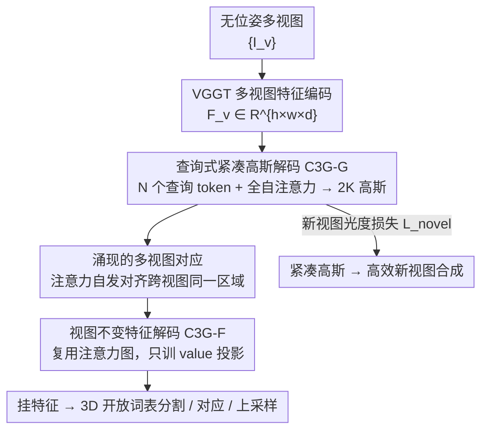

# Learning Compact 3D Representations from Feed-Forward Novel View Synthesis

**会议**: CVPR 2026  
**论文**: [CVF Open Access](https://openaccess.thecvf.com/content/CVPR2026/html/An_Learning_Compact_3D_Representations_from_Feed-Forward_Novel_View_Synthesis_CVPR_2026_paper.html)  
**代码**: https://cvlab-kaist.github.io/C3G （项目页）  
**领域**: 3D视觉  
**关键词**: 3D高斯泼溅, 前馈重建, 紧凑表示, 可学习查询, 特征提升

## 一句话总结
C3G 用一小撮可学习查询 token 经 self-attention 从无位姿多视图里"发现并解码"出只约 2K 个、放在关键空间位置的紧凑 3D 高斯，相比逐像素方法少约 65× 高斯却保持相当的新视图合成质量；并复用查询解码器涌现出的注意力图免训练地把任意 2D 特征无损提升到 3D，从而在更省显存、更快渲染的前提下显著提升 3D 开放词表分割等理解任务。

## 研究背景与动机
**领域现状**：从无位姿稀疏多视图前馈重建 3D 场景，近年主流是前馈式 3D Gaussian Splatting——网络直接预测每个像素一个（或多个）高斯，再接一个 2D→3D 特征提升阶段做场景理解。

**现有痛点**：逐像素预测有两个硬伤。其一，**生成大量冗余且跨视图错位的高斯**——多视图/高分辨率下动辄上百万高斯，视图越多伪影越多、显存越炸；其二，**做语义理解时算力开销巨大**——把丰富语义特征挂到这么多高斯上做 2D→3D 提升太贵，于是前作只能用自编码器把语义压成低维嵌入，造成信息损失、场景理解次优。

**核心矛盾**：作者抛出一个根本问题——重建和理解 3D 场景，真的需要"像素对齐"的密集高斯吗？人类理解周围环境时并不维护每个表面像素级的心理重建，而是形成紧凑、语义有意义的抽象（关键物体、大致空间关系、整体结构）。逐像素范式把"表示容量"均匀摊在每个像素上，恰恰违背了这种"按需分配"的直觉。

**本文目标**：在前馈、无位姿、无 GT 深度/分解标签的条件下，学出**只在必要空间位置放高斯**的紧凑表示，既省显存又支持无损特征提升。

**切入角度**：从人类视觉认知的"选择性注意"出发——用一小撮可学习查询 token 去"发现"场景里值得表示的区域，而不是僵硬地一像素一高斯。每个 token 自己学会跨视图聚合相关信息，形成一个连贯的 3D 高斯。

**核心 idea**：用"可学习查询 token + 全自注意力"取代"逐像素回归"来生成紧凑全局高斯；再把查询解码器涌现出的注意力图直接复用为特征聚合权重，免去昂贵的反向映射与额外的多视图对齐。

## 方法详解

### 整体框架
C3G 包含两部分。C3G-G（高斯解码器）：给定 $V$ 张无位姿输入图，先用预训练视觉编码器 VGGT 抽每视图特征 $F_v\in\mathbb{R}^{h\times w\times d}$（VGGT 自带强几何先验）；再把 $N$ 个可学习查询 token $Q\in\mathbb{R}^{N\times d}$ 与图像特征拼成统一序列 $X=[Q;F]$，过 $L$ 层全自注意力 transformer，让每个 token 跨所有视图聚合相关信息、token 之间互相交流以避免冗余、逐步细化"自己负责哪块 3D 区域"；最后把精炼后的 token 各自经轻量 MLP 头解码成一个高斯 $G_i$。训练只靠新视图合成的光度损失，无需 GT 深度或场景分解。C3G-F（特征解码器）：复用 C3G-G 学到的注意力图，只训练 value 投影，就能把任意编码器的 2D 特征无损提升成多视图一致的 3D 特征挂到高斯上。

### 关键设计

**1. 查询式紧凑高斯解码：用一小撮 token 发现关键区域，取代一像素一高斯**

针对"逐像素预测制造海量冗余且错位高斯"的痛点，C3G 把 $N$ 个可学习查询 token 当作"抽象单元"：每个 token 负责发现并表示场景里的一块特定 3D 区域。核心是把查询 token 与多视图图像特征拼成序列 $X=[Q;F]\in\mathbb{R}^{(N+V\times h\times w)\times d}$，过 $L$ 层全自注意力，使每个 token 学会三件事——从所有视图的特定区域聚合视觉信息、与其他 token 交流以避免重叠并保证覆盖、逐步细化自己代表的 3D 区域。transformer 后取精炼 token $\bar Q_i$，各自经 MLP 头解码成一个高斯（中心 $\mu_i$、不透明度 $\sigma_i$、协方差 $\Sigma_i$、球谐系数 $c_i$）。与逐像素方法把每个像素僵硬映射到高斯不同，查询 token 能灵活注意任意视图的任意区域，把表示容量分配到最需要的地方——这正是"只用约 2K 高斯就够"的来源（逐像素方法动辄 131K）。

**2. 涌现的多视图对应：注意力自发对齐跨视图同一区域，无需任何显式监督**

针对"逐像素特征跨视图不一致、需要额外对齐模块"的痛点，作者发现了一个关键涌现现象：尽管完全不监督这 $N$ 个 token 该如何划分场景、只用光度重建目标训练，每个查询 token 的注意力图却自发地在多个视图上聚焦到**空间一致的同一区域**（可视化中红点目标高斯在不同视角下都强烈注意到对应物体区域）。作者认为这来自隐式优化压力——要用有限的 $N$ 个高斯精确重建新视图，模型必须把高斯放到几何上连贯的区域，于是 token 自然学会了多视图对应。这个性质很重要：它意味着"跨视图对应"不必额外学，而是紧凑表示训练的副产品，直接为后续特征提升铺路。

**3. 视图不变特征解码 C3G-F：复用注意力图，只训 value 投影就能无损提升任意特征**

针对"2D→3D 特征提升要做昂贵反向映射、且要额外处理多视图不一致"的痛点，作者复用 C3G-G 涌现的注意力图来一举解决两难：① 对应识别——每个 token 已对它对应的投影区域有高注意力，省掉昂贵的反向映射去找"哪些高斯渲染了该像素"；② 多视图不一致——直接把注意力权重当插值权重去聚合不一致特征。具体地，C3G-F 复制 C3G-G 的架构与参数、**冻结注意力权重**，只让 value 投影可训，并为不同特征维度新设可学习特征 token $Q'\in\mathbb{R}^{N\times d'}$；这样每个特征 token 注意的多视图区域与对应高斯 token 完全一致，把 C3G-G 学到的对应关系直接借来做特征聚合。训练用渲染特征与 GT 特征的余弦相似损失 $L_{\text{feat}}=1-\cos(\hat F_t/\|\hat F_t\|,\,F'_t/\|F'_t\|)$。由于不用自编码器压缩，特征**无损**挂到高斯上，3D 理解任务因此显著受益。

### 损失函数 / 训练策略
C3G-G 的训练目标是把预测高斯渲染到新视图并最小化与 GT 图的光度差：$L_{\text{novel}}=\lambda_{\text{MSE}}L_{\text{MSE}}(\hat I_t,I_t)+\lambda_{\text{LPIPS}}L_{\text{LPIPS}}(\hat I_t,I_t)$，无需 GT 深度或场景分解标签。关键训练技巧是**渐进低通滤波**（借 RAIN-GS）：渲染时把 2D 高斯写成 $G^{2D}_i(p)=\exp\!\big(-\tfrac12(p-\mu^{2D}_i)^\top(\Sigma^{2D}_i+sI)^{-1}(p-\mu^{2D}_i)\big)$，把控制高斯尺寸的 $s$ 从大（如 10）逐步退火到 0.3——早期高斯位置噪声大时用放大区域提供稳健梯度、避免落到视锥外造成稀疏梯度与模式坍塌，后期再精细建模细节。消融显示去掉低通滤波会直接训练崩溃（PSNR/SSIM/LPIPS 全 N/A）。实现上 $N=2048$、$L=2$ 层 transformer、球谐阶数设 0（只建 RGB）、$224\times224$ 分辨率、$\lambda_{\text{MSE}}=1,\lambda_{\text{LPIPS}}=0.05$，AdamW 训 450K 步、8×H100。

## 实验关键数据

### 主实验
新视图合成（RealEstate10K，12/24/36 视图）：C3G 用约 **2K 高斯**就达到与逐像素/体素合并方法相当的质量，且经短暂测试时优化（TTO）后反超。

| 方法（24 视图） | PSNR↑ | #高斯↓ | 备注 |
|--------|------|------|------|
| AnySplat | 24.11 | 2,636K | 体素合并减高斯 |
| VGGT+NoPo | 21.24 | 1,204K | 逐像素，视图增多反而退化 |
| **C3G (Ours)** | **23.80** | **2K** | 高斯量级少约 1000× |
| C3G w/ TTO | **29.99** | 27K | TTO 后大幅领先 |

3D 场景理解（ScanNet，提升 LSeg/MaskCLIP 特征做开放词表分割，目标视图）：

| 方法 | LSeg mIoU↑ | MaskCLIP mIoU↑ | #高斯↓ | 显存↓ | FPS↑ |
|------|------|------|------|------|------|
| LSM（前馈） | 0.503 | 0.286 | 131K | 61.5MB | 625 |
| **C3G (Ours)** | **0.513** | **0.369** | **2K** | **4.1MB** | **785** |

C3G 在显存（4.1MB vs 61.5MB，约 15× 缩减）、高斯量（约 65× 少）、渲染速度（785 vs 625 FPS）全面占优，理解指标还更高（MaskCLIP mIoU 0.369 vs 0.286）。

### 消融实验
| 配置 | 关键指标（PSNR / SSIM / LPIPS） | 说明 |
|------|---------|------|
| Full（低通滤波 + 解冻编码器） | 22.39 / 0.713 / 0.259 | 完整模型 |
| w/o 低通滤波 | N/A | 高斯落到视锥外，训练直接崩溃 |
| 冻结视觉编码器 E | 18.44 / 0.553 / 0.408 | 阻碍有效高斯生成，大幅掉点 |
| #G=2048（默认） | 20.63 / 0.623 / 0.321 | 最优 |
| #G=4096 | 19.01 / 0.568 / 0.450 | 过多高斯落次优位置、陷局部最优 |

### 关键发现
- **低通滤波是稳定训练的命门**：去掉后高斯无法定位到目标视锥内、梯度稀疏、模式坍塌，直接 N/A；这是前馈 3DGS 定位高斯位置这一核心难题的有效解。
- **高斯数量并非越多越好**：从 256→2048 重建持续提升，但 4096 反而失稳（多余高斯落次优位置易陷局部最优），故全程固定 $N=2048$。
- **C3G-F 免自编码器**：消融表 7 显示带自编码器（压缩）的 mIoU 0.512 与无自编码器（无损）0.513 接近，但无损版 PSNR 更高（23.89 vs 23.60），印证"不压缩特征"对重建/理解都更优。
- **无强几何先验也能学**：把编码器换成无显式几何监督的 DINOv3，查询 token 仍能聚合出连贯高斯（PSNR 20.29），说明框架不死依赖 VGGT 的几何先验。
- **特征聚合大幅提升对应**：两视图对应（ScanNet PCK@10px）上，VGGT-Tracking+C3G 把平均从 34.0 提到 **68.1**，DINOv2/DINOv3 同样从约 23–38 跃到约 68，验证 C3G-F 作为视图不变特征解码器的有效性。

## 亮点与洞察
- **"查询发现"取代"逐像素回归"**：这是把 DETR 式 object query 思想搬到前馈 3DGS 的漂亮一招——表示容量按需分配而非均摊到像素，直接换来约 65× 高斯缩减且不掉质量，思路可迁移到任何"密集预测→稀疏抽象"的 3D 任务。
- **涌现对应当免费午餐**：只用光度损失训练，注意力却自发学会跨视图对应；作者没有把它当副产物丢掉，而是反手复用为特征提升的对齐权重，省掉昂贵反向映射——"训练副产物即下游能力"的设计哲学很值得学。
- **无损特征提升**：因为高斯只有约 2K 个，可以不压缩地把高维语义特征直接挂上去，避开了前作"自编码器压缩→信息损失"的妥协，这是理解指标反超 LSM 的根因。

## 局限与展望
- 主战场是室内/RealEstate 类有界场景，对大尺度室外、长序列、动态场景的可扩展性未充分验证；输入视角数继续增大时 2K 高斯是否仍够用没给出退化曲线。
- 高斯数固定为 $N=2048$ 且对该值敏感（4096 即失稳），缺乏"按场景复杂度自适应分配高斯数"的机制，复杂大场景下固定预算可能不足。⚠️ 以原文为准。
- 训练成本不低（450K 步、8×H100），且依赖 VGGT 这类强先验编码器；虽证明 DINOv3 也能用，但换骨干后的全面性能与最优配置仍待更系统的探索。

## 相关工作与启发
- **vs LSM**：同为前馈、两视图输入，但 LSM 走逐像素（131K 高斯）+ 特征压缩路线；C3G 用查询解码出 2K 高斯 + 无损特征，显存约 15× 更省、理解指标更高（MaskCLIP mIoU 0.369 vs 0.286）。
- **vs AnySplat / ZPressor / Long-LRM**：它们是"先逐像素后剪枝/合并/体素化"的事后压缩，没根治逐像素带来的输入视图偏置；C3G 从生成阶段就用全局查询直接产紧凑高斯，从源头避免冗余。
- **vs CF3 / Feature-3DGS（逐场景优化）**：它们需位姿、逐场景优化、上百万高斯；C3G 前馈、无位姿、2K 高斯，在 ScanNet 理解上反超逐场景方法，且 FPS 高一个量级。
- **vs FiT3D / AnyUp（特征提升/上采样）**：FiT3D 用自编码器提升 2D 特征但有信息损失、生成过多高斯；C3G-F 复用注意力图无损聚合，对应精度（PCK 平均 68.x vs 约 24–39）大幅领先。

## 评分
- 新颖性: ⭐⭐⭐⭐⭐ 用可学习查询从源头生成紧凑全局高斯、并把涌现注意力复用为特征提升权重，是对前馈 3DGS 范式的根本性重构
- 实验充分度: ⭐⭐⭐⭐⭐ 覆盖新视图合成、开放词表分割、多视图对应、特征上采样四类任务 + 完整消融，证据扎实
- 写作质量: ⭐⭐⭐⭐ 动机（人类抽象认知）到方法到涌现分析叙述连贯，但部分实现细节散落多表、需对照阅读
- 价值: ⭐⭐⭐⭐⭐ 约 65× 高斯缩减 + 无损特征提升直击前馈 3DGS 的显存/算力痛点，对下游理解任务实用价值高

<!-- RELATED:START -->

## 相关论文

- [\[CVPR 2026\] Cross-View Splatter: Feed-Forward View Synthesis with Georeferenced Images](cross-view_splatter_feed-forward_view_synthesis_with_georeferenced_images.md)
- [\[CVPR 2026\] From Rays to Projections: Better Inputs for Feed-Forward View Synthesis](from_rays_to_projections_better_inputs_for_feed-forward_view_synthesis.md)
- [\[CVPR 2026\] Splatent: Splatting Diffusion Latents for Novel View Synthesis](splatent_splatting_diffusion_latents_for_novel_view_synthesis.md)
- [\[CVPR 2026\] AnchorSplat: Feed-Forward 3D Gaussian Splatting with 3D Geometric Priors](anchorsplat_feed-forward_3d_gaussian_splatting_with_3d_geometric_priors.md)
- [\[CVPR 2026\] Dynamic-Static Decomposition for Novel View Synthesis of Dynamic Scenes with Spiking Neurons](dynamic-static_decomposition_for_novel_view_synthesis_of_dynamic_scenes_with_spi.md)

<!-- RELATED:END -->
