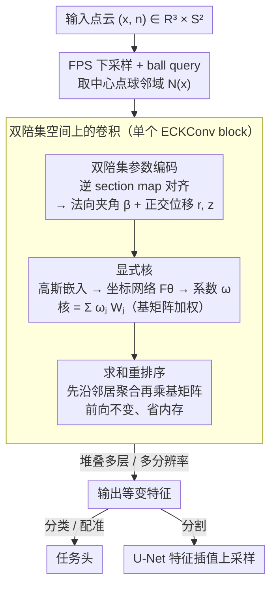

# ECKConv: Learning Coordinate-based Convolutional Kernels for Continuous SE(3) Equivariant Point Cloud Analysis

**会议**: CVPR 2026  
**arXiv**: [2603.17538](https://arxiv.org/abs/2603.17538)  
**代码**: 无  
**领域**: 3D视觉  
**关键词**: 点云分析, SE(3)等变性, 群卷积, 双陪集空间, 坐标网络, intertwiner框架

## 一句话总结

提出ECKConv，在intertwiner框架下将卷积核定义在双陪集空间 $\text{SO(2)}\backslash\text{SE(3)}/\text{SO(2)}$ 上，通过坐标网络显式参数化核函数，首次实现连续SE(3)等变性与大规模可扩展性的兼得，在分类、配准、分割四类任务上全面验证。

## 研究背景与动机

3D点云深度学习中，模型对刚体运动（旋转+平移）的对称性是高效学习的关键。群卷积是提取等变特征的代表方法，但现有实现在**严格对称性**和**可扩展性**之间存在根本性的权衡：

**领域现状**：群卷积分为两大流派——离散群方法（EPN、E2PN）直接在离散化的旋转群上展开核参数，可控卷积方法（TFN、SE(3)-Transformer）通过不可约分解保证连续等变性。

**现有痛点**：
   - 离散群方法将连续旋转离散化（如把SO(3)离散为有限个旋转），导致模型对称性与群的连续性之间产生discrepancy，无法严格保证连续SE(3)等变
   - 可控卷积方法虽然理论优美，但需要将特征和核分解到不可约表示上，计算代价昂贵（TFN仅62.28%分类准确率），无法扩展到大规模3D场景

**核心矛盾**：严格连续等变性 vs. 内存/计算可扩展性——鱼与熊掌不可兼得

**已有尝试**：intertwiner框架（Cohen et al.）提出将群卷积的域从群空间替换为商空间，理论上更合理。但先前工作CSEConv仅实现了SO(3)对称（缺少平移），且采用隐式核导致内存消耗大，不可扩展

**切入角度**：作者观察到，当参考点落在SO(2)子群（Z轴）上时，拓扑相同的点分布在不相交的orbit（double coset）上，每个orbit可由三个唯一参数表示。这意味着可以只依赖这些SE(3)不变参数来构建等变操作

**核心idea**：在双陪集空间上用坐标网络显式参数化卷积核，同时获得连续SE(3)等变性和内存可扩展性

## 方法详解

### 整体框架

ECKConv的输入是点云 $(x, n) \in \mathbb{R}^3 \times S^2$（坐标+法向量），经过多层ECKConv block处理后输出等变特征。每个block内部的核心操作是：对每个中心点的球查询邻域，提取SE(3)不变的双陪集参数，通过坐标网络计算核权重，对邻域特征加权求和得到输出特征。整体架构采用类似PointNet++的多分辨率设计（FPS下采样+ball query），分割任务采用U-Net架构配合特征插值上采样。

### 关键设计

**1. 双陪集空间上的卷积：让核只看三个SE(3)不变标量**

直接在群上展开核会逼着你离散化旋转（破坏连续等变）或做不可约分解（贵到跑不动），这是前面那条根本性权衡的源头。本文借 intertwiner 框架换一个域：取 $G=\text{SE(3)}$、左右子群 $H_1=H_2=\text{SO(2)}$、不变表示 $\rho_1=\rho_2=\text{id}$，把核函数定义在双陪集空间 $\text{SO(2)}\backslash\text{SE(3)}/\text{SO(2)}$ 上。卷积写成对球邻域的加权求和

$$(f*\kappa)(x) = \sum_{x_i \in \mathcal{N}(x)} \kappa\big(s(x)^{-1}x_i\big)\, f(x_i),\qquad \kappa: \text{SE(3)/SO(2)} \to \mathbb{R}^{C_{out} \times C_{in}}$$

关键在于双陪集空间里每个元素只由三个参数 $[\beta_g, r_g, z_g]$ 唯一确定，核 $\kappa$ 也就只依赖这三个标量。之所以能严格连续等变，是因为绕 Z 轴的那部分旋转自由度被左右两侧 SO(2) 子群的作用直接"吃掉"了——核根本看不到它，于是既不必离散化、也不必做不可约分解，连续 SE(3) 等变性是构造上天然成立的。

**2. 双陪集参数编码：把局部几何压成法向夹角加两个正交位移**

设计点 1 要求核的输入是三个 SE(3) 不变标量，这一步负责从原始邻域里把它们算出来。域空间分解为 $\mathbb{R}^3 \times S^2$（坐标 + 法向量），对 ball query 邻域内的每个点 $x_i$，先用逆 section map 对齐到中心点的局部坐标系，再提取三个量：法向量夹角 $\bar{\beta}_i = \arccos(\mathbf{n}^\top \cdot \mathbf{n}_i)$、平行于法向量的位移分量 $\bar{z}_i$、垂直于法向量的位移分量 $\bar{r}_i$（后两者都除以球查询半径做归一化）。三者恰好把"法向关系 + 两个正交方向上的空间位移"完整描述出来，归一化又保证每层 ECKConv 只在尺度一致的局部区域里看几何，跨层尺度不串。法向量并非硬性前提——拿不到时论文给了 Algorithm 1 的启发式替代（K-NN 平均差向量或 PCA 估计），代价是约 0.7% 的精度。

**3. 显式核：系数网络配可学习基矩阵，替掉 CSEConv 的隐式核**

前驱 CSEConv 用随机傅里叶特征的隐式核，让网络直接吐出整个 $C_{out}\times C_{in}$ 矩阵，参数和内存都压不住。ECKConv 把核拆成"系数 + 基"两部分：三个双陪集参数先归一化到 $[0,1]$，过高斯嵌入 $\text{Gau}(\cdot)\in\mathbb{R}^{3d}$（$\psi(x,y)=\exp(-(x-y)^2/2\sigma^2)$）编码，再由坐标网络 $F_\theta$ 输出一个只有 $A$ 维的系数向量 $\omega(\bar{x};\theta)\in\mathbb{R}^A$，核值由这些系数对一组可学习基矩阵 $\mathbf{W}_j$ 加权得到

$$\kappa\big(s(x)^{-1}x_i\big) = \sum_{j=1}^{A} \omega_j(\bar{x}_i;\theta)\, \mathbf{W}_j$$

网络只需回归 $A$ 个标量而非整个矩阵，高斯嵌入又借其有界秩在记忆与泛化之间取平衡，这正是同架构下 ECKConv-mini 能把 CSEConv 的 83.75%/2.95GB 改善到 87.36%/0.72GB 的来源。

**4. 求和重排序：零成本换来反向传播的内存可扩展性**

显式核虽省了参数，但朴素实现仍要对每个邻居先合成完整核矩阵再乘特征，反向传播内存吃在 $K$ 个邻居 × $C_{in}\times C_{out}$ 上。Proposition 4.1 用矩阵乘法结合律把求和顺序换一下：

$$\sum_i \Big(\sum_j \omega_j \mathbf{W}_j\Big) f(x_i) \;=\; \sum_j \mathbf{W}_j \sum_i \omega_j f(x_i)$$

先沿邻居把 $\omega_j f(x_i)$ 聚合、再乘基矩阵，梯度复杂度就从 $\mathcal{O}(AKC_{in}C_{out})$ 降到 $\mathcal{O}(A(KC_{in}+C_{in}C_{out}))$。前向结果分毫不变，纯靠改写计算顺序，却换来位姿配准 5.37GB vs CSEConv 39.09GB、大规模分割 10.26GB vs 66.46GB 的差距，把"严格等变"和"跑得起大场景"这对矛盾真正拆开。

### 损失函数 / 训练策略

- 分类：交叉熵损失（label smoothing=0.2），Adam，lr 1e-4余弦退火到1e-6，200 epochs
- 配准：$\mathcal{L} = \|\mathbf{R}_{pred}\mathbf{R}_{gt}^\top - \mathbf{I}\|_2^2 + \|\mathbf{t}_{pred} - \mathbf{t}_{gt}\|_2^2$，与DCP结合，SE(3)均匀采样训练位姿
- 分割：U-Net + 特征插值上采样（ShapeNet K=1，S3DIS K=3最近邻插值）
- S3DIS：裁剪 $4m^2$、4096点训练，XY缩放+X轴翻转增强，类别加权交叉熵，1米步长+3次投票推理。全部在单张RTX 3090完成

## 实验关键数据

### 主实验

| 数据集/任务 | 指标 | ECKConv | 之前SOTA | 提升 |
|-------------|------|---------|----------|------|
| ModelNet40 (SO(3)/SO(3)) | 分类准确率 | 90.92% (Normal) | 88.58% (E2PN) | +2.34% |
| ModelNet40 位姿配准 | 平均角误差 | 0.63° | 1.62° (EPN) | 2.6× |
| ModelNet40 位姿配准 | 最大角误差 | 8.57° | 178.95° (CSEConv) | 质的飞跃 |
| ShapeNet (SO(3)/SO(3)) | 部件分割 mIoU | 83.68% | 81.76% (VN) | +1.92% |
| S3DIS Area5 | 语义分割 mIoU | 61.80% | 60.3% (RI-MAE) | +1.50% |

### 消融实验

| 配置 | 准确率 / 内存 | 说明 |
|------|--------------|------|
| ECKConv-mini (显式核) | 87.36% / 0.72GB | 同架构CSEConv: 83.75% / 2.95GB，准确率+3.6%、内存4.1倍节省 |
| ECKConv (Algorithm 1) | 90.19% | 不用法向量，启发式替代 |
| ECKConv-Normal | 90.92% | 使用真实法向量，性能最优 |
| A=12→22（anchor bases） | 89.22→90.19% | 超参数变化，性能鲁棒 |
| 配准 ECKConv vs CSEConv | 5.37GB vs 39.09GB | 7.3倍内存节省 |
| 分割 ECKConv vs CSEConv | 10.26GB vs 66.46GB | 6.5倍内存节省 |

### 关键发现

- ECKConv在所有训练/测试旋转组合下保持一致准确率，验证了连续SE(3)等变性
- 位姿配准最能体现连续等变性的价值：CSEConv（仅SO(3)对称）最大角度误差178.95°，说明缺少平移等变性导致灾难性失败
- 在S3DIS大规模语义分割中，ECKConv超越了数据增强方法（KPConv+SO(3) Aug: 57.42%）和旋转不变方法（RI-MAE: 60.3%），证明SE(3)等变性对大规模场景的实际价值
- 超参数消融表明ECKConv对anchor数量 $A$ 和嵌入维度 $\Psi$ 变化鲁棒，残差连接对维持性能有重要作用

## 亮点与洞察

- **理论优雅与实用的统一**：将SE(3)等变性问题归结为双陪集空间上的核函数设计，理论上严格保证连续对称性，同时通过显式核实现工程可扩展性
- **显式核重排序**：仅通过改变求和顺序（Proposition 4.1）就将反向传播复杂度从 $O(AKC_{in}C_{out})$ 降到 $O(A(KC_{in}+C_{in}C_{out}))$，不改变前向计算结果，零成本获得可扩展性。这一简单trick的效果极其显著（7倍内存节省）
- **高斯嵌入的恰当选择**：将双陪集参数映射到高斯核空间，利用其有界秩性质平衡记忆与泛化，可迁移到其他连续几何参数处理场景
- **位姿配准实验**：展示了连续等变性vs离散等变性的本质差异——CSEConv最大角度误差178.95°是因为SO(3)对称无法处理平移，这个实验设计非常有说服力

## 局限与展望

- **各向同性限制**：由于使用标量型特征和双陪集元素，核函数对SE(3)作用各向同性，不适用于需要方向性表达的任务（法向量估计、分子结构预测、n-body问题）
- **法向量依赖**：ECKConv-Normal需要真实法向量才达最佳，Algorithm 1替代有~0.7%性能下降
- **与非等变SOTA差距**：分类上PTv3（92.54%）仍高~1.6%，等变约束可能限制模型容量
- **颜色信息未利用**：S3DIS实验仅用坐标+法向量，加入颜色可能进一步提升
- **注意力机制未探索**：未与Transformer结合，可能限制全局上下文建模

## 相关工作与启发

- **vs CSEConv**：最直接的前驱，ECKConv扩展到连续SE(3)（CSEConv仅SO(3)）并通过显式核实现可扩展性（4~7倍内存节省），性能也大幅超越
- **vs E2PN**：离散SE(3)+注意力池化实现可扩展性，但离散化导致旋转等变性不严格（SO(3)/SO(3)下88.58% vs 90.92%）
- **vs Vector Neurons**：模型无关框架实现SO(3)等变，在分割任务上VN（81.76%）不如ECKConv（83.68%），说明局部SE(3)等变优于全局SO(3)等变
- **vs TFN/SE(3)-T**：可控卷积代表，理论等变但计算极高（62-73%分类准确率），体现纯理论路线的实用局限
- ECKConv的双陪集空间思路可启发分子对称性、蛋白质结构等几何对称问题的处理

## 评分

- **新颖性**: ⭐⭐⭐⭐ 首次在intertwiner框架下实现连续SE(3)等变+可扩展的点云卷积，理论贡献扎实
- **实验充分度**: ⭐⭐⭐⭐ 覆盖分类/配准/部件分割/语义分割四类任务，消融充分且有可扩展性对比
- **写作质量**: ⭐⭐⭐⭐ 数学推导清晰严谨，图示直观，补充材料详尽
- **价值**: ⭐⭐⭐⭐ 解决了群卷积领域的核心权衡问题，对等变网络研究有重要推动意义

<!-- RELATED:START -->

## 相关论文

- [\[CVPR 2026\] Adapting Point Cloud Analysis via Multimodal Bayesian Distribution Learning](adapting_point_cloud_analysis_via_multimodal_bayesian_distribution_learning.md)
- [\[CVPR 2026\] Efficient Hybrid SE(3)-Equivariant Visuomotor Flow Policy via Spherical Harmonics](efficient_hybrid_se3-equivariant_visuomotor_flow_policy_via_spherical_harmonics_.md)
- [\[ECCV 2024\] Equi-GSPR: Equivariant SE(3) Graph Network Model for Sparse Point Cloud Registration](../../ECCV2024/3d_vision/equi-gspr_equivariant_se3_graph_network_model_for_sparse_point_cloud_registratio.md)
- [\[AAAI 2026\] Graph Smoothing for Enhanced Local Geometry Learning in Point Cloud Analysis](../../AAAI2026/3d_vision/graph_smoothing_for_enhanced_local_geometry_learning_in_point_cloud_analysis.md)
- [\[CVPR 2026\] Deformation-based In-Context Learning for Point Cloud Understanding](deformation-based_in-context_learning_for_point_cloud_understanding.md)

<!-- RELATED:END -->
