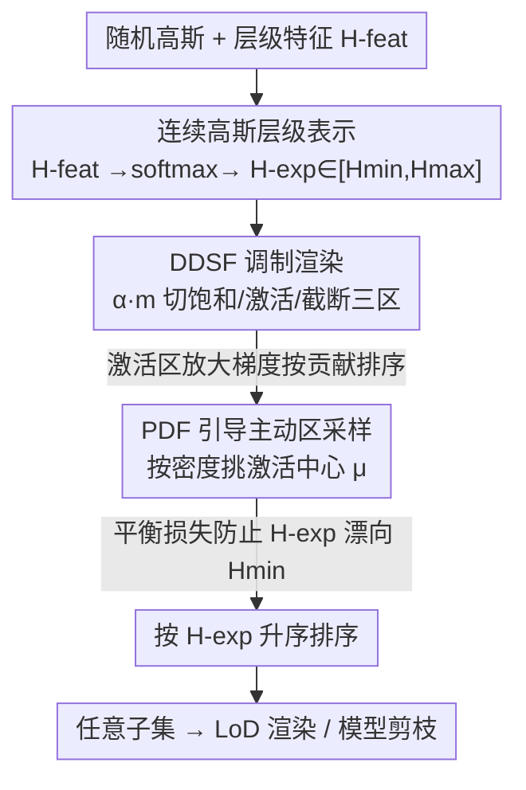

# Learning Differentiable Hierarchies in 3D Gaussian Splatting

**会议**: CVPR 2026  
**论文**: [CVF Open Access](https://openaccess.thecvf.com/content/CVPR2026/html/Pan_Learning_Differentiable_Hierarchies_in_3D_Gaussian_Splatting_CVPR_2026_paper.html)  
**代码**: 待确认  
**领域**: 3D视觉  
**关键词**: 3D高斯泼溅, Level-of-Detail, 可微层级, 模型剪枝, 连续层级学习

## 一句话总结
给每个高斯加一个可学习的「层级标量」，用一个可微的递减阶跃函数在单阶段训练里同时优化全模型渲染和层级排序，让 3DGS 无需多阶段训练就能按任意高斯数量做 LoD 渲染和剪枝，且训练时间只比标准 3DGS 多约 10%。

## 研究背景与动机

**领域现状**：3D Gaussian Splatting（3DGS）凭实时渲染和高质量新视角合成迅速流行，但一个场景常含数百万个无序高斯，存储开销巨大。低功耗设备需要紧凑模型、VR/AR 需要按视觉特性动态调分辨率的 foveated rendering，这些定制化场景都要求把「层级 / Level-of-Detail（LoD）」信息注入到原本无结构的表示里。

**现有痛点**：现有 LoD 方法要么引入额外数据结构 / 空间层级 / 隐式 MLP（如 FLoD、Octree-GS、Scaffold-GS），破坏了标准 3DGS 的表示和训练流程、无法无缝接入；要么在保持 3DGS 结构的前提下手工预定义层级划分、对每个 LoD 单独训练（自底向上的 LapisGS、自顶向下的 CLOD），导致层级可扩展性差、整体渲染质量下降、训练时间相比标准 3DGS 成倍增加。

**核心矛盾**：高斯是无序的，要做层级就得给它们排个「重要性序」；但排序本身需要知道每个高斯对场景的贡献，而贡献又依赖渲染——手工设计重要性指标或多阶段训练，无法**同时**满足「优化全模型渲染」和「按贡献学出层级」这两个相互耦合的目标。CLOD 这类连续 LoD 方法把层级固定成高斯的插入顺序，无法再调整；而它第二阶段用子集训练又会让全模型「遗忘」，100% 渲染时反而掉点。

**本文目标**：在不改 3DGS 表示、不加多阶段训练的前提下，学出一个连续、数据驱动的高斯层级，使得「取 H-exp 低于某阈值的子集」就能在任意高斯数量下得到高质量渲染。

**切入角度**：与其离散地手工分层，不如给每个高斯一个**连续、有界、可微**的层级值，把「分层」变成可被渲染损失梯度直接优化的属性。

**核心 idea**：用一个**可微递减阶跃函数（DDSF）**在训练时调制高斯不透明度——让落在「激活区」的高斯获得与其渲染贡献成正比的放大梯度，从而自然地把高贡献高斯推向低层级值，单阶段就学出一个按重要性排序的连续层级。

## 方法详解

### 整体框架
方法在标准 3DGS 的每个高斯上额外挂一个轻量的二维**层级特征 H-feat**，经 softmax 加权期望映射成有界连续标量 **H-exp ∈ [Hmin, Hmax]**（H-exp 越小代表贡献越大、层级越高）。训练时，渲染分两路并行：一路是标准全高斯渲染，另一路用 DDSF 把每个高斯的不透明度 $\alpha_i$ 乘上调制系数 $m_i = \sigma(H^{exp}_i; \mu)$ 后做「子集渲染」。DDSF 按激活中心 $\mu$ 把高斯切成饱和区（$m\approx1$，正常贡献）、激活区（$0<m<1$，被调制）、截断区（$m\approx0$，几乎不参与）三段；激活区窄而陡，使得渲染误差在该区产生放大梯度、按贡献分离高斯。为了让所有高斯的 H-feat 都被充分训练，PDF 引导采样按当前 H-exp 分布的概率密度去挑激活中心，让激活区覆盖高密度区间、推动 H-exp 在值域内均匀铺开。训练结束后按 H-exp 升序排序，取阈值以下的子集即可做 LoD 渲染或剪枝。

### 关键设计

**1. 连续高斯层级表示：把离散分层换成可微标量**

针对「无序高斯难以排序、手工离散分层不可微」的痛点，本文给每个高斯加一个二维无约束特征 $H^{feat}=[h_1,h_2]$，通过 softmax 后再对边界做加权期望映射到有界区间：$[p_1,p_2]=\mathrm{Softmax}(h_1,h_2)$，$H^{exp}=[p_1,p_2]\cdot[H_{min},H_{max}]^\top$。直接优化一个被钳在固定区间里的值会引起梯度消失或不稳定，而这种「无约束特征 + softmax 期望」的参数化既保证 H-exp 始终落在 $[H_{min},H_{max}]$ 内、又让梯度通过 softmax 平滑地控制两个边界的相对贡献，训练稳定。H-feat 不改高斯的形状（位置、协方差、球谐系数都不动），所以高斯基元定义与经典 3DGS 完全一致、能无缝接入标准管线。约定 H-exp 越小代表该高斯越重要。

**2. DDSF 渲染：用可微递减阶跃函数同时学层级、保渲染**

可微分层框架要同时满足两个耦合目标——既按高斯对渲染的贡献优化它的层级，又按学到的层级优化子集渲染——手工重要性指标或多阶段训练都做不到二者兼得。本文用一个**可微递减阶跃函数（DDSF）** $\sigma$ 作为调制函数：渲染时把高斯不透明度乘上 $m_i=\sigma(H^{exp}_i;\mu)\in[0,1]$，渲染色为 $C(x)=\sum_i T_i (m_i\alpha_i) c_i$，透过率 $T_i=\prod_{j<i}(1-m_j\alpha_j)$。前向看：饱和区 $m\approx1$ 等价于经典渲染，截断区 $m\approx0$ 相当于不渲染，由于激活区很窄，整体近似于「只渲染 $H^{exp}<\mu$ 的高斯子集」，保住了原训练目标。反向看：对 H-exp 的梯度为 $\frac{\partial L}{\partial H^{exp}_i}=\frac{\partial L}{\partial C}\cdot\frac{\partial C}{\partial m_i}\cdot\frac{\partial \sigma}{\partial H^{exp}_i}$，饱和/截断区 $\partial\sigma/\partial H^{exp}\approx0$ 几乎没梯度，唯独激活区因 $\sigma$ 陡变产生放大梯度，且幅度正比于 $\frac{\partial C}{\partial m_i}$（即该高斯对渲染色的贡献）。贡献大的高斯被推向更小的 H-exp，**自然形成按重要性排序的层级**。实现上用 sigmoid 作 $\sigma$、$\beta=10$，激活带宽约 0.59，在「陡峭」和「平滑」间取平衡。

**3. PDF 引导主动区采样：让每个高斯都被有效训练**

由于 DDSF 激活区很窄，单步只有 H-exp 落在 $\mu$ 附近的高斯能拿到有效梯度，激活中心必须在迭代中移动才能覆盖整个值域。但实际中 H-exp 受初始化偏置和训练动态影响往往聚成一窄团，**均匀随机**地选激活中心会导致某些高斯被过度优化、另一些训练不足。本文转而按当前 H-exp 分布的**概率密度函数**采样激活中心：把 $[H_{min},H_{max}]$ 均匀分成 $B$ 个 bin，统计每个 bin 内高斯数得直方图 $\mathrm{hist}(b)$，归一化得 $p(H_b)=\mathrm{hist}(b)/\sum_{b'}\mathrm{hist}(b')$，每步从 $\mu\sim\mathrm{Multinomial}(p(H))$ 采样。这样激活区更聚焦在 H-exp 密集处、保证每个激活区内层级被有效分离，长期把分布逐步摊开、逼近均匀，实现整体均衡优化。实验用 $B=50$。

### 损失函数 / 训练策略
训练并行做两路渲染：DDSF 子集渲染和标准全高斯渲染共享同一光栅化管线、并行执行。实现上把 CUDA 线程簇从 $block_x\times block_y$ 扩成 $\times 2$，每像素两个线程——一个对 $\alpha$ 施加调制系数 $m$（DDSF），一个乘 1（全渲染），分别输出 $I_{DDSF}$ 和 $I_{full}$，因两路除颜色/透过率外计算全共享，额外开销极小。损失由三项加权组成 $L=w_1 L^{full}_{ren}+w_2 L^{DDSF}_{ren}+w_3 L_{bal}$（$w_1{=}1.0,w_2{=}0.01,w_3{=}0.001$），其中渲染损失沿用 3DGS 的 $L_{ren}=(1-\lambda)L_1+\lambda\,\mathrm{SSIM}$（$\lambda{=}0.2$）。作者发现所有高斯的 H-exp 会集体漂向 $H_{min}$（都偏向「更重要」），故加**层级平衡损失** $L_{bal}=w_3\frac1N\sum_i(H_{max}-H^{exp}_i)^2$，其梯度正比于到 $H_{max}$ 的距离，H-exp 越靠近 $H_{min}$ 纠正力越强。做更激进的剪枝时，在 20000 步后取前 60% splat 作阈值、把 DDSF 激活中心固定在阈值附近，并把阈值前的 $w_3$ 提到 0.02、$w_2$ 提到 0.5，得到更紧凑模型。部署设 $H_{min}{=}0,H_{max}{=}10$。

## 实验关键数据

在 Mip-NeRF360、Tanks&Temples、Deep Blending 三个数据集上评测 LoD 渲染与模型剪枝，硬件为 RTX 5090。对比 PRoGS（对训练好的高斯重排序）、LapisGS（自底向上）、CLOD（自顶向下，连续 LoD）。所有方法统一用 3DGS-MCMC 训练策略、相同高斯总数。

### 主实验

LoD 渲染（三数据集平均 PSNR↑ / 训练时间 TrainT↓，min:s）：

| splat 比例 | 方法 | Mip-NeRF360 PSNR | Tanks&Temples PSNR | Deep Blending PSNR | 备注 |
|------|------|------|------|------|------|
| 25% | CLOD | 28.26 | 23.65 | 26.86 | 此前最强连续 LoD |
| 25% | Ours | 28.35 | 23.64 | 26.79 | 多数指标领先 |
| 50% | CLOD | 29.51 | 24.01 | 26.87 | |
| 50% | Ours | 29.47 | 24.20 | 26.92 | |
| 100% | CLOD | 29.59 | 24.12 | 26.86 | 全渲染时掉点/震荡 |
| 100% | Ours | 29.74 | 24.27 | 27.02 | 随 splat 比例稳步提升 |

训练时间（100% 设定，Mip-NeRF360）：本文约 26:41，CLOD 约 59:34、LapisGS 约 78:20，相比 3DGS-MCMC（23:53）只多约 10%，而 LapisGS/CLOD 因多阶段 LoD 训练耗时两倍以上。

模型剪枝（Mip-NeRF360，#GS 为高斯数百万）：

| 方法 | PSNR↑ | SSIM↑ | LPIPS↓ | #GS↓ |
|------|------|------|------|------|
| 3DGS | 27.45 | 0.811 | 0.223 | 3.204 |
| MaskGaussian-α | 27.43 | 0.811 | 0.227 | 1.205 |
| Ours (3DGS, pruning) | 27.37 | 0.810 | 0.231 | 1.534 |
| 3DGS-MCMC | 29.73 | 0.891 | 0.107 | 3.093 |
| Ours (MCMC, 60% LoD) | 29.59 | 0.890 | 0.113 | 1.856 |
| Ours (MCMC, pruning) | 29.67 | 0.895 | 0.111 | 1.622 |

约一半高斯数下渲染质量只轻微下降；MCMC 剪枝模型甚至在质量和高斯数上同时优于未调的 60% LoD 模型。

### 消融实验

| 配置 | PSNR↑ | SSIM↑ | LPIPS↓ | 说明 |
|------|------|------|------|------|
| Sigmoid ($\beta{=}10$, 默认) | 25.24 | 0.88 | 0.09 | 完整模型（truck 序列，4 个 splat 比例平均） |
| w/o $L_{bal}$ | 21.76 | 0.77 | 0.22 | 去平衡损失，H-exp 漂向 Hmin，掉 3.48 PSNR |
| $\beta{=}0.1$ | 22.49 | 0.78 | 0.17 | 激活区过大，渲染等价性差、梯度弱 |
| $\beta{=}1.0$ | 24.86 | 0.86 | 0.11 | 偏小 |
| $\beta{=}100$ | 24.11 | 0.84 | 0.12 | 过大，H-exp 变化太突兀 |
| PDF 采样（默认） | 25.24 | 0.88 | 0.09 | 完整采样策略 |
| 随机采样 | 24.65 | 0.86 | 0.11 | 掉 0.59 PSNR |
| 分位数采样 | 24.23 | 0.85 | 0.13 | 掉 1.01 PSNR |

### 关键发现
- **平衡损失最关键**：去掉后 PSNR 从 25.24 暴跌到 21.76，因为 H-exp 会整体漂向 $H_{min}$、破坏正确层级的学习。
- **$\beta$ 要适中**：太小则激活区过宽、损害渲染等价性并削弱更新 H-exp 的梯度；太大则 H-exp 变化太剧烈、打乱层级学习；$\beta=10$ 最佳。
- **PDF 采样优于随机/分位数采样**，同时兼顾采样有效性与层级分离。
- 本文随 splat 比例上升 PSNR 稳步提高，而 CLOD 在 60%–100% 区间常震荡甚至退化——作者归因于 CLOD 第二阶段子集训练让全模型「遗忘」、且其层级被固定为插入顺序不可改。

## 亮点与洞察
- **把「分层」变成一个可微属性**：不引入任何额外结构、不改高斯形状，只挂一个二维特征就让排序可被渲染梯度直接优化，单阶段完成，工程上极易接入标准 3DGS——这是最巧妙的地方。
- **DDSF 一函数双用**：前向近似子集渲染（保住原目标），反向在窄激活区产生正比于贡献的放大梯度（学出层级），把两个耦合目标统一进一个调制函数。
- **PDF 引导采样**对付的是「梯度只在窄激活区有效」这一机制性难题，思路（按当前分布密度引导采样窗口移动以均衡优化）可迁移到其他「局部窗口 + 需全域均衡」的可微学习问题。
- **并行光栅化**复用同一 CUDA kernel、每像素双线程同算两路，额外开销极小——是「双路渲染」能落地的关键工程细节。

## 局限与展望
- 激进剪枝需要在后期手工调训练目标（固定激活中心、提高 $w_3/w_2$、20000 步取 60% 阈值），不是完全免手工，超参对不同场景的鲁棒性未充分讨论。⚠️ 这些阈值/权重多为经验设定，换数据集时可能要重调。
- 评测集中在三个常用静态场景数据集，对大规模场景、动态场景或更极端压缩比下的表现未展开。
- $H_{min},H_{max}$ 固定为 [0,10]、bin 数 $B=50$ 等为人工设定，值域范围与层级粒度的关系缺乏系统分析。
- 改进方向：把激活中心采样、$\beta$、平衡损失权重做成可学习 / 自适应；探索动态场景或与编码压缩结合做更高压缩比。

## 相关工作与启发
- **vs FLoD / Octree-GS / Scaffold-GS**：它们靠额外数据结构、八叉树或 MLP 编码实现 LoD，破坏了标准 3DGS 表示无法无缝接入；本文不改高斯形状、只加层级特征，完全兼容经典管线。
- **vs LapisGS（自底向上多阶段）**：LapisGS 每个采样层各训 30000 步、手工预定义层级划分，训练时间两倍以上；本文单阶段、数据驱动学层级。
- **vs CLOD（自顶向下连续 LoD）**：CLOD 把层级固定成高斯插入顺序、不可调，且第二阶段子集训练让全模型遗忘、100% 渲染时震荡甚至退化；本文层级灵活可学、单阶段同时维持全模型与各级子集渲染，100% 设定仍稳步提升。
- **vs LightGaussian / RadSplat / MaskGaussian（剪枝）**：它们用手工重要性分数或掩码训练做剪枝；本文的连续层级表示稍作调整即可当剪枝用，约半数高斯下质量只轻微下降。

## 评分
- 新颖性: ⭐⭐⭐⭐ 用可微递减阶跃函数把多阶段离散分层统一成单阶段连续可学层级，思路干净且非平凡。
- 实验充分度: ⭐⭐⭐⭐ 三数据集覆盖 LoD 与剪枝两任务、消融到位；但场景类型偏静态常规，缺动态/超大规模验证。
- 写作质量: ⭐⭐⭐⭐ 前向/反向分析清晰、图示直观，公式推导完整。
- 价值: ⭐⭐⭐⭐ 即插即用、训练几乎无额外开销，对 3DGS 的 LoD 与压缩落地很实用。

<!-- RELATED:START -->

## 相关论文

- [\[CVPR 2026\] iSplat: Iterative Learning for Fine-Grained Gaussian Splatting](isplat_iterative_learning_for_fine-grained_gaussian_splatting.md)
- [\[CVPR 2026\] Spherical Voronoi: Directional Appearance as a Differentiable Partition of the Sphere](spherical_voronoi_directional_appearance_as_a_differentiable_partition_of_the_sp.md)
- [\[CVPR 2026\] FilterGS: Traversal-Free Parallel Filtering and Adaptive Shrinking for Large-Scale LoD 3D Gaussian Splatting](filtergs_traversal-free_parallel_filtering_and_adaptive_shrinking_for_large-scal.md)
- [\[CVPR 2026\] Parallelised Differentiable Straightest Geodesics for 3D Meshes](parallelised_differentiable_straightest_geodesics_for_3d_meshes.md)
- [\[CVPR 2026\] NVGS: Neural Visibility for Occlusion Culling in 3D Gaussian Splatting](nvgs_neural_visibility_for_occlusion_culling_in_3d_gaussian_splatting.md)

<!-- RELATED:END -->
