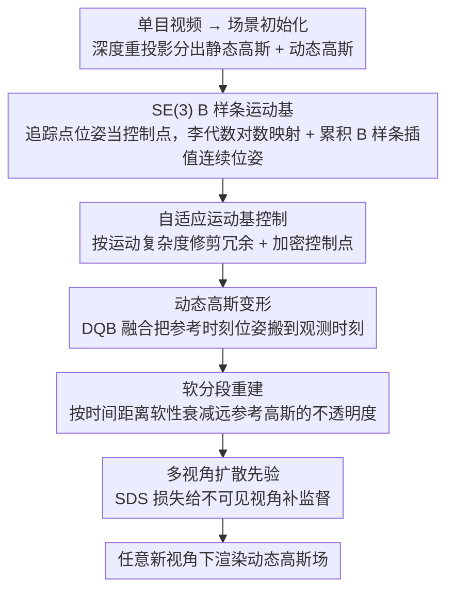

# Learning Explicit Continuous Motion Representation for Dynamic Gaussian Splatting from Monocular Videos

**会议**: CVPR 2026  
**arXiv**: [2603.25058](https://arxiv.org/abs/2603.25058)  
**代码**: [https://github.com/hhhddddddd/se3bsplinegs](https://github.com/hhhddddddd/se3bsplinegs)  
**领域**: 3D视觉  
**关键词**: 动态高斯泼溅, 单目视频, SE(3) B样条, 运动表示, 新视角合成

## 一句话总结

本文提出通过自适应 SE(3) B 样条运动基显式建模动态高斯的连续位置和朝向变形轨迹，配合软分段重建策略和多视角扩散模型先验，实现单目视频的高质量动态场景新视角合成，在 iPhone 和 NVIDIA 数据集上超越现有方法。

## 研究背景与动机

从单目视频重建动态场景是计算机视觉中的核心问题，广泛应用于 VR/AR 和电影制作。现有基于 3D 高斯泼溅的方法在处理动态场景时存在明显不足：

1. **隐式方法（如 D3DGS、4DGS）**通过 MLP 或 k-plane 学习从规范空间到观测空间的变换，无法保证变形轨迹的连续性
2. **显式方法（如 SplineGS）**虽然使用三次 Hermite 样条建模连续的位置变形轨迹，但忽略了高斯朝向的连续变化
3. **基于运动基的方法（如 SoM、MoSca）**通过学习仿射变换或运动脚手架来建模变形，但未统一处理位置和朝向的连续性

核心矛盾：当动态高斯的朝向变化不连续时，渲染图像中会出现严重伪影，尤其在复杂运动区域。作者的切入角度是：利用 SE(3) 累积 B 样条函数，能同时保证位置和朝向在数学上的连续性，从而统一解决这一问题。

## 方法详解

### 整体框架

这篇论文要解决的是：单目视频重建动态场景时，动态高斯的朝向若变化不连续，渲染就会在运动区域冒出伪影。它的破解办法是给每个动态高斯配一条数学上连续的刚体运动轨迹。整条流程是这样转的：先从单目视频用深度重投影把场景拆成静态高斯和动态高斯两部分；动态高斯不直接学每帧位置，而是挂在一组可学习的 SE(3) B 样条运动基上，由这些样条插值出任意时刻的连续位姿；训练中一个自适应机制按场景运动的复杂度增删控制点，再用软分段策略把不同参考时刻的动态高斯融合到当前观测时刻，并借多视角扩散模型给看不见的视角补监督。最终得到的是一个可在任意新视角下渲染的动态高斯场。

### 关键设计

**1. SE(3) B 样条运动基：让位置和朝向同时连续**

隐式方法（D3DGS、4DGS）用 MLP 学变形，连续性没保证；显式的 SplineGS 虽然用 Hermite 样条把位置变形连起来了，却管不了高斯朝向——而朝向一旦跳变，渲染就出伪影。本文把运动建在 SE(3) 群上：从 3D 追踪点取姿态 $Q = [R, t]$ 作为控制点初值，算相邻追踪点的相对位姿 $\Delta Q = Q_i^{-1} Q_{i+1}$，经李代数对数映射进切空间 $\xi = \log(\Delta Q)$，再用累积 B 样条基函数 $\Omega_i(t)$ 把这些控制点插值成任意时刻的连续变换：

$$T(t) = \left(\prod_{i=0}^{N_c-1} \exp(\Omega_i(t)\,\xi_i)\right) T_0$$

关键在于变换发生在 SE(3) 上而不是分开处理平移和旋转，所以平移轨迹和旋转朝向是被同一条样条同步约束的，数学上天然连续。这正是 Hermite 样条做不到的——它只能保证位置连续，朝向的跳变只能放任，本文从根上把朝向伪影消掉了。

**2. 自适应运动基控制：让控制点密度跟着运动复杂度走**

场景里有的区域几乎不动、有的剧烈形变，用同样多的控制点要么浪费算力要么表达不够。本文给运动基加了修剪和加密两个相反的操作。修剪每 $N_{prune}=500$ 迭代触发一次，试探性地挑出移除后轨迹变化最小的那个控制点，只有当移除带来的误差仍低于阈值 $\epsilon_{prune}=5.0$ 时才真删掉，把冗余控制点省下来。加密则每 $N_{densify}=500$ 迭代触发，用渲染误差图和动态区域 mask 取交集来锁定运动复杂的区域，对该区域的运动基复制控制点并加随机扰动，把表达力补上去。一删一增让控制点自动聚集到真正需要的地方——这也是后面消融里贡献最大的一项（移除后 iPhone mPSNR 掉 1.33）。

**3. 软分段重建：让近时刻的参考高斯主导融合**

把所有参考时间戳的动态高斯都搬到当前观测时刻时，时间跨度越大的那次刚体变换越不准，硬凑进来反而引入噪声。本文不做硬截断，而是按时间距离软性地压低远处参考高斯的不透明度：

$$o' = \text{sigmoid}\big(\text{scale} \cdot (1 - |t_{ref} - t_{obs}|)\big) \cdot o, \quad \text{scale}=5.0$$

参考时刻离观测时刻越远，$o'$ 衰减得越狠，于是近时刻的参考高斯在融合里占主导，远处不准的变换被自然淡化。对帧率长、运动复杂的视频（如 iPhone 数据）这一项收益尤其明显，正好对应它的设计初衷。

### 损失函数 / 训练策略

总损失由六项组成：重建损失 $\mathcal{L}_{rec}$（L1 + SSIM，$\beta=0.2$）、几何深度损失 $\mathcal{L}_{geo}$（$\lambda=0.075$）、多视角 SDS 损失 $\mathcal{L}_{sds}$（$\lambda=0.01$，使用多视角扩散模型提供不可见区域先验）、ARAP 刚性约束损失 $\mathcal{L}_{arap}$、光流追踪损失 $\mathcal{L}_{track}$、以及相机平滑损失 $\mathcal{L}_{smo}$（$\lambda=0.01$，约束相邻帧相机外参平滑变化）。相机外参作为可学习参数联合优化。训练 8000 迭代。

## 实验关键数据

### 主实验

| 数据集 | 指标 | 本文 | MoSca | SplineGS | SoM | 提升(vs MoSca) |
|--------|------|------|-------|----------|-----|----------------|
| iPhone | mPSNR↑ | **20.17** | 19.33 | 15.52 | 17.13 | +0.84 |
| iPhone | mSSIM↑ | **0.729** | 0.718 | 0.483 | 0.674 | +0.011 |
| iPhone | mLPIPS↓ | **0.274** | 0.274 | 0.371 | 0.279 | 持平 |
| NVIDIA | PSNR↑ | **27.81** | 26.76 | 27.12 | 24.58 | +1.05 |
| NVIDIA | SSIM↑ | **0.871** | 0.854 | 0.872 | 0.651 | +0.017 |
| NVIDIA | LPIPS↓ | **0.049** | 0.070 | 0.052 | 0.124 | -0.021 |

训练时间仅需 30 分钟（单卡 RTX 4090），FPS 达到 45.124，兼顾了效率和质量。

### 消融实验

| 配置 | iPhone mPSNR | iPhone mLPIPS | NVIDIA PSNR | NVIDIA LPIPS |
|------|-------------|---------------|-------------|--------------|
| Full model | **20.17** | **0.274** | **27.81** | **0.049** |
| w/o Adaptive Control | 18.84 | 0.350 | 26.87 | 0.128 |
| w/o Soft Segment | 19.02 | 0.328 | 27.06 | 0.085 |
| w/o $\mathcal{L}_{sds}$ | 19.39 | 0.288 | 27.13 | 0.074 |
| w/o $\mathcal{L}_{smo}$ | 19.18 | 0.295 | 27.15 | 0.076 |

运动表示替换消融（iPhone mPSNR）：使用 SoM 的 Pose 变换为 18.17，使用 MoSca 的 Motion Scaffold 为 19.26，本文 SE(3) B 样条为 **20.17**。

### 关键发现

- 自适应控制机制贡献最大（移除后 iPhone mPSNR 从 20.17 降至 18.84，降幅 1.33），说明运动基的密度应适配场景复杂度
- 软分段重建策略在 iPhone 数据（帧率长、运动复杂）上效果比 NVIDIA 数据更显著，符合其设计动机
- SE(3) B 样条运动表示相比 Pose 变换和 Motion Scaffold 分别提升 2.0 和 0.91 mPSNR，验证了统一建模位置和朝向连续性的重要性
- 对 2D 追踪先验误差有较好鲁棒性，加入 [-15,15] 随机噪声后性能下降有限（mPSNR 20.17→20.11）

## 亮点与洞察

- **将 SE(3) 累积 B 样条引入动态高斯泼溅**是关键贡献。B 样条本身在机器人学和 SLAM 中广泛使用，但在动态 3DGS 中统一建模位置和朝向的连续变形是首次。这个思路可以迁移到任何需要连续刚体运动建模的场景
- **自适应修剪+加密**的策略非常实用——允许简单运动区域用少量控制点，复杂区域自动加密，既省计算又提升质量
- **30 分钟训练时间**在同类方法中很有竞争力（对比 MarbleGS 的 13 小时），效率优势明显

## 局限与展望

- 论文图 7 中承认对大幅度非刚体运动（如人体舞蹈中的衣物飘动）效果不佳，因为 SE(3) B 样条本质上是刚体运动模型
- SDS 损失引入扩散模型增加了额外依赖和计算，其对不同场景的泛化效果未充分验证
- 仅在 iPhone (5场景) 和 NVIDIA (7场景) 数据集上评估，场景多样性有限
- 可以探索将 SE(3) B 样条与非刚体变形（如 blend shapes 或 SMPL）相结合，以处理更复杂的动态运动

## 相关工作与启发

- **vs SplineGS**: 仅建模位置的三次 Hermite 样条 vs 本文同时建模位置和朝向的 SE(3) B 样条，后者在 iPhone 数据上 mPSNR 高出 4.65
- **vs MoSca**: 使用 2D 基础模型构建 4D 运动脚手架，Motion Scaffold 的自由度高但不保证连续性，本文用数学上连续的 B 样条替代
- **vs SoM (Shape-of-Motion)**: 将运动建模为 SE(3) 运动基的线性组合但非连续参数化，本文用 B 样条提供了连续的参数化形式
- 自适应控制机制的思路可启发点云处理、NeRF 等领域中的自适应分辨率调整

## 评分

- 新颖性: ⭐⭐⭐⭐ 将成熟的 SE(3) B 样条引入动态 3DGS 是有意义的工程创新，但理论上不算全新
- 实验充分度: ⭐⭐⭐⭐ 消融全面且含运动表示替换对比，追踪鲁棒性分析有特色，但数据集偏少
- 写作质量: ⭐⭐⭐⭐ 方法描述清晰，公式推导完整，可视化丰富
- 价值: ⭐⭐⭐⭐ 实用价值高，训练快质量好，代码已开源

<!-- RELATED:START -->

## 相关论文

- [\[CVPR 2026\] SharpTimeGS: Sharp and Stable Dynamic Gaussian Splatting via Lifespan Modulation](sharptimegs_sharp_and_stable_dynamic_gaussian_splatting_via_lifespan_modulation.md)
- [\[NeurIPS 2025\] Dynamic Gaussian Splatting from Defocused and Motion-blurred Monocular Videos](../../NeurIPS2025/3d_vision/dynamic_gaussian_splatting_from_defocused_and_motion-blurred_monocular_videos.md)
- [\[CVPR 2026\] MotionScale: Reconstructing Appearance, Geometry, and Motion of Dynamic Scenes with Scalable 4D Gaussian Splatting](motionscale_reconstructing_appearance_geometry_and_motion_of_dynamic_scenes_with.md)
- [\[CVPR 2026\] PhysHO: Physics-Based Dynamic 3D Gaussian Human and Object from Monocular Video](physho_physics-based_dynamic_3d_gaussian_human_and_object_from_monocular_video.md)
- [\[CVPR 2026\] MoCapAnything: Unified 3D Motion Capture for Arbitrary Skeletons from Monocular Videos](mocapanything_unified_3d_motion_capture_for_arbitrary_skeletons_from_monocular_v.md)

<!-- RELATED:END -->
