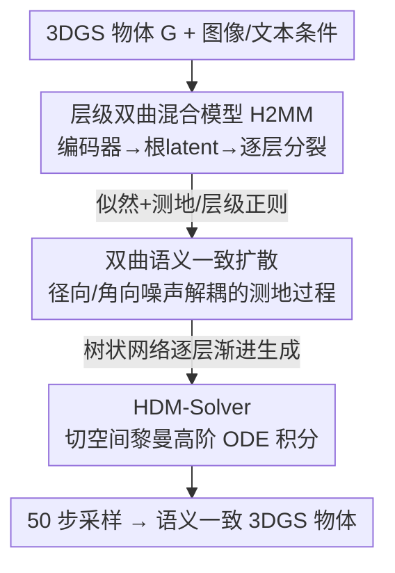

# Learning Hierarchical Hyperbolic Mixture Model for Part-aware 3D Generation

**会议**: CVPR 2026  
**论文**: [CVF Open Access](https://openaccess.thecvf.com/content/CVPR2026/html/Yang_Learning_Hierarchical_Hyperbolic_Mixture_Model_for_Part-aware_3D_Generation_CVPR_2026_paper.html)  
**代码**: 待确认  
**领域**: 3D视觉  
**关键词**: 部件感知3D生成, 双曲空间, 层级混合模型, 测地扩散, 黎曼ODE求解器

## 一句话总结
把 3D 物体的部件层级语义嵌入双曲空间，提出层级双曲混合模型 H2MM + 一个解耦径向/角向噪声的测地扩散过程 + 一个保持流形几何的高阶黎曼 ODE 求解器，在无条件、类别条件和多模态 3D 生成上同时刷新质量（FID/KID）与速度。

## 研究背景与动机

**领域现状**：3D 形状生成在图形学与 3D 视觉中是核心方向。早期方法用随机向量直接生成完整 3D 物体，质量与多样性尚可但缺乏细粒度建模、难恢复精细语义。受人类「按部件搭建复杂物体」启发，近期的**部件感知（part-aware）3D 生成**（SPAGHETTI、AutoPartGen、StdGEN 等）在恢复几何细节上更有效。

**现有痛点**：① 多数部件感知方法把所有部件视为**同一粒度**，忽略部件间天然的层级组织与语义依赖，导致部件间不一致；且把部件 latent 编码在**欧氏空间**——其分布更像图结构，流形利用率低、训练推理慢。② HGMMSplatting 引入层级语义树建模层级关系，但仍在欧氏空间编码多层语义，表达效率和层级保真度有限。③ HyperSDFusion 改用双曲空间捕捉粗到细的层级关系，却把每个 3D 物体当成**不可分的整体**，只把双曲几何当分辨率细化的结构先验、没做显式部件级语义层级；而且它在切空间里加**简单各向同性高斯噪声**，忽略双曲几何的**各向异性**、破坏其结构性质，也没解决双曲空间内采样加速问题，缺一个良定义的扩散范式。

**核心矛盾**：3D 物体的部件关系本质上是**树状 / 幂律分布**结构，欧氏空间表达这种层级既低效又保真度差；而已有的双曲方法要么不做部件感知、要么用错了噪声模型（各向同性噪声抹掉了双曲空间编码层级的各向异性）、要么没有适配双曲流形的快速采样器。

**本文目标**：在双曲空间里学一个**部件感知的层级语义嵌入**，设计一个能保持层级结构的高效双曲扩散策略，并给出一个能在双曲流形上正确积分的高阶 ODE 求解器。

**切入角度**：双曲空间体积随半径**指数增长**，天然适合容纳树状层级——沿径向方向自然分离层级、沿角向方向编码层内语义变化，这两者应被**解耦**对待。

**核心 idea**：用层级混合模型把 3DGS 的多级部件语义嵌入双曲流形（H2MM），再用**解耦径向/角向噪声**的测地扩散逐层生成语义、最后生成 3DGS，并用**黎曼高阶求解器**在切空间沿测地线积分以加速且保几何。

## 方法详解

### 整体框架
给定一组 3D 高斯 $G$（用 3DGS 表示物体细节），方法分三步。第一步 **H2MM**：一个双曲编码器-解码器把 3DGS 的层级从欧氏空间映射到双曲空间——编码器经共享双曲 MLP + 置换不变聚合得到双曲根 latent $z$，解码器自顶向下逐层「分裂」latent，每层是一个双曲混合模型、捕捉越来越细的部件语义，通过最大化双曲语义与 3DGS 间的似然（带测地与层级正则）学出高保真部件感知流形。第二步 **双曲语义一致扩散**：用预训练 MERU 从图像/文本抽双曲层级特征作条件，先逐层渐进生成 H2MM 语义、再在 H2MM 与条件联合引导下生成 3DGS 基元；扩散在切空间把噪声**解耦成径向（层级深度）+ 角向（层内语义）**两部分沿测地线注入，并用自适应树状网络扫描数据依赖、避免旧双曲图扩散里「节点和边联合生成」的约束。第三步 **HDM-Solver**：把双曲流形上的反向 ODE 投影到切空间用黎曼高阶积分求解，等价于在双曲空间用 Möbius 运算更新，既保流形几何又把采样步数压到 50 步。

### 关键设计

**1. 层级双曲混合模型 H2MM：把部件层级语义嵌进双曲流形**

针对「欧氏部件表示忽略层级、双曲方法又不做部件感知」的痛点，H2MM 自顶向下构造多层双曲混合模型。每一层定义为 $p(G|\Omega^l)=\prod_{i=1}^{N}\sum_{j=1}^{J}\pi_j f(G_i|\theta^l_j)$，其中 $\theta^l_j=D(\mathrm{Log}_0(z^l_j))$ 由双曲 latent 解码、$f(\cdot)$ 取高斯核（光滑、可解析、利于建模 3DGS 空间变化）。**层级分裂**用双曲交叉注意力从同一父 latent 更新各子 latent、再过双曲 MLP 分裂：$z^{l+1}=\sum_i\sum_j S(j)A^{i,j}_H M^i_H(z^l_i)$，信号函数 $S(j)$ 约束分裂限定在各自子节点内。优化靠双曲似然 + 几何正则：似然损失 $L_{nll}=-\frac1{|G|}\sum_d[\,l_{log}(G|\Omega^{l=d})+\frac1{\sigma^2}\|z^{l=d}\|_H]$；几何正则 $L_H=\sum_{l\neq l'}\max(0,\tau-d_H(\bar z^l,\bar z^{l'}))+\sum_k d_H(z,z^d_k)$ 强制层间质心分离、同时最小化根到叶 latent 的总测地距离。结果是一个层级忠实、每个部件都有专属嵌入的高保真流形，为后续生成提供精确部件级引导。

**2. 双曲语义一致扩散：解耦径向/角向噪声沿测地线生成**

针对 HyperSDFusion「在切空间加各向同性高斯噪声、抹掉双曲各向异性」的问题，本文把噪声注入和预测都搬到切空间、用 $\mathrm{Exp}/\mathrm{Log}$ 在流形和切空间间往返，并把高斯噪声**分解成径向 + 角向**两部分：$x_t=\sqrt{\alpha_t}\,x_0+\sqrt{1-\alpha_t}\,(\epsilon_r+\Lambda_c(x_0)\,\epsilon_a)$，$z_t=\mathrm{Exp}_{z_0}(x_t)$，其中 $\epsilon_r,\epsilon_a$ 分别建模径向 / 角向噪声，曲率因子 $\Lambda_c(x_0)=\tanh(\sqrt{|c|}\|x_0\|)/(\sqrt{|c|}\|x_0\|)$ 在径向坐标大的区域**压低角向噪声幅度**，从而保住「径向编码层级深度、角向编码语义变化」的各向异性。反向用切空间噪声预测器 $\hat x_0=s_\theta(\mathrm{Log}_0(z_t),t)$ 沿测地方向去噪。**渐进部件级生成**用树状拓扑网络自适应扫描依赖，避免旧双曲图扩散需联合生成节点和边：先在条件 $c$ 下生成根语义 $z$，再逐层在「前一层语义 + 条件特征」联合引导下生成后续层语义，最后在合成的 H2MM 与条件下生成 3DGS 基元。训练用 latent 噪声预测损失 $L_{latent}$、3DGS 扩散损失 $L_{diff}$，并加 LPIPS、渲染图像、alpha 图像损失 $L_{img}$ 加速收敛，第二阶段总损失 $L_{gs}=\lambda_1 L_{diff}+\lambda_2 L_{img}$。

**3. 双曲扩散模型求解器 HDM-Solver：把 ODE 求解重写成黎曼积分器**

针对「现有扩散 ODE 求解器都假设欧氏向量空间、直接套到双曲 latent 会让更新步离开流形、线性插值又破坏测地结构」的问题，本文把反向 ODE $\frac{dz_t}{dt}=u_t(z_t)$ 投影到切空间 $T_0\mathcal{B}^n_c$：$\frac{dx_t}{dt}=T_0(u_t(z_t)),\ x_t=\mathrm{Log}_0(z_t)$，把流形 ODE 转成切空间的欧氏 ODE 后可靠地做 Euler 更新，再经 $\mathrm{Exp}$ 映回流形——这等价于在双曲空间用 Möbius 运算更新（附录给证明）。由此推出一阶 HDM-Solver：$\tilde x_{t_i}=\frac{\alpha_{t_i}}{\alpha_{t_{i-1}}}\otimes\tilde x_{t_{i-1}}\ominus(\sigma_{t_i}(e^{h_i}-1)\otimes\epsilon_G(\tilde x_{t_{i-1}},t_{i-1}))$，其中 $h_i=\lambda_{t_i}-\lambda_{t_{i-1}}$、$\otimes/\ominus$ 是 Möbius 标量乘 / 减；二阶版在相邻时间步间插入中间点（Alg.1），三阶版见附录。其意义是：在双曲语义空间上，扩散 ODE 求解器必须被重新解读为**黎曼积分器**才能全程保持流形几何，从而在加速采样（50 步）的同时提升保真度。

### 损失函数 / 训练策略
H2MM 阶段用 $L_{nll}$（双曲似然 + latent 范数正则，$\sigma$ 控权）+ $L_H$（层间质心分离 + 根到叶测地距离最小化，$\tau$ 控最小间距）。扩散阶段先训 latent 预测 $L_{latent}=\mathbb{E}\|\{z^{l=d}_0\}-\epsilon_{\theta_1}(\{z^{l=d}_t\},t,c)\|^2$，再训 3DGS 生成 $L_{diff}=\mathbb{E}\|\hat y_{\theta_2}(G_t,t,\{z^{l=d}\},c)-G\|_2^2$ 并配 $L_{img}$（VGG 多分辨率特征 + 像素 + alpha）。实现上每物体取 $64\times64\times9=36864$ 个高斯基元，扩散步数 1000、cosine 噪声调度，HDM-Solver 采样步数设 50。

## 实验关键数据

数据集：ShapeNet Car/Chair（无条件 + 消融）、OmniObject3D（类别条件）、Objaverse 过滤 LVIS 子集（约 20k 高质量物体，多模态）。指标：5 万生成 vs 5 万真实渲染算 FID/KID；条件生成另用 CLIP 分数与用户研究；渲染分辨率 512×512。

### 主实验

无条件（ShapeNet Car/Chair）与类别条件（OmniObject3D）生成，FID-50K↓ / KID-50K(‰)↓：

| 方法 | Car FID | Car KID | Chair FID | Chair KID | Omni FID | Omni KID |
|------|------|------|------|------|------|------|
| GET3D | 17.15 | 9.58 | 19.24 | 10.95 | - | - |
| DiffTF | 51.88 | 41.10 | 47.08 | 31.29 | 46.06 | 22.86 |
| GaussianCube | 13.01 | 8.46 | 15.99 | 9.95 | 11.62 | 2.78 |
| HGMMSplatting | 11.03 | 7.16 | 12.74 | 8.61 | 10.57 | 2.02 |
| **Ours** | **9.89** | **6.24** | **11.03** | **6.91** | **9.12** | **1.93** |

文本到 3D（CLIP 分数↑ / 推理时间 s↓）与图像到 3D：

| 任务 | 方法 | 主指标 | 备注 |
|------|------|------|------|
| 文本→3D | DiffSplat | CLIP 28.32 / 8.64s | 几何纹理协调弱 |
| 文本→3D | **Ours** | **CLIP 31.02 / 3.92s** | 约 4 秒出高质量样本 |
| 图像→3D | G.Cube | PSNR 25.83 / LPIPS 0.1531 / FID-5K 16.45 | |
| 图像→3D | **Ours** | **PSNR 27.63 / LPIPS 0.1102 / FID-5K 14.99** | 全指标领先 |
| 部件编辑 | DiffSplat | FID 16.34 / CLIP-S 28.96 / 人评 4.1 | |
| 部件编辑 | **Ours** | **FID 15.27 / CLIP-S 29.38 / 人评 4.6** | |

### 消融实验

| 配置 | 关键指标 | 说明 |
|------|---------|------|
| Hyperbolic (默认) | NLL 0.97 / IoU 0.96 / FID 12.26 / KID 2.31 | 双曲空间 |
| Euclidean | NLL 1.21 / IoU 0.89 / FID 16.94 / KID 4.96 | 换欧氏空间，语义精度与采样质量双降 |
| Decoupled (默认) | FID 12.34 / KID 2.31 / CLIP-S 30.27 | 径向/角向噪声解耦 |
| Coupled | FID 16.72 / KID 3.56 / CLIP-S 27.36 | 噪声耦合，FID 恶化 4.38 |
| Tree (默认) | FID 27.1 / KID 0.014 | 树状网络 |
| w/o Tree | FID 31.4 / KID 0.021 | 去树状网络，FID 涨 4.3 |
| Progressive (默认) | FID 28.3 / KID 0.015 | 逐层渐进生成 |
| w/o Progressive | FID 32.0 / KID 0.022 | 去渐进生成，FID 涨 3.7 |

> ⚠️ Tab.3 中 Tree 与 Progressive 两组 FID 量级（27~32）与主表（9~12）不一致，疑为不同设定/子集下的相对对比，绝对值以原文为准。

### 关键发现
- **双曲 > 欧氏**：双曲空间体积指数增长，沿径向自然分离层级、降低语义重叠，NLL/IoU/FID/KID 全面变好；HDM-Solver 在切空间沿测地线更新进一步抑制投影误差与数值漂移。
- **噪声解耦最关键之一**：耦合噪声把 FID 从 12.34 推高到 16.72，因为解耦把「保层级」和「生成层内细节」分开，让反向扩散既稳住全局结构又保留局部形状灵活性。
- **树状网络 + 渐进生成都有效**：树状拓扑既简化生成流程又提质；逐层生成通过渐进细化每层得到更精确语义。
- **速度优势明显**：文本到 3D 约 4 秒、采样仅 50 步，同时质量领先。

## 亮点与洞察
- **「径向=层级深度、角向=层内语义」的解耦**是全文最漂亮的观察：曲率因子 $\Lambda_c$ 在大半径处压角向噪声，正好保住双曲几何编码层级所依赖的各向异性——把「物理几何性质」直接翻译成「噪声调度」。
- **把扩散 ODE 求解器重写成黎曼积分器**：指出直接套欧氏求解器会离开流形、破坏测地结构，转而在切空间积分再映回，等价于 Möbius 更新——是把双曲生成做「快且对」的关键。
- H2MM 用「逐层分裂 + 双曲交叉注意力」显式建模部件层级，相比把物体当整体的双曲方法和把部件压平到同一粒度的欧氏方法，兼顾了部件感知与层级保真。
- **可迁移**：径向/角向噪声解耦、流形上的黎曼 ODE 积分思路，可推广到任何在双曲/黎曼流形上做扩散生成的任务（如层级文本、分子图）。

## 局限与展望
- 方法栈较重（H2MM + 双曲扩散 + 高阶黎曼求解器 + 树状网络），实现与超参（曲率 $c$、$\tau$、$\lambda_1/\lambda_2$、层数、$J$）较多，复现门槛高。
- 每物体固定 $64\times64\times9=36864$ 个高斯基元，对极高复杂度物体或开放词表大规模生成的可扩展性未充分讨论。
- ⚠️ 消融 Tab.3 与主表 FID 量级不一致，文中未明确说明评测设定差异，绝对数值需以原文/附录为准。
- 改进方向：自适应部件数 / 层数；把曲率作为可学习量；探索更高阶或自适应步长的 HDM-Solver 进一步压采样步数。

## 相关工作与启发
- **vs SPAGHETTI / AutoPartGen / StdGEN（欧氏部件感知）**：它们把部件压到同一粒度、欧氏编码 latent（分布像图结构、流形利用率低），缺显式层级；本文在双曲空间显式建模部件层级。
- **vs HGMMSplatting（欧氏层级语义树）**：HGMM 在欧氏空间建层级树，表达效率与层级保真有限；本文换到双曲流形、层级保真更高，FID/KID 全面更优（如 Car 11.03→9.89）。
- **vs HyperSDFusion（双曲但整体建模）**：它把物体当不可分整体、只用双曲作分辨率细化先验，且加各向同性噪声破坏各向异性、无加速器；本文做显式部件级层级、解耦径向/角向噪声、并配黎曼高阶求解器。
- **vs GaussianCube / GET3D / DiffTF（无显式层级）**：缺多级语义引导导致过平滑或几何纹理纠缠；本文用多级语义引导降低生成难度、出更细几何与纹理。

## 评分
- 新颖性: ⭐⭐⭐⭐⭐ 双曲部件层级 + 径向/角向解耦扩散 + 黎曼 ODE 求解器三件套，把双曲几何性质系统性地贯穿表示、扩散、求解三层，原创性强。
- 实验充分度: ⭐⭐⭐⭐ 覆盖无条件/类别/文本/图像/部件编辑多任务、消融到位；但部分消融表量级存疑、缺更大规模开放词表验证。
- 写作质量: ⭐⭐⭐⭐ 动机层层递进、公式体系完整；但符号密集、部分结论依赖附录。
- 价值: ⭐⭐⭐⭐ 在质量与速度上同时领先，为双曲空间下的层级 3D 生成给出可用范式。

<!-- RELATED:START -->

## 相关论文

- [\[CVPR 2026\] Part$^{2}$GS: Part-aware Modeling of Articulated Objects using 3D Gaussian Splatting](part2gs_part-aware_modeling_of_articulated_objects_using_3d_gaussian_splatting.md)
- [\[CVPR 2026\] Realiz3D: 3D Generation Made Photorealistic via Domain-Aware Learning](realiz3d_3d_generation_made_photorealistic_via_domain-aware_learning.md)
- [\[CVPR 2026\] PartDiffuser: Part-wise 3D Mesh Generation via Discrete Diffusion](partdiffuser_part-wise_3d_mesh_generation_via_discrete_diffusion.md)
- [\[CVPR 2026\] HyperMVP: Hyperbolic Multiview Pretraining for Robotic Manipulation](hyperbolic_multiview_pretraining_for_robotic_manipulation.md)
- [\[CVPR 2026\] Repurposing 3D Generative Model for Autoregressive Layout Generation](repurposing_3d_generative_model_for_autoregressive_layout_generation.md)

<!-- RELATED:END -->
