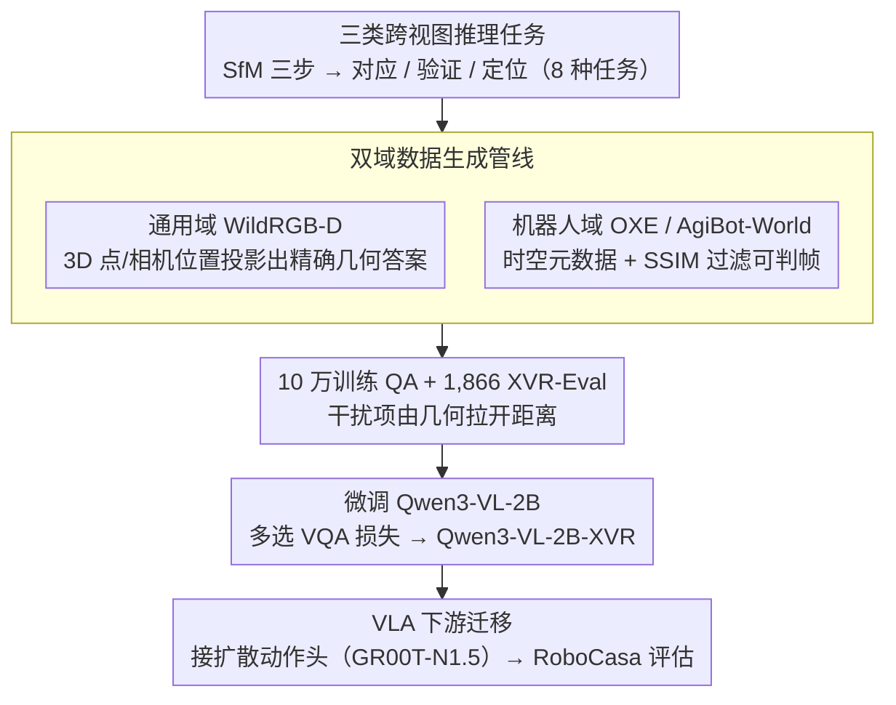

# Learning Multi-View Spatial Reasoning from Cross-View Relations

**会议**: CVPR 2026  
**arXiv**: [2603.27967](https://arxiv.org/abs/2603.27967)  
**代码**: [https://cross-view-relations.github.io](https://cross-view-relations.github.io)  
**领域**: 3D视觉  
**关键词**: 多视角空间推理, 跨视图关系, 视觉语言模型, 机器人操作, 数据集构建

## 一句话总结

XVR（Cross-View Relations）构建了一个 10 万样本的大规模多视角视觉问答数据集，通过对应关系、几何验证和视点定位三类任务显式训练 VLM 的跨视图空间推理能力，在多视角基准和机器人操作任务上均取得显著提升。

## 研究背景与动机

视觉语言模型（VLMs）在单视图视觉任务上表现出色，但在多视角空间推理方面严重不足，而这对机器人系统理解 3D 环境和跨视角操作至关重要。

1. **单视图局限**：现有空间推理数据集和基准几乎都是单视图的，信息有限且频繁遮挡
2. **多视角理解不深入**：即使有多视图数据集（如 AllAnglesBench），也只关注在各视图中"看到什么物体"，而非视图之间的几何关系
3. **缺乏跨视图显式监督**：没有显式的跨视图关系训练，VLMs 倾向于生成在单视图内看似合理但跨视图空间不一致的预测

核心切入点：受 Structure-from-Motion（SfM）流程启发，SfM 通过三个关键步骤（建立对应关系 → 验证几何一致性 → 估计相机位姿）整合多视角信息。作者将这三个步骤转化为三类跨视图监督任务，构建 XVR 数据集来直接训练 VLMs 的跨视图推理能力。

## 方法详解

### 整体框架

这篇论文想解决的核心问题是：VLM 在单张图里看物体很在行，可一旦给它一组从不同角度拍的图，它就说不清「这张图里的点对应那张图里的哪个点」「这两个视角的 3D 空间是否一致」。XVR 的做法是把经典几何视觉里的 Structure-from-Motion 流程拆解成 VLM 学得动的监督信号：先在两个数据域里用 3D 几何和时空元信息**自动**铸出带正确答案的多选问答，再拿这批数据微调一个小模型，最后把这个微调过的骨干网络接到机器人 VLA 上验证迁移效果。整条管线产出 10 万训练样本加 1,866 条 XVR-Eval 测试样本，覆盖 8 种任务、平均每题 4.32 张图，微调对象是 Qwen3-VL-2B。

### 关键设计

**1. 三类跨视图推理任务：把 SfM 的三步翻译成 VLM 学得动的 QA**

SfM 整合多视角信息靠三步——建立对应、验证几何一致、估计相机位姿，XVR 干脆按这三步切出三大类任务，让模型显式地学到「视图之间」的关系，而不是各看各的。**对应（Correspondence）**让模型把跨视图的同一个 3D 点匹配起来（点对应），或把不同视角里指向同一方向的箭头对齐（方向对应）；**验证（Verification）**让模型判断两个视角描述的 3D 空间是否自相矛盾（空间验证），以及一个图像序列里哪一帧时序上接不上（时序验证）；**定位（Localization）**则估计「这张图是从哪个视点拍的」，又细分出视点定位、方向视图定位、跨场景定位和语言条件定位四个子任务。八种任务合起来，正好把多视角 3D 理解的几条基础能力都覆盖到，而它们的难度也不靠模型猜——每道题的干扰选项都由几何信息算出来，确保答错就是真的没理解空间关系。

**2. 双域数据生成管线：通用域供精确几何，机器人域供视点与时序**

要大规模铸题又不能靠人工标注，关键是从已有数据集的几何/元信息里反推出带标准答案的问答。**通用域**取 WildRGB-D 的校准多视角 RGB-D 捕获，采样 3D 点或相机位置后投影到多个视图（$3\text{D}\to2\text{D}$），对应关系和定位任务的答案就直接来自这次投影；干扰项则刻意在空间上拉开距离，避免出现一眼能蒙对的平凡题。**机器人域**取 OXE 和 AgiBot-World 的操作轨迹，借时空元数据和相机标识符生成验证、定位类题目，并用 SSIM 过滤掉那些帧间差异肉眼根本看不出的样本，保证「时序对不上」这种题在视觉上确实可判。两个域互补：通用域给的是像素级精确的几何监督，机器人域补上真实操作中丰富的视点切换和时序动态。

**3. VLA 下游迁移：把跨视图感知直接接到机器人操作上**

光证明感知变强还不够，作者想看这种空间推理能不能转化成「手上的活」。于是把在 XVR 上微调好的 Qwen3-VL-2B-XVR 当作 VLA 模型的视觉语言骨干，在它之上接一个扩散动作头（沿用 GR00T-N1.5 架构），放进 RoboCasa 仿真里训练并评估 Franka Emika 机械臂的操作任务。这一步是用来检验「更好的跨视图空间感知 → 更好的具身操作」这条假设——如果成立，说明 XVR 学到的不是孤立的答题技巧，而是能即插即用提升下游操作的通用空间能力。

### 损失函数 / 训练策略

微调使用标准的多选 VQA 损失。数据质量控制关键环节包括：通用域仅保留点云密度 ≥1M 的高质量样本；机器人域仅保留 ≥3 摄像头、≥20 秒轨迹、有足够运动动态的序列。XVR-Eval 使用训练时未见过的数据源构建，确保测试泛化性。

## 实验关键数据

### 主实验

| 模型 | XVR-Eval Overall | 类型 |
|------|-----------------|------|
| Random | 32.64% | 基线 |
| Human | 83.85% | 人类基线 |
| Eagle2-2B | 16.99% | 开源 |
| Qwen3-VL-2B-Instruct | 36.82% | 开源 |
| Qwen3-VL-4B-Instruct | 45.02% | 开源 |
| Claude-4.5-Sonnet | 51.18% | 闭源 |
| GPT-5 | 61.74% | 闭源 |
| **Qwen3-VL-2B-XVR (Ours)** | **68.06%** | 微调 |

XVR 微调后的 2B 模型超越了所有闭源模型（包括 GPT-5），相对于基础模型提升 1.8×。

### 消融实验（XVR-Eval 子任务分析）

| 任务 | Qwen3-VL-2B | Qwen3-VL-2B-XVR | 提升 |
|------|-------------|-----------------|------|
| Point Correspondence | 46.59% | **94.32%** | +47.73 |
| Spatial Verification | 23.11% | **84.85%** | +61.74 |
| Viewpoint Localization | 19.50% | **57.68%** | +38.18 |
| Directional Correspondence | 26.14% | **53.79%** | +27.65 |
| Temporal Verification | 45.29% | 41.18% | **-4.11** |

外部基准迁移：MindCube-Tiny 和 RoboSpatial-Home 持续提升，Compatibility 子任务 +7.6%，Among 子任务 +7.0%。

VLA 操作成功率（RoboCasa）：TurnOffMicrowave 场景提升最大（约 +13%），CoffeePressButton 和 PnPCabToCounter 也有显著增益。

### 关键发现

- **Point Correspondence 和 Spatial Verification 提升最为惊人**（分别 +47.73 和 +61.74pp），超过人类水平，说明几何匹配类任务最受益于显式跨视图训练
- **Temporal Verification 是唯一下降的任务**（-4.11pp），因为 XVR 训练偏向空间几何推理而弱化了时序敏感性，存在空间-时序推理的权衡
- **2B 模型 > GPT-5**：显式跨视图监督的价值远超模型规模，Qwen3-VL-2B-XVR（2B参数）击败了 GPT-5
- Gemini-Robotics-ER-1.5 的 Viewpoint Localization 仅 6.22%，低于随机猜测，说明即使是专用机器人训练也无法替代显式跨视图关系监督
- 跨域迁移有效——XVR 训练在外视角（outside-looking-in）配置上训练，但在内视角（inside-looking-out）的 MindCube 上也有提升

## 亮点与洞察

- **SfM 流程到 VLM 训练的映射**非常优雅——将经典几何视觉中的对应-验证-定位流程转化为 VLM 可学习的 QA 任务，是将几何知识注入大模型的一种有效方法
- **小模型+显式监督 > 大模型+零样本**的发现意义重大——说明在空间推理这类结构化任务上，数据质量和任务设计比模型规模更重要
- **VLA 迁移成功**验证了"更好的空间感知 → 更好的操作"这一假设，XVR 训练的视觉骨干可即插即用提升机器人性能
- 数据生成管线的双域设计值得借鉴——利用现有数据集的元信息（相机参数、轨迹）自动生成大规模训练数据

## 局限与展望

- **时序推理退化**：XVR 偏重静态多视角的空间推理，牺牲了时序动态理解能力，未来可加入显式的时序关系训练
- **VLA 评估仅在仿真中**：RoboCasa 模拟器不能完全反映真实物理环境的复杂性，需要真机验证
- 通用域数据主要来自 WildRGB-D，场景类型可能有限（主要是桌面物体），扩展到更多室外和大规模场景数据可能带来更大提升
- 未探索与深度估计、法线估计等 3D 感知任务的联合训练

## 相关工作与启发

- **vs MultiSPA**: MultiSPA 提供大规模多帧空间推理数据，有深度和视觉对应但缺乏显式跨视图几何关系监督；XVR 的跨视图关系更具结构化
- **vs MindCube**: MindCube 评估从有限视角的场景想象能力，XVR 在其上取得了迁移性提升，说明跨视图训练能泛化到空间想象任务
- **vs SpatialVLM/RoboSpatial**: 这些工作注入 3D 空间线索到单视图理解，XVR 拓展到多视图的跨视图关系理解，是更全面的空间智能
- **vs pi0.5**: pi0.5 通过增强 VLM 骨干来提升具身推理，XVR 提供了一种通过数据驱动的方式实现类似目标的路径

## 评分

- 新颖性: ⭐⭐⭐⭐⭐ SfM→VLM 训练的映射非常创新，三类任务的设计有理论基础且实践有效
- 实验充分度: ⭐⭐⭐⭐⭐ 10 个 VLM 对比（含闭源）、内外部基准、VLA 迁移、人类基线，非常完整
- 写作质量: ⭐⭐⭐⭐⭐ 结构清晰，任务定义严谨，图表设计精美，分析深入
- 价值: ⭐⭐⭐⭐⭐ 填补了 VLM 多视角空间推理的训练数据空白，VLA 迁移验证了实际应用价值

<!-- RELATED:START -->

## 相关论文

- [\[CVPR 2026\] UniSplat: Learning 3D Representations for Spatial Intelligence from Unposed Multi-View Images](unisplat_3d_representations_unposed.md)
- [\[CVPR 2026\] 3D-Aware Multi-Task Learning with Cross-View Correlations for Dense Scene Understanding](3d-aware_multi-task_learning_with_cross-view_correlations_for_dense_scene_unders.md)
- [\[CVPR 2026\] Cross-View Splatter: Feed-Forward View Synthesis with Georeferenced Images](cross-view_splatter_feed-forward_view_synthesis_with_georeferenced_images.md)
- [\[CVPR 2026\] SPE-MVS: Spatial Position Encoding Enhanced Multi-View Stereo with Monocular Depth Priors](spe-mvs_spatial_position_encoding_enhanced_multi-view_stereo_with_monocular_dept.md)
- [\[CVPR 2026\] Multi-view Consistent 3D Gaussian Head Avatars 'without' Multi-view Generation](multi-view_consistent_3d_gaussian_head_avatars_without_multi-view_generation.md)

<!-- RELATED:END -->
