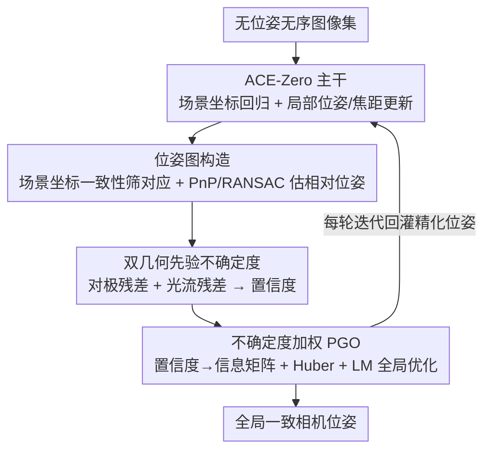

# Learning Scene Coordinate Reconstruction from Unposed Images via Pose Graph Optimization

**会议**: CVPR 2026  
**论文**: [CVF Open Access](https://openaccess.thecvf.com/content/CVPR2026/html/Tse_Learning_Scene_Coordinate_Reconstruction_from_Unposed_Images_via_Pose_Graph_CVPR_2026_paper.html)  
**代码**: 待确认  
**领域**: 3D视觉  
**关键词**: 场景坐标回归, 位姿图优化, 无监督SfM, 不确定度建模, ACE-Zero

## 一句话总结
在无监督场景坐标回归框架 ACE-Zero 之上引入位姿图优化（PGO），用预测出的场景坐标自动构边、再用对极+光流双几何先验给每条边估置信度做加权全局优化，把原本只做局部精化、容易漂移的相机位姿拉到全局一致，PSNR 追平甚至超过 COLMAP，且重建时间从 38h 压到 30min。

## 研究背景与动机
**领域现状**：从无序图像集恢复相机位姿与三维结构的 Structure-from-Motion（SfM）正在从「特征匹配 + 三角化 + 束调整」的传统管线，转向直接回归场景坐标 / 相机位姿的学习式方法。其中 ACE-Zero 是代表：它无需真值位姿或深度，从一批无序、无位姿的图像里自举出相机参数与场景几何，靠重投影损失自监督训练一个场景坐标回归网络。

**现有痛点**：ACE-Zero 的位姿精化是「纯局部」的——它用一个学习式优化器只根据单图自身信息更新该图位姿，从不强制跨图一致。结果在大规模、纹理弱、重复结构或初始位姿噪声大的场景里，会累积漂移、出现全局错位（论文 Fig.1：COLMAP 初始化的位姿经 ACE-Zero 局部精化后 PSNR 反而从 28.1 掉到 19.1）。

**核心矛盾**：学习式推理擅长从单图回归几何，却缺少全局约束；而经典的全局优化（PGO / 全局束调整）擅长跨视图一致性，却需要显式的成对位姿约束和共视图——这恰恰是 ACE-Zero 不产出的。两套范式各有所长却没接起来。

**本文目标**：把 PGO 接进 ACE-Zero，需要解决两个具体子问题：(1) ACE-Zero 不给成对约束，如何无监督地从它的输出里造出可靠的位姿图边？(2) 场景坐标预测本身有噪声又不带不确定度，朴素优化容易过拟合或失稳，如何给每条约束估出置信度做鲁棒加权？

**切入角度**：作者观察到，虽然 ACE-Zero 不直接给约束，但它对每个像素都密集预测了三维场景坐标——这些坐标本身就能在图像对之间建立几何一致的对应，从而反推出相对位姿约束；而约束的可靠性又能用对极几何、光流这类「不依赖真值」的几何先验来评估。

**核心 idea**：用「场景坐标一致性筛边 + 几何先验估置信度」把学习式推理与图优化缝合成混合框架——让全局几何推理补上神经推理缺失的多视图一致性。

## 方法详解

### 整体框架
方法是在 ACE-Zero 自监督迭代重建循环的每一轮里，插入一套「构图 → 估不确定度 → 加权全局优化」的位姿精化模块。ACE-Zero 主干照旧负责场景坐标回归与局部位姿/焦距更新；本文新增的三步则把局部更新提升为全局一致的轨迹，并把优化结果回灌进下一轮迭代，让坐标与位姿在闭环里互相改进。整条流水线无需任何真值位姿、深度或三维标注。

### 关键设计

**1. 从场景坐标一致性自动构造位姿图：把 ACE-Zero 输出转成可优化的图**

这一步针对「ACE-Zero 不产出成对约束、无法直接喂给 PGO」的痛点。作者不依赖特征匹配，而是直接用密集场景坐标做几何一致性筛选：对图像 $I_i$ 中某像素预测的三维点 $X_i^t$，用图像 $j$ 的当前位姿逆 $T_j^{-1}$ 把它投到 $I_j$ 上得 $\hat{x}_j^t = \pi(T_j^{-1} X_i^t)$，再取该处 $I_j$ 自己预测的场景坐标 $X_j^t$，算三维一致性误差 $e_{\text{match}}^t = \lVert X_j^t - X_i^t \rVert$。若误差低于阈值 $\tau$ 即视为一致匹配（可选做对称回投校验）。在足够多的一致匹配上用 RANSAC + PnP 解出相对位姿 $Z_{ij} = [R_{ij}\,|\,t_{ij}] \in SE(3)$（满足 $X_j^t \approx R_{ij} X_i^t + t_{ij}$），作为图的边；图的节点就是各相机位姿 $T_i$。阈值 $\tau$ 从 0.2m 随迭代逐步收紧到 0.05m——早期预测糙时宽松多留边，后期预测准时严格剔噪。这样把「神经网络的密集坐标」转成了「图优化要的稀疏成对约束」。

**2. 对极 + 光流双几何先验估不确定度：给每条边一个不依赖真值的置信度**

由于场景坐标预测有噪、RANSAC 在内点稀疏时会失败，构出的边质量参差不齐，朴素 PGO 会被坏边带偏。作者用两个互补的几何先验给每个匹配估置信度。**对极先验**：用相对位姿算本质矩阵 $E_{ij} = [t_{ij}]_\times R_{ij}$，得 $I_j$ 中对应 $x_i^t$ 的对极线 $l_j^t = K_j^{-\top} E_{ij} K_j^{-1} x_i^t$，取投影点 $\hat{x}_j^t$ 到该线的垂直距离作对极残差 $e_{\text{epi}}^t$，残差小说明几何一致、置信高。但作者实测（Fig.2）对极残差对小位姿扰动不够敏感、有时加平移扰动反而残差更低，故只当启发式置信指标而非严格几何校验器。**光流先验**：用 RAFT 估稠密光流 $F_{i\to j}$ 得流式对应 $\tilde{x}_j^t = x_i^t + F_{i\to j}(x_i^t)$，再算 $e_{\text{flow}}^t = \lVert \hat{x}_j^t - \tilde{x}_j^t \rVert_2$。光流来自图像内容、对位姿误差更鲁棒，恰好补上对极先验依赖全局位姿精度的短板——一个全局几何、一个局部图像驱动。最终每个匹配的置信分为加权和 $\sigma_{ij}^t = \alpha_1 e_{\text{epi}}^t + \alpha_2 e_{\text{flow}}^t$（实现取 $\alpha_1=0.4,\alpha_2=0.6$）。

**3. 不确定度加权的迭代全局 PGO：让可靠约束主导、坏约束被压低**

有了边和置信度，PGO 求解一组绝对位姿 $\{T_i\}$ 使所有相对约束最一致，目标为 $\min_{\{T_i\}} \sum_{(i,j)\in E} \lVert \mathrm{Log}(Z_{ij}^{-1} T_i^{-1} T_j) \rVert^2_{\Omega_{ij}}$，其中 $\mathrm{Log}(\cdot)$ 是 $SE(3)$ 到 $\mathfrak{se}(3)$ 的对数映射、$\Omega_{ij}$ 是信息矩阵。关键在于信息矩阵由置信度驱动：先把每条边所有匹配置信取均值 $\sigma_{ij}$，再令 $\Omega_{ij} = \frac{1}{\sigma_{ij}^2 + \epsilon} I$——置信低（残差大）的边信息矩阵小、在优化里影响被自动压低。第一帧加极紧先验（标准差 $10^{-6}$）锚定坐标系，普通因子标准差 0.1，用 Huber 损失（尺度 1.0）抗外点，孤立节点加松先验（标准差 10）防优化崩溃，最后用 Levenberg–Marquardt 求解。这套 PGO 不是事后跑一次，而是嵌进 ACE-Zero **每一轮迭代**：局部更新一出来就被全局传播、漂移当场被纠，下一轮在更一致的位姿上继续，形成「局部精化 ↔ 全局一致」的闭环。

## 实验关键数据

评测协议：因真实场景难拿真值位姿，作者以 COLMAP 位姿当伪真值，并用「自监督新视图合成 PSNR」间接衡量位姿质量——各方法估出全部位姿后切分训练/测试集，在训练集上训 Nerfacto，对测试位姿合成图像，与真实测试图算 PSNR（dB），位姿越准 PSNR 越高。在 7-Scenes（重定位）、Mip-NeRF 360（视图合成）、Tanks and Temples（重建）三个基准上评测，全程单张 NVIDIA 3090。

### 主实验

| 数据集 | 指标 | 本文(full) | ACE-Zero | COLMAP(default) | 说明 |
|--------|------|-----------|----------|-----------------|------|
| 7-Scenes | 平均 PSNR↑ | **21.7** | 21.2 | 21.2 | 追平/超过 ACE-Zero 与 COLMAP |
| 7-Scenes | 平均重建时间↓ | **30min** | 1h | 38h | 比 COLMAP default 快约 76× |
| Mip-NeRF 360 | 平均 PSNR↑ | **24.3** | 22.9 | 24.7 | 大幅超 ACE-Zero、逼近 COLMAP |
| Tanks&Temples | PSNR↑ | 普遍优于 ACE0、近 COLMAP | — | — | 短(150–500 图)/长(4k–22k 图)版均测 |

补充：在 Mip-NeRF 360 上，近期稠密 RGB SLAM 方法 VGGT-SLAM 因序列图差异大表现很差（平均 14.3 PSNR），远低于 ACE-Zero 与本文。

### 消融实验
在 7-Scenes / Mip-NeRF 360 上逐步加回组件（PSNR↑）：

| 配置 | 7-Scenes 平均 | Mip-NeRF 360 平均 | 说明 |
|------|--------------|-------------------|------|
| vanilla PGO（裸接图优化） | 12.6 | 13.8 | 不加置信度直接 PGO，被坏边带崩，反而远差于 ACE-Zero |
| w/o uncertainty | 18.5 | 21.0 | 有构图、无不确定度加权，仍明显掉点 |
| Ours (full) | **21.7** | **24.3** | 双先验置信加权 PGO，最佳 |

### 关键发现
- **不确定度加权是成败手：** 裸接 PGO（vanilla）平均只有 12.6 / 13.8，比 ACE-Zero 本身（21.2 / 22.9）还差近一半——盲目全局优化会被噪声边毒化；只有按几何先验给边加权，才把 PGO 的全局一致性优势真正兑现成涨点。
- **效率反超：** 论文摘要强调平均只需约一半迭代次数即可收敛；7-Scenes 上 30min vs ACE-Zero 1h、COLMAP default 38h，说明全局约束让重建收敛更快而非更慢。
- **对极先验是「软指标」非「硬校验」：** 作者诚实指出对极残差对位姿扰动不单调（Fig.2 加平移扰动反而降残差），所以必须叠加光流先验互补，单用对极不够判别。⚠️ 部分逐场景数字源自缓存 OCR（如 Stairs 列 16.7/21.0/17.7 等），以原文表格为准。

## 亮点与洞察
- **「用网络自己的密集输出反推稀疏约束」很巧：** 别的混合方法要么换掉某个传统子模块、要么需要结构化输入，本文不改 ACE-Zero、不加监督，纯靠场景坐标的几何一致性自造图边，把「不产约束」的黑盒变成可优化对象——这个把密集预测降采样成稀疏可优化约束的思路可迁到任何稠密几何回归网络。
- **双先验互补的设计动机讲得很实：** 对极几何全局但依赖位姿精度、光流局部但鲁棒于位姿误差，二者一全局一局部恰好覆盖彼此盲区，这种「按失效模式互补」而非「简单集成」的先验组合值得借鉴。
- **置信度→信息矩阵的接口干净：** 把启发式几何残差归一成 $1/(\sigma^2+\epsilon)$ 直接当 PGO 信息矩阵，无需训练任何不确定度头，零额外监督就让标准图优化器「认得」哪条边可信。

## 局限与展望
- **强依赖 ACE-Zero 与外部模块：** 整个框架建在 ACE-Zero 之上，且不确定度估计要调用 RAFT 光流、ZoeDepth 初始化，任一上游失效都会传导；阈值 $\tau$、权重 $\alpha_1,\alpha_2$ 等需人工设定。
- **置信度仍是启发式：** 作者自承对极残差与真实位姿误差不严格相关，只能当软指标；缺一个有理论保证的不确定度，极端噪声场景下加权可能仍不够准。
- **评测以 COLMAP 当伪真值：** PSNR 间接衡量位姿，存在「超过 COLMAP 未必更准」的解释模糊；缺真值绝对位姿误差（ATE/RPE）这类直接度量。
- **可改进方向：** 把不确定度做成可学习、端到端反传到场景坐标回归；或把构图与置信估计统一进一个轻量预测头，减少对 RAFT 等外部模型的依赖。

## 相关工作与启发
- **vs ACE-Zero**：本文直接的对照与基座。ACE-Zero 纯局部精化、易漂移；本文加全局 PGO + 不确定度，多视图一致性显著改善且更快收敛，是「在其上补全局约束」而非另起炉灶。
- **vs DeepSFM / GraphSfM**：这类学习式 SfM 用神经模块替换三角化、位姿平均等传统子步，但通常假设结构化输入（图像序列或可靠初始化）带来更强几何先验；本文针对的是更难的无序、无位姿设定。
- **vs VGGT-SLAM / DROID-SLAM**：近期稠密神经 SLAM，在序列图差异大的数据集（如 Mip-NeRF 360）上易失稳；本文不假设序列性，靠场景坐标构图更稳。
- **vs UA-Pose / UnPose 等不确定度方法**：它们多从神经网络或扩散模型导出不确定度；本文转而用对极+光流的纯几何先验估置信，无需额外训练，更适配无监督设定。

## 评分
- 新颖性: ⭐⭐⭐⭐ 「场景坐标自造图边 + 几何先验加权 PGO」的缝合思路清晰，但 PGO、对极、光流各组件均为成熟技术的组合。
- 实验充分度: ⭐⭐⭐⭐ 三大基准 + 短/长版 + 关键消融到位；缺直接的绝对位姿误差度量，PSNR 间接评测略保守。
- 写作质量: ⭐⭐⭐⭐ 动机与失效模式（对极不单调）讲得诚实清楚，公式与流程完整。
- 价值: ⭐⭐⭐⭐ 把学习式 SfM 的全局一致性短板补上且大幅提速，对无监督重建/定位实用性强。

<!-- RELATED:START -->

## 相关论文

- [\[CVPR 2026\] UniSplat: Learning 3D Representations for Spatial Intelligence from Unposed Multi-View Images](unisplat_3d_representations_unposed.md)
- [\[CVPR 2026\] CoLoR: The Devil is in Scene Coordinate Regression for Large-Scale Visual Localization](color_the_devil_is_in_scene_coordinate_regression_for_large-scale_visual_localiz.md)
- [\[ICCV 2025\] Scene Coordinate Reconstruction Priors](../../ICCV2025/3d_vision/scene_coordinate_reconstruction_priors.md)
- [\[CVPR 2026\] Uni3R: Unified 3D Reconstruction and Semantic Understanding via Generalizable Gaussian Splatting from Unposed Multi-View Images](uni3r_unified_3d_reconstruction_and_semantic_understanding_via_generalizable_gau.md)
- [\[ICLR 2026\] UFO-4D: Unposed Feedforward 4D Reconstruction from Two Images](../../ICLR2026/3d_vision/ufo-4d_unposed_feedforward_4d_reconstruction_from_two_images.md)

<!-- RELATED:END -->
