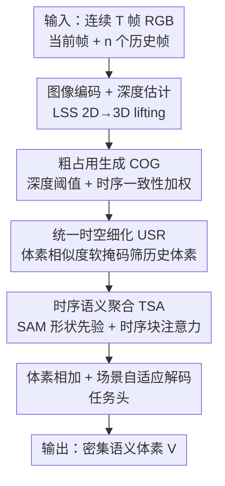

# Learning Spatial-Temporal Consistency for 3D Semantic Scene Completion

**会议**: CVPR 2026  
**论文**: [CVF Open Access](https://openaccess.thecvf.com/content/CVPR2026/html/Xue_Learning_Spatial-Temporal_Consistency_for_3D_Semantic_Scene_Completion_CVPR_2026_paper.html)  
**代码**: 无  
**领域**: 3D视觉  
**关键词**: 语义场景补全, 时序一致性, 占用预测, 体素细化, 相机感知

## 一句话总结
ConSSC 把历史 RGB 帧 lift 到统一的 3D 占用空间，用「分层体素细化」补几何、用「时序语义聚合」补语义，在不加任何额外传感器的前提下把纯相机的语义场景补全推到 SemanticKITTI / KITTI-360 新 SOTA（IoU 48.17 / 48.79，mIoU 19.20 / 20.85）。

## 研究背景与动机

**领域现状**：语义场景补全（Semantic Scene Completion, SSC）要从部分观测中联合推断体素级的占用与语义标签，是自动驾驶、机器人导航的关键 3D 感知任务。LiDAR 方案精度高但成本贵，因此 MonoScene 之后纯相机的 SSC 路线迅速兴起——成本低、外观线索丰富。

**现有痛点**：单帧相机方案受遮挡和视野限制，大片区域根本没被观测到，预测必然模糊。后续工作（VoxFormer-T、HTCL-S 等）开始引入时序帧，但大多只是**简单堆叠多帧特征**，缺乏显式的时序对应建模，结果是几何与语义随时间漂移、补全不完整。

**核心矛盾**：时序信息明明能补上当前帧看不到的区域，但「怎么把历史帧的 2D/3D 线索精准对齐到当前体素」一直没解决好——粗粒度的 BEV/体素融合满足不了 dense SSC 对细粒度时空对应的要求。

**本文目标**：在纯相机、不加传感器的前提下，同时改善几何一致性（补全被遮挡结构）和语义一致性（纠正遮挡区的歧义标签）。

**切入角度**：作者把历史帧统一 lift 进一个 3D 场景级占用框架，从两类互补线索下手——历史体素之间的相似度（几何）、多视角 2D 可见性与形状先验（语义）。

**核心 idea**：用「先从深度生成粗占用、再用历史体素相似度逐级细化」补几何，再用「SAM 形状先验 + 时序注意力」聚合多视角语义，把时序线索真正对齐到当前体素，而不是粗暴堆叠。

## 方法详解

### 整体框架
ConSSC 的输入是连续 $T$ 帧 RGB 图像 $\{I_t, I_{t-1}, \dots\}$，输出是当前帧前方体素网格的语义概率 $V \in \mathbb{R}^{X \times Y \times Z \times C}$（$C$ 含空类）。流水线是：图像编码器抽当前与历史帧特征，配合现成深度模型估计深度图，再用 Lift-Splat-Shoot（LSS）做 2D→3D lifting 得到初始体素集合；这些体素先进 **分层体素细化（HVR）** 补几何——用历史深度图生成粗占用、再用历史体素相似度逐级细化；然后进 **时序语义聚合（TSA）** 补语义——用 SAM 抽多帧形状掩码、时序注意力聚合后投回 3D；最后两路体素相加，过场景自适应解码器和任务头给出预测。

### 关键设计

**1. 粗占用生成（COG）：用深度 + 时序一致性给体素一个可靠的几何初始**

针对「单帧遮挡导致占用先验不可靠」的痛点，COG 不直接回归占用，而是从深度图出发。把深度图离散成深度概率分布，用最大概率索引取每个像素的深度估计 $d_f(x,y)$，再用深度阈值判定占用：$d \le d_f(x,y)$ 记 1，否则 0。关键在于对**历史帧**额外算了一个时序权重：先取当前帧与历史帧的深度差 $\Delta d = |d_t(x,y) - d_{t-k}(x,y)|$，再用高斯核 $w(x,y) = \exp(-\Delta d^2 / 2\sigma^2)$ 衡量两帧深度一致性，最终占用概率是当前与历史的加权融合 $P_{occ} = (1-w)\cdot Occ_t + w \cdot Occ_{hist}$，其中 $w$ 取 $K$ 个历史帧权重的算术平均。这样得到的粗占用 $O_{coarse}$ 把当前体素分成「可细化的已占用区」和「需要幻想补全的未观测区」，给后续细化划出了一个比单帧可靠得多的工作范围。

**2. 统一时空细化（USR）：用体素相似度软掩码，只取「该信」的历史体素**

粗占用解决了「在哪补」，USR 解决「补什么」。简单堆叠历史体素会把过时、无关的信息也叠进来，所以作者按相似度筛选。先算当前体素 $V_t$ 与历史体素 $V_{hist}$ 的逐元素差 $\Delta v$，引入可学习的逐通道权重 $w_V$ 做加权平方差 $\Delta_w = (\Delta v)^2 \odot w$，沿特征维求和压成单通道总差 $\Delta_{total}$，再用倒数映射成相似度分数 $s = 1/(1+\Delta_{total})$。然后用一个可学习阈值 $\gamma$（初始为 1）做尺度感知隔离，经 sigmoid 生成连续软掩码 $M = \mathrm{sigmoid}(s-\gamma)$，扩展到特征维后与 $V_{hist}$ 逐元素相乘，过滤出可信历史体素 $V'_{hist}$；为保证梯度传播还加了恒等残差 $V_{refined} = V'_{hist} + \theta \cdot V_{hist}$。筛过的历史体素直接逐元素加到当前粗占用上，显式增强那些「时序不稳或单帧不可见」的区域；对仍无法观测的幻想区，再用 Deformable Cross-Attention 从全部历史体素里学补全。比起卷积融合或硬掩码，软掩码 + 可学阈值让模型自适应决定保留多少历史信息。

**3. 时序语义聚合（TSA）：用 SAM 形状先验 + 时序注意力纠正遮挡区语义**

几何补好后，遮挡区的**语义标签**还是模糊的。TSA 用历史 RGB 的语义线索来纠正：对每帧用（冻结的轻量）SAM 以 box 提示抽出分割掩码 $F^t_{sam}$。为衡量同一物体跨帧的时序稳定性，先沿通道归一化，再算逐像素内积得帧间对应 $c_{i,j}(x,y)$，并用下界阈值 $\phi$ 截断不可靠匹配；把每帧与其它帧的对应求和得稳定性分数 $s_i$，softmax 归一化成帧级权重 $w_i = \mathrm{softmax}(s_i)$——稳定、清晰观测到的区域权重大，遮挡/模糊区自动降权。语义特征即是 SAM 特征的加权聚合 $F_{sim} = \sum_i w_i \cdot F^i_{sam}$。之后用基于注意力的两步增强：以 $F_{sim}$ 为 Query、各帧 $F_{sam}$ 为 Key，投到低维并切成不重叠的空间块在不同尺度算亲和；同时加一个可学习的时序位置偏置 $P_{time}$（经 MLP 加到投影特征 $K_{pos} = k_{proj} + \mathrm{MLP}(P_{time})$）建模时序依赖。聚合得到 $F_{agg}$ 后用深度概率分布软投影回体素，与离散深度体相乘、过 3D 卷积得 $V_{agg}$，最后与 $V_{refined}$ 相加过体素编码器。借助 SAM 的形状先验，同一物体的不同视角能互补证据，让遮挡或稀疏观测区拿到更可靠的语义。

### 损失函数 / 训练策略
沿用集合预测范式：用匈牙利算法把预测体素掩码与真值匹配，对每对匹配施加掩码损失 $L_{mask}$、Dice 损失 $L_{dice}$ 和分类损失 $L_{cls}$，总目标 $L = \lambda_{mask}L_{mask} + \lambda_{dice}L_{dice} + \lambda_{cls}L_{cls}$，权重 $\lambda_{mask}=5,\ \lambda_{dice}=5,\ \lambda_{cls}=2$。骨干用 ResNet50，时序帧数 $T=4$，用冻结的 MobileSAM 取掩码；AdamW 训 30 epoch，初始学习率 1e-4，在 20/25 epoch 降，两张 RTX A6000、batch size 2。

## 实验关键数据

### 主实验
在两个室外大规模 SSC 基准上评测，仅用 RGB 输入。指标 IoU 衡量几何占用、mIoU 衡量语义。

| 数据集 | 指标 | ConSSC（本文） | 之前最好（时序） | 之前最好（单帧） |
|--------|------|------|----------|----------|
| SemanticKITTI（test） | IoU / mIoU | **48.17 / 19.20** | SOAP 47.54 / 18.72 | ScanSSC 44.54 / 17.40 |
| SSCBench-KITTI-360（test） | IoU / mIoU | **48.79 / 20.85** | — | SOAP 48.48 / 20.17 |

在 SemanticKITTI 上比单帧 SOTA ScanSSC 高 3.63 IoU / 1.80 mIoU，比 CGFormer 高 3.76 IoU / 2.57 mIoU；相比 VoxFormer-T、HTCL-S、SOAP 等时序方法也都取得最高 IoU 与 mIoU。在 KITTI-360 上同样超过所有相机方案，尤其在 building、car 等结构化区域重建更准。

### 消融实验
在 SemanticKITTI 验证集上逐模块消融（HVR 拆成 COG + USR，外加 TSA）：

| 配置 | IoU(%) | mIoU(%) | 说明 |
|------|--------|---------|------|
| Baseline | 44.47 | 16.95 | 仅用标准 deformable cross-attention 交互时序特征 |
| + COG | 47.47 | 17.24 | 深度引导的体素初始化提供更可靠结构先验 |
| + USR | 48.01 | 18.17 | 时序对齐体素细化增强几何连续性 |
| + COG + USR | 48.86 | 18.66 | 完整 HVR |
| + TSA | 47.92 | 18.13 | 仅语义聚合 |
| Full（HVR + TSA） | **49.10** | **19.10** | 三者互补 |

设计替换分析（Table 4）进一步验证关键组件：

| 模块 | 替换方案 | IoU(%) | mIoU(%) |
|------|---------|--------|---------|
| HVR | Soft Mask → 去掉 | 48.04 | 18.37 |
| HVR | USR → 卷积融合 | 47.77 | 18.28 |
| TSA | SAM Mask → 图像特征 | 49.19 | 18.69 |
| TSA | 注意力层 → 去掉 | 48.73 | 18.87 |
| Ours | Full model | 49.10 | 19.10 |

### 关键发现
- **TSA 带来最大 mIoU 增益**：SAM 驱动的掩码能抑制噪声体素、强化跨帧一致的物体结构，说明语义补全比几何补全更吃时序对应。
- **软掩码 / 体素相似度对齐缺一不可**：把 USR 换成普通卷积融合或去掉软掩码，IoU/mIoU 都明显下滑，证明「按相似度筛历史体素」是几何细化的核心。
- **时序帧数有最优点**：历史帧从少加到多先涨后饱和，超过 3 帧增益趋平，作者最终取 4 帧，在时序信息与算力间折中。⚠️ 原文此处表格标注为「Table X」，疑似排版残留，以原文为准。

## 亮点与洞察
- **把「补几何」和「补语义」拆成两条互补支路**很干净：HVR 处理体素级几何相似度、TSA 处理多视角语义证据，二者最后体素相加，思路清晰且消融显示真正互补。
- **软掩码 + 可学阈值做历史体素筛选**是可迁移的 trick：任何「想用历史/多视角特征但怕引入过时噪声」的时序融合任务，都能借鉴这种「相似度→连续掩码→残差保护」的自适应保留机制，而非简单平均或硬阈值。
- **借现成基础模型当形状先验**（冻结 MobileSAM 提供分割掩码）几乎零成本就给遮挡区注入了物体级一致性，是「用大模型先验补稠密预测」的一个轻量范例。

## 局限与展望
- **依赖外部深度模型与 SAM**：COG 的粗占用质量受现成深度估计影响，TSA 受 SAM 分割质量影响，深度/分割失效场景下两条支路都可能退化，论文未充分讨论这种级联误差。
- **动态物体处理存疑**：基于历史帧深度一致性与体素相似度的设计，对快速运动物体（如对向车辆）的跨帧对应可能不稳，表 1 中 bicycle/motorcyclist 等小动态类别表现波动较大（如 truck 一列仅 0.2）。
- **算力与帧数权衡固定**：4 帧是经验最优，面向更长时序或在线流式推理的扩展性未验证；可探索自适应帧数选择或显式运动补偿来进一步对齐动态区域。

## 相关工作与启发
- **vs VoxFormer-T**: 它简单堆叠多帧特征、无显式时序对应建模；ConSSC 用体素相似度软掩码 + 深度一致性加权做细粒度对齐，几何与语义一致性都更好。
- **vs HTCL-S**: HTCL-S 通过跨帧亲和与动态细化做多帧融合，但仍偏粗粒度；ConSSC 把几何（HVR）和语义（TSA）解耦，并引入 SAM 形状先验补遮挡区语义，在两个基准上均超过它。
- **vs SOAP**: 同样利用历史特征恢复遮挡区，但 ConSSC 的「粗占用→相似度细化→语义聚合」三段式在 mIoU 上更高（19.20 vs 18.72），且强调显式时空一致性而非单纯历史特征复用。

## 评分
- 新颖性: ⭐⭐⭐⭐ 「相似度软掩码筛历史体素 + SAM 形状先验补语义」组合在纯相机 SSC 里较新颖，但各组件多基于已有思路改良
- 实验充分度: ⭐⭐⭐⭐ 两个主流基准 + 完整模块/设计消融 + 帧数分析，较扎实；动态类别与失效分析略欠
- 写作质量: ⭐⭐⭐ 方法叙述清楚，但公式排版有残留（Table X、部分下标错位），可读性受影响
- 价值: ⭐⭐⭐⭐ 不加传感器把纯相机 SSC 推到新 SOTA，对低成本自动驾驶感知有实用价值

<!-- RELATED:START -->

## 相关论文

- [\[CVPR 2026\] LaS-Comp: Zero-shot 3D Completion with Latent-Spatial Consistency](las-comp_zero-shot_3d_completion_with_latent-spatial_consistency.md)
- [\[AAAI 2026\] Towards Temporal Fusion Beyond the Field of View for Camera-based Semantic Scene Completion](../../AAAI2026/3d_vision/towards_temporal_fusion_beyond_the_field_of_view_for_camera-based_semantic_scene.md)
- [\[CVPR 2026\] AdaSFormer: Adaptive Serialized Transformers for Monocular Semantic Scene Completion from Indoor Environments](adasformer_adaptive_serialized_transformers_for_monocular_semantic_scene_complet.md)
- [\[CVPR 2026\] Semantic Foam: Unifying Spatial and Semantic Scene Decomposition](semantic_foam_unifying_spatial_and_semantic_scene_decomposition.md)
- [\[AAAI 2026\] SplatSSC: Decoupled Depth-Guided Gaussian Splatting for Semantic Scene Completion](../../AAAI2026/3d_vision/splatssc_decoupled_depth-guided_gaussian_splatting_for_semantic_scene_completion.md)

<!-- RELATED:END -->
