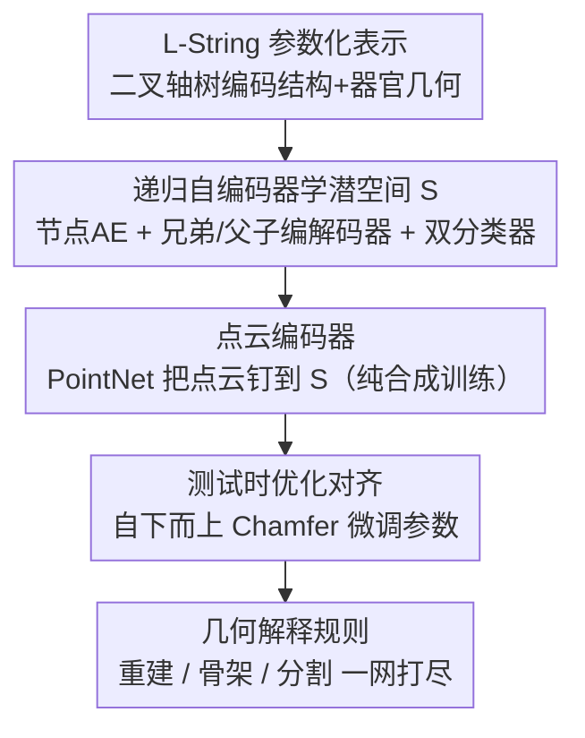

# Learning to Infer Parameterized Representations of Plants from 3D Scans

**会议**: CVPR 2026  
**论文**: [CVF Open Access](https://openaccess.thecvf.com/content/CVPR2026/html/Ghrer_Learning_to_Infer_Parameterized_Representations_of_Plants_from_3D_Scans_CVPR_2026_paper.html)  
**代码**: https://gitlab.inria.fr/sghrer/3d-L-plants  
**领域**: 3D视觉 / 植物表型 / 结构化重建  
**关键词**: 植物表型, L-System, 递归神经网络, 参数化重建, 点云

## 一句话总结
本文用递归神经网络学一个植物的"形状空间"，把无序 3D 点云直接推断成一棵参数化的 L-String（二叉轴树），从而一次性输出植物的分枝拓扑 + 每个器官的几何参数，且纯靠程序化模型生成的合成数据训练就能泛化到真实扫描，统一支撑 3D 重建、骨架提取、器官分割三大表型任务。

## 研究背景与动机

**领域现状**：植物表型（量化基因型在环境中如何生长）要从观测里抽高层信息——3D 几何重建、器官分割、骨架提取。观测多为 2D 图像或 3D 扫描。现有工作要么做"逆向建模"（找能生成给定植物的生长规则），要么是"任务专用"方法（只解三个任务之一）。

**现有痛点**：逆向建模很难，现有方法只适用于**无叶**的分枝结构（如树枝），碰到带叶的一年生植物就失效。任务专用方法各管一摊、互不通用，且都不输出结构化的参数表示。与本文最接近的 Demeter 虽能学参数化植物模型，但需要**人工标注的 3D 扫描**训练、推理还要**预先分割好的输入**、重建走繁琐三步法——标注与预处理都昂贵且易错。

**核心矛盾**：植物器官多、是 3D 分枝系统，器官又细又彼此贴近，造成强烈自遮挡与歧义；想从一团无序点云里既恢复"结构（拓扑）"又恢复"几何（每个器官参数）"，而点云点数不定、L-String 又在离散（模块数量/类型）和连续（角度/长度参数）两个维度同时变化，直接回归极难。

**本文目标**：从一张 3D 扫描点云推断出一个参数化表示，同时编码分枝结构与各器官几何，并能直接复用到多个表型任务。

**切入角度**：作者借力生物启发的程序化模型（L-System）——它用递归规则描述植物发育，既能指导网络设计（递归性），又能批量生成带真值的合成训练数据，从而绕开昂贵标注。

**核心 idea**：用递归自编码器在 L-String（二叉轴树）上学一个潜形状空间 S，再训一个点云编码器把扫描钉到 S，推理时"点云→S→递归解码→L-String"，把"无序点云"翻译成"结构化参数树"。

## 方法详解

### 整体框架
方法目标是从输入点云 $P$ 推断一棵 L-String $l$。因为点云无序、点数不定，而 L-String 在离散与连续维度同时变化，直接回归不可行，作者把它拆成"先学一个能编码 L-String 的潜空间 S，再学一个把点云映到 S 的编码器"。训练分两步：先用递归自编码器在合成 L-String 上学 S（含节点自编码、兄弟/父子递归编解码器与两个辅助分类器）；再训一个 PointNet 点云编码器，把点云对齐到其对应 L-String 在 S 中的潜点。推理时点云经编码器得潜点、再经递归解码器还原成 L-String，最后用测试时优化对齐输入、并通过几何解释规则一网打尽重建/骨架/分割三任务。

### 关键设计

**1. L-String 参数化表示：用二叉轴树同时编码拓扑与几何**

针对"任务专用方法不输出结构、逆向建模又只能处理无叶枝"的痛点，作者用 L-System 把植物表示成带括号的参数化模块串（L-String）：模块对应器官（茎 stem、子叶 cotyledon、叶柄 petiole、叶 leaf、分枝 branch），每个模块带一组参数（如茎的直径/长度/生长角/弯曲角/叶序角），括号标记分枝起止，相邻模块有父子关系、开括号允许多子与兄弟关系，从而编码植物的**轴树（axial tree）**架构。为了能用二叉树递归网络，作者把"在该物种里总同时出现的模块"合并成 **node**（每物种手工定义一次合并规则，保证合并后是二叉树）。这样一来，L-String 既给出拓扑（哪个器官连哪个），又给出几何（每个器官的连续参数），是输入扫描所缺失而下游任务所需的结构化信息。方法适用于任何可表示为二叉轴树的植物。

**2. 递归自编码器与潜空间 S：用 RvNN + 双分类器自下而上压成一个潜点**

要让变长、变结构的 L-String 落到固定维潜空间 $S$，作者学一对编码/解码 $E: L \to S$、$D: S \to L$ 使 $l \approx D(E(l))$。因为不同类型 node 参数维度不同、不可直接比较，先给每类 node 学一对节点编解码器 $(E_{node,i}, D_{node,i})$（单层全连接 + tanh）把它映进 $S$；然后按两 node 在树中的关系（兄弟 sibling 或父子 parent-child）各学一对递归编解码器 $(E_{sib},D_{sib})$、$(E_{pc},D_{pc})$，自叶向根递归地两两合并，直到整棵树压成 $S$ 中一个潜点。解码时反着来，但需要知道每个潜点该用哪个解码器：故联训两个辅助分类器——$C_{split}$ 判断一个潜点该按父子分裂、兄弟分裂还是停止（叶节点），$C_{node}$ 判断叶潜点属于哪类 node。训练用节点级重建损失 $L_{rec} = \sum_n L_{rec}(n)$（各器官参数的加权 MSE）加两个分类交叉熵，总损失 $L_{total} = L_{rec} + L_{split} + L_{node}$。这套递归结构天然契合植物"自相似分枝"的本性，是它能处理变结构 L-String 的关键。

**3. 点云编码器：PointNet 把无序点云钉到潜点，纯合成数据训练**

学好 $S$ 后还差"扫描→S"这一跳。作者用 PointNet 学映射 $E_{points}: P \to S$。训练利用配对数据（点云 $P$ 及其对应 L-String $l$）：把 $l$ 过递归编码器得真值潜点 $s$，把 $P$ 过 $E_{points}$ 得预测 $\hat{s}$，最小化 $L_{points} = \sum_j (\hat{s}_j - s_j)^2$，逼编码器把点云落到其对应 L-String 的潜点位置。整套训练**只用 L-Py 程序化生成的合成点云**（还模拟采集噪声以增鲁棒），从而彻底绕开真实扫描的人工标注；实验显示这样训出的模型能直接泛化到无标注的真实扫描。

**4. 测试时优化对齐 + 几何解释：先抑误差累积，再一网打尽三任务**

递归解码出的模块参数若有误差会沿生长轴累积——比如底部茎的角度估偏，会让整株主轴生长方向跑偏。作者用**测试时优化**对齐输入：自下而上、先优化主茎模块的 3D 角度与长度参数，再优化叶柄（长度/弹性）、再优化叶（尺寸/曲率），全部以重建植株与输入点云的**双向 Chamfer 距离**为目标，自底向上迭代两轮。得到对齐后的 L-String 后，三个下游任务都靠对它施加**几何解释规则**直接读出：**重建**=对 $l$ 跑几何解释还原 3D 植株；**骨架**=只重建最小宽度的茎（可选叶主脉），支持带叶/无叶两种尺度；**分割**=保留器官类型标签，再按 k 近邻把标签从带注释点云传播到输入 $P$。一个表示、一次推断，三任务同出。

### 损失函数 / 训练策略
潜空间训练用 $L_{total} = L_{rec} + L_{split} + L_{node}$；点云编码器用 $L_{points}$ 的潜点回归 MSE。数据集为合成 Chenopodium Album：用 L-Py 生成 10 种结构 × 100 株 = 1000 对 (L-String, 点云)，按 8/1/1 划分训练/验证/测试，硬件 Quadro RTX 5000。⚠️ 节点合并规则需每物种手工定义一次。

## 实验关键数据

**自定义指标说明**：**Accuracy↓** 重建面到真值的单向 Chamfer 距离；**Completeness↓** 真值到重建面的单向 Chamfer；**Size** 输出表示大小（越小越紧凑）；**# Comp.** 输出网格连通分量数（越接近 1 越完整）；**LN Accuracy↑** 叶片数匹配百分比；**LAI Accuracy↑** 叶面积指数（单位地表的单面叶面积）精度；**Topology↑** 用树编辑距离判定拓扑正确的植株百分比；骨架与分割均用**双向 Chamfer 距离**评估。

### 主实验（3D 重建 vs SIREN）
在干净点云、加高斯噪声、单目深度图三种输入下对比 SIREN（Prasad et al. 验证的最佳植物点云重建法）：

| 输入 | 方法 | Accuracy↓ | Completeness↓ | Size | Time | # Comp. | LN↑ | LAI↑ | Topo↑ |
|------|------|-----------|---------------|------|------|---------|-----|------|-------|
| 干净 | SIREN | 0.0012 | 0.0006 | 780.88 KB | 7m14s | 33 | ✗ | ✗ | ✗ |
| 干净 | **Ours** | 0.0059 | 0.0090 | **17.56 KB** | **4m01s** | **1** | 98% | 93% | 75% |
| 噪声 | SIREN | 0.0121 | 0.0008 | 780.88 KB | 7m27s | 268 | ✗ | ✗ | ✗ |
| 噪声 | **Ours** | **0.0054** | **0.0074** | **17.56 KB** | **3m56s** | **1** | 98% | 93% | 78% |
| 深度图 | SIREN | 0.0013 | 0.0022 | 780.88 KB | 6m44s | 49 | ✗ | ✗ | ✗ |
| 深度图 | **Ours** | 0.0060 | 0.0089 | **17.57 KB** | **3m47s** | **1** | 98% | 94% | 78% |

干净数据下 SIREN 的距离误差更小，但其在噪声下急剧退化（Accuracy 0.0012→0.0121、连通分量 33→268，碎成一堆片）；本文方法对噪声/缺失鲁棒、噪声下反超 SIREN，表示比 SIREN 紧凑一到两个数量级、推理快近一倍，且额外给出 SIREN 给不了的叶数/LAI/拓扑（✗ 表示该法无法输出）。

### 骨架提取（双向 Chamfer↓）
| 方法 | Clean(Full) | Noisy(Full) | Depth(Full) | Clean(Branch) |
|------|-------------|-------------|-------------|---------------|
| Xu et al. | 0.0102 | 0.0110 | 0.0145 | ✗ |
| Chaudhury et al. | 0.0139 | 0.0154 | 0.0449 | ✗ |
| Livny et al. | 0.0257 | 0.0282 | —（崩溃） | ✗ |
| **Ours** | 0.0178 | 0.0174 | 0.0199 | 0.0161 |

基线都只能吃无叶输入、且输出尺度不可调（✗ 无法在 branch 尺度操作，"—"为数值问题崩溃）；本文在三种测试集上表现一致、对噪声鲁棒，并独家支持"带叶全骨架 / 仅分枝骨架"两种尺度。

### 分割与泛化
- 语义分割对比 PlantNet、PSegNet：本文与强基线持平，且在**叶柄（petiole）分割上反超 PSegNet**，对噪声与部分缺失数据鲁棒。
- 仅用合成数据训练，直接测 5 株真实 Chenopodium Album 扫描，重建/分割整体良好、骨架紧贴拓扑（原文 Figure 6），验证 sim-to-real 泛化。

### 关键发现
- 紧凑参数表示是核心红利：17.5KB vs 780KB，且天然连通（# Comp.=1），噪声下不碎，正是结构化先验在兜底。
- SIREN 这类隐式法擅长贴合干净点，但缺结构先验，遇噪声/缺失就碎裂、且给不出表型量（叶数/LAI/拓扑）。
- "一表三用"：同一 L-String 经几何解释即得重建+骨架+分割，三任务与各自专用强基线持平，省去为每任务单独建模。

## 亮点与洞察
- 把"从扫描理解植物"重新表述成"推断一棵参数化 L-String"，让结构先验进入重建——这是它对噪声鲁棒、能同时输出拓扑与表型量的根因，思路可迁移到任何可程序化建模的对象（血管、道路网）。
- 用程序化模型一鱼两吃：既指导网络的递归结构设计，又当合成数据工厂绕开人工标注，是"合成数据 + 归纳偏置对齐"的漂亮范例。
- 测试时自下而上的 Chamfer 优化巧妙抑制了沿生长轴的误差累积，对任何"链式/树式参数会传播误差"的回归问题都有借鉴意义。

## 局限与展望
- **每物种需重训一个模型**：要有该物种的 L-System 生成训练数据，还要手工定义 node 合并规则以保证二叉树结构——可扩展性受限。
- 仅适用可表示为二叉轴树的植物，且受限于部分可观测部位，无法建模单子叶植物（如小麦、玉米）。
- 评估主要在小型一年生 Chenopodium Album 上，向大型/复杂树木或更密集冠层的泛化未充分验证。
- 可改进：探索跨物种共享潜空间、自动学习 node 合并规则、放宽二叉树假设以覆盖更广植物类型。

## 相关工作与启发
- **vs Demeter（Cheng et al.）**：同样学参数化植物模型，但 Demeter 需人工标注 3D 扫描训练、推理要预分割输入、重建走繁琐三步；本文纯合成训练、无需预处理，直接从原始扫描推参数表示。
- **vs SIREN（隐式重建）**：SIREN 干净数据精度高但无结构先验、噪声下碎裂且不输出表型量；本文牺牲少量干净精度换来紧凑表示、噪声鲁棒与拓扑/叶数/LAI 输出。
- **vs 逆向建模（Guo/Št'ava 等）**：他们从 2D 图像推无叶枝的 L-System 规则；本文吃 3D 扫描、能处理带叶一年生植物，并直接重建给定真实实例而非只学生成规则。
- **vs 任务专用法（PlantNet/PSegNet/Xu 等）**：各解一任务；本文一个参数表示同出重建+骨架+分割，且与各专用强基线持平。

## 评分
- 新颖性: ⭐⭐⭐⭐⭐ 把植物理解重构成"推断 L-String"，用 RvNN 学植物形状空间属首个纯合成训练的此类方案。
- 实验充分度: ⭐⭐⭐⭐ 三任务 × 三种输入 + 真实扫描泛化较系统，但仅一个物种、缺更多物种与大型植物验证。
- 写作质量: ⭐⭐⭐⭐ 结构清晰、定位表与图示到位；L-String/node 合并等概念对非领域读者门槛偏高。
- 价值: ⭐⭐⭐⭐ 对植物表型与农业 crop modeling 有直接落地价值，结构化+合成训练范式可外溢到其他树状结构重建。

<!-- RELATED:START -->

## 相关论文

- [\[CVPR 2026\] Velox: Learning Representations of 4D Geometry and Appearance](velox_learning_representations_of_4d_geometry_and_appearance.md)
- [\[CVPR 2026\] Learning Compact 3D Representations from Feed-Forward Novel View Synthesis](learning_compact_3d_representations_from_feed-forward_novel_view_synthesis.md)
- [\[CVPR 2026\] UniSplat: Learning 3D Representations for Spatial Intelligence from Unposed Multi-View Images](unisplat_3d_representations_unposed.md)
- [\[CVPR 2026\] Learning to Solve PDEs on Neural Shape Representations](learning_to_solve_pdes_on_neural_shape_representations.md)
- [\[CVPR 2026\] EvObj: Learning Evolving Object-centric Representations for 3D Instance Segmentation without Scene Supervision](evobj_learning_evolving_object-centric_representations_for_3d_instance_segmentat.md)

<!-- RELATED:END -->
