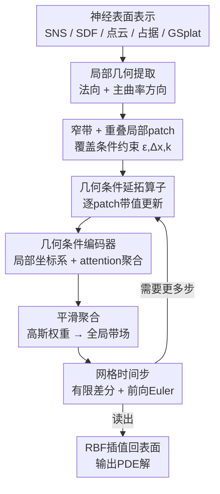

# Learning to Solve PDEs on Neural Shape Representations

**会议**: CVPR2026  
**arXiv**: [2512.21311](https://arxiv.org/abs/2512.21311)  
**代码**: [项目主页](https://welschinger.github.io/Learning-to-Solve-PDEs-on-Neural-Shape-Representations/)  
**领域**: 3D视觉 / 几何处理 / 神经表面表示  
**关键词**: 表面PDE、Closest Point Method、神经隐式表面、可微求解器、几何条件算子

## 一句话总结
本文把经典 Closest Point Method（CPM）里最关键的"法向延拓"步骤用一个轻量、几何条件化的神经算子学出来，从而**直接在神经表面表示（SNS / SDF / 占据场 / 点云 / Gaussian Splatting）上求解表面 PDE**，无需抽 mesh、无需逐实例优化，且全程可微——只在单个示例形状（Spike）上训练一次就能泛化到未见形状、拓扑和输入函数，精度与 CPM 相当。

## 研究背景与动机

**领域现状**：在曲面上求解偏微分方程（热扩散、Poisson、调和插值等）是几何处理与形状分析的核心。主流求解器（FEM/SFEM、有限差分）都建立在**离散三角网格**上，精度与稳定性有成熟理论保证。

**现有痛点**：而现代 3D 资产越来越多地以**神经表示**存在——点云/splats、神经隐式场（DeepSDF、占据网络）、过拟合 INR（SIREN）、球面神经表面（SNS）等。这些表示天然可微、拓扑无关、与生成式管线兼容，但**以网格为中心的 PDE 求解器根本不在它们生存的域里工作**。结果只能二选一：要么先 marching cubes 抽出 mesh 求完再塞回去（破坏端到端可微、引入往返误差），要么用 surface PINN 做逐实例残差训练（换个形状就要重训，泛化差、运行时贵）。

**核心矛盾**：CPM 这类 embedding 方法本来很适合——它把表面 PDE 嵌入到表面周围一条窄带（narrow band）里，在笛卡尔网格上用标准差分求解。但它依赖一个**显式的"延拓-重启"循环**：每步都要把表面函数沿法向延拓到窄带（closest point extension，保证沿法向常值），再做体积求解。这个显式延拓需要反复评估最近点投影，是绑死在显式几何上的瓶颈，也是和神经表示对接的障碍。

**本文目标**：① 设计一个**表示无关**、直接吃神经几何的表面 PDE 求解器；② 保住 CPM 的精度同时去掉显式延拓的开销；③ 全程可微，能当神经网络层插进训练管线。

**切入角度**：作者观察到 CPM 的延拓步骤**本质是局部的**——某个窄带点的延拓只依赖它附近的局部几何（法向、主曲率）和邻近采样。既然是局部映射，就可以用一个**小的、几何条件化的算子**把它隐式学出来。

**核心 idea**：用"学一个局部延拓算子"替代"显式的最近点延拓 + 重启"，让 PDE 直接在神经数据所在的地方被求解。

## 方法详解

### 整体框架
方法把"在神经表面上求解 PDE"拆成一个 **grid-to-grid 的迭代循环**：从任意神经表面 $\mathcal{S}$ 采点并提取局部几何（法向 $\mathbf{n}$、主曲率方向 $\mathbf{t}_1,\mathbf{t}_2$），在表面周围建一条宽度 $\varepsilon$ 的笛卡尔窄带 $\mathcal{B}_\mathcal{S}$，用一族**重叠的局部 patch** $\{\mathcal{P}_i\}$ 把窄带盖住；每个 patch 在自己的局部坐标系下，由**几何条件神经算子** $\mathcal{N}_\Theta$ 做一次"带值更新"（隐式完成沿法向常值的延拓），所有 patch 的局部预测被平滑聚合成全局带场 $\tilde{U}_t$；由于 $\tilde{U}_t$ 沿法向常值，就能直接用标准有限差分 + 前向 Euler 推进一个时间步得到 $U_{t+1}$；循环往复，最后用径向基函数把带场限制回表面读出解。整条管线没有任何 mesh 抽取、也没有 CPM 那种 extend–restrict 往返。

### 关键设计

**1. 学习 CPM 的延拓算子：用一次前向预测替代"显式延拓 + 重启"循环**

CPM 求解 = 在窄带做体积差分 + 每步重新做"最近点延拓"保证沿法向常值。痛点在于这个延拓步是显式的、绑死在显式几何上：要反复算最近点投影 $\mathrm{cp}(x):=\arg\min_{y}\|x-\mathcal{S}(y)\|$ 并做多项式插值重启，既慢又难对接神经表示。本文的关键洞察是——延拓只依赖**局部**几何，于是把它换成一个学到的局部算子 $\mathcal{N}_\Theta$。给定 $t$ 时刻的带场 $U_t$，记它在 patch $\mathcal{P}_i$ 上的局部限制 $u_t^i:=U_t|_{\mathcal{B}_i}$，算子吃进 per-patch 的带值和局部几何，直接输出沿法向常值的更新：

$$\tilde{u}_t^i = \mathcal{N}_\Theta^{(\mathcal{P}_i,\,u_t^i)}(\hat{\mathcal{B}}_i)$$

这里 $\tilde{(\cdot)}$ 表示"沿表面法向常值"。一旦带场常值，环境（ambient）算子限制到表面就等于内蕴算子，于是表面 Laplacian 等可被标准差分 stencil 替换。和旧 CPM 的区别：旧方法每步都显式 extend–restrict 在表面与网格间往返；本文把延拓"内化"成单次前向，既去掉往返、又因为只依赖局部几何而天然兼容任何能采点+给法向的表示

**2. 重叠局部 patch + 覆盖条件：把全局问题切成可学的局部单元，并保证不漏盖**

要让"局部算子"覆盖整个窄带，就需要把 $\mathcal{S}$ 和 $\mathcal{B}_\mathcal{S}$ 分解成一族重叠的、以表面点为中心的 patch。每个 patch $\mathcal{P}_i:=(\mathcal{L}_i,\mathcal{B}_i,\mathcal{F}_i)$ 锚在表面中心点 $p_i^c$：$\mathcal{L}_i$ 是该点的局部标架 $(\mathbf{n},\mathbf{t}_1,\mathbf{t}_2)$，$\mathcal{B}_i$ 收集最近的 $k$ 个带节点，$\mathcal{F}_i$ 收集邻域表面特征（点+法向）。所有量都转进局部标架（戴 hat：$\hat{\mathcal{B}}_i,\hat{\mathcal{F}}_i$），从而**对平移和旋转不变**——这是泛化到未见形状的关键。patch 用类似 floodfill 的方式从种子向外铺，间距参数控制重叠度。

但固定 $k$ 个邻居会留隐患：网格间距 $\Delta x$ 太小或带宽 $\varepsilon$ 太大时，有些带点离任何中心都太远，导致漏盖。作者借用 **Gauss 球问题**给出定量约束：半径 $\varepsilon/\Delta x$ 的球内格点数约 $N_3 \approx \tfrac{4}{3}\pi(\varepsilon/\Delta x)^3$，要保证每个带点至少被一个 patch 覆盖，就得满足

$$\varepsilon \le \Delta x\left(\tfrac{3k}{4\pi}\right)^{1/3}$$

实践中 $\varepsilon$ 取形状尺寸的约 5%，再据此选 $\Delta x$，在精度和算力间平衡。这个覆盖条件把"会不会漏盖"从玄学变成可验证的不等式

**3. 几何条件神经编码器：用 attention 式聚合 + 局部标架让一个小网络吃下任意表示的几何线索**

延拓算子的内核是个轻量编码器：由三个小 MLP $(\Phi_{\theta_1},\Phi_{\theta_2},\Phi_{\theta_3})$ 加一个可学标量 $\lambda$ 构成。输入是查询点 $q$、局部带点 $\hat{\mathcal{B}}_i$ 及其当前场值 $u^i$、以及局部表面特征 $\hat{\mathcal{F}}_i$（位置+法向，全在局部标架里）。机制是 attention-like：查询点 $q$ 对邻近带样本做注意力得到空间权重，而 $\hat{\mathcal{F}}_i$ **调制**这个聚合，使更新被局部几何条件化；输出是加权和给出 $q$ 处的更新值。为应对每个 patch 表面特征数量 $N_i$ 不定，对 $\mathcal{F}_i$ 做 mean pooling 得到固定长度描述子。形式上

$$\mathcal{N}_\Theta:\ \mathbb{R}^3\times\mathbb{R}^{k\times3}\times\mathbb{R}^{N_i\times6}\times\mathbb{R}^{k}\ \longrightarrow\ \mathbb{R}$$

这个设计直接利用了 embedding 方法"延拓只看局部"的性质，所以一个小网络就够、且能跨形状跨表示泛化。聚合阶段把各 patch 的局部预测用高斯权重融成全局带场：$\tilde{U}_t(x)=\frac{\sum_i \exp(-\|x-p_i^c\|^2/T)\,\tilde{u}_t^i(x)}{\sum_i \exp(-\|x-p_i^c\|^2/T)}$，温度 $T$ 控制混合软硬

### 损失函数 / 训练策略
**单形状训练 + 单项式监督**：只在一个代表性形状 Spike（用 SNS 表示）上训练。理由是网络只依赖一阶/二阶几何量（法向+曲率），而 Spike 的曲率分布足够丰富，足以覆盖延拓算子需要见的局部几何。监督信号用次数 $\le 5$ 的**单项式** $\mathcal{M}:=\{(x,y,z)\mapsto x^iy^jz^k\mid i{+}j{+}k\le5\}$：对每个 $g$，网络输入 $g(\mathcal{B}_i)$、目标是延拓后的 $g(\Pi_i)$（$\Pi_i$ 是带点的最近点投影）。作者论证 PDE 解光滑、可被前几阶 Taylor 系数良好逼近，所以学单项式就够，测试时能泛化到未见函数。

**两个损失**：① 主 MSE 强制延拓后函数值准确重建——$L_{\mathrm{MSE}}=\frac{1}{k|\mathcal{D}||\mathcal{M}|}\sum \|\mathcal{N}_\Theta^{(\mathcal{P}_i,g)}(\hat{\mathcal{B}}_i)-g^{\mathrm{GT}}\|_2^2$；② 法向一致性 $L_{\mathrm{NC}}=\sum_q|\langle\nabla_q\mathcal{N}_\Theta(q),\mathbf{n}(\mathrm{cp}(q))\rangle|$，鼓励场梯度与表面法向正交（即沿法向常值），梯度由自动微分对 $q$ 求得。总目标 $L=L_{\mathrm{MSE}}+\alpha L_{\mathrm{NC}}$。消融显示小权重 $\alpha$ 稳定降误差，权重过大反而把解推向平凡的法向不变场。此外用随机旋转做数据增强应对脐点（umbilic）等曲率方向歧义的退化情形。

## 实验关键数据

### 主实验
**球面收敛性（Poisson，有解析 GT）**——与 SFEM、CPM 在四档分辨率上对比，报归一化平均/最大误差（越低越好），运行时含完整管线：

| Solver | 分辨率 | NMAE ↓ | NMaxE ↓ | Time(s) |
|--------|--------|--------|---------|---------|
| SFEM | Very fine | $1.11\times10^{-4}$ | $1.29\times10^{-4}$ | 5.46 |
| CPM | Fine | $1.46\times10^{-2}$ | $3.49\times10^{-2}$ | 30.2 |
| CPM | Very fine | $1.48\times10^{-2}$ | $3.52\times10^{-2}$ | 335.0 |
| **Ours** | Fine | $1.33\times10^{-2}$ | $3.17\times10^{-2}$ | 38.0 |
| **Ours** | Very fine | $1.32\times10^{-2}$ | $3.23\times10^{-2}$ | **72.6** |

本文与 CPM 共享同一套带式 PDE 求解器，差异只来自延拓算子。结论：**精度与 CPM 相当**（同量级，甚至 Fine 档 NMAE 略优 $1.33$ vs $1.46\times10^{-2}$），但在 Very fine 档运行时 **72.6s vs CPM 335.0s**，快约 4.6×——因为省掉了昂贵的显式延拓/往返。SFEM 作为高度优化的成熟参考误差更低，作者明确"不以击败 FEM 为目标，只用它当可靠参照"。

**ShapeNet 泛化（Poisson，NRMSE ×$10^{-2}$）**——只在 Spike 上训练（spike-only），在 5 个未见椅子/桌子（A–E）上测试，SFEM 为参考：

| 方法 | A | B | C | D | E |
|------|------|------|------|------|------|
| GINO (spike-only) | 13.59 | 13.89 | 8.58 | 6.67 | 7.38 |
| CPM (training-free) | 1.92 | 0.892 | 0.936 | 0.889 | 0.600 |
| **Ours (spike-only)** | **1.05** | 0.909 | 0.986 | **0.354** | **0.364** |
| GINO (在这些形状上过拟合) | 0.33 | 0.21 | 0.34 | 0.16 | 0.18 |

关键发现：在**同一 train-test split**下（都只见过 Spike），本文一致优于 GINO（GINO spike-only 误差高一个数量级，因为它假设固定离散化、不为神经隐式几何而设计）；只有当 GINO 在测试形状上**过拟合**后才更好，但那已不是泛化。本文与同样 training-free 的 CPM 精度相当、互有胜负。

### 消融实验
| 配置 | 结论 |
|------|------|
| 法向一致性 $L_{\mathrm{NC}}$ | 小权重稳定降误差；权重过大偏向平凡法向不变场、伤精度；即使不加，算子也基本保持法向常值 |
| 局部特征 | 位置+法向最重要；精确曲率只带边际收益 |
| 带感受野 $k$ | 增大 $k$ 收益递减，误差先降后平台；中等 $k\sim400$ 平衡精度/稳定/算力 |
| 模型容量 | 浅而窄的 MLP 已够，加深加宽仅边际提升 |
| 可学注意力强度 $\lambda$ | 单个可学标量轻微但稳定地提精度 |

### 关键发现
- **延拓步是 CPM 真正可学的核心**：把它换成局部学到的算子就足以让经典求解器变成表示无关、可微的算子，其余（差分、时间积分）沿用标准数值方法即可。
- **局部性 → 数据高效 + 泛化**：因为算子只看一阶/二阶局部几何，单个 Spike 的曲率分布就训得动，且对重网格/连通性变化误差稳定（mesh-centric 管线对此很敏感）。
- **可微性可用**：在玩具实验里通过求解器反传优化热源强度 $h$，从 $h_0=0.8$ 收敛到 $1.0002$（目标 $h^\star=1$），证明梯度能准确穿过整个求解器。

## 亮点与洞察
- **"只学最该学的那一步"**：不端到端学整个 PDE 解，而是精准定位 CPM 里唯一绑死显式几何的延拓步去学，其余复用成熟数值方法。这种"外科手术式"的学习既省数据又稳，是把经典算法神经化的优雅范式。
- **用 Gauss 球问题给覆盖度上界**：把"patch 会不会漏盖窄带"这个工程隐患转成一条可验证的不等式 $\varepsilon\le\Delta x(3k/4\pi)^{1/3}$，把超参选择从试错变成有依据，值得借鉴到任何"局部 patch 覆盖空间"的方法里。
- **单项式监督替代真实 PDE 解**：基于"PDE 解光滑、可被低阶 Taylor 逼近"的洞察，用 $\le5$ 次单项式当训练信号，绕开了"要先有大量解析/数值解才能训"的鸡生蛋问题，测试时还能泛化到高频未见函数。
- **局部标架带来的天然不变性**：所有量转进 $(\mathbf{n},\mathbf{t}_1,\mathbf{t}_2)$ 局部坐标系，使算子对平移旋转不变，这是"单形状训练即可跨形状泛化"的几何根因，可迁移到其它逐 patch 的几何学习任务。

## 局限与展望
- **自交与中轴附近失效**：靠近自交或 medial axis 时 SDF 梯度不可靠，延拓质量下降——这是所有 closest-point 类方法的通病。作者建议混合 fallback：用 $|\nabla\phi|$ 或曲率阈值检出病态 patch，交给经典求解器处理。
- **演化表面要重建窄带**：当表面在 PDE 作用下移动（如曲率流），窄带必须重建重采样，摊销收益被削弱。把"带维护"也学进算子是有意思的方向。
- **非完全离散化不变**：性能会随网格间距和带厚变化。作者提出 scale-aware 条件化、多分辨率训练来增强鲁棒性。
- **依赖底层表示在表面附近足够准确**：若神经表示本身在表面附近质量差，几何线索（法向/曲率）就不可靠，整条管线随之退化。
- （自评）精度只是"与 CPM 相当"，相对高度优化的 SFEM 仍有约一个数量级差距；论文定位是几何组件而非高阶数值格式，主打的是"可微 + 表示无关 + 速度"，而非绝对精度 SOTA，看待结论时要带这个 caveat。

## 相关工作与启发
- **vs CPM（Closest Point Method）**：本文直接建立在 CPM 之上，复用其窄带嵌入与边界处理；区别在于把 CPM 的**显式延拓-重启循环**换成单次几何条件前向，去掉 extend–restrict 往返，从而又快又能对接神经表示。精度同量级，速度在高分辨率下显著更优。
- **vs Surface PINN（残差训练类）**：PINN 类方法 mesh-free 但需逐实例优化，换形状/换函数就重训，对刚性、边界施加、残差加权敏感。本文训练一次即泛化，单次前向更新，无逐实例负担。
- **vs GINO / 神经算子（FNO、DeepONet）**：这类方法摊销解映射跨问题族，但通常依赖经典求解器监督、假设固定离散化/图表，且不原生面向神经隐式几何。本文在同一 split 下显著优于 GINO 的泛化设置，且天生吃神经表示。
- **vs INR-as-discretization（隐式神经空间表示求解时变 PDE）**：那类方法把 INR 当空间离散、随时间演化其权重，精度-内存权衡好，但是全局权重演化 + 逐问题时间积分，无法直接用到未见形状；本文是局部更新算子，跨形状/表示泛化。
- **vs SFEM/FEM**：成熟、精度高，但绑死显式网格，对网格质量敏感、演化几何需重网格，且无法直接用于神经表示——这正是本文要补的空白。

## 评分
- 新颖性: ⭐⭐⭐⭐⭐ "学 CPM 的延拓步"这个切入点干净而有洞察，第一个让表面 PDE 直接在多种神经表示上端到端可微求解
- 实验充分度: ⭐⭐⭐⭐ 球面解析收敛 + ShapeNet 泛化 + 多表示 + 可微玩具 + 五项消融，覆盖全面；但绝对精度仅与 CPM 相当、未在大规模/高阶 PDE 上压力测试
- 写作质量: ⭐⭐⭐⭐ 动机与方法链条清晰，符号规范；pipeline 七步偏密、部分细节（编码器内部 attention 具体形式）需看附录
- 价值: ⭐⭐⭐⭐⭐ 给神经 3D 资产补上"可微 PDE 层"，对逆问题、PDE 先验、几何编辑等下游有直接价值，且可与更强数值格式互补

<!-- RELATED:START -->

## 相关论文

- [\[CVPR 2026\] Velox: Learning Representations of 4D Geometry and Appearance](velox_learning_representations_of_4d_geometry_and_appearance.md)
- [\[CVPR 2026\] Learning to Infer Parameterized Representations of Plants from 3D Scans](learning_to_infer_parameterized_representations_of_plants_from_3d_scans.md)
- [\[CVPR 2026\] Learning Compact 3D Representations from Feed-Forward Novel View Synthesis](learning_compact_3d_representations_from_feed-forward_novel_view_synthesis.md)
- [\[CVPR 2026\] Learning 3D Shape Fidelity Metric from Real-world Distortions](learning_3d_shape_fidelity_metric_from_real-world_distortions.md)
- [\[CVPR 2026\] UniSplat: Learning 3D Representations for Spatial Intelligence from Unposed Multi-View Images](unisplat_3d_representations_unposed.md)

<!-- RELATED:END -->
