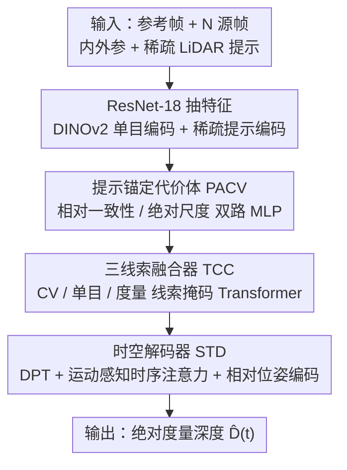

# LiDAR Prompted Spatio-Temporal Multi-View Stereo for Autonomous Driving

**会议**: CVPR 2026  
**论文**: [CVF Open Access](https://openaccess.thecvf.com/content/CVPR2026/html/Sun_LiDAR_Prompted_Spatio-Temporal_Multi-View_Stereo_for_Autonomous_Driving_CVPR_2026_paper.html)  
**代码**: https://github.com/Akina2001/DriveMVS.git  
**领域**: 3D视觉  
**关键词**: 多视图立体, 度量深度, LiDAR提示, 时序一致性, 自动驾驶

## 一句话总结
DriveMVS 把稀疏 LiDAR 当「几何提示」注入多视图立体（MVS）：既作硬约束锚定代价体的绝对尺度，又作软特征经三线索融合器与单目/几何先验融合，再用时空解码器保证跨帧一致，从而在自动驾驶零样本跨域设置下同时拿到度量精度、时序稳定与泛化（KITTI MAE 0.49 m、AbsRel 2.56%）。

## 研究背景与动机

**领域现状**：自动驾驶的闭环仿真与世界建模都依赖从随手拍的驾驶视频里恢复精确的**度量深度**。随着 L4 车队为降成本走「极简 LiDAR」配置（更少线束），如何在稀疏 LiDAR 下建一条鲁棒的度量深度管线成了刚需。

**现有痛点**：三类主流方案各有硬伤——① 单目基础模型（Depth-Anything、MoGe-2）泛化强但有**尺度歧义**、时序不一致；② 通用 MVS（MVSAnywhere）几何保真高但**逐帧独立**估计、会时序闪烁，且在低视差/静止/重复纹理下因极线线索不可靠而退化；③ 前馈多视图模型（VGGT、MapAnything）推理快但**绝对深度精度差**。即便多模态融合用稀疏 LiDAR 锚定，提示本身也稀疏、间歇、分布不均，只靠当前帧线索的系统在输入缺失时会崩。

**核心矛盾**：度量精度、多视图/时序一致性、跨域泛化这三件事彼此竞争——强行靠多视图几何会在弱极线场景崩尺度，强行靠单目先验又丢绝对尺度，且都缺时序约束。

**本文目标**：在极简 LiDAR 配置下同时满足四点——度量级精度（即便多视图线索失效）、时序一致（无闪烁）、对提示间歇/轻微错位鲁棒、零样本跨域泛化。

**切入角度**：两个洞察——(1) 稀疏但度量精确的 LiDAR 可当几何提示，把深度锚到绝对尺度；(2) 异构线索的深度融合是消歧关键，再配一个时空解码器保跨帧一致。

**核心 idea**：把 LiDAR 提示以两种方式嵌入 MVS——硬约束锚定代价体、软特征经三线索融合——并用运动感知的时空解码器传播尺度，统一度量精度、时序一致与泛化。

## 方法详解

### 整体框架
DriveMVS 在长度 $T$ 的序列上工作，每个时刻 $t$ 输入参考图 $I_r(t)$、$N$ 张源图、对应内外参以及各视角的稀疏度量提示 $P(t)$，模型 $M_\theta$ 输出逐像素 logit 图 $x(t)$，再借代价体换算成绝对度量深度 $\hat D(t)$。流水线是：ResNet-18 前两阶段抽参考/源图特征；**提示锚定代价体（PACV）** 把稀疏提示显式拆成「相对一致性」与「绝对尺度锚定」两路 MLP 建代价体；**三线索融合器（TCC）** 用 Mask Transformer 联合推理 CV 线索、单目线索（DINOv2/Depth-Anything-V2）、度量线索（稀疏提示编码）三股异构特征；最后 **时空解码器（STD）** 基于 DPT 上采样、内嵌运动感知时序注意力，输出连续、稳定的视频深度。

### 关键设计

**1. 提示锚定代价体（PACV）：把「相对匹配」和「绝对尺度」拆开学，防止代价体在弱极线下崩尺度**

针对「低视差/无纹理区极线线索模糊、尺度坍塌成单目歧义」的痛点，PACV 显式解耦两件本质不同的事。基线代价体对每个参考像素和 $D=64$ 个对数均匀采样的深度假设平面 $k$，把元数据（特征点积 $F_r \cdot F^i_s$、射线方向、相对位姿、有效掩码）喂给一个 MLP 算分、跨视角 softmax 加权求和——这几乎全在学**相对一致性**。PACV 额外开一路：用同样的元数据经 MLP 得相对一致性代价 $CV_{rel}(k,j)$；同时对当前深度假设 $d_k$ 与 $N{+}1$ 个下采样稀疏提示取绝对差（无效像素填 $-1$ 掩码值）建**绝对度量代价** $CV_{abs}(k,j)$；二者拼接成锚定特征 $\phi(k,j)=\mathrm{Concat}(CV_{rel}, CV_{abs})$，再由 MLP 解出权重与分数 $\omega(k,j),s(k,j)$，按 $CV_{anchor}(k)=\sum_j \mathrm{Softmax}(\omega)\odot s$ 聚合。强迫网络在打分前同时推理「学到的相对一致性」和「来自提示的绝对度量线索」，就能在相对线索不可靠的低视差/无纹理区避免代价体坍塌——这是绝对尺度持续锚定的来源。

**2. 三线索融合器（TCC）：用掩码 Transformer 把几何、单目、度量三股异构线索结构化融合**

光有代价体不够——它几何锚定但**结构不可知**。TCC 是个 $L=12$ 层的 Mask Transformer，联合推理三股互补线索：CV 线索 $F_{cv}$（代价体 patchifier 产出，含深度假设、几何锚定但缺结构）、单目线索 $F_{mono}$（DINOv2 用 Depth-Anything-V2 权重初始化，提供强全局上下文与场景级相对深度先验）、度量线索 $F_{metric}$（稀疏感知提示编码器产出的高保真绝对约束）。每个基本块是「Mask Transformer → Cross-Cue Merging → Mask Transformer」：前后两阶段让三股线索各自用三路相互掩码的自注意力精炼自身表示，其中度量线索用 Mask-SA（带显式掩码阻止 query 注意到无效/缺失提示像素，保证对稀疏性鲁棒、不传播不可靠信号）；中间的 Cross-Cue Merging 做核心融合——先把几何锚定的 $F'_{cv}$ 与含强相对深度先验的单目 $F'_{mono}$ 逐元素相加 $Z = F'_{cv} \oplus F'_{mono}$（轻量求和实现 token 级一致又省算力），再让 $Z$ 作 Query、度量线索 $F'_{metric}$ 作 Key/Value 做交叉注意力 $\hat F_{cv} = Z + \mathrm{CA}(Q{=}Z, K{=}V{=}F'_{metric})$。关键是这个交互被限制在**跨多帧的时空邻域内的有效提示位置**，既保局部保真又顺带给了时序一致性、对瞬时缺失提示更鲁棒。

**3. 时空解码器（STD）：运动感知时序注意力 + 相对位姿编码，传播尺度、消除闪烁**

逐帧独立解码会时序闪烁。STD 基于 DPT 上采样到全分辨率，在上采样块里内嵌**运动感知的时序自注意力**，联合处理融合 token 与相邻参考帧，沿时序维做 MSA + FFN 聚合信息。为让模型捕捉跨帧位姿变化，引入**相对位姿编码器**：在时序注意力前把相对相机位姿嵌入特征流，使时序层更好地辨别像素对应与运动；同时对整段视频编绝对位置嵌入捕捉帧间位置关系。为控算力，时序层只插在少数低分辨率阶段，并从特征里均匀采 4 个特征图作输入。最终绝对度量深度由 sigmoid 归一化输出在代价体度量边界 $[d_{min}, d_{max}]$ 内对数空间重标定恢复：$\hat D(t) = \exp(\log d_{min} + \log(d_{max}/d_{min})\cdot \sigma(x(t)))$。这条支路把绝对尺度沿视频平滑传播，是无闪烁、稳定视频深度的来源。

### 损失函数 / 训练策略
逐帧几何用 [28] 的监督损失：对数深度的 L1 损失 $L_{depth}$、梯度损失 $L_{grad}$、法线损失 $L_{normals}$；时序稳定用 [8] 的时序损失 $L_{temporal}$ 惩罚相邻帧深度变化不一致。总损失 $L = \alpha(L_{depth}+L_{grad}+L_{normals}) + \beta L_{temporal}$，$\alpha=\beta=1$，施加在解码器四个输出尺度上。训练在 4 张合成域 MVS 数据集（TartanAir、TartanGround、VKITTI2、MVS-Synth）上做，稀疏提示由真值深度反投影合成并注入异常/边界扰动模拟真实噪声；训练时以 0.5 概率随机丢弃每个先验模态（对应 token 置零），逼模型在部分输入下学鲁棒表示，得到一个能灵活适配各种先验组合的统一模型。4×A100 训 240k 步约 1 天，batch 6、分辨率 640×480。

## 实验关键数据

### 主实验
在三个**未参与训练**的自动驾驶数据集上做零样本评测（KITTI/DDAD 采 16 线、Waymo 采 8 线 LiDAR 作提示）。指标：MAE 为逐像素绝对误差（米）；AbsRel 为绝对相对误差（%）；$\tau$ 为内点率 $\tau<1.25$（%，越高越好）。

| 数据集 | 指标 | DriveMVS（本文） | 次优（含提示） | 通用 MVS（无提示） |
|--------|------|------|----------|----------|
| KITTI | MAE / AbsRel / τ | **0.49 / 2.56 / 98.78** | PriorDA 0.61 / 2.98 / 98.57 | MVSAnywhere 1.78 / 10.48 / 90.91 |
| DDAD | MAE / AbsRel / τ | **2.64 / 5.45 / 95.25** | PriorDA 2.79 / 5.82 / 94.50 | MVSAnywhere 4.18 / 10.16 / 91.71 |
| Waymo | MAE / AbsRel / τ | **1.24 / 4.46 / 95.95** | Marigold-DC 1.94 / 8.04 / 91.98 | MVSAnywhere 3.30 / 11.43 / 89.80 |

三个数据集九项指标全部第一，且对前馈（VGGT、MapAnything）、单目（MoGe-2、DepthPro）、提示单目（PromptDA、PriorDA）、通用 MVS 等各范式都有明显优势。

时序一致性（KITTI，TAE 为相邻帧深度重投影对齐误差，越低越稳）：

| 方法 | AbsRel(%)↓ | τ(%)↑ | TAE↓ |
|------|-----------|-------|------|
| VideoDA-B（CVPR'25） | 16.64 | 83.17 | 0.767 |
| MVSAnywhere（CVPR'25） | 10.37 | 91.05 | 0.338 |
| Ours | **2.56** | **98.78** | **0.296** |

### 消融实验
KITTI 上对三模块 + 两损失消融（PACV / TCC / STD / 几何损失 $L_s$ / 时序损失 $L_t$）：

| 配置 | PACV | TCC | STD | $L_t$ | AbsRel↓ | τ↑ | TAE↓ |
|------|------|-----|-----|------|---------|-----|------|
| A 基线（MVSAnywhere） | | | | | 10.37 | 91.05 | 0.338 |
| D | ✓ | ✓ | | | 4.11 | 97.84 | 0.338 |
| E | ✓ | ✓ | ✓ | | 2.76 | 98.72 | 0.338 |
| F | | | ✓ | ✓ | 10.18 | 91.30 | 0.297 |
| G | ✓ | ✓ | ✓ | | 2.58 | 98.76 | 0.335 |
| H Full | ✓ | ✓ | ✓ | ✓ | **2.56** | **98.78** | **0.296** |

### 关键发现
- **PACV + TCC 是度量精度的主力**：A→D→E 看，引入提示锚定代价体与三线索融合把 AbsRel 从 10.37 砍到 2.76，证明「显式注入稀疏 LiDAR 绝对尺度」才是精度跃升的关键。
- **STD + 时序损失专管时序平滑**：A→F 单看 TAE 从 0.338 降到 0.297（AbsRel 几乎不变），说明时空解码器与 $L_t$ 主要贡献跨帧稳定、并轻微提升逐帧精度；G→H 加上 $L_t$ 把 TAE 进一步压到 0.296。
- **极简先验注入不够**：把 mvg-MVS / doubletake 式的先验注入塞进基线（ExpB/C）虽有提升但有限，因为缺显式尺度感知的代价体建模与时序正则——这正是 PACV 与 STD 补上的。
- **对极端场景鲁棒**：在雨天、暗光、自车静止等低视差/无纹理场景下，因持续的绝对尺度锚定 + 多视图 + 时序，DriveMVS 退化远小于只靠当前帧线索的方法。

## 亮点与洞察
- **「LiDAR 提示双重嵌入」是核心巧思**：同一份稀疏提示既作硬约束锚代价体（PACV）、又作软特征经注意力融合（TCC），把「绝对尺度」和「相对几何」解耦后再融合，直接命中 MVS 在弱极线下崩尺度的老问题。
- **训练时随机丢模态（p=0.5）**换来一个统一模型，对提示间歇/缺失天然鲁棒，免去为不同传感器组合训多个专用变体——这种「dropout 先验模态」的训练范式很值得迁移到任何多模态融合任务。
- **用合成数据 + 模拟 LiDAR 噪声训、真实数据零样本测**的路线说明：只要把绝对尺度线索显式建好，跨域泛化可以靠合成监督拿到，规避了真实 LiDAR-RGB 配对的标注成本。

## 局限与展望
- **依赖合成数据训练**：训练全用合成域（含模拟 LiDAR 提示），真实 LiDAR 的噪声分布、运动畸变、时间同步误差与合成扰动未必一致，sim-to-real gap 的边界论文未充分量化。
- **提示线束与采样策略固定**：KITTI/DDAD 取 16 线、Waymo 取 8 线是经验设定，对更稀疏（如 4 线）或非均匀分布提示的退化曲线、以及提示与图像时间戳错位的容忍度仍需更多验证。⚠️ 表 5 的极端场景完整数值在缓存中被截断，以原文为准。
- **算力与时序层位置**：时序层只插在少数低分辨率阶段是为控算力的折中，长序列或在线流式部署下的内存/延迟、以及更高分辨率时序建模的收益未展开。

## 相关工作与启发
- **vs MVSAnywhere**: 同为通用 MVS、用单目先验 + 多视图几何，但逐帧独立估计会时序闪烁、且低视差下崩；DriveMVS 加 PACV 锚绝对尺度 + STD 保时序，KITTI AbsRel 从 10.48 降到 2.56、TAE 从 0.338 降到 0.296。
- **vs PriorDA / PromptDA（提示单目）**: 它们把稀疏深度当先验引导单目预测，但缺多视图几何推理；DriveMVS 把提示嵌进 MVS 代价体并联合多视图，KITTI/DDAD/Waymo 全面更优。
- **vs VGGT / MapAnything（前馈多视图）**: 前馈推理快但绝对深度精度差（即便给位姿内参）；DriveMVS 牺牲部分速度换显著更高的度量精度与时序一致，更贴合自动驾驶对可靠尺度的需求。

## 评分
- 新颖性: ⭐⭐⭐⭐ 「LiDAR 提示双重嵌入 + 解耦相对/绝对尺度的代价体」在 MVS 里较新颖，组件多基于已有模块组合改良
- 实验充分度: ⭐⭐⭐⭐⭐ 三数据集零样本 + 时序一致性 + 模块/损失消融 + 极端场景鲁棒性，覆盖全面且对比范式齐全
- 写作质量: ⭐⭐⭐⭐ 动机四要求与方法解耦讲得清楚，部分公式/表格在缓存中排版略乱
- 价值: ⭐⭐⭐⭐⭐ 直面极简 LiDAR 量产趋势，统一度量精度/时序/泛化且开源，对自动驾驶仿真与感知实用价值高

<!-- RELATED:START -->

## 相关论文

- [\[CVPR 2026\] Revisiting Monocular SLAM with Spatio-Temporal Scene Modeling](revisiting_monocular_slam_with_spatio-temporal_scene_modeling.md)
- [\[CVPR 2026\] ST4R-Splat: Spatio-Temporal Referring Segmentation in 4D Gaussian Splatting](st4r-splat_spatio-temporal_referring_segmentation_in_4d_gaussian_splatting.md)
- [\[CVPR 2026\] SPE-MVS: Spatial Position Encoding Enhanced Multi-View Stereo with Monocular Depth Priors](spe-mvs_spatial_position_encoding_enhanced_multi-view_stereo_with_monocular_dept.md)
- [\[CVPR 2026\] TROPHIES: Temporal Reconstruction of Places, Humans, and Cameras from Multi-view Videos](trophies_temporal_reconstruction_of_places_humans_and_cameras_from_multi-view_vi.md)
- [\[CVPR 2026\] STAC: Plug-and-Play Spatio-Temporal Aware Cache Compression for Streaming 3D Reconstruction](stac_plug-and-play_spatio-temporal_aware_cache_compression_for_streaming_3d_reco.md)

<!-- RELATED:END -->
