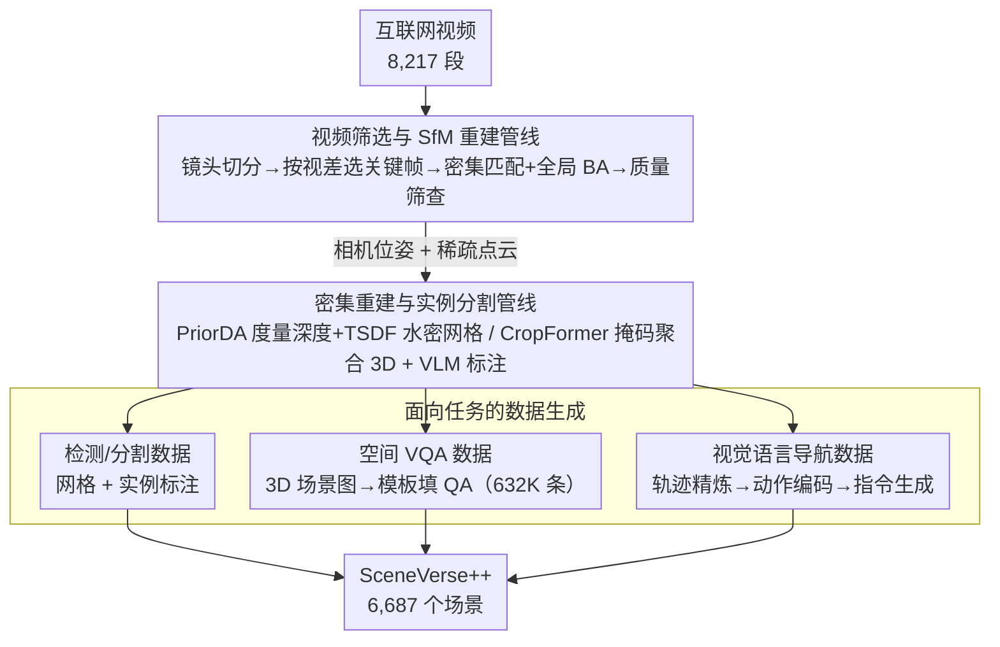

# Lifting Unlabeled Internet-level Data for 3D Scene Understanding

**会议**: CVPR 2026  
**arXiv**: [2604.01907](https://arxiv.org/abs/2604.01907)  
**代码**: [项目页面](https://sv-pp.github.io/)  
**领域**: 3D视觉  
**关键词**: 3D场景理解, 互联网视频, 自动数据引擎, 视觉语言导航, 空间推理

## 一句话总结

构建SceneVerse++，通过自动化数据引擎从6,687个无标注互联网视频中生成3D场景理解训练数据，在3D目标检测（F1@.25提升20.6）、空间VQA（+14.9%）和视觉语言导航（+14% SR）三个任务上展示了利用互联网级数据推进3D场景理解的可行性。

## 研究背景与动机

3D场景理解是人类和具身智能的关键能力，涵盖从几何感知（深度估计、目标检测）到语义理解（分割、视觉定位）再到高级推理（空间问答、导航）。深度学习在该领域的成功高度依赖大规模标注的真实3D数据集。

核心矛盾：与2D图像可以从网上轻松获取和标注不同，3D场景数据的采集和标注极其昂贵——需要专用硬件（RGB-D/LiDAR）、3D网格重建、人工密集语义标注。自ScanNet以来，学术界在3D数据规模上几乎没有量级飞跃。而互联网上存在海量未标注的视频数据，它们天然捕获了3D世界。

本文的切入角度：设计自动化数据引擎，将无标注的互联网视频转化为3D场景理解的训练数据。不同于以往将各子模块（重建、分割、语义标注）简单拼接的做法，本文系统分析了自动数据生成的瓶颈，提供了在不同感知粒度任务上规模化端到端模型的指导方针。核心idea：通过精心设计的数据引擎，互联网视频可以成为弥补3D标注数据稀缺、提升端到端模型能力的可行路径。

## 方法详解

### 整体框架

这篇论文想解决的是「3D 数据太贵、自 ScanNet 以来一直涨不上规模」的困境，办法是把互联网上海量的无标注视频自动「抬」成 3D 场景理解的训练数据。整条管线分三步走：先从原始视频里挑出可用片段、用运动恢复结构（SfM）算出相机位姿和稀疏点云；再把稀疏几何补成密集网格、并打上实例级分割与语义标签；最后针对检测/分割、空间 VQA、视觉语言导航（VLN）三类下游任务，各自把 3D 场景转写成对应的训练样本。整套引擎跑下来，8,217 个视频最终筛出 6,687 个可用场景，每个场景都带图像、相机位姿、密集重建、实例分割和高级推理标注。

### 关键设计

**1. 视频筛选与 SfM 重建管线：从噪声满满的网络视频里挖出可三角化的几何**

互联网视频里夹着大量户外、人像、镜头切换等对 3D 重建毫无帮助甚至有害的内容，直接喂给 SfM 只会得到一堆失败的三角化。管线先用 TransNetV2 做镜头切分、过滤掉低质量与非室内片段，关键的一步是**按视差而非均匀时间间隔选关键帧**——视差大才说明相机真的移动了、三角化才稳，均匀采样在静止段会塞进一堆冗余帧。选好帧后做密集像素匹配 + 全局 BA 解出位姿与稀疏点，最后用空间覆盖度和重投影误差等指标做质量筛查。针对长视频显存吃紧的问题，这里用优化过的伪轨迹像素来压内存，让长片段也能跑完整的全局优化。

**2. 密集重建与实例分割管线：在质量和速度之间挑一条能规模化的路**

拿到稀疏 SfM 结果后还要补成可用的密集 3D 场景，这里要在两条已有路线之间权衡：神经渲染（Neural Rendering）类方法重建质量高但每个场景都要单独优化、慢到没法上量；纯端到端前馈重建快，但长视频显存受限、几何还会漂。本文走的是**度量深度 + SfM 几何**的折中路：把 SfM 稀疏点投影回各帧得到稀疏深度先验，用 PriorDA 在此先验下预测密集的度量深度，再做 TSDF 融合生成水密网格。分割侧则用 CropFormer 出逐帧掩码，靠邻帧视图共识和空间一致性把 2D 掩码聚合进 3D，再让 VLM 给每个实例生成文本描述和语义标签。这套组合把单场景成本压到平均 71 秒重建 + 96 秒分割，是它敢在 6 千多个场景上跑的前提。

**3. 面向任务的数据生成：把同一个 3D 场景翻译成三种任务各自要的格式**

重建好的场景对不同下游任务意味着不同的监督形式。3D 检测和分割最直接，重建网格和实例标注本身就是标签；空间 VQA 则先从场景构建 3D 场景图，再用模板把物体的相对距离、方向、数量等关系填成 QA 对，一共生成 632K 条。最棘手的是 VLN：room-tour 视频是人随手逛房间的不规则轨迹，而 R2R 基准要的是「目标导向的最短路径 + 自然语言指令」，两者差距很大，没法直接拿来用。为此 VLN 走一条三阶段管线——先做轨迹预处理把自由漫游切成有起点终点的合理片段，再把每段几何运动编码成离散动作序列，最后由模型按动作序列生成导航指令。后面的消融会显示，正是这里的轨迹精炼和指令增强决定了 VLN 数据能不能用（原始轨迹直接训练 SR 只有 0.036）。

### 损失函数 / 训练策略

- 3D检测：SpatialLM基于MLLM，在SceneVerse++上预训练后在ScanNet上微调
- 3D分割：Mask3D在SceneVerse++上预训练+ScanNet微调
- 空间VQA：Qwen2.5-VL-3B/7B使用LoRA微调，训练202K数据
- VLN：LLaVA-Video作为基础模型，先在SceneVerse++预训练再在R2R微调

## 实验关键数据

### 主实验

| 数据集/任务 | 指标 | 本文(SceneVerse++) | 对比方法 | 提升 |
|--------|------|------|----------|------|
| ScanNet 3D检测 | F1@.25 (预训练+微调) | 58.6 | 38.0 (SpatialLM原始) | +20.6 |
| ScanNet 3D检测 | F1@.25 (零样本) | 30.9 | 29.0 (SpatialLM) | +1.9 |
| ARKitScenes 3D检测 | F1@.25 (零样本) | 35.8 | 35.1 (SpatialLM) | +0.7 |
| ScanNet 3D分割 | AP25 (预训练+微调) | 38.5 | 36.1 (从头训练) | +2.4 |
| VSI-Bench VQA (3B) | Avg Accuracy | 42.8 (SV++零样本) | 27.9 (基线) | +14.9 |
| VSI-Bench VQA (7B) | Avg Accuracy | 46.4 (SV++零样本) | 36.6 (基线) | +9.8 |
| R2R VLN | SR (预训练+微调) | 0.228 | 0.088 (仅R2R) | +0.14 |

### 消融实验

| 配置 | 关键指标 | 说明 |
|------|---------|------|
| 完整SceneVerse++预训练+R2R微调 | SR 0.228 | 最优策略 |
| 混合训练(R2R+SV++) | SR 0.188 | 直接混合不如先预训练再微调 |
| 去掉轨迹精炼(w/o TR) | SR 0.036→微调0.177 | 原始轨迹质量差，精炼很关键 |
| 去掉指令增强(w/o IE) | SR 0.022→微调0.074 | 语言多样性对性能影响巨大 |
| SV++零样本VQA(ARKit子集) | 48.0 (3B) | 与SN/SN++有标注训练(49.0)接近 |

### 关键发现

- 在3D检测上，SceneVerse++预训练提供的真实世界分布先验使微调收益巨大（F1@.25从38.0到58.6）
- 在3D分割上，Mask3D因依赖特定管线的图分割结果，对域迁移敏感，SceneVerse++零样本效果不佳但微调后仍有提升
- 空间VQA中SceneVerse++在通用空间知识（相对距离、相对方向）上改进最大，在域特定知识（物体数量、房间大小）上较弱——反映了域差距
- VLN中轨迹精炼和指令增强两个数据质量因素对性能至关重要，原始互联网视频不能直接用
- 存在明确的过拟合转折点：训练初期所有评估指标均提升，之后域内数据继续涨而域外数据趋于饱和或下降

## 亮点与洞察

- 系统性地分析了互联网视频到3D场景理解的全链路瓶颈，而非简单拼凑子模块
- 覆盖从低级感知（检测/分割）到高级推理（VQA/VLN）三个代表性任务，验证全面
- 数据规模可观：6,687场景超过ARKitScenes，平均每场景49个目标、21个类别
- 对模型可扩展性的深入讨论很有价值：依赖预计算分割的模型(Mask3D)比直接操作原始模态的模型(SpatialLM)更难扩展

## 局限与展望

- 依赖多个子模块（SfM、深度估计、分割、VLM标注）组合，各模块的误差会级联传播
- 视频筛选中仍需少量人工标注（<10秒/场景）来保证数据质量
- 3D分割任务展示了域特定偏差对模型扩展的限制——需要更鲁棒的模型架构
- 互联网视频主要是室内room-tour类型，对室外/动态场景的覆盖有限
- 自动数据生成管线中各子模块多在小规模任务特定基准上训练，泛化能力有限

## 相关工作与启发

- **vs ScanNet/ScanNet++**: 人工采集的高质量3D数据集，但规模受限（ScanNet ~1.5k场景）；SceneVerse++通过自动化从互联网获取6.7k场景，数据量级更大但质量需要权衡
- **vs RoomTour3D/NaVILA**: 同样利用互联网视频，但局限于导航单一任务；SceneVerse++覆盖检测/分割/VQA/VLN全面任务
- **vs Miao et al.**: 使用2D单视图数据集+估计深度生成3D标注，但受限于已有2D数据集且只能做单帧级处理
- **启发**: 子模块开发应以"支持鲁棒的野外3D理解"为目标，不仅评估任务特定性能，还要衡量对自动化数据生成管线的贡献

## 评分

- 新颖性: ⭐⭐⭐⭐ 系统性利用互联网视频进行全面3D场景理解的思路有创新，对瓶颈的分析有深度
- 实验充分度: ⭐⭐⭐⭐⭐ 三个任务、多种训练策略对比、详细消融和训练动态分析
- 写作质量: ⭐⭐⭐⭐ 层次清晰，讨论深入，对数据引擎的局限性有坦诚分析
- 价值: ⭐⭐⭐⭐⭐ 为3D场景理解的数据扩展提供了系统性路线图和实践指南

<!-- RELATED:START -->

## 相关论文

- [\[CVPR 2026\] Masking Matters: Unlocking the Spatial Reasoning Capabilities of LLMs for 3D Scene-Language Understanding](masking_matters_unlocking_the_spatial_reasoning_capabilities_of_llms_for_3d_scen.md)
- [\[CVPR 2026\] Fast SceneScript: Fast and Accurate Language-Based 3D Scene Understanding via Multi-Token Prediction](fast_scenescript_fast_and_accurate_language-based_3d_scene_understanding_via_mul.md)
- [\[CVPR 2026\] PointTPA: Dynamic Network Parameter Adaptation for 3D Scene Understanding](pointtpa_dynamic_network_parameter_adaptation_for_3d_scene_understanding.md)
- [\[ICCV 2025\] Towards Scalable Spatial Intelligence via 2D-to-3D Data Lifting](../../ICCV2025/3d_vision/towards_scalable_spatial_intelligence_via_2d-to-3d_data_lifting.md)
- [\[CVPR 2026\] EmbodiedSplat: Online Feed-Forward Semantic 3DGS for Open-Vocabulary 3D Scene Understanding](embodiedsplat_online_feed-forward_semantic_3dgs_for_open-vocabulary_3d_scene_und.md)

<!-- RELATED:END -->
