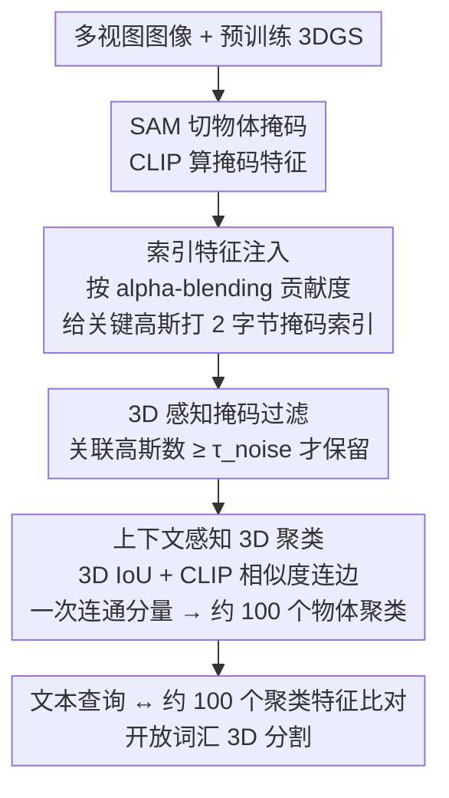

# LightSplat: Fast and Memory-Efficient Open-Vocabulary 3D Scene Understanding in Five Seconds

**会议**: CVPR 2026  
**arXiv**: [2603.24146](https://arxiv.org/abs/2603.24146)  
**代码**: [项目页面](https://vision3d-lab.github.io/lightsplat/)  
**领域**: 3D视觉 / 场景理解  
**关键词**: 开放词汇3D场景理解, 3D高斯溅射, 语义索引注入, 无训练框架, 聚类推理

## 一句话总结

LightSplat 提出了一种快速且内存高效的无训练框架，通过为3D高斯分配紧凑的2字节语义索引（而非高维CLIP特征），配合轻量级索引-特征映射和单步3D聚类，实现了比现有SOTA快50-400倍、内存降低64倍的开放词汇3D场景理解。

## 研究背景与动机

开放词汇3D场景理解旨在通过自然语言查询在3D环境中分割任意类别的物体，在机器人、3D编辑、AR/VR等领域有广泛应用。现有方法主要基于3D高斯溅射(3DGS)将2D语义蒸馏到3D场景中，但面临三个核心瓶颈：

1. **计算代价高**：特征蒸馏被迭代优化所阻塞，需要反复将渲染视图与CLIP嵌入对齐（如LangSplat需100分钟）
2. **内存开销大**：为每个高斯存储高维语言特征导致冗余存储和过多的逐高斯比较（每个高斯需4×512字节）
3. **语义退化**：当高斯投影回2D时特征模糊，间接监督与3D几何不对齐

核心矛盾：2D语义到3D的映射本可通过直接索引实现，但现有方法不必要地依赖迭代优化和密集特征存储。本文的关键洞察是：**物体语义可以通过紧凑的掩码索引直接从2D提升到3D，无需逐高斯特征存储和迭代训练**。

## 方法详解

### 整体框架

LightSplat 要回答的问题是：在已有一个训练好的 3DGS 场景后，怎样用最低的时间和内存成本，让人能用自然语言查询其中的任意物体。它的核心取舍是放弃"给每个高斯都存一份语言特征再迭代优化"的主流做法，改走一条几乎全是确定性单步操作的路线。

整条流程是这样转的：先对每张视图用 SAM 切出物体掩码、用 CLIP 给每个掩码算一份特征；接着把这些 2D 掩码的归属"投射"回 3D——根据每个高斯对掩码渲染的贡献度，只给真正参与成像的关键高斯打上一个 2 字节的掩码索引，而不是塞进 512 维特征；然后做一轮 3D 感知的掩码过滤，把缺乏几何支撑的噪声掩码剔掉；再按掩码之间的 3D 重叠和语义相似度连边、做一次连通分量分析，把成千上万个高斯收敛成约 100 个物体级聚类；最后推理时只需把查询文本和这约 100 个聚类特征比一比，而不是去和十万级的高斯逐个比对。

### 关键设计

**1. 索引特征注入：用 2 字节索引替代逐高斯的高维特征**

主流方法慢且占内存的根因，是它们把语言特征当成"要存进每个高斯、再靠渲染对齐反复优化"的东西。LightSplat 换了个思路：每个 2D SAM 掩码本来就有唯一身份，那就给它一个整数索引，让高斯只记"我属于哪个掩码"，特征本体单独存在一张索引-特征映射表里。具体落地时，先用 alpha-blending 的权重衡量每个高斯对某层掩码的渲染贡献

$$w_n^{(l)}(u,v) = \alpha_n \cdot T_n^{(l)}(u,v)$$

只有贡献超过阈值 $\tau_{\text{contrib}}$ 的高斯才会被打上对应的 2 字节掩码索引，视觉上无关的高斯不参与，避免把语义糊到背景上。这样一来，每个高斯从存 4×512 字节的 CLIP 特征降到只存 2 字节索引，单看存储是约 1024 倍的压缩，而语义并没有丢——它只是搬到了映射表里，用一次查表就能取回。

**2. 3D 感知掩码过滤：剔除没有几何支撑的噪声掩码**

SAM 在单视图里切出来的掩码并不都靠谱，有些只是某个视角下的伪影，硬把它们提升到 3D 反而会污染语义。LightSplat 利用上一步建立的 2D-3D 对应关系来判断一个掩码值不值得信：看它实际关联了多少个高斯。过滤规则很直接，

$$\mathcal{M}_{\text{filtered}} = \{m_k \mid |\mathcal{G}_k| \geq \tau_{\text{noise}}\}$$

即只保留关联高斯数量超过 $\tau_{\text{noise}}$ 的掩码，关联高斯太少的掩码（往往是视角相关的碎片）被丢弃。这一步把"哪些 2D 观测有稳定 3D 结构撑腰"作为可靠性的代理，从而提升多视图之间的语义一致性。

**3. 上下文感知 3D 聚类：一次连通分量分析收敛到物体级**

即便过滤后，同一个物体仍会被不同视角的多个掩码、大量高斯重复表示，直接拿来推理既慢又不一致。LightSplat 把这一步建模成图问题：构造无向图 $G=(V,E)$，节点是过滤后的掩码，当两个掩码对应的 3D 高斯集合 IoU 超过 $\tau_{\text{IoU}}$、且它们的 CLIP 特征余弦相似度超过 $\tau_{\text{feat}}$ 时就连一条边——几何上重叠、语义上又相近，说明它们多半指向同一个物体。然后只做**一次**连通分量分析就把所有掩码切成若干 3D 聚类，每个聚类的特征取其成员掩码 CLIP 特征的平均。和 LUDVIG 那类需要反复迭代的图扩散相比，这里单步就收敛，推理面对的对象数量从十万级高斯直接塌缩到约 100 个聚类，这也是推理时间能从秒级降到 0.1 秒的直接原因。

### 损失函数 / 训练策略

无训练方法，无需任何优化过程。所有步骤（索引注入、掩码过滤、图构建、聚类）均为确定性的单步操作。

## 实验关键数据

### 主实验

**LERF-OVS 3D物体选择**:

| 方法 | Mean mIoU | Mean mAcc@0.25 | 蒸馏时间 |
|------|-----------|----------------|----------|
| LangSplat | 7.66 | 9.37 | 100 min |
| OpenGaussian | 42.15 | 56.22 | 50 min |
| Dr.Splat | 43.58 | 63.87 | 4 min |
| **LightSplat** | **47.58** | **68.32** | **4.2 s** |

**DL3DV-OVS**:

| 方法 | Mean mIoU | Mean mAcc@0.25 | 蒸馏时间 |
|------|-----------|----------------|----------|
| LUDVIG | 29.21 | 56.89 | 12 min |
| **LightSplat** | **44.98** | **60.82** | **4.8 s** |

**ScanNet 语义分割 (19类)**:

| 方法 | mIoU | mAcc | 蒸馏时间 | 推理时间 | 内存/高斯 |
|------|------|------|----------|----------|-----------|
| Dr.Splat | 6.69 | 15.76 | 4 min | 8.1 s | 128 byte |
| **LightSplat** | **13.69** | **23.01** | **5 s** | **0.1 s** | **2 byte** |

### 消融实验

| 配置 | Mean mIoU | 说明 |
|------|-----------|------|
| 无掩码过滤 | 44.73 | 噪声掩码降低语义质量 |
| 无3D聚类 | 44.56 | 缺乏物体级别一致性 |
| 完整模型 | 47.58 | 过滤+聚类双管齐下最优 |

### 关键发现

- LightSplat在LERF-OVS上达到47.58 mIoU（SOTA），同时蒸馏时间仅4.2秒——比Dr.Splat快约57倍，比LangSplat快约1429倍
- 2字节索引 vs 128字节CLIP特征，实现64倍内存节省
- 推理时仅需与~100个聚类比较，ScanNet上推理时间从8.1秒降至0.1秒
- 在大规模室外场景(DL3DV-OVS)上优势更明显：mIoU从次优的29.21提升到44.98

## 亮点与洞察

- 核心洞察极为精炼：用2字节索引替代512维特征向量，通过间接映射保留完整语义信息，是一个令人拍案叫绝的简化设计
- 完全无训练的流程使其成为真正的即插即用方案，不需要GPU训练时间
- 单步聚类（连通分量分析）替代迭代优化，整个pipeline的每一步都追求简洁高效

## 局限与展望

- 依赖预训练3DGS的质量：如果3D重建本身存在伪影，索引注入也会受影响
- 阈值参数（$\tau_{\text{contrib}}, \tau_{\text{noise}}, \tau_{\text{IoU}}, \tau_{\text{feat}}$）需要调整，对不同场景的鲁棒性有待验证
- 对细粒度语义（如区分外观相似但语义不同的物体）的处理能力可能受限于CLIP特征本身
- 聚类粒度固定，可能无法适应需要多层次语义理解的场景

## 相关工作与启发

- **vs Dr.Splat**: Dr.Splat需迭代特征聚合+Product Quantization训练，LightSplat单步完成且性能更优
- **vs LUDVIG**: LUDVIG使用图扩散，计算开销更大，在DL3DV-OVS上mIoU被LightSplat大幅超越(29.21→44.98)
- **vs LangSplat/LEGaussians**: 这些方法通过渲染引导迭代特征优化，速度慢两个数量级且性能更差
- **启发**: "索引+映射表"的间接语义表示范式可推广到其他3D特征存储场景

## 评分

- 新颖性: ⭐⭐⭐⭐⭐ 用2字节索引替代高维特征的洞察极简却极有效，全面颠覆了"需要迭代优化"的假设
- 实验充分度: ⭐⭐⭐⭐ 覆盖三个数据集、多指标对比，但消融实验可更深入
- 写作质量: ⭐⭐⭐⭐ 方法动机清晰、流程图质量高，数学符号统一
- 价值: ⭐⭐⭐⭐⭐ 50-400×加速和64×内存节省具有巨大实用价值，可直接应用于实时AR/VR场景

<!-- RELATED:START -->

## 相关论文

- [\[CVPR 2026\] EmbodiedSplat: Online Feed-Forward Semantic 3DGS for Open-Vocabulary 3D Scene Understanding](embodiedsplat_online_feed-forward_semantic_3dgs_for_open-vocabulary_3d_scene_und.md)
- [\[CVPR 2026\] ExtrinSplat: Decoupling Geometry and Semantics for Open-Vocabulary Understanding in 3D Gaussian Splatting](extrinsplat_decoupling_geometry_and_semantics_for_open-vocabulary_understanding_.md)
- [\[CVPR 2026\] OnlinePG: Online Open-Vocabulary Panoptic Mapping with 3D Gaussian Splatting](onlinepg_online_open-vocabulary_panoptic_mapping_with_3d_gaussian_splatting.md)
- [\[CVPR 2026\] Fast SceneScript: Fast and Accurate Language-Based 3D Scene Understanding via Multi-Token Prediction](fast_scenescript_fast_and_accurate_language-based_3d_scene_understanding_via_mul.md)
- [\[AAAI 2026\] OpenScan: A Benchmark for Generalized Open-Vocabulary 3D Scene Understanding](../../AAAI2026/3d_vision/openscan_a_benchmark_for_generalized_open-vocabulary_3d_scene_understanding.md)

<!-- RELATED:END -->
