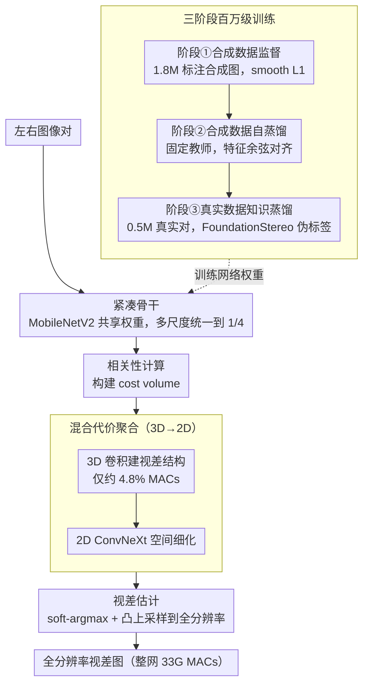

# Lite Any Stereo: Efficient Zero-Shot Stereo Matching

**会议**: CVPR 2026  
**arXiv**: [2511.16555](https://arxiv.org/abs/2511.16555)  
**代码**: [tomtomtommi/LiteAnyStereo](https://tomtomtommi.github.io/LiteAnyStereo/)  
**领域**: 3D视觉  
**关键词**: 立体匹配, 零样本泛化, 高效推理, 混合代价聚合, 知识蒸馏

## 一句话总结

提出Lite Any Stereo，通过混合2D-3D代价聚合模块和三阶段百万级数据训练策略（监督→自蒸馏→真实数据知识蒸馏），以不到SOTA精确方法1%的计算量（33G MACs），在四个real-world benchmark上ranking 1st，首次证明超轻量模型可具备强零样本泛化能力。

## 研究背景与动机

立体匹配领域存在**精度与效率的严重割裂**：

**领域现状**：当前立体匹配方法分两大阵营——精确方法（FoundationStereo、Selective-IGEV等）利用基础模型深度先验或大规模计算实现高精度但MACs高达数千G；高效方法（LightStereo、BANet等）追求实时推理但精度较低

**现有痛点**：高效方法大多只针对特定域（如KITTI）微调，缺乏零样本泛化能力；社区普遍认为轻量模型因容量有限，天然无法具备零样本能力

**核心矛盾**：efficiency vs. zero-shot generalization——社区默认这两者不可兼得

**关键gap**：虽然StereoAnything尝试用单目深度模型生成30M伪视差图来训练高效模型，但单目深度质量有限，高效模型仍远落后于精确方法

**切入角度**：作者认为问题不在模型容量本身，而在于(a)架构未充分利用2D和3D互补信息，(b)训练策略未利用现有大量无标注真实数据

**核心idea**：通过混合代价聚合+三阶段训练策略，让超轻量模型也能bridge sim-to-real gap，实现strong zero-shot generalization

## 方法详解

### 整体框架

前馈式网络，四阶段pipeline：共享权重特征提取（MobileNetV2骨干，多尺度特征统一到1/4分辨率）→ 相关性计算（构建cost volume $\mathbf{C}(d,h,w) = \frac{1}{N_c}\langle \mathbf{F}_L^{1/4}(h,w), \mathbf{F}_R^{1/4}(h,w-d) \rangle$）→ 混合3D-2D代价聚合 → 视差估计（soft-argmax + 凸上采样到全分辨率）。整体仅33G MACs。泛化能力不靠网络本身、而是靠一套与推理流程正交的三阶段百万级训练策略喂出来。

### 关键设计

**1. 紧凑骨干：用对的小网络，而不是更大更新的网络**

零样本立体匹配通常靠堆深度先验（DepthAnything）或大网络换精度，但这两条路都会把计算量推到数千 G MACs。本文反其道而行，直接拿 ImageNet 预训练的 MobileNetV2 当共享权重特征提取器，抽出 $\{1/4, 1/8, 1/16, 1/32\}$ 四个尺度的特征，再用残差上采样统一回 1/4 分辨率送进匹配。值得一提的是更新的 ConvNeXt v2 反而不一定更好：消融里它在 ETH3D 上略优（5.03 vs 5.39），却在 Middlebury 上更差（10.52 vs 10.89），整体看 MobileNetV2 的通道配置更契合立体匹配的需求。坚持不引入外部深度先验，正是把整网压到 33G MACs 的关键前提。

**2. 混合代价聚合：让少量 3D 卷积只负责"看懂视差结构"**

纯 2D 聚合会把视差维度直接折叠成通道，丢掉了视差方向上的结构连续性；纯 3D 聚合虽然保留了这个维度，却很贵，而且视差维度上很多层级其实贡献甚微。本文的做法是把两者串成 3D→2D：

$$\mathbf{C}_{agg} = \mathbf{G}_{2D}(\mathbf{G}_{3D}(\mathbf{C}))$$

先让多尺度 3D 卷积（kernel $(3,3,3)$）在跨视差方向上建立结构感知，这一步只占约 4.8% 的计算量；再交给 ConvNeXt 层做高效的 2D 空间细化。作者对照过四种集成顺序——并联 bilateral、2D→3D、3D→2D、交错 interleaved——3D→2D 全面最优（Tab.2a：ETH3D 5.39 对比纯 2D 的 6.48、bilateral 的 8.55），说明"先建视差结构、再做空间细化"才是对的信息流方向。3D 占比也不是越多越好：从 4.8% 加到 9.5%、15.6% 后 Middlebury 反而从 9.50 退到 10.06、10.34——在固定 MACs 预算下，3D 占多了就会挤掉 2D 细化的空间，得不偿失。

**3. 三阶段百万级训练：用合成数据打底、再用真实数据蒸出泛化**

架构再轻也跨不过 sim-to-real 的鸿沟，本文把泛化能力交给训练策略分三步逼出来。第一步是合成数据监督：在 1.8M 张标注合成图（SceneFlow 35K + FallingThings 30K + FSD 1.1M + CREStereo 0.2M + VKITTI2 21K + TartanAir 0.31M + Dynamic Replica 0.14M）上用 smooth L1 端到端训 150K 步，先把基础匹配能力立起来。第二步是合成数据上的自蒸馏：教师和学生同架构、都从第一步初始化，教师吃干净输入、学生吃强扰动输入，靠特征余弦对齐迫使学生学到域不变表示

$$\mathcal{L}_{feat} = 1 - \frac{1}{HW}\sum_{i=1}^{HW} \cos(F_i, F_i')$$

这里教师怎么更新很关键——对比固定权重、EMA、hard copy 学生权重三种方案，固定教师最好（K.12：3.64 vs 3.97 vs 4.22），稳定的锚点对容量有限的轻量学生更友好。第三步才真正打通真实域：收 0.5M 张无标注真实立体对（Flickr1024、InStereo2k、Holopix50K、DrivingStereo、SouthKenSV、UASOL），用冻结的 FoundationStereo 当教师生成伪标签微调 100K 步。这一步的教训是数据质量远比数量重要——像 Stereo4D（仅 512×512）、HRWSI（校正差）这类低质量数据塞进来反而拖累泛化，宁缺毋滥。

### 损失函数 / 训练策略

- Stage ①: $\mathcal{L}_{disp} = \text{smooth}_{L_1}(\mathbf{D} - \mathbf{D}_{gt})$
- Stage ②: $\mathcal{L}_{disp} + \mathcal{L}_{feat}$（特征余弦对齐）
- Stage ③: 伪标签 $\text{smooth}_{L_1}$ loss，不再做自蒸馏（对伪标签无额外增益）
- 训练配置：150K+50K+100K步，batch 176，A100 GPU，AdamW + one-cycle LR（峰值2e-4），裁剪256×512→微调320×736，$D_{max}=192$

## 实验关键数据

### 主实验（百万级数据零样本泛化）

| 数据集 | 指标 | Lite Any Stereo | 之前最佳高效方法 | 精确方法参考 | MACs |
|--------|------|----------------|-----------------|-------------|------|
| KITTI 2012 | D1 | **3.04** | 4.00 (StereoAnything-L) | 2.51 (FoundationStereo) | 33G vs 84G vs 12824G |
| KITTI 2015 | D1 | **3.87** | 4.81 (StereoAnything-L) | 2.83 (FoundationStereo) | 同上 |
| ETH3D | Bad 1.0 | **3.53** | 3.81 (StereoAnything-L) | 0.49 (FoundationStereo) | 同上 |
| Middlebury | Bad 2.0 | **7.51** | 9.82 (StereoAnything-L) | 1.12 (FoundationStereo) | 同上 |
| DrivingStereo天气 | D1 | **8.74** | - | 10.71 (FoundationStereo) | 33G vs 12824G |

注：在DrivingStereo天气子集上，Lite Any Stereo（33G MACs）甚至超越了计算量389倍的FoundationStereo教师模型！

### 消融实验

| 训练阶段消融 | K.12 | K.15 | ETH3D | Middlebury | 说明 |
|-------------|------|------|-------|------------|------|
| Stage ① only | 4.05 | 4.55 | 4.43 | 8.49 | 合成数据监督基线 |
| + Stage ② | 3.66 | 4.53 | 4.69 | 7.03 | 自蒸馏: K.12/Mid显著提升 |
| + Stage ③ | **3.04** | **3.87** | **3.53** | 7.51 | 真实数据蒸馏: K.12/ETH3D再提升 |

| 聚合方式 (Tab.2a) | K.12 | K.15 | ETH3D | Middlebury |
|-------------------|------|------|-------|------------|
| 纯2D | 5.02 | 5.01 | 6.48 | 11.29 |
| 3D→2D (默认) | 4.78 | 4.64 | 5.39 | 10.89 |
| bilateral并联 | 5.10 | 5.10 | 8.55 | 12.00 |
| interleaved | 4.61 | 4.73 | 6.20 | 11.34 |

### 关键发现

- 仅4.8%的3D计算占比就能带来显著视差结构感知——增加反而因MACs预算挤占导致性能下降
- 3D→2D串联优于所有其他混合方案，先建模视差结构再空间细化是正确的信息流方向
- 固定教师的自蒸馏优于EMA和hard copy——稳定锚点对轻量学生学习域不变特征更有效
- 训练策略具有**架构普适性**：同样策略应用于LightStereo-M和BANet-2D后也有一致提升
- 推理速度全面最快：GTX 1080 Ti上21ms、RTX 2080 Ti上19ms、RTX 3090上23ms、RTX 4090上17ms，且2K输入仅需2.5GB显存
- DrivingStereo天气子集上student超越teacher（8.74 vs 10.71），说明轻量模型+蒸馏可学到比大模型更鲁棒的表示

## 亮点与洞察

- **打破认知壁垒**：首次证明超轻量模型（<1% MACs）可以匹敌甚至超越精确方法的零样本性能，挑战了"轻量=弱泛化"的社区共识
- **混合聚合的极简主义**：仅4.8%的3D计算就捕获了关键的视差结构信息，说明3D卷积在视差维度上的作用是"画龙点睛"而非"大力出奇迹"
- **训练策略的通用价值**：三阶段策略对不同架构（LightStereo、BANet）都有效，可直接作为高效立体匹配的标准训练范式
- **student超越teacher**：DrivingStereo上轻量学生超越FoundationStereo教师，说明蒸馏+域特化可以让小模型在特定分布上优于大模型，这一现象值得深入研究

## 局限与展望

- **与先验方法差距**：未使用DepthAnything等深度先验，性能上限受限（ETH3D: 3.53 vs FoundationStereo 0.49）
- **伪标签瓶颈**：Stage③质量完全依赖FoundationStereo——教师在某些场景失败，学生也学不好
- **Middlebury室内场景**：室内数据规模有限，Stage③后Middlebury从7.03升至7.51，说明室内真实数据不足
- **固定最大视差**：$D_{max}=192$可能限制超大视差场景的应用
- **透明/反射物体**：作者承认这些挑战性场景仍需改进
- 未探索时序一致性，多帧stereo video可能进一步提升

## 相关工作与启发

- **vs LightStereo**：同为轻量级2D聚合方法（33G MACs），但LightStereo零样本泛化弱。Lite Any Stereo通过加入极少量3D聚合和三阶段训练，在K.12上从4.10降至3.04
- **vs StereoAnything**：也追求高效模型泛化，但依赖单目深度伪标签（30M样本），质量不如本文用FoundationStereo的立体伪标签。且StereoAnything-L需84G MACs，本文仅33G
- **vs FoundationStereo**：作为Stage③的教师模型。有趣的是学生在DrivingStereo天气上超越教师，说明蒸馏+轻量架构在特定分布上有独特优势
- **vs BANet**：同期high-efficiency方法（36G MACs），在SceneFlow-only设定下BANet零样本泛化极差（ETH3D: 44.89），但经过本文的三阶段训练策略后大幅提升至4.05

## 评分

- **新颖性**: ⭐⭐⭐⭐ 首次在极低计算量下实现SOTA零样本立体匹配，打破了"轻量=弱泛化"的刻板印象
- **实验充分度**: ⭐⭐⭐⭐⭐ 五个真实世界基准、多GPU推理时间对比、详尽消融、训练策略普适性验证
- **写作质量**: ⭐⭐⭐⭐ 结构清晰，图表丰富，消融系统有说服力
- **价值**: ⭐⭐⭐⭐⭐ 对立体匹配实际部署有直接推动，三阶段训练策略有广泛参考价值

<!-- RELATED:START -->

## 相关论文

- [\[CVPR 2026\] What Makes Good Synthetic Training Data for Zero-Shot Stereo Matching?](what_makes_good_synthetic_training_data_for_zero-shot_stereo_matching.md)
- [\[CVPR 2026\] PromptStereo: Zero-Shot Stereo Matching via Structure and Motion Prompts](promptstereo_zero-shot_stereo_matching_via_structure_and_motion_prompts.md)
- [\[CVPR 2026\] PIP-Stereo: Progressive Iterations Pruner for Iterative Optimization based Stereo Matching](pip-stereo_progressive_iterations_pruner_for_iterative_optimization_based_stereo.md)
- [\[ICCV 2025\] RobuSTereo: Robust Zero-Shot Stereo Matching under Adverse Weather](../../ICCV2025/3d_vision/robustereo_robust_zero-shot_stereo_matching_under_adverse_weather.md)
- [\[CVPR 2025\] FoundationStereo: Zero-Shot Stereo Matching](../../CVPR2025/3d_vision/foundationstereo_zero-shot_stereo_matching.md)

<!-- RELATED:END -->
