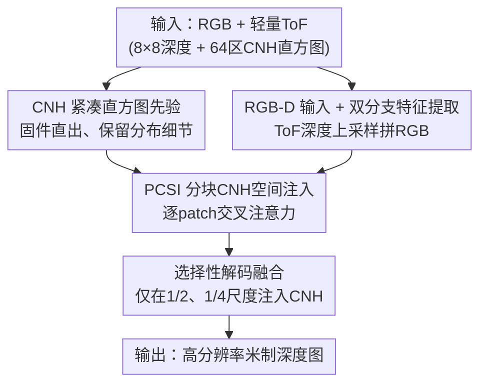

# LiteSense: Lifting Lightweight ToF with RGB for High-Resolution Metric Depth Estimation

**会议**: CVPR 2026  
**论文**: [CVF Open Access](https://openaccess.thecvf.com/content/CVPR2026/html/Li_LiteSense_Lifting_Lightweight_ToF_with_RGB_for_High-Resolution_Metric_Depth_CVPR_2026_paper.html)  
**代码**: 有（论文称源码与数据集开源于 GitHub，⚠️ 具体地址以原文为准）  
**领域**: 3D视觉  
**关键词**: 米制深度估计、RGB-ToF 融合、紧凑归一化直方图、轻量化网络、跨模态注意力

## 一句话总结
LiteSense 把多区 ToF 传感器输出的紧凑归一化直方图（CNH）和 RGB 图像在一个 U-Net 里做分块交叉注意力融合，用仅 5.5M 参数就在室内米制深度估计上逼近大模型 SOTA，并大幅超越同类 RGB-ToF 方法 DELTAR。

## 研究背景与动机
**领域现状**：米制深度估计要从图像恢复带绝对尺度、高分辨率、跨场景一致的深度。主流路线有两条——纯视觉单目模型（MiDaS、ZoeDepth、Metric3D、Depth Anything）靠海量数据拿到强泛化，主动传感器（LiDAR、结构光、ToF）靠物理测距拿到绝对尺度。

**现有痛点**：单目模型缺显式米制监督，难稳定恢复绝对尺度，而且动辄上百 M 参数、上千 GFLOPs，边缘部署吃力；轻量 ToF 传感器（如 VL53L8CH）虽便宜，但分辨率极低（8×8），单独无法重建稠密几何。把二者融合是自然思路，但已有方案（用稀疏 LiDAR 当 prompt，或像 DELTAR 那样融合 ToF 深度+方差图）计算开销大，且因分辨率悬殊导致细节丢失。

**核心矛盾**：绝对尺度先验（来自低分辨率 ToF）和高分辨率纹理（来自 RGB）之间存在分辨率鸿沟——直接把 8×8 深度上采样去对齐高分辨率 RGB，要么细节糊掉，要么全局注意力把不相关区域的深度分布串扰到一起。

**本文目标**：在严格的轻量预算下，既保住绝对尺度又恢复高分辨率细节，做到边缘设备可实时部署。

**切入角度**：作者注意到新一代多区 ToF 传感器直接在固件里输出 CNH——每个分区一条归一化的回波直方图，紧凑却完整保留了该区内的深度分布，比 DELTAR 用「均值+方差近似单高斯再采样」保留了多得多的分布细节。

**核心 idea**：把 ToF 的「深度值」和「CNH 分布」分开表示——深度值上采样后拼进 RGB 当尺度先验，CNH 分布则通过一个分块交叉注意力模块（PCSI）只在对应空间区域内注入，避免跨区串扰，从而用极小的网络完成高分辨率米制深度估计。

## 方法详解

### 整体框架
LiteSense 是一个 U-Net 风格编码-解码网络，输入是 RGB 图、低分辨率 ToF 深度、以及 64 个分区的 CNH 直方图，输出相机与 ToF 共视区域内的高分辨率米制深度图。流程上分四步：先把上采样后的 ToF 深度和 RGB 拼成 RGB-D 输入提供粗尺度先验；再用双分支（空间分支 + 直方图分支）分别提取 RGB-D 特征和 CNH 分布特征；接着用 PCSI 模块在每个局部 patch 内把 CNH 注入 RGB-D 特征；最后多级解码器渐进上采样重建稠密深度，且只在中间尺度做 CNH 融合以避免分块伪影。

### 关键设计

**1. CNH 紧凑归一化直方图作为辅助先验：用固件直出的分布替代被压缩的高斯采样**

这一设计针对的痛点是「怎么把 ToF 测量榨干」。DELTAR 用每区深度的均值和方差近似一个单高斯，再固定采样若干离散深度值——这一步丢掉了原始分布里大量细节。LiteSense 转而直接用 CNH：每个分区给出一条 18-bin 的归一化回波直方图，覆盖 0~5.4 m（有效约 4.0 m），描述「不同距离上的光子返回计数」，把区内深度分布紧凑但完整地保留下来。作者强调，像「深度加权直方图聚合」或「高斯混合拟合」这类直觉做法都会破坏原始信号的物理可解释性，因此选择把深度值与 CNH 分布**分开表示**：深度走 RGB-D 通道提供尺度，CNH 走独立分支提供互补的结构指引。消融里 CNH 显著优于「深度独入」和「DELTAR 式采样分布」，证明这条原生分布确实是精度关键。

**2. RGB-D 输入 + 双分支混合特征提取：把绝对尺度灌进通道，把分布编进高维**

低分辨率 ToF 深度先被上采样并与 RGB 拼成 RGB-D 输入，让深度通道提供一个初始的全局尺度先验。空间分支（Spatial Block）采用裁剪改造的 MobileNetV4-Small，四个下采样块在 1/2、1/4、1/8、1/16 四个尺度上提取多尺度特征，兼顾 RGB 纹理与 ToF 尺度；直方图分支（Histogram Block）先把每个分区的 CNH 单独归一化（保证每条直方图只反映本区内的相对分布），再用不下采样的 MLP 编码器编码——全程不下采样是为了保住 64 条分布各自的原始结构，从而捕捉跨区的细微深度差异。把深度当通道注入这一选择本身也被消融证明优于「只把 ToF 深度当特征融合」。

**3. PCSI 分块 CNH 空间注入：用局部交叉注意力杜绝跨区串扰**

CNH 各分区之间在物理上没有相关性，若做全局交叉注意力，空间不相关的区域会互相干扰。PCSI（Patch-wise CNH Spatial Injection）借鉴 tile-based 超分思路，把编码后的 RGB-D 特征图 $F\in\mathbb{R}^{H\times W\times C_I}$ 和 CNH 嵌入 $H\in\mathbb{R}^{N^2\times C_H}$ 都均匀切成 $N\times N$ 个不重叠 patch（$N^2=64$，与 ToF 分区一一对齐），各自经 $1\times1$ 卷积投到统一维度。每个 patch $F_i$ 只与其对应的 CNH 特征 $H_i$ 做局部调制 $\tilde{F}_i=\phi(F_i,H_i)$，其中 $\phi(\cdot)$ 实例化为交叉注意力：RGB-D 特征作 Query，CNH 特征作 Key/Value，让每个区域只被自己那条 CNH 分布引导。注入后各 patch 再拼回原布局送入解码器。这种「区域内独立调制」既消除了全局注意力的跨区干扰，又让每个区域能在自己的 CNH 先验下学到细粒度深度分布。

**4. 选择性解码融合：只在中间尺度注入 CNH，规避分块边界伪影**

解码器是 U-Net 式渐进上采样，但 CNH 增强表示**只在 1/2 和 1/4 两个尺度**融合，更深、更低分辨率的阶段只用原始 RGB-D 特征。动机有二：其一，PCSI 要把特征图切成 64 个 patch 与 ToF 分区对齐，patch 不能太小才能与对应 CNH 有意义地交互，1/2、1/4 分辨率对应的 patch 恰是仍保留有效局部结构的最小粒度；其二，若每个阶段都做分块融合，重复的 patch 划分会在最终深度图里引入明显的块边界伪影，限制在中间尺度可维持全局空间连续性。

### 损失函数 / 训练策略
总损失为尺度不变对数损失与梯度 MAE 之和：$L=L_{\text{SILog}}+L_{\text{Grad}}$。SILog 采用缩放变体 $L_{\text{SILog}}=\alpha\sqrt{\frac{1}{T}\sum_i g_i^2+\lambda(\frac{1}{T}\sum_i g_i)^2}$，残差 $g_i=\log(d_i)-\log(d_{gt,i})$，默认 $\lambda=0.85,\ \alpha=10$；梯度项 $L_{\text{Grad}}=\frac{1}{HW}\sum_{i,j}|\nabla d_{i,j}-\nabla d_{gt,i,j}|$ 强调深度边界细节。训练用 AdamW（初始 lr 0.001、weight decay 0.01），warm-up + 余弦退火，单张 RTX 3090，输入 416×416，batch 32，50 epoch，无预训练。

## 实验关键数据

**自定义/关键指标说明**：AbsRel 为绝对相对误差，RMSE 为均方根误差（米），$\delta_i$ 为阈值精度——满足 $\max(\hat{d}/d,\ d/\hat{d})<1.25^i$ 的像素占比（越高越好）；#Params、#FLOPs 衡量轻量化程度。

### 主实验
NYUv2 上与单目米制深度（MMDE）和辅助引导方法对比（FLOPs 在 416×416 下统计）：

| 方法 | 类别 | δ1 ↑ | RMSE ↓(m) | AbsRel ↓ | #Params ↓(M) | #FLOPs ↓(G) |
|------|------|------|-----------|----------|--------------|-------------|
| HybridDepth | MMDE（SOTA） | 0.989 | 0.128 | 0.026 | 59.15 | 377.82 |
| Metric3D-V2-L | MMDE | 0.989 | 0.183 | 0.047 | 302.91 | 548.05 |
| DA-V2-S | MMDE | 0.961 | 0.228 | 0.063 | 24.18 | 82.61 |
| DELTAR | 辅助引导（RGB-ToF） | 0.952 | 0.311 | 0.064 | 18.55 | 79.98 |
| **LiteSense（本文）** | 辅助引导 | **0.982** | **0.197** | **0.029** | **5.48** | **33.87** |

要点：相比同类 RGB-ToF 方法 DELTAR，δ1 从 0.952→0.982、AbsRel 从 0.064→0.029，参数量仅 5.48M（约为 DELTAR 的 30%，省约 70%）、FLOPs 33.87G 也最低；与大模型 SOTA HybridDepth 的差距很小（δ1 差 <8%、AbsRel 差 <12%），却用了零头规模的算力。

零样本泛化（NYUv2 训练，直接测 SUN RGB-D，无微调）：

| 方法 | δ1 ↑ | RMSE ↓(m) | AbsRel ↓ |
|------|------|-----------|----------|
| ZoeDepth | 0.918 | 0.402 | 0.105 |
| Metric3D-V2-L | 0.962 | 0.410 | 0.107 |
| DELTAR | 0.950 | 0.367 | 0.063 |
| **LiteSense（本文）** | **0.980** | **0.228** | **0.032** |

LiteSense 在未见室内场景上仍取得最高精度，验证 ToF 尺度先验对跨场景泛化的价值。作者还在自建真实数据集 THDR3K 上验证：模拟输入下 δ1 0.959，微调到真实数据后 0.914，整体优于 DELTAR（0.907）。

### 消融实验
NYUv2 上逐组件消融（均以 RGB-only 为基线）：

| ToF 深度 | CNH 直方图 | PCSI | δ1 ↑ | RMSE ↓(m) | AbsRel ↓ | 说明 |
|----------|-----------|------|------|-----------|----------|------|
| — | — | — | 0.663 | 0.718 | 0.216 | RGB-only 基线 |
| 特征融合 | — | — | 0.891 | 0.449 | 0.099 | ToF 深度当特征 |
| 通道拼接 | — | — | 0.926 | 0.359 | 0.080 | ToF 深度当通道（更优） |
| — | CNH | — | 0.948 | 0.352 | 0.056 | 仅 CNH 即超深度 |
| 通道拼接 | CNH | — | 0.962 | 0.290 | 0.046 | 深度+CNH，全局注意力 |
| 通道拼接 | CNH | ✓ | **0.982** | **0.197** | **0.029** | 完整模型 |

### 关键发现
- CNH 是精度主力：单独加 CNH（δ1 0.948）就超过单独加 ToF 深度（0.891/0.926），说明原生分布比离散深度值信息量大得多。
- 「深度当通道」优于「深度当特征」：把上采样 ToF 深度直接拼成 RGB-D 通道（0.926）比当作旁路特征融合（0.891）更能利用 ToF 的空间线索。
- PCSI 不可或缺：把局部分块注入换成全局交叉注意力后明显掉点（0.962→0.982 的逆向看，去掉 PCSI 即退到 0.962），证明杜绝跨区串扰是高分辨率细节的关键。
- 部署实测：480×480 输入下 GPU(RTX-3060) 约 15 ms、CPU(i5-12400F) 约 160 ms、NPU(RK3576) 约 570 ms（未量化），跨异构设备均近实时。

## 亮点与洞察
- 「分别表示深度值与 CNH 分布」是全文最巧的取舍：深度走通道给尺度、分布走分支给结构，避免了高斯拟合/加权聚合破坏物理可解释性——这种「不强行统一表示」的思路可迁移到其他多模态传感融合。
- PCSI 把 tile-based 超分的「分块对齐」迁到跨模态注意力上，用空间对齐的先验天然限定注意力范围，比加正则约束全局注意力更直接，值得借鉴到任何「分区传感器 + 稠密图像」的场景。
- 「只在中间尺度融合」体现了对分块伪影的工程洞察：融合粒度和分块伪影之间有 trade-off，作者用分辨率位置而非额外去伪影模块来解决，省参数。
- 用 5.48M 参数逼近 300M 级 SOTA，说明在有强物理先验（ToF）时，模型容量可以大幅压缩——对边缘部署是很实在的启发。

## 局限与展望
- 作者承认：对极小物体的边界估计偏弱（图示中小物体轮廓略糊），ToF 辅助主要改善的是全局尺度一致性而非细节锐度。
- 精度在 >3.5 m 后下降，因为接近该 ToF 传感器（有效约 4.0 m）的工作上限——方法对 ToF 量程依赖较强，户外或大场景适用性存疑。⚠️
- 真实数据上模拟输入与真实 CNH 分布差异大，必须先微调才能用，说明 sim-to-real 仍有缺口；THDR3K 仅 2738 对样本、16 室内场景，规模有限。
- 可改进方向：把 CNH 分布建模成可学习的连续表示而非定 bin 直方图，或引入边界细化分支补小物体细节。

## 相关工作与启发
- **vs DELTAR**：同样融合多区 ToF 与 RGB，但 DELTAR 用均值/方差近似单高斯再采样，丢分布细节且模型不够轻；LiteSense 用原生 CNH + 分块注入，精度全面更高（δ1 0.952→0.982）且参数省约 70%。
- **vs 单目大模型（Metric3D/Depth Anything/HybridDepth）**：它们靠百万到千万级预训练数据拿泛化，参数 300M+；LiteSense 不预训练、靠 ToF 物理先验，用 5.48M 就逼近其精度，部署友好。
- **vs LiDAR-prompt 方法（PriorDA 等）**：LiDAR 给稀疏离散点，轻量 ToF 给低分辨率但空间连续的深度图，后者更适合上采样拼通道；PriorDA 对低分辨率 ToF 利用不足，明显逊于本文。

## 评分
- 新颖性: ⭐⭐⭐⭐ 首次把 CNH 引入深度估计并设计 PCSI 分块注入，思路清晰但属「新传感器特性 + 成熟模块」的组合创新。
- 实验充分度: ⭐⭐⭐⭐ NYUv2/SUN RGB-D/自建 THDR3K 三套数据 + 完整逐组件消融 + 多硬件部署实测，较扎实；真实数据集规模偏小。
- 写作质量: ⭐⭐⭐⭐ 动机推导和模块设计讲得透，图示丰富，公式清楚。
- 价值: ⭐⭐⭐⭐ 轻量 + 米制 + 可部署，对边缘 3D 感知很实用，且开源数据集填补 RGB-ToF-CNH 空白。

<!-- RELATED:START -->

## 相关论文

- [\[CVPR 2026\] MD2E: Modeling Depth-to-Edge Cues for Monocular Metric Depth Estimation](md2e_modeling_depth-to-edge_cues_for_monocular_metric_depth_estimation.md)
- [\[CVPR 2026\] Radar-Guided Polynomial Fitting for Metric Depth Estimation](radar-guided_polynomial_fitting_for_metric_depth_estimation.md)
- [\[CVPR 2026\] UniDAC: Universal Metric Depth Estimation for Any Camera](unidac_universal_metric_depth_estimation_for_any_camera.md)
- [\[CVPR 2026\] The Midas Touch for Metric Depth](the_midas_touch_for_metric_depth.md)
- [\[CVPR 2026\] Modeling Spatiotemporal Neural Frames for High Resolution Brain Dynamics](modeling_spatiotemporal_neural_frames_for_high_resolution_brain_dynamic.md)

<!-- RELATED:END -->
