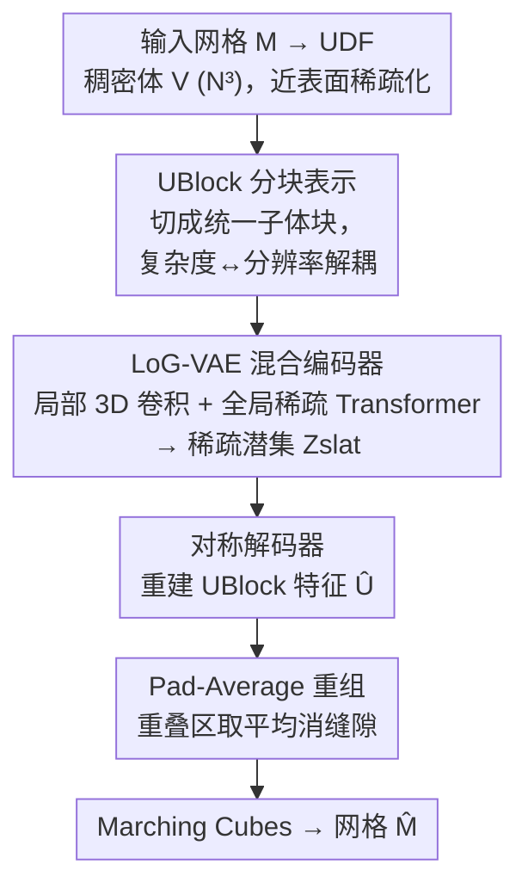

# LoG3D: Ultra-High-Resolution 3D Shape Modeling via Local-to-Global Partitioning

**会议**: CVPR 2026  
**论文**: [CVF Open Access](https://openaccess.thecvf.com/content/CVPR2026/html/Yang_LoG3D_Ultra-High-Resolution_3D_Shape_Modeling_via_Local-to-Global_Partitioning_CVPR_2026_paper.html)  
**代码**: 待确认  
**领域**: 3D视觉 / 三维生成  
**关键词**: 无符号距离场UDF、3D VAE、局部到全局、超高分辨率重建、稀疏Transformer

## 一句话总结
LoG3D 把高分辨率无符号距离场（UDF）切成统一的子体素块 UBlock，用"局部 3D 卷积 + 全局稀疏 Transformer"的混合 VAE 分块编解码，再用 Pad-Average 策略消除块边界缝隙，从而把 3D VAE 的可重建分辨率首次推到 $2048^3$，在重建精度和生成质量上都达到 SOTA。

## 研究背景与动机

**领域现状**：3D 生成 AI 进展迅速，但高保真 3D 内容生成远比 2D 难。主流方法在多种表示间权衡：点云、网格、3DGS、隐式场。隐式场里的有符号距离场（SDF）最擅长建模连续表面，是当下主导范式。

**现有痛点**：SDF 依赖"内/外符号一致"，必须先把输入网格做**昂贵且有损的 watertight（水密化）预处理**，这一步丢掉几何细节，且对开放表面、非流形几何（如开口曲面、复杂内部结构）根本失效。点云虽绕开了水密约束，但作为离散表示对采样密度敏感，重建出的表面常有空洞和不连续。

**核心矛盾**：更深层的问题在 VAE 架构本身——稀疏体素类模型普遍用"激进的压缩—解压"流水线：把整个输入下采样成一个全局潜变量再上采样重建。这种**全局瓶颈（global-bottleneck）设计天然会丢高频几何细节**，而高频细节恰恰是保真度的命脉。此外 VecSet 类 VAE 还存在"模态错配"：把离散局部点特征压成全局潜集合，又要解码回连续局部场，逼着注意力机制同时背"语义抽象"和"模态转换"两副担子。

**本文目标**：找一种表示和架构，既能处理任意拓扑（开放/非流形），又能在不丢高频细节的前提下把可重建分辨率推到超高（$2048^3$）。

**切入角度**：作者转向**无符号距离场（UDF）**作为核心表示——它绕过 SDF 易错的符号计算，对噪声和真实数据缺陷天然鲁棒，拓扑无关，能忠实表示 SDF 无法处理的非流形几何，且作为连续场比离散点云更契合神经网络。

**核心 idea**：用"局部到全局（Local-to-Global, LoG）"架构替代全局瓶颈——先把高分辨率 UDF 切成固定大小的 UBlock，用轻量 3D CNN 在每块内保住局部细节，再用稀疏 Transformer 建模块间长程依赖保证全局一致，由此**把模型复杂度与输入分辨率解耦**，实现前所未有的可扩展性。

## 方法详解

### 整体框架
LoG-VAE 是一个面向超高分辨率 3D 形状建模的局部到全局变分自编码器，全程作用在 UDF 上。给定三角网格 $\mathcal{M}$，流程是：先转成 UDF 并离散成稠密体 $V\in\mathbb{R}^{N\times N\times N}$ → 按距离阈值 $\tau$ 保留近表面体素得到稀疏表示 → **Partition** 切成统一网格的带 padding 子体块 UBlock → 混合编码器 $\mathbf{E}$（局部 3D 卷积 + 全局稀疏 Transformer）映射成稀疏潜向量集 $\mathcal{Z}_{slat}$ → 对称解码器 $\mathbf{D}$ 重建出 $\hat{\mathcal{U}}$ → 用 **Pad-Average** 把重叠块重组回完整 UDF 体 → Marching Cubes 提取最终网格 $\hat{\mathcal{M}}$。整网在 UDF loss 监督下训练。

### 关键设计

**1. UBlock 分块表示：把模型复杂度从输入分辨率上解耦出来**

这是全文基石，直接针对"全局瓶颈丢高频细节"的痛点。先把网格转 UDF 离散成稠密体 $V\in\mathbb{R}^{N\times N\times N}$，再做稀疏化只保留近表面体素：$\mathcal{V}_{sparse}=\{(\mathbf{x}_i,u(\mathbf{x}_i))\mid u(\mathbf{x}_i)<\tau\}$，取 $\tau=4/N$，其余距离值截断到 $5/N$，整体 min-max 归一化到 $[0,1]$。然后把稠密体切成 $D\times D\times D$ 的子体网格 UBlock，子块分辨率 $D$ 由划分因子 $s$ 决定（$D=N/s$），只选含稀疏体素的 $L$ 个"活跃"块：$\mathcal{U}=\{(\mathbf{f}_i,\mathbf{p}_i)\}_{i=1}^L$，其中 $\mathbf{f}_i\in\mathbb{R}^{D\times D\times D}$ 是该块归一化 UDF 值，$\mathbf{p}_i\in\mathbb{Z}^3$ 是块的网格坐标，且对典型稀疏形状 $L\ll s^3$。关键在于：模型只在固定大小的 UBlock 上运算，**升到 $2048^3$ 只增加稀疏 token 数 $L$、不改任何模型参数**，从而避开了传统全局压缩对高频细节的不可逆损失，让重建质量随输入分辨率自然增长。

**2. LoG-VAE 混合编解码器：局部卷积管细节、全局稀疏 Transformer 管一致性**

这一设计回应"VecSet 类模态错配 + 局部卷积感受野有限"两难。编码器 $\mathbf{E}$ 是混合框架：先在每个 UBlock 内用 3D 卷积 + 3D max-pooling 抽局部几何特征、逐步下采样空间分辨率；再把稀疏 UBlock 当成**变长 token**，借鉴 TRELLIS 给每个有效体素加基于 3D 坐标的位置编码，用**移位窗口注意力（shifted window attention）**在有效块之间建模长程依赖。解码器 $\mathbf{D}$ 与编码器对称，交替用全局稀疏注意力层和局部 3D CNN 块，把潜表示 $\mathcal{Z}_{slat}$ 逐步上采样回 $\hat{\mathcal{U}}$，再映射回 $N^3$ 体的原始空间位置、反归一化恢复距离值。整个过程可写成 $\mathcal{Z}_{slat}=\mathbf{E}(\mathcal{U}),\ \hat{\mathcal{U}}=\mathbf{D}(\mathcal{Z}_{slat})$。由于 UDF 值恒大于零，最终用 Marching Cubes 以等值面阈值 $\theta=1/N$ 提网格。这样局部卷积负责高保真压缩/还原局部细节，稀疏 Transformer 负责块间协调保住全局结构完整，二者互补避免了"一个注意力背两副担子"。

**3. Pad-Average 策略：用重叠 padding + 平均消除块边界缝隙**

分块带来的副作用是边界不连续——相邻 UBlock 特征表示不同，直接重组会在块接缝处产生表面粗糙和拓扑断裂。Pad-Average 分两步治理：先给每个 UBlock 做 padding，把输入分辨率从 $D^3$ 扩成 $(D+2\alpha)^3$（$\alpha$ 是 padding 大小），块总数 $L$ 不变但相邻块产生空间重叠，给 Transformer 学块间相关性提供了上下文；重组阶段把重叠块映射回 $N^3$ 体，**对重叠区域的值取平均**确定最终 UDF 值，平滑了过渡。这套"padding 给上下文 + averaging 抹接缝"的双重作用在抑制边界伪影的同时保住几何保真，最终提取出更光滑连续的表面。消融显示 $\alpha$ 增大收益在 $\alpha=2$ 后饱和、更大值显著增内存，故默认取 $\alpha=2$。

### 损失函数 / 训练策略
监督施加在所有 UBlock 的全部空间位置上（$|\hat{\mathcal{U}}|=|\mathcal{U}|=L$）。重建项是 UDF 值的回归损失 $\mathcal{L}_{udf}=\frac{1}{|\hat{\mathcal{U}}|}\sum_{(\mathbf{x},\hat u(\mathbf{x}))\in\hat{\mathcal{U}}}\lVert u(\mathbf{x})-\hat u(\mathbf{x})\rVert_2^2$，对潜表示 $\mathcal{Z}_{slat}$ 加 KL 散度正则约束潜空间，总目标 $\mathcal{L}_{total}=\mathcal{L}_{udf}+\lambda\mathcal{L}_{KL}$。实际训练中用 **Huber loss 替代标准 L2** 做重建项，因其对离群点不敏感、训练更稳。实现基于 TRELLIS 官方代码，约 50 万高质量网格训练（ABO/HSSD/Objaverse-XL 严格筛选）；先在 $1024^3$（$s=128,D=8$）训练，再微调支持 $2048^3$（$s=256,D=8$），渐进学习多尺度细节；默认 $\alpha=2$、潜通道 16，8×H20 训练 5 天、batch=1，AdamW 初始学习率 $5\times10^{-5}$。

## 实验关键数据

基线对比 Hunyuan3D-2.1 / TRELLIS / Dora（均 $256^3$）、Direct3D-S2 / TripoSF（均 $1024^3$），用官方预训练权重。指标：**CD**（Chamfer Distance，越低越好）、**F1**（在 0.01 与 0.001 两阈值下计算）；细节指标 **NMSE**（多视角法线均方误差）与 **SNE**（Sharp Normal Error，专测显著区域和锐边的重建质量）。测试集用 Toys4k 子集（高频细节）和自建 iHome（家居物品，类别故意与训练分布不同，测 OoD 泛化）。

### 主实验
LoG3D 即便在 $1024^3$ 也在两个数据集每项指标上全面超越所有基线，scale 到 $2048^3$ 后进一步提升（CD ×10⁵、F1 ×10²）：

| 方法 | 分辨率 | NMSE ↓ | SNE ↓ | CD ↓ | F1(0.001) ↑ |
|------|--------|--------|-------|------|-------------|
| Hunyuan3D-2.1 | 256³ | 3.00 | 18.74 | 0.54 | 7.22 |
| TRELLIS | 256³ | 3.30 | 14.51 | 0.39 | 20.01 |
| Direct3D-S2 | 1024³ | 3.17 | 12.35 | 0.23 | 21.99 |
| TripoSF | 1024³ | 1.27 | 6.38 | 0.07 | 36.16 |
| **Ours-1024** | 1024³ | 0.34 | 1.13 | 0.06 | 42.85 |
| **Ours-2048** | 2048³ | **0.29** | **0.85** | 0.06 | **42.98** |

（以上为 Toys4k 数据。在 iHome 上 Ours-2048 同样领先，如 SNE 降到 0.94、F1(0.001) 达 39.37。）作者强调本模型与 Direct3D 同压缩比、比 TripoSF 还高一倍压缩率，却全面更优；且 scale 到 $2048^3$ 只增稀疏 token、不改参数。

### 消融实验
在 Toys4k、$1024^3$ 下逐个移除核心模块（CD ×10⁵、F1 ×10²）：

| 配置 | NMSE ↓ | SNE ↓ | CD ↓ | F1(0.001) ↑ | 说明 |
|------|--------|-------|------|-------------|------|
| Full Pipeline | 0.34 | 1.13 | 0.06 | 42.85 | 完整模型 |
| w/o UBlocks（局部卷积） | 2.13 | 3.74 | 0.09 | 41.77 | 换回标准下/上采样，质量大降 |
| w/o 全局稀疏 Transformer | 0.96 | 2.92 | 0.07 | 42.48 | 出现可见接缝、表面不连续 |
| w/o Pad-Average | 0.58 | 1.90 | 0.07 | 42.55 | 边界伪影、表面变糙 |

Padding 值 $\alpha$ 的单独消融：$\alpha=0/1/2/3$ 时 NMSE 为 0.58/0.40/0.34/0.33、SNE 为 1.90/1.24/1.13/1.13，$\alpha=2$ 后收益饱和。

### 关键发现
- **UBlock 局部卷积贡献最大**：去掉后 NMSE 从 0.34 飙到 2.13、SNE 从 1.13 升到 3.74，因为它在全分辨率局部块上运算保住了高频细节，而标准下采样会不可逆地丢失这些细节。
- **全局稀疏 Transformer 管"不裂"**：移除后定量急降、定性上出现明显接缝和不连续表面，说明它负责跨 UBlock 边界的一致性。
- **Pad-Average 的 padding 与 averaging 双重作用缺一不可**：padding 给 Transformer 学全局相关提供重叠上下文，averaging 在重组时抹平过渡；$\alpha=2$ 是保真度与显存的最佳折中。
- **架构解耦带来真·可扩展**：从 $1024^3$ 到 $2048^3$ 性能继续涨而非饱和，验证"模型大小与输入分辨率解耦"的设计奏效。

## 亮点与洞察
- **"分块 + 局部全分辨率处理"破解全局瓶颈**：用 UBlock 把复杂度从分辨率解耦，是把 3D VAE 推到 $2048^3$ 这一前所未见区间的关键，思路可迁移到任何受全局压缩损失困扰的体素生成任务。
- **选 UDF 而非 SDF 是有远见的表示决策**：绕开昂贵且有损的水密化预处理，天然支持开放表面、非流形和带内部结构的复杂几何——这类几何在 SDF 下要么 ill-posed 要么算不动。
- **Pad-Average 是简洁有效的"接缝消除器"**：用重叠 padding + 重叠区取平均这一极简策略解决分块法的通病（块边界伪影），几乎零额外参数，可作为各类分块重建的即插即用 trick。

## 局限与展望
- 作者承认框架**只管几何、没有显式纹理生成机制**，要做带纹理的资产还需另接（如谱纹理场）。
- $2048^3$ 的体素重建中 Marching Cubes 计算开销很重，作者建议用 GPU 加速的等值面提取缓解。
- UDF 的等值面阈值 $\theta=1/N$、稀疏阈值 $\tau=4/N$ 等是按分辨率手设的经验值，对极端薄壁或超细结构的鲁棒性未充分讨论；混合编解码 + 多块 padding 也带来相当的训练成本（8×H20 训 5 天）。

## 相关工作与启发
- **vs SDF 类（Sparc3D / Direct3D-S2）**：它们直接用 SDF 场当输入和重建目标、消掉了模态转换，重建质量高，但**继承 SDF 对水密输入的硬约束**，无法处理开放/非流形几何；LoG3D 用 UDF 彻底绕开水密化，拓扑更灵活，同压缩比下指标更优。
- **vs VecSet 类 VAE（3DShape2VecSet / CLAY / TripoSG / Dora）**：它们把离散局部点特征压成全局潜集合再解码回连续场，存在模态错配、需越来越重的参数化模型来弥合；LoG3D 用"输入即 UDF、输出即 UDF"的模态一致设计 + 分块局部处理，避开了这副"双重担子"。
- **vs 稀疏体素 VAE（XCube / TRELLIS / TripoSF）**：本文沿用 TRELLIS 的稀疏体素 + 移位窗口注意力骨架，但把全局压缩—解压换成 UBlock 局部到全局，主要为解决高分辨率下高频细节丢失与分辨率—复杂度耦合的问题，并以此首次稳定 scale 到 $2048^3$。

## 评分
- 新颖性: ⭐⭐⭐⭐ UDF 表示 + UBlock 分块 + 局部全局混合 VAE 的组合切实把分辨率推到新区间，但各组件多在已有思路上演进。
- 实验充分度: ⭐⭐⭐⭐⭐ 多基线多指标、Toys4k + 自建 iHome（OoD）、逐模块消融 + padding 值消融，证据扎实。
- 写作质量: ⭐⭐⭐⭐ 动机—方法—实验逻辑清晰，部分公式在缓存中 OCR 有损（⚠️ 公式以原文为准）。
- 价值: ⭐⭐⭐⭐⭐ 首次把 3D VAE 稳定 scale 到 $2048^3$ 并保任意拓扑，对高保真 3D 内容生成是实打实的能力突破。

<!-- RELATED:START -->

## 相关论文

- [\[CVPR 2026\] PatchAlign3D: Local Feature Alignment for Dense 3D Shape Understanding](patchalign3d_local_feature_alignment_for_dense_3d_shape_understanding.md)
- [\[CVPR 2026\] Modeling Spatiotemporal Neural Frames for High Resolution Brain Dynamics](modeling_spatiotemporal_neural_frames_for_high_resolution_brain_dynamic.md)
- [\[CVPR 2026\] 4D Local Modeling Toward Dynamic Global Perception for Ambiguity-free Rotation-Invariant Point Cloud Analysis](4d_local_modeling_toward_dynamic_global_perception_for_ambiguity-free_rotation-i.md)
- [\[AAAI 2026\] SmartSplat: Feature-Smart Gaussians for Scalable Compression of Ultra-High-Resolution Images](../../AAAI2026/3d_vision/smartsplat_feature-smart_gaussians_for_scalable_compression_of_ultra-high-resolu.md)
- [\[CVPR 2026\] High-Fidelity Mobile Avatars with Pruned Local Blendshapes](high-fidelity_mobile_avatars_with_pruned_local_blendshapes.md)

<!-- RELATED:END -->
